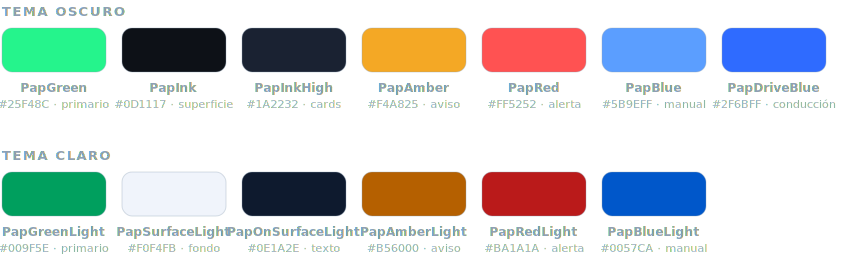

<p align="center">
  
</p>

<h1 align="center">Paparcar</h1>

<p align="center">
  <b>Plazas de aparcamiento en tiempo real, compartidas por la comunidad.</b><br/>
  Cuando sales con el coche, la app lo detecta sola y publica la plaza que acabas de liberar
  para que otro conductor cercano la encuentre.
</p>

<p align="center">
  
  
  
  
  
</p>

---

## Estado del proyecto · 2026-07-16

**Pre-beta en field-testing continuo.** El core está completo y mergeado en `master`; la cadena de
detección se valida a diario en dispositivos reales (Oppo + Redmi) con telemetría remota, con
política *fix-forward* ante regresiones.

| Área | Estado |
|------|--------|
| Detección dual (BT determinista + Coordinator AR-first) | ✅ En master, field-test continuo |
| Niveles de detección honestos (Automático / Asistido+ / Asistido) | ✅ Con árbitro BT (supersede/veto) |
| Red de seguridad (worker 15 min + reconcile de salidas perdidas) | ✅ |
| Sync offline-first con reconcile LWW (vehículos, zonas, sesiones) | ✅ |
| UI / design system (roles tipográficos, componentes `Pap*`, guardarraíles Konsist) | ✅ |
| Puck de conducción nativo (fork kmp-maps, 1.6% jank) | ✅ En master · PR upstream [kmp-maps#170](https://github.com/software-mansion/kmp-maps/pull/170) |
| Dev Catalog (flavor `mock` sin backend) | ✅ |
| Telemetría de diagnóstico remota (Firestore, gate por flag) | ✅ |
| Detección iOS | ⚠️ Nativos listos, wiring AR → coordinator pendiente |
| Firebase App Distribution | 🚧 Android scaffold listo · iOS sin configurar |

Roadmap completo en [`docs/ROADMAP.md`](./docs/ROADMAP.md).

---

## Identidad visual

### Logo

El logo corporativo es el coche verde neón sobre disco *ink* — idéntico al icono de launcher y
**theme-independent** (el disco siempre es oscuro, lee igual en claro y oscuro). La fuente de
verdad en la app es [`paparcar_logo.xml`](./composeApp/src/commonMain/composeResources/drawable/paparcar_logo.xml)
(VectorDrawable, con variante `_dark`); para docs se usa
[`docs/assets/paparcar-logo.svg`](./docs/assets/paparcar-logo.svg). Es un asset **Nivel 3**:
trae su color de marca horneado, **nunca se tinta**.

### Colores corporativos

Fuente de verdad: [`ui/theme/Color.kt`](./composeApp/src/commonMain/kotlin/io/apptolast/paparcar/ui/theme/Color.kt).

<p align="center">
  
</p>

- **Verde de marca = primario.** Todo CTA normal usa `primary` (`PapGreen` #25F48C en oscuro,
  `PapGreenLight` #009F5E en claro).
- **Rojo reservado a alerta real**: permisos bloqueantes, acciones destructivas, errores de
  formulario y fiabilidad LOW / TTL crítico. Nunca para un CTA normal.
- Las superficies oscuras son la rampa *ink* neutra-fría (#0D1117 → #222C3E); en claro, la rampa
  *azure* (misma familia de tono H≈217°). El ADN verde vive en los acentos, no en las superficies.

### Tipografía — 3 familias por rol (`PaparcarType`)

La familia y el tamaño son propiedad del **rol** del texto, nunca del widget
([`ui/theme/PaparcarType.kt`](./composeApp/src/commonMain/kotlin/io/apptolast/paparcar/ui/theme/PaparcarType.kt), 18 roles):

| Familia | Uso | Roles ejemplo |
|---------|-----|---------------|
| **Outfit** (IDENTITY) | Títulos | `screenTitle`, `heroTitle`, `cardTitle` |
| **Inter** (STRUCTURE + PROSE) | Frases que se leen, botones, labels | `body`, `subtitle`, `cta`, `sectionHeader` |
| **Barlow Condensed** (DATA) | Datos y tokens repetidos | `metadata`, `badge`, `distance`, `statNumber` |

`fontSize` inline y `MaterialTheme.typography.*` están **prohibidos** en features
(guardarraíl Konsist `TypographyGuardrailTest`).

### Iconos — 3 niveles

*Plumbing de UI → Material Symbols Rounded (tintado); concepto de Paparcar → vector propio
multicolor sin tintar* (hero, onboarding, marcadores, vehículos). Detalle en [`CLAUDE.md`](./CLAUDE.md).

---

## Stack

> Fuente de verdad: [`gradle/libs.versions.toml`](./gradle/libs.versions.toml).

- **Lenguaje:** Kotlin 2.4.0 (KSP 2.3.9) · JVM 17
- **Build:** AGP 9.2.1 · compileSdk 37 · targetSdk 36 · minSdk 26
- **UI:** Compose Multiplatform 1.11.1 · Material3 (JB) 1.9.0 · Navigation Compose 2.9.2
- **Arquitectura:** Clean Architecture + MVI (State + Intent + Effect)
- **DI:** Koin 4.2.2
- **DB local:** Room KMP 2.8.4 (SQLite bundled)
- **Backend:** Firebase vía GitLive KMP 2.4.0 (Auth + Firestore + Crashlytics)
- **Mapas:** kmp-maps (Software Mansion) 0.9.1 — Google Maps (Android) / Apple Maps (iOS),
  con fork propio para el puck de conducción nativo
- **Auth:** BaseLogin (librería propia, JitPack)
- **Async:** Coroutines 1.11.0 + Flow · Serialization 1.11.0 · Datetime 0.8.0
- **Imágenes:** Coil 3.5.0 + Ktor 3.5.1
- **Logging:** Napier 2.7.1 · **Background:** WorkManager (Android)

**Targets:** Android `minSdk 26 / target 36 / compile 37` · iOS `arm64 + simulatorArm64`

---

## Cómo funciona la detección

**Doctrina rectora** (violarla es un bug):

> *El evento NOMINA, solo el movimiento MEDIDO confirma.* Un EXIT de geocerca o un AR ENTER solo
> despiertan/arman; ninguno confirma una plaza por sí mismo — hace falta conducción medida en el
> stream (o pasos/egress inambiguos).
>
> *Fallo asimétrico: mejor falso negativo que falso positivo.* Ante la duda se PREGUNTA (nudge /
> prompt), nunca se planta una plaza fantasma. La fiabilidad se estampa en cada sesión.

Dos estrategias independientes que **nunca se mezclan**:

- **`BluetoothDetectionStrategy`** (determinista) — BT disconnect del MAC emparejado → fix GPS →
  alejarse ≥30 m del coche → confirma con fiabilidad alta. Ligada a la MAC del coche, no al
  modelo. Es el nivel **Automático**.
- **`CoordinatorDetectionStrategy`** (probabilístico) — el **Asistido**. Se *arma* con AR
  IN_VEHICLE ENTER (carril de baja latencia) o GEOFENCE_EXIT, solo si el embarque está atado al
  propio coche. *Confirma* con pasos+egress, egress cinemático medido por GPS o
  vehicle-exit+ventana+egress — todas exigen conducción medida. El ancla de posición se bloquea
  con los pasos de egress o se congela al final de la conducción, para que la caminata no
  arrastre el pin.
- **Red de seguridad** — `ParkingSafetyNetWorker` (15 min) + sensor de movimiento reconcilian
  salidas que el OS no entregó; nunca liberan por distancia sola.
- **Árbitro BT** — si el BT del coche reconecta durante una detección asistida, la supersede/veta;
  el BT jamás puntúa dentro del scoring del Coordinator.

Ambas convergen en `ConfirmParkingUseCase` → Room + Firestore + Geofence + Notification +
WorkManager. El servicio Android serializa todos los triggers en un intake único; la **decisión**
de cada trigger es un use case puro de `commonMain` — el service solo hace I/O y side-effects.

La pantalla de permisos muestra el **nivel de detección** resultante (Automático / Asistido+ /
Asistido) según BT emparejado, exención de batería y permisos concedidos.

Spec canónica en [`docs/detection/PARKING-DETECTION.md`](./docs/detection/PARKING-DETECTION.md).

---

## Navegación

BottomNav con 3 destinos — regla editorial: *si pasa AHORA → Home; si pasó o es mío-permanente →
Vehículos; si configura → Ajustes.*

- **Home** — mapa, plazas libres en tiempo real, sesión activa, detección en curso
- **Vehículos** — garaje (pager por vehículo) + historial de aparcamientos
- **Ajustes** — configuración + salud de detección/permisos

Flujo de entrada: Splash → Auth → VehicleRegistration → Onboarding → Permissions → Home.

---

## Modelos de datos clave

- **`Spot`** — plaza comunitaria: location, type (auto/manual), confidence, sizeCategory, TTL
- **`UserParking`** — sesión propia: vehicleId, location, geofenceId, detectionMethod
- **`Vehicle`** — brand, model, bluetoothDeviceId, sizeCategory, carbodyType
- Categorización bidimensional: `VehicleSize` (5 tallas) × `CarbodyType` (10 carrocerías) →
  compatibilidad `SpotFit` — ver [`docs/architecture/VEHICLE-CATEGORIZATION.md`](./docs/architecture/VEHICLE-CATEGORIZATION.md)

---

## Estructura del proyecto

```
composeApp/
├── src/commonMain/kotlin/io/apptolast/paparcar/
│   ├── domain/         Kotlin puro — entidades, UseCases (evaluadores de detección incluidos)
│   ├── data/           Repos + Room + Firestore + mappers + reconcile LWW
│   ├── presentation/   ViewModels MVI + screens Compose
│   ├── ui/             Design system (PaparcarType, componentes Pap*, tema, mapa)
│   ├── core/           Utilidades transversales
│   └── di/             Módulos Koin
├── src/androidMain/    detection/, location/, bluetooth/, geofence/, notification/, worker/
├── src/iosMain/        CLLocation, CMMotion, CoreBluetooth (wiring pendiente)
└── src/mock/           Dev Catalog — modo demo sin backend

iosApp/                 SwiftUI shell (delegado a Compose vía MainViewController)
```

Visión arquitectónica completa en [`docs/ARCHITECTURE.md`](./docs/ARCHITECTURE.md).

---

## Dev Catalog (flavor `mock`)

Modo solo-mock para entrar a la app **sin OAuth ni Firebase** y probar pantallas y estados en
dispositivo: launcher propio (`DevMainActivity`) con escenarios de sesión/permisos
(`MockScenario`) y una galería de estados (`StateGalleryScreen`) con paridad con los
`*Previews.kt`. Toda pantalla/estado/condición de routing nueva debe reflejarse ahí en la misma
tarea (regla ⛔ en [`CLAUDE.md`](./CLAUDE.md)).

```bash
./gradlew :composeApp:assembleMockDebug
```

---

## Getting started

### Prerequisitos

- Android Studio (Ladybug o posterior) con plugin KMP
- Xcode (solo si se trabaja en iOS)

### Setup

1. `git clone ...`
2. Añadir `composeApp/google-services.json` (Firebase Console → Project settings)
3. Crear `local.properties` con:
   ```properties
   MAPS_API_KEY=AIza...
   GOOGLE_WEB_CLIENT_ID=...
   ```
4. (Opcional para release) `keystore.properties` con `RELEASE_KEYSTORE_FILE`,
   `RELEASE_KEYSTORE_PASSWORD`, `RELEASE_KEY_ALIAS`, `RELEASE_KEY_PASSWORD`
5. Compilar:
   ```bash
   ./gradlew :composeApp:assembleProdDebug   # app real (Firebase/OAuth)
   ./gradlew :composeApp:assembleMockDebug   # Dev Catalog (sin backend)
   ```
   > ⚠️ En Windows no hay `gradlew.bat`: usa Git Bash (`./gradlew`), no PowerShell.

### Permisos

- **Android:** `ACCESS_FINE_LOCATION` + `ACCESS_BACKGROUND_LOCATION` + `ACTIVITY_RECOGNITION` +
  `POST_NOTIFICATIONS` + `BLUETOOTH_CONNECT`. El onboarding los pide en orden con rationales y
  muestra el nivel de detección que desbloquea cada uno.
- **iOS:** `NSLocationAlwaysAndWhenInUseUsageDescription` + `NSMotionUsageDescription` +
  `NSBluetoothAlwaysUsageDescription` + `UIBackgroundModes: location, fetch, processing`
  (ya en `iosApp/iosApp/Info.plist`).

---

## i18n

- **Base:** EN (siempre completa) · **P0:** ES · **P1:** IT, PT, FR · **P2:** DE, NL, PL, RO
- 9 locales activos con paridad de keys. Excluidos por complejidad de UI: RTL (AR, HE) y glifos
  complejos (ZH, JA, KO, TH, HI).

---

## Documentación

| Documento | Cuándo leerlo |
|-----------|----------------|
| [`CLAUDE.md`](./CLAUDE.md) | **Reglas obligatorias** — iconos, tipografía, strings, magic numbers, commits, Dev Catalog |
| [`docs/ROADMAP.md`](./docs/ROADMAP.md) | Estado real de features ✅🚧📋🔮 |
| [`docs/ARCHITECTURE.md`](./docs/ARCHITECTURE.md) | Capas, flujos de datos, paquetes, decisiones técnicas |
| [`docs/detection/PARKING-DETECTION.md`](./docs/detection/PARKING-DETECTION.md) | **Spec algorítmica canónica de detección** |
| [`docs/PARKING_DETECTION.md`](./docs/PARKING_DETECTION.md) | Estrategias dual, estados, plan de mejora |
| [`docs/architecture/VEHICLE-CATEGORIZATION.md`](./docs/architecture/VEHICLE-CATEGORIZATION.md) | Talla × carrocería → `SpotFit` |
| [`docs/BUGS_AND_DEBT.md`](./docs/BUGS_AND_DEBT.md) | Inventario de bugs y deuda técnica |
| [`docs/IOS_PLAN.md`](./docs/IOS_PLAN.md) | Estado iOS, stubs pendientes, plan App Distribution iOS |
| [`docs/audits/AUDIT-2026-07-04-full.md`](./docs/audits/AUDIT-2026-07-04-full.md) | Auditoría completa del proyecto (cerrada en master) |
| [`docs/release/RELEASE-PROCESS.md`](./docs/release/RELEASE-PROCESS.md) | Keystore, signing y release Android |
| [`docs/backlog/*.md`](./docs/backlog/) | Tickets activos por iniciativa |
| [`diagnostics/README.md`](./diagnostics/README.md) | Captura y procesado de logs de detección |
| `docs/archive/` | Docs históricos preservados |

---

## Convenciones rápidas

- **Strings:** nada hardcoded — `composeResources/values/strings.xml`, keys EN, mínimo EN+ES
- **Magic numbers:** `private companion object` con `UPPER_SNAKE_CASE`
- **Errores:** `kotlin.Result<T>` en one-shot; `Flow` con `.catch`; UI vía `PaparcarError` sealed
- **Tests:** toda UseCase nueva con test unitario; fakes sobre mocks
- **Commits:** Conventional Commits con ticket ID — `feat(home): add per-vehicle cards [HOME-002]`
- **Ramas:** `feature/HOME-001-bottom-sheet`, `bugfix/...`, `refactor/...`, `chore/...`
- **Logs:** Napier con tag, nunca `println`

Detalle completo en [`CLAUDE.md`](./CLAUDE.md).

---

<p align="center">
  <br/>
  <sub>Built with 💚 by the AppToLast Team.</sub>
</p>
