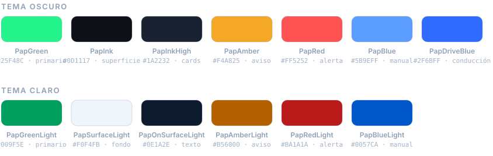

<p align="center">
  
</p>

<h1 align="center">Paparcar</h1>

<p align="center">
  <b>Plazas de aparcamiento en tiempo real, compartidas por la comunidad.</b><br/>
  Cuando sales con el coche, la app lo detecta sola y publica la plaza que acabas de liberar
  para que otro conductor cercano la encuentre.
</p>

<p align="center">
  
  
  
  
  
</p>

---

## Estado del proyecto · 2026-08-30 (master `46621e7f`)

**Pre-lanzamiento, en field-testing diario.** El producto está completo y mergeado en `master`; la
cadena de detección se mide cada día en dispositivos reales (Oppo + Redmi) con telemetría remota, con
política *fix-forward* ante regresiones. Lo que falta para publicar **no es código de producto**: es
la ficha de Play, las verificaciones de la cuenta de desarrollador y el endurecimiento de claves.

| Área | Estado |
|------|--------|
| Detección dual (BT determinista + Coordinator AR-first) | ✅ En master, field-test continuo |
| Procedencia del pin (`detectionPath` + `armEvidence` en cada sesión) | ✅ |
| Niveles de detección honestos (Automático / Asistido+ / Asistido) | ✅ Con árbitro BT (supersede/veto) |
| Red de seguridad (worker 15 min + reconcile de salidas perdidas) | ✅ |
| Sync offline-first con reconcile LWW (vehículos, zonas, sesiones) | ✅ |
| Votos de comunidad sobre plazas · frescura por edad (TTL 2 h) | ✅ |
| UI / design system (una tipografía, color por método, guardarraíles Konsist) | ✅ |
| Puck de conducción nativo (fork kmp-maps en Maven Central) | ✅ · PR upstream [kmp-maps#170](https://github.com/software-mansion/kmp-maps/pull/170) |
| Dev Catalog (flavor `mock` sin backend) | ✅ |
| Telemetría de diagnóstico remota (Firestore, gate por flag) | ✅ |
| Split `:app` + `:shared` | ✅ |
| CI: build + tests + **compilación de `iosMain` en `macos-latest`** | ✅ |
| Superficie legal (privacidad, borrado de cuenta por web, data safety) | ✅ código · ⏳ acciones de cuenta |
| Detección iOS | 🟡 nativos listos; el lazo GPS → coordinator, en rama `IOS-F0-001` sin mergear |
| Publicación en Play | 🔴 ficha sin capturas · trader status y verificaciones pendientes |

Roadmap y bloqueantes en [`docs/ROADMAP.md`](./docs/ROADMAP.md).

---

## Identidad visual

### Logo

El logo corporativo es el coche verde neón sobre disco *ink* — idéntico al icono de launcher y
**theme-independent** (el disco siempre es oscuro, lee igual en claro y oscuro). La fuente de
verdad en la app es [`paparcar_logo.xml`](./shared/src/commonMain/composeResources/drawable/paparcar_logo.xml)
(VectorDrawable, con variante `_dark`); para docs se usa
[`docs/assets/paparcar-logo.svg`](./docs/assets/paparcar-logo.svg). Es un asset **Nivel 3**:
trae su color de marca horneado, **nunca se tinta**.

### Colores corporativos

Fuente de verdad: [`ui/theme/Color.kt`](./shared/src/commonMain/kotlin/com/rndeveloper/paparcar/ui/theme/Color.kt).

<p align="center">
  
</p>

La doctrina en una frase: **la app es VERDE (marca); el color del NOMBRE de un coche dice CÓMO se le
vigila; el estado se ESCRIBE, no se tiñe.**

- **Verde de marca = primario.** Todo CTA normal usa `primary` (`PapGreen` #25F48C en oscuro,
  `PapGreenLight` #009F5E en claro).
- **Tres verdes separados por TONO, nunca por luminosidad**: marca (#25F48C / #009F5E), vigilancia
  (`PapWatchGreen` #0FBF9A / #05876D) y plaza fresca. Cada hex tiene una única historia.
- **Azul `papCarBlue` = vehículo vigilado por Bluetooth.** Gris = sin vigilancia. El estado
  (aparcado / en ruta / sin aparcar) va siempre en `onSurface`, animado.
- **Rojo reservado a alerta real**: permisos bloqueantes, acciones destructivas, errores de
  formulario y caducidad crítica de plaza. **Nunca en un CTA.**
- Las superficies oscuras son la rampa *ink* neutra-fría (#0D1117 → #222C3E); en claro, la rampa
  *azure* (misma familia de tono H≈217°). El ADN verde vive en los acentos, no en las superficies.

Doctrina y tabla completa de tokens: [`docs/design/COLOR-SYSTEM.md`](./docs/design/COLOR-SYSTEM.md).
Guardarraíl: `ColorGuardrailTest` prohíbe `Color(0x…)` literal y teñir el estado en `presentation/`.

### Tipografía — una familia, tres voces, 22 roles (`PaparcarType`)

Familia, tamaño **y peso** son propiedad del **ROL** del texto, nunca del widget
([`ui/theme/PaparcarType.kt`](./shared/src/commonMain/kotlin/com/rndeveloper/paparcar/ui/theme/PaparcarType.kt)).
Nunca se elige fuente: se elige rol. En el call site **solo se decide el color**.

Desde [UI-TYPE-RETIRE-THE-OLD-FAMILIES-001] la app envía **una sola tipografía**, Plus Jakarta Sans
(2,30 MB → 0,17 MB de fuentes). Que las tres voces compartan letra no las fusiona: siguen decidiendo
tamaño, peso y qué es un nombre, una cifra o prosa.

| Voz | Pregunta que contesta | Roles |
|-----|------------------------|-------|
| **MARCA** | ¿es un nombre propio o un título? | `screenTitle`, `heroTitle`, `sectionTitle`, `cardTitle`, `rowName` |
| **LECTURA** | todo lo que se lee o se pulsa | `sectionHeader`, `subsectionHeader`, `eyebrow`, `cta`, `rowTitle`, `subtitle`, `body`, `label`, `caption`, `meta`, `badge` |
| **CIFRA** | ¿es una cifra que protagoniza su bloque? | `statNumber`, `statLabel`, `counter`, `counterUnit`, `chartLabel`, `chartValue` |

`fontSize`, `letterSpacing`, `fontWeight` inline y `MaterialTheme.typography.*` están **prohibidos**
en features (guardarraíl Konsist `TypographyGuardrailTest`).

### Iconos — 3 niveles

*Plumbing de UI → Material Symbols Rounded (tintado); concepto de Paparcar → vector propio
multicolor sin tintar* (hero, onboarding, marcadores, vehículos). Detalle en [`CLAUDE.md`](./CLAUDE.md).

---

## Stack

> Fuente de verdad: [`gradle/libs.versions.toml`](./gradle/libs.versions.toml).

- **Lenguaje:** Kotlin 2.4.10 (KSP 2.3.11) · JVM 17 · Gradle 9.7.1
- **Build:** AGP 9.3.2 · compileSdk 37 · targetSdk 37 (Android 17) · minSdk 26
- **UI:** Compose Multiplatform 1.12.0 · Material3 (JB) 1.9.0 · Navigation Compose 2.9.2
- **Arquitectura:** Clean Architecture + MVI (State + Intent + Effect)
- **DI:** Koin 4.2.2
- **DB local:** Room KMP 2.8.4 (SQLite bundled 2.7.0)
- **Backend:** Firebase vía GitLive KMP 2.6.0 (Auth + Firestore + Crashlytics) · firebase-bom 34.18.0
- **Mapas:** `io.github.rndevelo.kmpmaps:core:0.9.1-puck4` — **fork propio** en Maven Central
  (Google Maps en Android / Apple Maps en iOS); da el marker de id estable que necesita el puck
- **Auth:** BaseLogin 1.1.0 (librería propia, JitPack) — ⛔ no se toca desde este repo
- **Async:** Coroutines 1.11.0 + Flow · Serialization 1.11.0 · Datetime 0.8.0
- **Imágenes:** Coil 3.6.0 + Ktor 3.5.2 (motor de red)
- **Logging:** Napier 2.7.1 · **Background:** WorkManager 2.11.2 (Android)
- **Tests:** JUnit 4 · Turbine · Robolectric · **Konsist** (10 guardarraíles de arquitectura)

**Targets:** Android `minSdk 26 / target 37 / compile 37` · iOS `arm64 + simulatorArm64`

> Solo versiones estables en el catálogo: ni un alpha/beta/rc. Al comprobar si algo se quedó atrás,
> consultar `repo1.maven.org` y `dl.google.com/dl/android/maven2` — el índice de
> `search.maven.org/solrsearch` está obsoleto y miente por versiones enteras.

---

## Cómo funciona la detección

**Doctrina rectora** (violarla es un bug):

> *El evento NOMINA, solo el movimiento MEDIDO confirma.* Un EXIT de geocerca o un AR ENTER solo
> despiertan/arman; ninguno confirma una plaza por sí mismo — hace falta conducción medida en el
> stream (o pasos/egress inambiguos).
>
> *Fallo asimétrico: mejor falso negativo que falso positivo.* Ante la duda se PREGUNTA (nudge /
> prompt), nunca se planta una plaza fantasma. La fiabilidad se estampa en cada sesión.
>
> *Todo trigger dispara SIEMPRE*, aunque llegue tarde, con verificación tardía. Un evento viejo
> pierde autoridad directa (pasa al evaluador), pero nunca se descarta en silencio.

Dos estrategias independientes que **nunca se mezclan**:

- **`BluetoothDetectionStrategy`** (determinista) — BT disconnect del MAC emparejado → fix GPS →
  alejarse ≥30 m del coche → confirma con fiabilidad alta. Ligada a la MAC del coche, no al
  modelo. Es el nivel **Automático**.
- **`CoordinatorDetectionStrategy`** (probabilístico) — el **Asistido**. Se *arma* con AR
  IN_VEHICLE ENTER (carril de baja latencia) o GEOFENCE_EXIT, solo si el embarque está atado al
  propio coche. *Confirma* con pasos+egress, egress cinemático medido por GPS o
  vehicle-exit+ventana+egress — todas exigen conducción medida. El ancla de posición se bloquea
  con los pasos de egress o se congela al final de la conducción, para que la caminata no
  arrastre el pin.
- **Red de seguridad** — `ParkingSafetyNetWorker` (15 min) + sensor de movimiento reconcilian
  salidas que el OS no entregó; nunca liberan por distancia sola.
- **Árbitro BT** — si el BT del coche reconecta durante una detección asistida, la supersede/veta;
  el BT jamás puntúa dentro del scoring del Coordinator.

Ambas convergen en `ConfirmParkingUseCase` → Room + Firestore + Geofence + Notification +
WorkManager. El servicio Android serializa todos los triggers en un intake único; la **decisión**
de cada trigger es un use case puro de `commonMain` — el service solo hace I/O y side-effects.

Todo pin persiste su **procedencia**: `detectionPath` + `armEvidence`. En cualquier diagnóstico se
puede decir qué trigger colocó cada pin, no solo cuánto podía equivocarse.

La pantalla de permisos muestra el **nivel de detección** resultante (Automático / Asistido+ /
Asistido) según BT emparejado, exención de batería y permisos concedidos.

Spec canónica en [`docs/detection/PARKING-DETECTION.md`](./docs/detection/PARKING-DETECTION.md).

---

## Navegación

BottomNav con 3 destinos — regla editorial: *si pasa AHORA → Home; si pasó o es mío-permanente →
Vehículos; si configura → Ajustes.*

- **Home** — mapa, plazas libres en tiempo real, sesión activa, detección en curso
- **Vehículos** — garaje (pager por vehículo) + historial de aparcamientos
- **Ajustes** — configuración + salud de detección/permisos

Flujo de entrada: Splash → Auth → VehicleRegistration → Onboarding → Permissions → Home.

---

## Modelos de datos clave

- **`Spot`** — plaza comunitaria: location, type (auto/manual), confidence, sizeCategory, TTL
- **`UserParking`** — sesión propia: vehicleId, location, geofenceId, detectionMethod
- **`Vehicle`** — brand, model, bluetoothDeviceId, sizeCategory, carbodyType
- Categorización bidimensional: `VehicleSize` (5 tallas) × `CarbodyType` (10 carrocerías) →
  compatibilidad `SpotFit` — ver [`docs/architecture/VEHICLE-CATEGORIZATION.md`](./docs/architecture/VEHICLE-CATEGORIZATION.md)

---

## Estructura del proyecto

```
shared/                 KMP — toda la lógica de producto
├── src/commonMain/kotlin/com/rndeveloper/paparcar/
│   ├── domain/         Kotlin puro — entidades, UseCases (evaluadores de detección incluidos)
│   ├── data/           Repos + Room + Firestore + mappers + reconcile LWW
│   ├── presentation/   ViewModels MVI + screens Compose
│   ├── ui/             Design system (PaparcarType, componentes Pap*, tema, mapa)
│   ├── core/           Utilidades transversales
│   └── di/             Módulos Koin
├── src/androidMain/    detection/{service,worker,receiver,sensor}, location/, bluetooth/,
│                       notification/, permissions/, diagnostics/, logging/
├── src/iosMain/        CLLocation, CMMotion, CoreBluetooth (sin stubs; falta el lazo GPS)
├── src/commonTest/     el grueso de los tests (use cases, ViewModels, replay de trazas de campo)
└── src/androidUnitTest/  lo que necesita JVM/Android: guardarraíles Konsist, Robolectric, workers

app/                    Shell Android — entry points, manifest, res, flavors, firma
├── src/main/           MainActivity, PaparcarApp, AppNotificationManagerImpl, res/
└── src/mock/           Dev Catalog — modo demo sin backend (kotlin + res/manifest)

iosApp/                 SwiftUI shell (delegado a Compose vía MainViewController)
```

Visión arquitectónica completa en [`docs/ARCHITECTURE.md`](./docs/ARCHITECTURE.md).

---

## Dev Catalog (flavor `mock`)

Modo solo-mock para entrar a la app **sin OAuth ni Firebase** y probar pantallas y estados en
dispositivo: launcher propio (`DevMainActivity`) con escenarios de sesión/permisos
(`MockScenario`) y una galería de estados (`StateGalleryScreen`) con paridad con los
`*Previews.kt`. Toda pantalla/estado/condición de routing nueva debe reflejarse ahí en la misma
tarea (regla ⛔ en [`CLAUDE.md`](./CLAUDE.md)).

```bash
./gradlew :app:assembleMockDebug
```

---

## Getting started

### Prerequisitos

- Android Studio (Ladybug o posterior) con plugin KMP
- Xcode (solo si se trabaja en iOS)

### Setup

1. `git clone ...`
2. Añadir `app/google-services.json` (Firebase Console → Project settings)
3. Crear `local.properties` con:
   ```properties
   MAPS_API_KEY=AIza...
   GOOGLE_WEB_CLIENT_ID=...
   ```
4. (Opcional para release) `keystore.properties` con `RELEASE_KEYSTORE_FILE`,
   `RELEASE_KEYSTORE_PASSWORD`, `RELEASE_KEY_ALIAS`, `RELEASE_KEY_PASSWORD`
5. Compilar:
   ```bash
   ./gradlew :app:assembleProdDebug   # app real (Firebase/OAuth)
   ./gradlew :app:assembleMockDebug   # Dev Catalog (sin backend)
   ```
   > ⚠️ En Windows no hay `gradlew.bat`: usa Git Bash (`./gradlew`), no PowerShell.

### Permisos

- **Android:** `ACCESS_FINE_LOCATION` + `ACCESS_BACKGROUND_LOCATION` + `ACTIVITY_RECOGNITION` +
  `POST_NOTIFICATIONS` + `BLUETOOTH_CONNECT`. El onboarding los pide en orden con rationales y
  muestra el nivel de detección que desbloquea cada uno.
- **iOS:** `NSLocationAlwaysAndWhenInUseUsageDescription` + `NSMotionUsageDescription` +
  `NSBluetoothAlwaysUsageDescription` + `UIBackgroundModes: location, fetch, processing`
  (ya en `iosApp/iosApp/Info.plist`).

---

## i18n

- **Base:** EN (siempre completa) · **P0:** ES · **P1:** IT, PT, FR · **P2:** DE, NL, PL, RO
- 9 locales activos con paridad de keys, verificada por `LocaleParityGuardrailTest`. Excluidos por
  complejidad de UI: RTL (AR, HE) y glifos complejos (ZH, JA, KO, TH, HI).
- ⚠️ **Faltar en un locale NO crashea, y por eso es peor**: si la traducción falta pero la key está en
  `values`, el texto **sale en inglés en silencio** (así vivieron 48 días dos botones de la pantalla
  de permisos). Si falta en `values`, ahí sí crashea en todo locale que no la declare.
- ⚠️ Hay **dos** superficies de strings con reglas opuestas para el apóstrofo: Compose Resources
  (`composeResources/values/`) **no desescapa `\'`** → apóstrofo crudo; `app/src/main/res/` sí lo
  escapa. Detalle en `CLAUDE.md`.

---

## Documentación

**Docs vivos** — afirman en presente; cada uno declara en su cabecera la fecha y el commit contra el
que fue verificado. Si no coinciden con el código, es un bug del doc.

| Documento | Cuándo leerlo |
|-----------|----------------|
| [`CLAUDE.md`](./CLAUDE.md) | **Reglas obligatorias** — iconos, tipografía, color, strings, magic numbers, commits, Dev Catalog |
| [`docs/ROADMAP.md`](./docs/ROADMAP.md) | Qué queda por hacer: ramas en vuelo, backlog abierto, bloqueantes de lanzamiento |
| [`docs/ARCHITECTURE.md`](./docs/ARCHITECTURE.md) | Capas, flujos de datos, paquetes, decisiones técnicas |
| [`docs/BUGS_AND_DEBT.md`](./docs/BUGS_AND_DEBT.md) | Deuda **estructural** abierta y riesgos |
| [`docs/detection/PARKING-DETECTION.md`](./docs/detection/PARKING-DETECTION.md) | **Spec canónica de detección** + log de cada guard y por qué existe |
| [`docs/detection/DETECTION-READINESS.md`](./docs/detection/DETECTION-READINESS.md) | Qué le decimos al usuario sobre la detección (readiness, tiers de permisos) |
| [`docs/design/COLOR-SYSTEM.md`](./docs/design/COLOR-SYSTEM.md) | Significado de cada token de color — una historia por hex |
| [`docs/architecture/VEHICLE-CATEGORIZATION.md`](./docs/architecture/VEHICLE-CATEGORIZATION.md) | Talla × carrocería → `SpotFit` |
| [`docs/IOS_PLAN.md`](./docs/IOS_PLAN.md) | Estado real de iOS y qué falta para un beta |
| [`docs/CODE-READING-CHECKLIST.md`](./docs/CODE-READING-CHECKLIST.md) | Leer el proyecto entero por orden de dependencia |
| [`docs/release/RELEASE-PROCESS.md`](./docs/release/RELEASE-PROCESS.md) · [`RELEASE-SECURITY.md`](./docs/release/RELEASE-SECURITY.md) | Keystore, firma, distribución y endurecimiento de claves |
| [`docs/legal/`](./docs/legal/) | Data safety y runbook de borrado de cuenta |
| [`docs/backlog/README.md`](./docs/backlog/README.md) | **Índice de lo que sigue abierto** — 285 tickets, 195 cerrados; aquí solo lo que queda |
| [`diagnostics/README.md`](./diagnostics/README.md) | Captura y procesado de logs de detección |

**Registros fechados** — fotos que no envejecen mal porque llevan su fecha y su commit-base:
[`docs/audits/`](./docs/audits/) (auditoría completa del 2026-07-04),
[`docs/detection/01-…11-*.md`](./docs/detection/) (análisis del refactor de agosto),
[`docs/refactors/`](./docs/refactors/), y [`docs/archive/`](./docs/archive/) para lo superado.

---

## Convenciones rápidas

- **Strings:** nada hardcoded — `composeResources/values/strings.xml`, keys EN, **los 9 locales en la
  misma tarea**
- **Magic numbers:** `private companion object` con `UPPER_SNAKE_CASE`
- **Errores:** `kotlin.Result<T>` en one-shot; `Flow` con `.catch`; UI vía `PaparcarError` sealed
- **Tests:** toda UseCase nueva con test unitario; fakes sobre mocks
- **Commits:** Conventional Commits con ticket ID — `feat(home): add per-vehicle cards [HOME-002]`
- **Ramas:** `feature/HOME-001-bottom-sheet`, `bugfix/...`, `refactor/...`, `chore/...`
- **Logs:** Napier con tag, nunca `println`

Detalle completo en [`CLAUDE.md`](./CLAUDE.md).

---

<p align="center">
  <br/>
  <sub>Built with 💚 by the AppToLast Team.</sub>
</p>
