# 02 — Radiografía del coordinator y su máquina de estados

> 📌 **Citas de línea ancladas a master `2288468e` (2026-08-24), el commit de arranque de F6.**
> A partir de aquí la Fase 1 mueve símbolos y los números se desplazan: son *a fecha de*, no punteros
> vivos. Para resolver cualquiera con exactitud: `git show 2288468e:<fichero>`. [P0.5]

> Subagente B · refactor de solo-lectura · 2026-08-18.
> Fichero principal: `composeApp/src/commonMain/kotlin/io/apptolast/paparcar/domain/coordinator/CoordinatorParkingDetector.kt`
> (**2.573 líneas**; abreviado `CPD.kt`). Compañeros: `ConfirmationPhase.kt` (77 líneas),
> `domain/detection/*` y los dos evaluadores puros `EvaluateParkingDecisionUseCase.kt` /
> `EvaluateUnattendedParkingSaveUseCase.kt`. Todas las referencias línea:fichero son del árbol en
> master a fecha de este informe.

---

## 0. Mapa general

- El estado de sesión vive en `private data class ParkingDetectionState` (`CPD.kt:150–370`),
  dentro de un único `MutableStateFlow` (`CPD.kt:372`) mutado con `update`/`updateAndGet`.
- **PERO** el KDoc de la clase promete «All mutable state is held in a single MutableStateFlow»
  (`CPD.kt:99–101`) y eso es **falso**: conviven **8 campos `@Volatile` de clase** —
  `savedConfirmPostedAt` (387), `currentSessionId` (392), `sessionOutcome` (396),
  `lastFinishedFix` (401), `lastFinishedSessionId` (416), `lastFinishedStepEvents` (423),
  `lastFinishedMaxSpeedMps` (428), `currentArmEvidence` (467) — y **7 variables locales de
  `invoke`** con semántica de estado de sesión: `completed` (536), `locationCount` (537),
  `jamExtensionLogged` (539), `creepWindow` (543), `loggedVehicleExit` (549),
  `activeVehicleId` (591), `activeVehicleType` (592).
- Tres corrutinas concurrentes mutan/leen ese estado: el collector principal (`CPD.kt:722–1292`),
  `stepJob` (`CPD.kt:599–669`), `holdWatchdogJob` (`CPD.kt:694–719`); más `phaseJob` (solo lectura,
  675–682) y los entrypoints externos thread-safe `onVehicleExit`/`onHumanPoweredRide`/
  `onVehicleRide`/`onUserConfirmedParking`/`onUserDeniedParking` (`CPD.kt:1357–1395`) y
  `notifyDepartureConfirmed` (457–463).

---

## 1. Tabla de campos de `ParkingDetectionState`

**39 campos** + 4 miembros derivados (`bestFix()` :356, `maxSpeedKmh` :360,
`sessionDurationMs()` :363, `anchorGapEnteredAtCapture` :369) + la sub-clase `PendingConfirm`
(:142–148). Escritores/lectores citados por línea de `CPD.kt` salvo indicación.

| # | Campo | Tipo | Quién lo ESCRIBE | Quién lo LEE | Invariante | Tag |
|---|-------|------|------------------|--------------|-----------|-----|
| 1 | `stoppedSince` | `Long?` | :2158 (abre/mantiene stop), :2347 (null al mover) | :633–641 gate de pasos, :928 diag, :2062 `startedAt`, :2101/2109 rebind, :2203 duración | epoch-ms del primer fix <1 m/s del stop actual; null en movimiento | — |
| 2 | `stoppedFixes` | `List<GpsPoint>` | :2159–2160 (append en ventana inicial, cap `maxStoppedFixes`), :2348 (vacía al mover) | `bestFix()` :356–357, :2130 `restProvenByFixes` | solo fixes de los primeros 30 s del stop; el de menor accuracy es el spot | [LOC-001][DET-SHORT-TRIP-FREEZE-001] |
| 3 | `vehicleExitConfirmed` | `Boolean` | `onVehicleExit` :1359, :2357 (clear si `effectiveDriving`) | :838–843 edge-log, :1141 UnattendedSave, :1251/1692 decision input, :2413 scoring, :2441 LowReached, :2482 Candidate snapshot | señal AR EXIT viva SOLO para el stop actual; conducir la borra | — |
| 4 | `userConfirmedParking` | `Boolean` | `onUserConfirmedParking` :1382 | :875/:887/:897 hold, :1051 rama user | un "Sí" gana a todo (precedencia BUG-COORD-115) | [BUG-COORD-115] |
| 5 | `pendingConfirm` | `PendingConfirm?` | `beginConfirm` :1455–1457, :881/:909 (discard), :1628–1630 (clear en degrade) | :699–715 watchdog, :849–921 hold, :1309–1313 finally | no-null = "aparcado tentativo": la sesión vive para poder descartar un errand stop | [DET-C-02] |
| 6 | `phase` | `ConfirmationPhase` | :1629, :1732, :1767, :2326/2349 (Idle al conducir), :2436, :2449, :2490, :2508 | `promptShownAt` :1122, :1218 cast a Candidate, phaseJob :678, :2434/2486 avance | máquina explícita Idle→LowReached→Notified→Candidate; ver §1b | [REFACTOR-200] |
| 7 | `hasEverReachedDrivingSpeed` | `Boolean` | seed :528 (arm verificado), :461 (upgrade tardío), :808 (cruce medido), :623 (un-seed veto ENTER), `onUserDeniedParking` :1391 (preserva) | :447 propiedad pública, :633 gate pasos, :928/:950/:958 aborts, :1004 lock vehicle, :1110 skip, :2131 freeze | latch de sesión "hubo velocidad de conducción (o seed)"; habilita TODOS los paths de confirm | [BUG-SHORT-TRIP][DET-G-04][DET-G-05] |
| 8 | `hasEverMoved` | `Boolean` | :809 | solo log :828 y preservación :1392 | velocidad + desplazamiento simultáneos (guard histórico de `maxNoMovementMs`); hoy casi vestigial | — |
| 9 | `sessionOrigin` | `GpsPoint?` | :807 (primer fix, nunca sobrescrito) | :740–744 distFromOrigin | primer fix de la sesión | — |
| 10 | `bestStopLocation` | `GpsPoint?` | :2161 (captura/refina), :2350 (null si `shouldClearBestStop`) | 15+ sitios: :641 gate pasos, :1059–1076 user-confirm, :1136 UnattendedSave, helpers §6, :2101–2149 rebind, finally :1318 | ancla del coche = fix de mejor accuracy del stop; una vez PINNED no se re-captura en stops posteriores | [ANCHOR-LOCK-001][DET-ANCHOR-FREEZE-001] |
| 11 | `anchorCapturedAtStop` | `Long?` | :2162 (=`startedAt` al rebind), :2351 (null al clear) | :2101 `pinnedToOtherStop`, :2109 `sameStopPreEgress`, :1904 sustained departure | `stoppedSince` del stop al que pertenece el ancla | [ANCHOR-LOCK-001] |
| 12 | `anchorFrozen` | `Boolean` | :2195 (`matured`), :2352 (false al clear) | `isAnchorPinned` :1787, `hasKinematicEgressSignal` :1814, :2331 acumulador kinemático | stop drive-entered maduró (tiempo o fixes) → el coche descansa aquí sin necesitar pasos | [DET-ANCHOR-FREEZE-001] |
| 13 | `walkFixesSinceDriving` | `Int` | :2363 (+1 fix móvil no-CAR; 0 si CAR/reposición) | :2133 veto de freeze, :2165 snapshot | odómetro "entré a este stop andando" desde el último veredicto CAR | [DET-ANCHOR-FREEZE-001] |
| 14 | `kinematicEgressFixes` | `Int` | :2329–2335 (+1 fix banda peatón con ancla FROZEN; 0 al clear), :2379 | `hasKinematicEgressSignal` :1815, log :1269 | egress medido por GPS para hardware con contador mudo | [DET-KINEMATIC-EGRESS-001] |
| 15 | `egressOriginFix` | `GpsPoint?` | :2196 (parado), :2380–2384 (móvil), null al clear | `isEgressBornAtAnchor` :2000, `refinedParkLocation` :2020, :1083 user-confirm, :1138 UnattendedSave, :2153–2156 refine | dónde NACIÓ el egress; un egress genuino nace en el coche | [DET-ANCHOR-EGRESS-001] |
| 16 | `egressOriginStepCount` | `Int` | :2197/:2385–2389 (=stepCount al registrar el birth) | :2005 allowance, :2025/:2036 refine pin, :2155/:2344 refine birth | pasos ya contados al registrar el birth (SNAPSHOT) | [DET-ANCHOR-EGRESS-001] |
| 17 | `anchorWalkFixesAtCapture` | `Int` | :2165–2166 (sella `walkFixesSinceDriving` al rebind) | `isAnchorWalkEntered` :1802/:1805, log :1158 | cuánta caminata condujo AL stop del ancla (SNAPSHOT) | [DET-CREDIBLE-DRIVE-001] |
| 18 | `stepEventsSinceDriving` | `Int` | stepJob :649 (+1 SIEMPRE), :2375 (0 si CAR) | :2170 snapshot | feed crudo del odómetro de caminata (sin gate de conteo) | [DET-CONFIRM-FRESHNESS-001] |
| 19 | `anchorStepEventsAtCapture` | `Int` | :2170–2171 (snapshot al rebind) | `isAnchorWalkEntered` :1803, UnattendedSave :1145, zona :280 (`EvaluateUnattendedParkingSaveUseCase.kt`) | corrobora el taint walk-entered: caminar dispara steps, la maniobra no (SNAPSHOT) | [DET-CONFIRM-FRESHNESS-001] |
| 20 | `anchorSawStepsAtCapture` | `Boolean` | :2172–2173 (snapshot al rebind) | `isAnchorWalkEntered` :1804 | ¿el sensor estaba VIVO cuando se capturó? (SNAPSHOT — un contador que despierta tarde no suaviza el taint retroactivamente) | [DET-CONFIRM-FRESHNESS-001] |
| 21 | `walkRunOriginFix` | `GpsPoint?` | :2367–2371 (primer fix del run peatonal; null si CAR) | :2178 span del walk-in | dónde empezó el tramo "a pie" vigente | [DET-WALK-ENTERED-ANCHOR-ZONE-001] |
| 22 | `anchorWalkInSpanMeters` | `Double` | :2177–2189 (snapshot al rebind), :2372 (0 al clear) | UnattendedSave :1146 → zona :281 | cota GPS del arrastre del walk-in, habla aunque el contador esté mudo (SNAPSHOT) | [DET-WALK-ENTERED-ANCHOR-ZONE-001] |
| 23 | `stopEnteredAfterGapMs` | `Long` | :2076–2084 (al ABRIR el stop, mide el agujero), :2355 (0 al mover) | :2085 log, :2192–2194 stamp | magnitud del agujero GPS por el que se entró al stop ACTUAL | [DET-GAP-ANCHOR-001/ZONE-001] |
| 24 | `anchorGapMsAtCapture` | `Long` | :2193–2194 (snapshot al rebind), :2356 (0 al clear) | derivado :369, :1143 UnattendedSave, :1059/:1076 user-confirm, :1261 decision | taint GAP-ENTERED con MAGNITUD: el agujero acota su propia duda (SNAPSHOT) | [DET-GAP-ANCHOR-ZONE-001] |
| 25 | `sessionSawSteps` | `Boolean` | stepJob :647 (latch, nunca se resetea en sesión) | :2172 snapshot, :2261 stepless, UnattendedSave :1140 | el sensor de pasos está VIVO esta sesión | [DET-CONFIRM-FRESHNESS-001] |
| 26 | `bicycleRideAtMs` | `Long?` | `onHumanPoweredRide` :1367 | `humanPoweredRide` :1350 | timestamp verdadero del último AR `ON_BICYCLE` (veto, nunca arma) | [DET-BIKE-NOT-A-CAR-001] |
| 27 | `vehicleRideAtMs` | `Long?` | `onVehicleRide` :1375 | `humanPoweredRide` :1351 | boarding posterior supersede la bici (timestamps comparables, no booleans) | [DET-BIKE-NOT-A-CAR-001] |
| 28 | `pinnedSteplessMovingFixes` | `Int` | :2264–2265 (+1 si `steplessQualifies`), stepJob :648 (0 en cada paso), :2378 (0 al clear) | :2266 `steplessDeparture` | fixes móviles fuera del envelope con contador VIVO en silencio → creep del coche | [DET-CONFIRM-FRESHNESS-001] |
| 29 | `previousFix` | `GpsPoint?` | :2198/:2390 (todo fix procesado, basura incluida) | :2077–2080 gap, :2251 mute hop, :1589 sealPoint, :1318 finally, :2458/:2499 logs | el `prev` del hop fix-a-fix; DELIBERADAMENTE sin filtrar | [DET-CREDIBLE-DRIVE-001] |
| 30 | `consecutiveRepositionFixes` | `Int` | :2200 (0 parado), :2306/:2358 (+1 o 0 móvil) | :2312 `isRepositionBurst` | racha de fixes a velocidad de maniobra con buena accuracy | [PARKING-001] |
| 31 | `stepCount` | `Int` | stepJob :651 (con gate :633–641), :2359 (0 si `effectiveDriving`), :1733 (0 en discard de candidate) | 12+ sitios: :928 abort, :1244/:1249 fast-confirm, :1675, helpers `movementOutrunsSteps`/`egressExceedsWalkReach`/`isAnchorLocked`, :2109/:2149, finally :1322 | pasos con doble gate pre/post-drive; reset en drive y en discard para evitar contaminación entre stops | [BUG-GARAGE-COLA-001][BUG-COORD-105][DET-STEP-SPEED-GATE-001] |
| 32 | `sessionStartMs` | `Long?` | :810 (primer fix) | `sessionDurationMs` :363 | reloj de sesión basado en el PRIMER FIX (≠ `sessionStartMs` local de invoke :511, que es el arm!) | — |
| 33 | `maxSpeedMps` | `Float` | :815 (`= pendingMax` SOLO si `driveProven`, si no 0) | `maxSpeedKmh` :360, :619 veto ENTER, :1133 UnattendedSave, :1579 persist, finally :1323 | estadística "esta sesión MIDIÓ conducción"; cero hasta que el track lo prueba | [DET-DRIVE-PROOF-001] |
| 34 | `pendingMaxSpeedMps` | `Float` | :772–774, :816 | :815 promoción, :1134 UnattendedSave (hint), :993 log | pico crudo pre-prueba | [DET-DRIVE-PROOF-001] |
| 35 | `credibleDrivingFixes` | `Int` | :776–777, :817 | :1135 UnattendedSave (`rawDriveSignalMinFixes`) | CONTEO de fixes a velocidad real con accuracy creíble (un pico ≠ una conducción) | [DET-SENTRY-ARM-PEDESTRIAN-CLOCK-001] |
| 36 | `driveProven` | `Boolean` | :799–801, :818 (latch) | :815 gate de `maxSpeedMps` | el track corroboró un drive (corroboratesDrive o short-hop) | [DET-DRIVE-PROOF-001] |
| 37 | `recentFixes` | `List<GpsPoint>` | :819 (`pruneRecentFixes`, cap 48) | :801 `corroboratesDrive` | ring acotado de look-back | [DET-DRIVE-PROOF-001] |
| 38 | `shortHopQualifyingFixes` | `Int` | :784–791, :820 | :797 (prueba short-hop) | racha de fixes inequívocamente lejos del pin de salida; un teleport aislado no cuenta | [DET-SHORT-HOP-PROOF-001] |
| 39 | `lastSpeedMps` | `Float` | :823 | stepJob :641 (gate egress-walk), :1258/:1699 decision (`isRolling`) | velocidad del último fix — persona (~1.4) vs crawl de tráfico | [DET-STEP-SPEED-GATE-001] |

### 1b. `ConfirmationPhase` (`ConfirmationPhase.kt:36–66`)
`Idle` · `LowReached(firstReachedAt)` · `Notified(shownAt)` ·
`Candidate(highReachedAt, hadVehicleExit, shownAt)`. Transiciones documentadas :17–29; reset a
`Idle` al conducir (`CPD.kt:2326`). `Candidate.hadVehicleExit` es un **snapshot** de
`vehicleExitConfirmed` a la entrada del candidate (`CPD.kt:2482`); `shownAt` se preserva de
`Notified` (`CPD.kt:2508`) para que el response-timeout siga contando desde el prompt original.
`promptShownAt` (extension :72–77) es el único lector transversal.

### 1c. Estado FUERA del `StateFlow` (el "segundo estado")
| Campo | Escritores | Lectores | Riesgo |
|---|---|---|---|
| `currentArmEvidence` `@Volatile` :467 | :534 (invoke), :459 (`notifyDepartureConfirmed`, otro hilo), :622 (stepJob, veto ENTER) | :615–617 (stepJob), :1256/:1697 (decision), :1580 (persist) | escritura en 2 pasos con `hasEverReachedDrivingSpeed` (:622–623) SIN atomicidad conjunta |
| `sessionOutcome` `@Volatile` :396 | :551, :934, :987, :1031, :1209, :1541, :1610, :1647 | :1325 (SessionEnded), :1508 (`startsWith("confirmed_")`!) | acoplamiento por PREFIJO de string entre `runConfirm` y `saveUnattendedZone` |
| `activeVehicleId/Type` (locals :591–592) | :1035–1042 | :1103, :1150, :1181/:1186, :1225–1226, :1275 | atribución de la sesión fuera del snapshot atómico |
| `creepWindow` (local :543) | :951–954 | :959–965 | ring paralelo a `recentFixes` con propósito casi idéntico |
| `savedConfirmPostedAt` `@Volatile` :387 | :578, :1608 | :570 | cruza sesiones (Koin single); perdido en process death (documentado) |
| `lastFinished*` `@Volatile` :401–428 | finally :1318–1323 | getters públicos :407–429 (honest-close ladder del service) | contrato post-invoke; correcto pero es un 3er canal de salida |

---

## 2. Clasificación de los campos

- **Primarios** (23) — medidos directamente de fixes/sensores/señales externas: `stoppedSince`,
  `stoppedFixes`, `vehicleExitConfirmed`, `userConfirmedParking`, `sessionOrigin`, `previousFix`,
  `recentFixes`, `sessionStartMs`, `lastSpeedMps`, `stepCount`, `sessionSawSteps`,
  `stepEventsSinceDriving`, `bicycleRideAtMs`, `vehicleRideAtMs`, `pendingMaxSpeedMps`,
  `credibleDrivingFixes`, `walkFixesSinceDriving`, `kinematicEgressFixes`,
  `consecutiveRepositionFixes`, `pinnedSteplessMovingFixes`, `shortHopQualifyingFixes`,
  `walkRunOriginFix`, `stopEnteredAfterGapMs`.
- **Derivados / latcheados** (8) — función de otros campos o veredictos con memoria:
  `hasEverReachedDrivingSpeed`, `hasEverMoved`, `driveProven`, `maxSpeedMps` (= `pendingMax`
  gated por `driveProven`), `bestStopLocation` (selección min-accuracy), `anchorFrozen`
  (veredicto madurado), `phase`, `pendingConfirm`.
- **Snapshots-en-un-instante** (8) — sellados en el momento de un evento y deliberadamente
  inmunes a información posterior: `anchorCapturedAtStop`, `anchorWalkFixesAtCapture`,
  `anchorStepEventsAtCapture`, `anchorSawStepsAtCapture`, `anchorWalkInSpanMeters`,
  `anchorGapMsAtCapture`, `egressOriginFix`, `egressOriginStepCount`.
  A los que se suman los snapshots EMBEBIDOS en otros tipos: `PendingConfirm.*` (:142–148,
  captura completa del confirm), `ConfirmationPhase.Candidate.hadVehicleExit/highReachedAt/shownAt`,
  `Notified.shownAt`, `LowReached.firstReachedAt`.
  Patrón común: los 5 `anchor*AtCapture` se sellan TODOS bajo la misma condición
  `anchorStopOfRecord != s.anchorCapturedAtStop`, repetida literalmente **5 veces**
  (`CPD.kt:2165, 2170, 2172, 2177, 2193`).

---

## 3. Grafo de dependencias entre campos

### Aristas (A condiciona la escritura/lectura de B)

| De | A | Mecanismo (líneas CPD.kt) |
|---|---|---|
| `previousFix` | `stopEnteredAfterGapMs` | medición del agujero al abrir stop :2076–2084 |
| `stopEnteredAfterGapMs` | `anchorGapMsAtCapture` | stamp al rebind :2193 |
| `anchorGapMsAtCapture` | `anchorGapEnteredAtCapture` → user-confirm/decision/UnattendedSave | :369, :1059, :1261, :1143 |
| `stoppedSince` | `anchorCapturedAtStop` | `startedAt` al rebind :2124/2162 |
| `stoppedSince` | `stepCount` | gate de conteo :634 |
| `stoppedFixes` | `bestStopLocation` (vía `bestFix`), `anchorFrozen` (`restProvenByFixes`) | :356, :2130 |
| `stepCount` | `isAnchorLocked` → `isAnchorPinned` | :1780, :1787 |
| `isAnchorPinned` | captura del ancla (`pinnedToOtherStop`), `effectiveDriving`, `resumeSpeedBar` del hold, stepless | :2101, :2271, :856, :2261 |
| `anchorFrozen` | `kinematicEgressFixes` (solo acumula frozen), `hasKinematicEgressSignal` | :2331, :1814 |
| `hasEverReachedDrivingSpeed` | modo de conteo de `stepCount`, aborts, lock de vehículo, skip, maduración del freeze | :633, :928/:958, :1004, :1110, :2131 |
| `walkFixesSinceDriving` | `matured` (veto freeze), `anchorWalkFixesAtCapture` | :2133, :2165 |
| `walkRunOriginFix` | `anchorWalkInSpanMeters` | :2178 |
| `sessionSawSteps` | `anchorSawStepsAtCapture`, `steplessQualifies` | :2172, :2261 |
| `stepEventsSinceDriving` | `anchorStepEventsAtCapture` | :2170 |
| `anchorWalkFixesAtCapture`+`anchorStepEventsAtCapture`+`anchorSawStepsAtCapture` | `isAnchorWalkEntered` | :1801–1807 |
| `bestStopLocation` | TODOS los helpers geométricos (§6), registro del egress birth, `refinedParkLocation` | :1415→, :2149/:2339, :2019 |
| `egressOriginFix`+`egressOriginStepCount` | `isEgressBornAtAnchor`, `refinedParkLocation` | :1998–2009, :2018–2047 |
| `recentFixes` | `corroboratesDrive` → `driveProven` | :801, :1961 |
| `shortHopQualifyingFixes` | `shortHopProven` → `driveProven` | :792–799 |
| `driveProven`+`pendingMaxSpeedMps` | `maxSpeedMps` | :815 |
| `maxSpeedMps` | `sessionSawDriving` (decision :141 EvalPD), `measuredDriving` (UnattendedSave :161), veto ENTER :619 | — |
| `lastSpeedMps` | gate de pasos egress-walk :641, `isRolling` (decision) | — |
| `sessionSawSteps` (evento de paso) | `pinnedSteplessMovingFixes` := 0 | stepJob :648 |
| `pinnedSteplessMovingFixes` | `steplessDeparture` → `effectiveDriving` | :2266–2270 |
| `consecutiveRepositionFixes` | `isRepositionBurst` → `shouldClearBestStop` | :2312–2314 |
| `effectiveDriving` (variable eje) | resetea `stepCount`, `walkFixesSinceDriving`, `stepEventsSinceDriving`, `phase`→Idle, `vehicleExitConfirmed` | :2359, :2363, :2375, :2326, :2357 |
| `shouldClearBestStop` (variable eje) | limpia 9 campos: ancla, `anchorCapturedAtStop`, `anchorFrozen`, `anchorGapMsAtCapture`, `anchorWalkInSpanMeters`, `pinnedSteplessMovingFixes`, `kinematicEgressFixes`, `egressOriginFix`, `egressOriginStepCount` | :2350–2389 |
| `vehicleExitConfirmed` | `Candidate.hadVehicleExit` (snapshot), decision input, scoring | :2482, :1251, :2413 |
| `phase` | `promptShownAt` → response-timeout; `Candidate` → árbol candidate | :1122, :1218 |
| `pendingConfirm` | watchdog (delay+finalize), bloque hold, finally | :699, :850, :1309 |
| `bicycleRideAtMs`/`vehicleRideAtMs` | `humanPoweredRide` → decision + UnattendedSave | :1344–1354 |

### Diagrama (mermaid)

```mermaid
graph TD
  subgraph "Prueba de conducción"
    recentFixes --> corroboratesDrive --> driveProven
    shortHopQualifyingFixes --> driveProven
    pendingMaxSpeedMps --> maxSpeedMps
    driveProven --> maxSpeedMps
    maxSpeedMps --> sessionSawDriving["sessionSawDriving (decision)"]
    credibleDrivingFixes --> unattended["UnattendedSave"]
  end

  subgraph "Ancla"
    previousFix --> stopEnteredAfterGapMs --> anchorGapMsAtCapture
    stoppedSince --> anchorCapturedAtStop
    stoppedFixes --> bestStopLocation
    walkFixesSinceDriving --> anchorFrozen
    stoppedSince --> anchorFrozen
    bestStopLocation --> isAnchorPinned
    stepCount --> isAnchorLocked --> isAnchorPinned
    anchorFrozen --> isAnchorPinned
    isAnchorPinned -->|"veta re-captura"| bestStopLocation
  end

  subgraph "Taints (snapshots al rebind)"
    walkFixesSinceDriving --> anchorWalkFixesAtCapture
    stepEventsSinceDriving --> anchorStepEventsAtCapture
    sessionSawSteps --> anchorSawStepsAtCapture
    walkRunOriginFix --> anchorWalkInSpanMeters
    anchorWalkFixesAtCapture --> isAnchorWalkEntered
    anchorStepEventsAtCapture --> isAnchorWalkEntered
    anchorSawStepsAtCapture --> isAnchorWalkEntered
  end

  subgraph "Egress"
    stepCount --> egressBirth["egressOriginFix + egressOriginStepCount"]
    kinematicEgressFixes --> hasKinematicEgressSignal
    anchorFrozen --> hasKinematicEgressSignal
    kinematicEgressFixes --> egressBirth
    bestStopLocation --> isEgressBornAtAnchor
    egressBirth --> isEgressBornAtAnchor
    egressBirth --> refinedParkLocation
  end

  subgraph "Veredicto por fix (updateStopTracking)"
    isAnchorPinned --> effectiveDriving
    sustainedDeparture --> effectiveDriving
    steplessDeparture --> effectiveDriving
    corroboratedMuteHop --> effectiveDriving
    movementOutrunsSteps --> effectiveDriving
    pinnedSteplessMovingFixes --> steplessDeparture
    sessionSawSteps --> steplessDeparture
    previousFix --> corroboratedMuteHop
    anchorCapturedAtStop --> sustainedDeparture
    consecutiveRepositionFixes --> isRepositionBurst
    effectiveDriving --> shouldClearBestStop
    isRepositionBurst --> shouldClearBestStop
    shouldClearBestStop -->|"limpia 9 campos"| bestStopLocation
    effectiveDriving -->|reset| stepCount
    effectiveDriving -->|reset| walkFixesSinceDriving
    effectiveDriving -->|Idle| phase
    effectiveDriving -->|clear| vehicleExitConfirmed
  end

  subgraph "Confirmación"
    phase --> promptShownAt --> responseTimeout["response-timeout → UnattendedSave"]
    vehicleExitConfirmed --> phase
    stepCount --> decision["EvaluateParkingDecision"]
    hasKinematicEgressSignal --> decision
    lastSpeedMps --> decision
    isEgressBornAtAnchor --> decision
    isAnchorWalkEntered --> decision
    anchorGapMsAtCapture --> decision
    decision --> pendingConfirm
    userConfirmedParking --> pendingConfirm
    pendingConfirm --> runConfirm
  end
```

---

## 4. Ramas de precedencia del collect principal (orden REAL de evaluación)

Bloque `locations.collect { }` (`CPD.kt:729–1292`). Antes de cualquier rama, cada fix pasa por
**(0a)** `updateStopTracking` :737 (ver §5) y **(0b)** el `updateAndGet` de estadísticas de sesión
:739–825 (origin, drive-proof, short-hop, `lastSpeedMps`), más el log del fix y el edge del AR EXIT
:837–843.

| # | Rama | Condición exacta | Side effects |
|---|------|------------------|--------------|
| 1 | **Hold post-confirm** [DET-C-02] :849–921 | `state.pendingConfirm != null`; sub-orden: (1a) `!userConfirmedParking && heldMs ≥ confirmHoldMs && heldConfirmOutrunByVehicle(...)` :875 → descarta (`pendingConfirm=null`, log `HOLD_STALE_DISCARDED`) y **cae al resto**; (1b) `userConfirmedParking \|\| heldMs ≥ confirmHoldMs` :887 → `runConfirm` (path `user` con 1.0 si hubo Sí) y `return`; (1c) `drivingResumed` (speed > bar según `isAnchorPinned`, acc ≤ 50) :904 → descarta y cae; (1d) else :916 → `return` (sigue holdeando) | save Room+Firestore, notificación saved-card, o descarte silencioso |
| 2 | **Abort false-ENTER** :928–937 | `!hasEverReachedDrivingSpeed && stepCount ≥ falseEnterAbortSteps` | `sessionOutcome="aborted_false_enter"`, `completed=true` |
| 3 | **Guard no-movement + extensión jam** :950–1001 | `!hasEverReachedDrivingSpeed && sessionAge > budget` (budget corto si `staleExitDelivery` [DET-ZOMBIE-PROBE-001]); se perdona si `recentCreep ≥ jamCreepMinMeters` y edad ≤ `jamExtendedNoMovementMs` [DET-JAM-WINDOW-001] | outcome `aborted_no_movement[_jam]`, log `NO_MOVEMENT_JAM_FOLD`, `completed=true` |
| 4 | **Lock de vehículo** :1004–1048 | `hasEverReachedDrivingSpeed && activeVehicleId == null` | I/O a `vehicleRepository`; `VehicleFenceOwnershipPolicy.resolveSessionVehicleId` (veto BT [DET-BT-OWNERSHIP-001]); si null → `aborted_no_vehicle`, `completed=true` |
| 5 | **User-confirm** [BUG-COORD-115] :1051–1108 | `state.userConfirmedParking` | elección de ancla [DET-CONFIRM-ANCHOR-001]: `isEgressBornAtAnchor && !gapEntered` → ancla; else "answered far from car" (>100 m de ancla Y birth) → witnessed stop, si no fix actual; `runConfirm(1.0, "user")` |
| 6 | **Skip pre-drive** :1110–1113 | `!hasEverReachedDrivingSpeed` | `return@collect` sin side effects |
| 7 | **Response-timeout → UnattendedSave** [DET-RECONCILE-001] :1122–1215 | `phase.promptShownAt != null && now - promptShownAt > confirmationResponseTimeoutMs` | veredicto puro `EvaluateUnattendedParkingSaveUseCase` → `SaveZone` (`saveUnattendedZone` :1481, radio acotado por la duda) / `Ask` (`nudgeUnattended` :1532) / `SaveExact` (`runConfirm` a `refinedParkLocation`, reliability 0.5); siempre `completed=true` |
| 8 | **Árbol CANDIDATE** :1218–1230 | `state.phase is ConfirmationPhase.Candidate` | `evaluateCandidatePhase` :1666 → `beginConfirm` / discard (phase→Notified + `stepCount=0` [BUG-COORD-105]) / `degradeToPrompt` / nada |
| 9 | **Fast confirm steps/kinemático** [DET-D-03] :1244–1289 | `stepCount ≥ minStepsToConfirm \|\| hasKinematicEgressSignal(state)` | `EvaluateParkingDecisionUseCase` con `elapsedSinceHighMs=0` → `beginConfirm(refinedParkLocation)` / `degradeToPrompt` / cae al scoring |
| 10 | **Scoring de confianza** :1291 | resto | `evaluateConfidence` :2403 → avance de `phase` (`advanceLowMedium` :2429 / `advanceHigh` :2474) + `notifyParkingConfirmation` |

⚠️ **El KDoc de precedencia (`CPD.kt:81–93`) lista 9 ramas y NO coincide con el código**: omite el
bloque hold (que en realidad se evalúa PRIMERO), omite que el lock de vehículo puede abortar la
sesión (`aborted_no_vehicle`), y coloca el user-confirm en 4º cuando el hold (1b) ya resuelve el
Sí antes. Fuera del collect corren además dos "ramas" asíncronas con los mismos side effects:
`holdWatchdogJob` :694–719 (finaliza un hold hambriento de fixes por RELOJ y cancela la sesión) y
el finally :1305–1336 (finaliza un hold pendiente si el stream murió, snapshot honest-close,
`SessionEnded`, guard de superseded [DET-AUDIT-002 T8]).

---

## 5. Descomposición de `updateStopTracking` (`CPD.kt:2059–2395`)

Una función, dos lambdas `update` gigantes (rama parado :2061–2202, rama móvil :2224–2392), y
**11 máquinas de estado independientes** conviviendo:

| # | Máquina | Campos propios | Dónde vive |
|---|---------|----------------|-----------|
| 1 | **Reloj de stop** | `stoppedSince`, `stoppedFixes` | :2062–2063, :2158–2160 / reset :2347–2348 |
| 2 | **Detector de hueco GPS** [DET-GAP-ANCHOR-*] | `stopEnteredAfterGapMs` (lee `previousFix`) | :2076–2094; muere con el stop :2355 |
| 3 | **Captura/refinado del ancla** [LOC-001][ANCHOR-LOCK-001] | `bestStopLocation`, `anchorCapturedAtStop`; predicados `pinnedToOtherStop`, `withinInitialWindow`, `sameStopPreEgress`, `mayCapture` | :2101–2115, :2124 |
| 4 | **Maduración del freeze** [DET-ANCHOR-FREEZE-001][DET-SHORT-TRIP-FREEZE-001] | `anchorFrozen`; predicados `restProvenByTime/Fixes`, `matured` | :2116–2143, :2195 |
| 5 | **Sellado de snapshots del rebind** | los 5 `anchor*AtCapture` + `anchorWalkInSpanMeters` | :2163–2194 (condición `anchorStopOfRecord != s.anchorCapturedAtStop` repetida 5 veces) |
| 6 | **Nacimiento del egress** [DET-ANCHOR-EGRESS-001] — DOS sabores | `egressOriginFix`, `egressOriginStepCount`; `recordEgressBirth`/`refineEgressBirth` | parado :2144–2156+2196–2197; móvil :2336–2345+2380–2389 (lógica DUPLICADA con gates ligeramente distintos) |
| 7 | **Discriminador persona/coche (`effectiveDriving`)** | lee `stepCount`, `previousFix`, ancla, pinned; 6 entradas: `isRealDrive`, `sustainedDeparture`, `steplessDeparture`, `anchorPinned`, `corroboratedMuteHop`, `outruns` — `when` de precedencia :2267–2276 | :2205–2276 |
| 8 | **Salida stepless** [DET-CONFIRM-FRESHNESS-001] | `pinnedSteplessMovingFixes` (reset cruzado desde stepJob :648) | :2252–2266, :2378 |
| 9 | **Burst de reposición** [PARKING-001] | `consecutiveRepositionFixes`, `isRepositionBurst` | :2214–2215, :2306–2322, :2358; reset en parado :2200 |
| 10 | **Odómetro de caminata** [DET-ANCHOR-FREEZE-001][DET-WALK-ENTERED-*] | `walkFixesSinceDriving`, `walkRunOriginFix`, `stepEventsSinceDriving` | :2363–2375 (solo rama móvil) |
| 11 | **Egress kinemático** [DET-KINEMATIC-EGRESS-001] | `kinematicEgressFixes` | :2329–2335, :2379 (solo rama móvil, exige `anchorFrozen`) |

**Dónde se entrelazan.** Dos variables-eje cosen todas las máquinas en la rama móvil:
- `effectiveDriving` (:2267) — la escriben las máquinas 7 y 8, y de ella dependen: el flush de
  `stepCount` (:2359), el reset del odómetro 10 (:2363–2375), el clear de `vehicleExitConfirmed`
  (:2357) y el reset de `phase` a Idle (:2326).
- `shouldClearBestStop` (:2314) = `effectiveDriving || isRepositionBurst` — dispara la cascada
  que limpia **9 campos** de las máquinas 3, 4, 5, 6, 8 y 11 (:2350–2389).

Además el **stepJob** invade estas máquinas desde otra corrutina: resetea
`pinnedSteplessMovingFixes` (máquina 8) e incrementa `stepEventsSinceDriving` (máquina 10) en
:646–650, con el gate de conteo leyendo `lastSpeedMps`/`bestStopLocation` (:633–641). Y la
máquina 3 depende del `stepCount` de la 10/stepJob (`sameStopPreEgress`, `isAnchorLocked`). El
retorno de la función (`stoppedDuration`) se calcula re-leyendo `_detectionState.value` (:2203)
tras el update, fuera de la atomicidad de la lambda.

---

## 6. Inventario de helpers privados puros del coordinator

Todos en `CPD.kt`; LOC = líneas del cuerpo (sin KDoc).

| Helper | Firma | Campos de estado que lee | LOC | Líneas |
|---|---|---|---|---|
| `humanPoweredRide` | `(ParkingDetectionState, VehicleType?, Long) -> Boolean` | `bicycleRideAtMs`, `vehicleRideAtMs` (delega en `isHumanPoweredRide` de `domain/detection/HumanPoweredRide.kt`) | 11 | 1344–1354 |
| `hasEgressDisplacement` | `(state, current: GpsPoint) -> Boolean` | `bestStopLocation` | 8 | 1415–1422 |
| `isAnchorLocked` | `(s) -> Boolean` | `bestStopLocation`, `stepCount` | 2 | 1779–1780 |
| `isAnchorPinned` | `(s) -> Boolean` | + `anchorFrozen` | 2 | 1786–1787 |
| `isAnchorWalkEntered` | `(s) -> Boolean` | `anchorWalkFixesAtCapture`, `anchorStepEventsAtCapture`, `anchorSawStepsAtCapture` | 7 | 1801–1807 |
| `hasKinematicEgressSignal` | `(s) -> Boolean` | `anchorFrozen`, `bestStopLocation`, `kinematicEgressFixes` | 3 | 1813–1815 |
| `movementOutrunsSteps` | `(s, current) -> Boolean` | `bestStopLocation`, `stepCount` | 10 | 1825–1834 |
| `heldConfirmOutrunByVehicle` | `(PendingConfirm, s, current) -> Boolean` | `stepCount` (+ `pending.location`) | 13 | 1843–1855 |
| `escapesAnchorEnvelope` | `(s, current) -> Boolean` | `bestStopLocation` | 8 | 1861–1868 |
| `egressExceedsWalkReach` | `(s, current) -> Boolean` | `bestStopLocation`, `stepCount` | 10 | 1880–1889 |
| `isSustainedDepartureFromAnchor` | `(s, current, now) -> Boolean` | `bestStopLocation`, `anchorCapturedAtStop` | 22 | 1902–1923 |
| `isCorroboratedVehicleHop` | `(prev: GpsPoint?, curr) -> Boolean` | ninguno directo (`previousFix` pasado como arg) | 11 | 1934–1944 |
| `corroboratesDrive` | `(history: List<GpsPoint>, curr) -> Boolean` | ninguno directo (`recentFixes` pasado) | 22 | 1961–1982 |
| `pruneRecentFixes` | `(history, curr) -> List<GpsPoint>` | ninguno | 3 | 1986–1988 |
| `isEgressBornAtAnchor` | `(s) -> Boolean` | `bestStopLocation`, `egressOriginFix`, `egressOriginStepCount` | 12 | 1998–2009 |
| `refinedParkLocation` | `(s, fallback) -> GpsPoint` | `bestStopLocation`, `egressOriginFix`, `egressOriginStepCount`, `stoppedFixes` (vía `bestFix`) | 30 | 2018–2047 |

Extensión top-level pura: `ConfirmationPhase.toDetectionPhase()` (2572–2573).

**Familia geométrica duplicada** — cuatro helpers son la MISMA fórmula
`d > steps × stride + acc_a + acc_b + FLOOR` con floor/base distintos:
`movementOutrunsSteps` (floor `minEgressDisplacementMeters`, base ancla),
`egressExceedsWalkReach` (floor `egressBirthFloorMeters`, base ancla),
`heldConfirmOutrunByVehicle` (floor `egressBirthFloorMeters`, base pin holdeado),
`escapesAnchorEnvelope` (steps=0, floor `minEgress`, base ancla). Candidatos naturales al futuro
dueño `AnchorTrust`/`DriveProof` [DET-VERDICT-NOT-PREDICATE-001]; hoy son 4 copias de la física.

No puros (side effects / suspend), citados para completar el censo: `logDetection` :433,
`beginConfirm` :1445, `saveUnattendedZone` :1481, `nudgeUnattended` :1532, `runConfirm` :1559,
`evaluateCandidatePhase` :1666, `degradeToPrompt` :1754, `updateStopTracking` :2059,
`evaluateConfidence` :2403, `advanceLowMedium` :2429, `advanceHigh` :2474, `reset` :1401.

---

## 7. Hallazgos principales

1. **La promesa de "estado único atómico" está rota.** Además del `StateFlow`, hay 8 `@Volatile`
   + 7 locals de `invoke` con semántica de estado (§1c). Lo más delicado: el veto enter-arm del
   stepJob escribe `currentArmEvidence` y `hasEverReachedDrivingSpeed` en DOS pasos no atómicos
   (:622–623) desde otra corrutina; y `saveUnattendedZone` decide su retorno haciendo
   `sessionOutcome.startsWith("confirmed_")` (:1508) — un contrato por prefijo de string entre dos
   métodos.
2. **`updateStopTracking` = 11 máquinas en 2 lambdas**, cosidas por `effectiveDriving` y
   `shouldClearBestStop`; la condición de rebind del ancla está copiada 5 veces (:2165–2194) y el
   nacimiento del egress está duplicado en dos sabores (parado :2144 / móvil :2336) con gates
   ligeramente distintos. Cualquier campo nuevo debe recordar su reset en 2–3 sitios.
3. **El KDoc de precedencia (:81–93) miente por omisión**: 9 ramas documentadas vs 10 reales en el
   collect (+2 asíncronas: watchdog y finally); el bloque hold — que va PRIMERO — no aparece en la
   lista, y el lock de vehículo puede abortar.
4. **`state` capturado una vez por iteración** (:739 `updateAndGet`) se usa en todas las ramas
   aunque ramas anteriores (hold-discard :881) ya hayan mutado el flow — los fall-through operan
   deliberadamente sobre una foto parcialmente obsoleta; funciona hoy porque cada rama lee campos
   disjuntos, pero es un invariante implícito sin test.
5. Duplicación menor: `creepWindow` (local) y `recentFixes` (estado) son dos rings de fixes
   recientes con propósitos casi idénticos y podas distintas.

**NO VERIFICADO**: no se han leído `CalculateParkingConfidenceUseCase` (scoring interno),
`ConfirmParkingUseCase` (guard de repark), `EvaluateShortHopDriveProofUseCase`, ni los tests del
coordinator; sus contratos se citan solo según los KDoc del coordinator. Los valores por defecto
de `ParkingDetectionConfig` citados provienen de `domain/model/ParkingDetectionConfig.kt`
(:16–767, verificados los nombres de los ~110 parámetros, no todos los comentarios).
