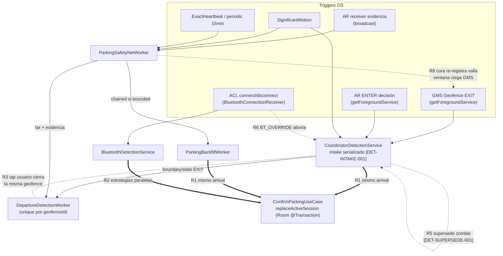

# 03 · Inventario de workers, servicios, receivers y entrypoints — y mapa de carreras

> Subagente C · refactor de solo-lectura · 2026-08-18. Fuentes: lectura íntegra de
> `shared/src/androidMain/.../detection/**`, `.../bluetooth/**` y `AndroidManifest.xml`.
> Todo lo no confirmado con código está marcado **NO VERIFICADO**.

## 1 · Inventario de actores (39)

### 1.1 Workers (11) — `detection/worker/`

| Clase | Qué lo dispara | Qué hace | Qué escribe | Con quién compite | ¿Idempotente? | Reintentos | Tags |
|---|---|---|---|---|---|---|---|
| `RegisterActivityTransitionsWorker` | Periódico 12 h, `enqueueKeep` desde `PaparcarApp:78`, `MainActivity:125`, `BootCompletedReceiver:42` (unique KEEP) | Re-registra las transiciones AR en GMS | Registro AR en GMS (via `ActivityRecognitionManagerImpl`) | Los otros 3 call sites de `registerTransitions()` — mitigado por el throttle de 30 min (`ActivityRecognitionManagerImpl:98`) | Sí (KEEP + `FLAG_UPDATE_CURRENT`) | retry ×3 | — |
| `ClearActiveParkingSessionWorker` | `WorkManagerParkingSyncScheduler.enqueueClearActiveParkingSession` (unique `parking_clear_active_$sessionId`, REPLACE) al `clearActive` en Room | Flip `isActive=false` del doc de Firestore (update targeted) | Firestore `parkingHistory/{sessionId}` | `SaveNewParkingSessionWorker` (que también apaga la previa) — mismo update targeted, convergente | Sí (update de un flag) | retry ×3, exp 30 s, red requerida | [PIPE-002] |
| `UpdateParkingSessionAddressAndPlaceWorker` | `enqueueUpdateParkingSessionAddressAndPlace` → APPEND_OR_REPLACE a la cadena `parking_chain_$sessionId` | Sube address+POI a Firestore | Firestore sesión | **Carrera conocida documentada en el código** (`:65-67`): puede correr antes de que `SaveNewParkingSessionWorker` haya creado el doc → NOT_FOUND; mitigada por el encadenado + retry | Sí | retry ×3, exp 30 s, red | [PIPE-002][BUG-WORKER-001] |
| `FirstParkNudgeWorker` | Periódico 24 h, `enqueueKeep` desde `PaparcarApp:102` | Nudge "aparca una vez" en cold-start si `EvaluateFirstParkNudgeUseCase` lo aprueba | `AppPreferences` (contador+timestamp), notificación | Nadie (autolimitado por caso de uso) | Sí | success siempre | [DET-TOGGLE-002] |
| `DepartureDetectionWorker` | Unique `DepartureDetectionWorker_$geofenceId` (REPLACE) desde: servicio EXIT boundary (`CoordinatorDetectionService:485`), EXIT stale (`:518`), AR mid-trip (`:784`) y safety-net dispatch (`ParkingSafetyNetWorker:322`) | Decide y procesa la SALIDA (veredicto en `RunDepartureCheckUseCase`); Dismissed → `clearCureThrottle` | Vía use case: Room clearActive, spot publicado, geofence removida (NO VERIFICADO en detalle — vive en commonMain) | `handleWatchdogDeparture` (tap del usuario) y el honest-close del coordinator, que cierran la MISMA sesión por otra vía | Sí a nivel de encolado (unique+REPLACE); la resolución la protege el use case | retry (exp 15 s, ~15/30/60 s) para inconclusos | [DET-SOLID-001][DET-RECONCILE-001] |
| `ReportSpotWorker` | `WorkManagerReportSpotScheduler` (unique `ReportSpotWorker_$spotId`, REPLACE) | Publica el spot liberado en Firestore; descarta si expiró en cola (TTL anclado al release) | Firestore `spots` | Nadie (payload autocontenido, no lee Room) | Sí (unique por spotId; TTL evita spots stale) | retry ×5, exp 30 s, red | [SPOT-OFFLINE-TTL-001] |
| `GeofenceJanitorWorker` | Periódico 12 h (KEEP) + `enqueueOnce` (REPLACE) desde `PaparcarApp`, `BootCompletedReceiver:43,47` y post-login sync (`enqueueGeofenceRestore`) | Restaura geofences de sesiones activas; barrido de duplicados active (repara invariante 1-activa-por-vehículo) | GMS geofences; Room `clearActiveById` sobre duplicados stale | La cura del `ParkingSafetyNetWorker` (ambos re-registran la misma valla — re-registro idempotente pero abre la ventana ciega de GMS, ver carrera R8) | Sí (re-add con `FLAG_UPDATE_CURRENT`, initial trigger 0) | retry ×3 | [GEOF-001][VEH-ACTIVE-FENCE-001][DET-SOLID-001] |
| `SaveNewParkingSessionWorker` | `enqueueSaveNewParkingSession` (cadena unique `parking_chain_$sessionId`, REPLACE) desde `ConfirmParkingUseCase` | Sube la sesión nueva a Firestore + apaga la previa; `NonCancellable` | Firestore sesión nueva + flag de la previa | `UpdateParkingSessionAddressAndPlaceWorker` (encadenado detrás) | Sí (set por id) | retry ×5, exp 30 s, red | [BUG-WORKER-002][DET-PIN-PROVENANCE-001] |
| `ParkingBackfillWorker` | **Encadenado DETRÁS** de `DepartureDetectionWorker` por el safety-net (`ParkingSafetyNetWorker:339-347`), solo si `preconfirmed && backfillBounded` | Reconstruye el pin de LLEGADA en el fix de despertar (LOW reliability) vía `ConfirmParkingUseCase` | Room+Firestore sesión nueva (por confirm), notificación revertible | **El coordinator vivo** (mismo arrival) — guard `detectionRuntime.isRunning` (`:64`); **la resolución nudge-only** del coordinator — guard stamp en prefs (`:83`) | Sí de facto (confirm reemplaza la activa; se abstiene ante guard) | **Nunca reintenta** (`:141`) | [DET-RECONCILE-001][DET-ARRIVAL-DOUBLE-PIN-001][DET-BACKFILL-TAINT-001] |
| `ParkingSafetyNetWorker` | Periódico 15 min (KEEP, `PaparcarApp:95`, boot) + `enqueueCheckNow` (unique `_now`, REPLACE, expedited) desde **10 fuentes**: sig-motion, app-start, detection-end (×2 en el servicio), AR ENTER/EXIT receiver, fence ENTER, exit-stale, BT connect, BT park, exact-alarm | El cerebro del reconcile aparcado: cura valla, re-sella ancla+pasos, despacha salida, prompt "¿sigues aparcado?", reaper de FGS fantasma, detectores de kill, sync de sig-motion y exact-alarm | Prefs `parking_safety_net` (ancla, pasos, seal, throttles, heartbeat, exits stale), GMS geofence (cura), encola `DepartureDetectionWorker`(+`ParkingBackfillWorker`), notificaciones, telemetría | El coordinator vivo (guard `isRunning` `:156`); el `GeofenceJanitorWorker` (misma valla); múltiples fuentes `enqueueCheckNow` colapsan en un unique-work (REPLACE) | Sí (evaluador puro + throttles a disco) | success siempre (sin retry) | [DET-SAFETY-NET-001][ANCHOR-PERSIST-001][DET-RECONCILE-001][DET-CONJUNCTION-001][OEM-KILL-001] |
| `EnrichParkingSessionWorker` | `WorkManagerParkingEnrichmentScheduler` (unique `EnrichParkingSessionWorker_$sessionId`, REPLACE) tras confirm | Geocoder + POI + snap del route a OSM (una vez); backfill pin-to-pin para pins `safety_net_backfill` | Room sesión (address/place/route vía repo) → dispara `UpdateParkingSessionAddressAndPlaceWorker` | La cadena de sync Firestore (indirecto) | Sí (`routeSnapped` flag) | retry ×3, exp 30 s; al agotar acepta la ruta cruda | [DET-ROUTE-SNAP-STORE-001][ROUTE-GAP-HONEST-001] |

### 1.2 Receivers (7)

| Clase | Qué lo dispara | Qué hace | Qué escribe | Con quién compite | ¿Idempotente? | Tags |
|---|---|---|---|---|---|---|
| `ParkingConfirmationReceiver` | Botones de notificación (CONFIRMED/DENIED/ACK/REVERT/DEPARTURE_CONFIRMED) | Reenvía al intake serializado del `CoordinatorDetectionService` vía `startForegroundService` | Nada (forward puro) | Nada — la serialización la hace el intake | Sí | [BUG-SERVICE-107] |
| `BootCompletedReceiver` | `BOOT_COMPLETED` (incl. sintético Android 15+ post-force-stop) y `MY_PACKAGE_REPLACED` | Re-arma AR + re-encola periódicos + restauración inmediata de geofences | Registro AR; colas WorkManager | `PaparcarApp.onCreate` (mismos enqueues) — KEEP lo hace inocuo | Sí (KEEP) | [GEOF-RESTORE-001] |
| `GeofenceEnterReceiver` | PendingIntent broadcast de la valla ENTER gemela | Solo encola `enqueueCheckNow(SOURCE_GEOFENCE_ENTER)` | Nada directo | — | Sí | [DET-RETURN-ANCHOR-001] |
| `GeofenceExitWitnessReceiver` | PendingIntent broadcast de la valla testigo EXIT | SOLO loguea (decision-free por contrato) | Solo log | — | Sí | [DET-EXIT-WITNESS-001] |
| `ExactHeartbeatReceiver` | Alarma exacta (`setExactAndAllowWhileIdle`, ~5 min aparcado) | Re-arma el siguiente tick + `enqueueCheckNow(SOURCE_EXACT_ALARM)` | Prefs `exact_heartbeat` | — | Sí | [DET-EXACT-HEARTBEAT-001] |
| `ActivityTransitionReceiver` | AR broadcast lane (IN_VEHICLE ENTER+EXIT, ON_BICYCLE) — carril de EVIDENCIA | Estampa `DepartureEventBus` con true-time; hints al coordinator (`onVehicleExit/onVehicleRide/onHumanPoweredRide`); acelera el safety-net (AR ENTER y EXIT) | `DepartureEventBus` (prefs mirror) | El carril de DECISIÓN (`ACTION_AR_TRANSITION` al servicio) recibe el MISMO ENTER — ambos estampan el mismo true-time (idempotente por diseño, `CoordinatorDetectionService:683`) | Sí | [DET-G-01][DET-SOLID-001][DET-BIKE-NOT-A-CAR-001] |
| `BluetoothConnectionReceiver` | ACL_CONNECTED / ACL_DISCONNECTED del stack BT (manifest, exported + permiso) | Resuelve vehículo por MAC; arbitraje BT-sobre-coordinator (`ACTION_BT_OVERRIDE`); DISCONNECTED → FGS BT; CONNECTED → cancel + `SOURCE_BT_CONNECT` | `BtConnectionStore` (connected set + timestamp) | **El coordinator en vivo** — el override lo aborta [DET-TIERS-001] | Sí | [DET-TIERS-001][DET-BT-IDENTITY-GATE-001][DET-BT-RECEIVER-EXPORT-001] |

### 1.3 Servicios (2 + helper)

| Clase | Qué lo dispara | Qué hace | Qué escribe | Con quién compite | ¿Idempotente? | Tags |
|---|---|---|---|---|---|---|
| `CoordinatorDetectionService` | 11 acciones: START/STOP_TRACKING, SENTRY_WAKE, RESUME_SENTRY, GEOFENCE_EXIT (getForegroundService de GMS), AR_TRANSITION (decisión), CONFIRMED/DENIED/ACK/REVERT, DEPARTURE_CONFIRMED, BT_OVERRIDE; null intent = sticky restart (stop sin promover) | ÚNICO dueño del arm/track del Coordinator. **Intake `Channel(UNLIMITED)` de un solo consumidor [DET-INTAKE-001]**: cada intent se procesa a completitud y el teardown se decide una vez por comando (`stopSelfResult(startId)` veta stops stale). Arma vía `startParkingDetection` (gate `coordinatorMayArm` [DET-STRATEGY-GATE-001]); honest-close + arrival-resolution en `NonCancellable`; SENTRY residente | `DetectionRuntimeState` (running/presence/trip), `PendingDetectionStore` (arm+heartbeat), `SentryResidenceStore`, `DrivingRouteStore`, prefs del safety-net (arrival resolution, stale-exit record), encola `DepartureDetectionWorker` y checks; el confirm/abort lo ejecuta `CoordinatorParkingDetector` (commonMain) | Consigo mismo (jobs supersedidos), con el safety-net y su backfill, con BT (override), con el pin manual | El intake serializa; los jobs se protegen con identidad `detectionJob === thisJob` | [DET-INTAKE-001][DET-SUPERSEDE-001][DET-ENDED-VETO-RACE-001][DET-RESIDENT-FGS-001] |
| `BluetoothDetectionService` | `BluetoothConnectionReceiver`: BT_DISCONNECTED (startForegroundService) / BT_CONNECTED (startService) | DISCONNECTED → `BluetoothParkingDetector.detectParking` (debounce 30 s → fix estacionario → walk-away ≥30 m o timeout-save) → confirm; CONNECTED → cancela el job + check BT_CONNECT | Room+Firestore vía `ConfirmParkingUseCase`; notificación | El coordinator (estrategias paralelas — resueltas por `resolveStrategy` + override); jobs BT supersedidos entre sí | Guard `detectionJob === thisJob` [BT-BUG-101]; START_NOT_STICKY | [BT-REFACTOR-FGS-001][DET-BT-TIMEOUT-SAVE-001] |
| `ForegroundServiceController` | Helper de ambos servicios | promote / stop con `stopSelfResult(startId)` (veto de stops stale) / removeNotification | — | — | Sí | [BUG-FGS-100][DET-INTAKE-001] |

### 1.4 Entrypoints, schedulers y stores de nivel raíz (15 + 3 BT)

| Clase | Rol | Estado que posee | Notas de concurrencia |
|---|---|---|---|
| `GeofenceManagerImpl` | Registra 3 vallas por parking (EXIT→`getForegroundService` al servicio; ENTER gemela y testigo EXIT→broadcast), NEVER_EXPIRE, initial trigger 0 | Registro GMS | Re-add idempotente (`FLAG_UPDATE_CURRENT`); PERO cada re-registro resetea el estado INSIDE/OUTSIDE de GMS (ventana ciega — de ahí el throttle de la cura) |
| `WorkManagerParkingSyncScheduler` | Encola save/clear/update + restore de geofences (síncrono) | — | Unique names por sessionId; REPLACE/APPEND_OR_REPLACE |
| `WorkManagerParkingEnrichmentScheduler` | Encola enrich | — | Unique por sessionId, REPLACE |
| `WorkManagerReportSpotScheduler` | Encola report spot | — | Unique por spotId, REPLACE |
| `ExactHeartbeatScheduler` | Alarma exacta one-shot ~5 min mientras aparcado; `sync()` desde el safety-net en CADA tick + re-arm del receiver | Prefs `exact_heartbeat` | Un solo punto de armado/desarmado (el worker); auto-sana tras process kill |
| `SignificantMotionMonitor` | Sensor one-shot TYPE_SIGNIFICANT_MOTION; en SENTRY → `ACTION_SENTRY_WAKE` directo; si no → `enqueueCheckNow(SIG_MOTION)` | `armed` + cooldown en memoria | `@Synchronized`; cooldown anti-tormenta [DET-SENTRY-COOLDOWN-001] vive AQUÍ porque 3 espejos llaman a `sync` |
| `PendingDetectionStore` | Registro durable de un arm vivo (armId, heartbeat, sawDriving) en prefs `parking_safety_net` | Prefs | Escribe el servicio, lee/limpia el safety-net (watchdog never-silent) |
| `SentryResidenceStore` | Stamp durable de residencia SENTRY (mismo prefs) | Prefs | Escrito por `enterSentry`, limpiado en toda salida deliberada; leído por 2 detectores de kill |
| `DepartureEventBusImpl` | Último AR ENTER (true-time), `@Volatile` + espejo prefs | Prefs `departure_event_bus` | Estampado por AMBOS carriles AR (idempotente, mismo true-time) |
| `GeofenceEventBusImpl` | Channel UNLIMITED de eventos de valla in-process | Memoria | Solo `Exited` de boundary se emite (los stale se retienen para no limpiar UI) |
| `TripTrailImpl` | Ring buffer a disco de fixes one-shot (60 pts) | Prefs `trip_trail` | `synchronized(lock)`; dedupe por timestamp |
| `DrivingRouteStoreImpl` | Ruta densa del viaje a disco | Prefs `driving_route` | `synchronized(lock)`; se limpia en CONFIRM, no en el finally (carrera de re-arm, field 2026-08-09) |
| `DepartureWatchResumerImpl` | `ACTION_RESUME_SENTRY` desde momentos foreground | Cooldown en memoria | Gate por el MISMO stream que el epílogo (una pregunta, un contestador) [DET-WATCH-RESUME-RACE-001] |
| `ActivityRecognitionManagerImpl` | Registra AR en dos carriles (broadcast evidencia + getForegroundService decisión) | Throttle 30 min en memoria | Cada re-registro re-entrega la última transición stale a AMBOS carriles [DET-AR-FIRST-001b] |
| `ManualParkingDetectionImpl` | start() = ACTION_START_TRACKING (FGS); stop() = STOP_TRACKING (pin manual cancela auto-confirm tardío [DET-MANUAL-CANCEL-001]) | — | — |
| `BluetoothParkingDetector` | Lógica del flujo BT (stateless, cancelación cooperativa) | — | Confirma vía `ConfirmParkingUseCase` |
| `AndroidBluetoothScanner` | Bonded devices + estado conectado (lee `BtConnectionStore`) | — | — |
| `BtConnectionStore` | Última conexión + set conectado-ahora por vehicleId | Prefs `bt_identity` | Escribe el receiver, leen el safety-net y el strategy resolver |

### 1.5 Manifest (`app/src/main/AndroidManifest.xml`)

- Servicios: `CoordinatorDetectionService` y `BluetoothDetectionService`, ambos `foregroundServiceType="location"`, `exported="false"` (`:65-76`).
- Receivers: `ActivityTransitionReceiver` (exported, permiso GMS AR), `BootCompletedReceiver` (BOOT + MY_PACKAGE_REPLACED), `BluetoothConnectionReceiver` (exported + permiso BLUETOOTH_CONNECT — obligatorio, el stack BT no entrega a no-exportados [DET-BT-RECEIVER-EXPORT-001]), `GeofenceEnterReceiver`, `GeofenceExitWitnessReceiver`, `ExactHeartbeatReceiver` (explícitos, sin filter), `ParkingConfirmationReceiver` (filter con 4 acciones).
- ⚠️ Detalle: el intent-filter de `ParkingConfirmationReceiver` (`:148-153`) NO lista `ACTION_DEPARTURE_CONFIRMED`, que el receiver sí enruta (`ParkingConfirmationReceiver:51`). Si la notificación "sigues aparcado" usa PendingIntent explícito a la clase, el filter es irrelevante — **NO VERIFICADO** (el builder de esa notificación no está en el alcance leído).
- Permisos FGS: `FOREGROUND_SERVICE`, `FOREGROUND_SERVICE_LOCATION`, `FOREGROUND_SERVICE_DATA_SYNC`, más `SCHEDULE_EXACT_ALARM`, `ACTIVITY_RECOGNITION`, `BLUETOOTH_CONNECT`, `RECEIVE_BOOT_COMPLETED`.

## 2 · ¿Pueden DOS actores armar, confirmar o cerrar una sesión A LA VEZ?

**SÍ — por diseño hay múltiples escritores, y los propios comentarios del código documentan carreras de campo reales.** La serialización solo es total DENTRO del `CoordinatorDetectionService` (intake [DET-INTAKE-001]); entre procesos lógicos (servicio ↔ workers ↔ servicio BT) no hay lock global, solo guards por par + la transacción Room como última línea.

Evidencia:

1. **Dos confirmadores del mismo arrival** — `ParkingBackfillWorker.kt:51-66`: *"a live coordinator session can arm for the SAME arrival in the race window between that decision and this worker actually running"* (field 2026-07-20: pin fantasma a 96 m). Guard actual: skip si `detectionRuntime.isRunning` (`:64`) — que NO cubre la ventana si el coordinator arma DESPUÉS de esa lectura y ANTES del confirm del worker. **NO VERIFICADO** que esa sub-ventana esté cerrada; la defensa real es `replaceActiveSession` (transaccional) + la carta revertible.
2. **Tres llamadores de `ConfirmParkingUseCase`** desde contextos concurrentes: el coordinator vivo (job del servicio), `ParkingBackfillWorker` (hilo WorkManager) y `BluetoothParkingDetector` (job del servicio BT). Las estrategias BT y Coordinator corren en **servicios FGS distintos y simultáneos** (notificaciones 1001 vs 1003, `BluetoothDetectionService.kt:50-53`); el arbitraje [DET-TIERS-001] (`BluetoothConnectionReceiver:104-130`) aborta el coordinator en el edge BT, pero es asíncrono (startService → intake) — entre el edge y el abort ambos están vivos.
3. **Dos cerradores de la misma salida**: `DepartureDetectionWorker` (unique por geofence, con reintentos en curso) y `handleWatchdogDeparture` (tap del usuario → `ProcessConfirmedDepartureUseCase` directo en el servicio, `CoordinatorDetectionService:394-404`) pueden resolver la MISMA geofence en paralelo. **NO VERIFICADO** que `ProcessConfirmedDepartureUseCase`/`RunDepartureCheckUseCase` sean mutuamente idempotentes (viven en commonMain, fuera del alcance leído); el desenlace benigno depende de que "sesión ya no activa" sea un no-op en ambos.
4. **El invariante final es la transacción Room**: `UserParkingDao.replaceActiveSession` (`UserParkingDao.kt:83-89`, `@Transaction` deactivate-then-insert) garantiza ≤1 activa por vehículo *por operación*; y aun así el janitor mantiene un barrido de duplicados "que no deberían existir" (`GeofenceJanitorWorker.kt:57-72`) — el propio código admite que carreras legacy/sync los producen.
5. **El armado sí está serializado** dentro del servicio: todo trigger entra por el intake y `startParkingDetection` cancela el job anterior; dos arms simultáneos del Coordinator son imposibles en un mismo proceso. Lo que sí ocurre es arm Coordinator + detección BT simultáneas (punto 2).

## 3 · Mapa de carreras conocidas

| # | Carrera | Actores | Recurso en disputa | Guard actual (evidencia) |
|---|---|---|---|---|
| R1 | **Doble colocador del arrival** (pin fantasma 2026-07-20) | Coordinator vivo vs `ParkingBackfillWorker` | La sesión activa del vehículo (el pin de llegada) | Skip si `isRunning` (`ParkingBackfillWorker.kt:64`) + deferral a la resolución nudge-only estampada [DET-BACKFILL-TAINT-001] (`:83`, escrita en `CoordinatorDetectionService:896-912`) + backfill chained DETRÁS de la salida |
| R2 | **Estrategias paralelas BT/Coordinator** | `BluetoothDetectionService` vs `CoordinatorDetectionService` | La sesión del vehículo y el pin | `resolveStrategy` + gate [DET-STRATEGY-GATE-001] (`CoordinatorDetectionService:1165-1174`) + override [DET-TIERS-001] (`BluetoothConnectionReceiver:120-130` → `:284-287`); la señal BT jamás entra al scoring |
| R3 | **Doble cerrador de la salida** | `DepartureDetectionWorker` (retries) vs tap `DEPARTURE_CONFIRMED` (`handleWatchdogDeparture:394`) vs honest-close (`maybeRunHonestClose:816`) | La sesión activa por geofence/vehículo | Unique-work REPLACE por geofence para los workers; entre worker y tap/honest-close solo la idempotencia del dominio — **NO VERIFICADO** |
| R4 | **Job supersedido mata al sustituto** [DETECT-SERVICE-RACE-001] | Job de detección viejo vs nuevo (mismo servicio; espejo BT [BT-BUG-101]) | El FGS y `detectionRuntime` | Identidad `detectionJob === thisJob` en el finally (`CoordinatorDetectionService:1315`, `BluetoothDetectionService:170`); `setRunning(true)` síncrono pre-launch (`:1185`) |
| R5 | **Sesión zombie bloquea el siguiente park** [DET-SUPERSEDE-001] | Sesión corriendo (valla espuria) vs EXIT/AR nuevo | El slot único de detección | `shouldSupersedeRunningSession` por distancia (`:550`, `:699`) + telemetría `SessionSuperseded`; si es la misma zona, se suprime para no resetear el abort timer [DET-AR-REARM-001] |
| R6 | **Stop de un trigger decapita a otro** (EXIT real muerto 10 ms después de un TickOnly, 2026-07-11) | Comandos concurrentes del mismo servicio | La vida del servicio y el handling en vuelo | Intake de un solo consumidor [DET-INTAKE-001] (`:147-191`) + `stopSelfResult(startId)` (`ForegroundServiceController:75-79`) + `DetectionEnded` desde `invokeOnCompletion`, nunca desde el finally [DET-ENDED-VETO-RACE-001] (`:1337-1350`) |
| R7 | **Entregas stale/re-entregadas** (EXIT lejos de la valla; AR ENTER re-entregado en cada re-registro) | GMS vs el estado real | Autoridad para liberar/armar | Split boundary-vs-stale (`EvaluateGeofenceExitUseCase`, `:502-528`) — el stale pierde autoridad instantánea pero SIEMPRE dispara el worker + `recordStaleExitDelivery` para la conjunción [DET-CONJUNCTION-001]; probe corto [DET-ZOMBIE-PROBE-001] (`:643`); throttle de re-registro AR 30 min [DET-AR-FIRST-001b]; ladder evalúa sin fix primero (`:729-751`); TTL en `ReportSpotWorker:69-73` |
| R8 | **Zombies de geofence** (valla huérfana / estado GMS envenenado / ventana ciega del re-registro) | GMS vs Room | Qué vallas existen y su estado INSIDE/OUTSIDE | Orphan-clean en el EXIT (`:463-470`); NEVER_EXPIRE + borrado explícito ([GEOF-001], `GeofenceManagerImpl:190-194`); cura throttled [DET-ANCHOR-FREEZE-001 F4] (`ParkingSafetyNetWorker:264-308`) + `clearCureThrottle` tras EXIT falso (`DepartureDetectionWorker:50`); janitor solo re-registra vallas del vehículo activo/BT [VEH-ACTIVE-FENCE-001] |
| R9 | **Swap-race de vehículo activo** | Cambio de coche activo vs viaje en curso | A qué coche se atribuye el pin | `nominatingVehicleId` de la valla que disparó gana al vehículo activo (`CoordinatorParkingDetector.kt:487-490` [VEH-ACTIVE-FENCE-001]); `TripContext(session.vehicleId)` en cada arm |
| R10 | **Duplicados de sesión activa** (supersession de sesiones) | Confirm concurrentes / sync remoto | Invariante 1-activa-por-vehículo | `replaceActiveSession` `@Transaction` (`UserParkingDao.kt:83-89`) + barrido reparador del janitor (`GeofenceJanitorWorker.kt:57-72`) que estampa `pendingSync` para propagar a Firestore |
| R11 | **Save vs Update en Firestore** (doc aún no creado) | `SaveNewParkingSessionWorker` vs `UpdateParkingSessionAddressAndPlaceWorker` | El doc de la sesión | Misma cadena unique `parking_chain_$sessionId` con APPEND_OR_REPLACE (`WorkManagerParkingSyncScheduler:48-59`); la carrera residual está documentada como warning (`UpdateParkingSessionAddressAndPlaceWorker:65-67`) |
| R12 | **Pin manual vs auto-confirm tardío** | Usuario marca a mano vs coordinator en vuelo | El pin del vehículo | `ManualParkingDetectionImpl.stop()` → STOP_TRACKING cancela el job [DET-MANUAL-CANCEL-001] (`:26-31`) — ventana entre el confirm del coordinator y el STOP: **NO VERIFICADO** |
| R13 | **Tormenta sig-motion wake-abort** (~18 s/ciclo, 2026-08-13) | SigMotion vs SENTRY re-arm | CPU/batería + FGS parpadeante | Streak + cooldown centralizado en el monitor [DET-SENTRY-COOLDOWN-001] (`SignificantMotionMonitor:93-131`, `CoordinatorDetectionService:957-982`) |
| R14 | **Resume del watch vs stream sin entregar** | `DepartureWatchResumerImpl` vs Room flow frío | Reconstruir el SENTRY | Una pregunta un contestador [DET-WATCH-RESUME-RACE-001] (`DepartureWatchResumerImpl:18-24,47-68`) + cooldown 60 s |

## 4 · Observaciones de riesgo residual (para el refactor)

1. **`ConfirmParkingUseCase` tiene 3 llamadores en contextos concurrentes distintos** (coordinator, backfill, BT) y su serialización real es solo la transacción Room. El guard `isRunning` del backfill es check-then-act sin lock: la ventana entre la lectura (`ParkingBackfillWorker:64`) y el confirm (`:109`) sigue abierta si un arm llega en medio.
2. **El cierre de salida no tiene dueño único**: worker (con retries), tap del watchdog y honest-close pueden tocar la misma sesión; la benignidad depende de idempotencia en commonMain no auditada aquí (**NO VERIFICADO**).
3. **Estado compartido crítico en un solo fichero de prefs** (`parking_safety_net`): ancla, pasos, seal, exits stale, heartbeat, pendings, residencia SENTRY y arrival-resolution — escrito por el servicio, el worker y `AndroidDetectionStepAnchors` (contrato de claves `internal`). SharedPreferences es atómico por editor pero no transaccional entre claves relacionadas escritas por actores distintos; el "prune before ANCHOR prefix" (`ParkingSafetyNetWorker:743-752`) es orden-sensible.
4. `enqueueCheckNow` usa un ÚNICO unique-work `ParkingSafetyNetWorker_now` con REPLACE para 10 fuentes: una fuente puede pisar (REPLACE) el check aún no ejecutado de otra, perdiendo su `source` (solo afecta a telemetría/`userPresent`, no al veredicto — el evaluador relee el mundo).
