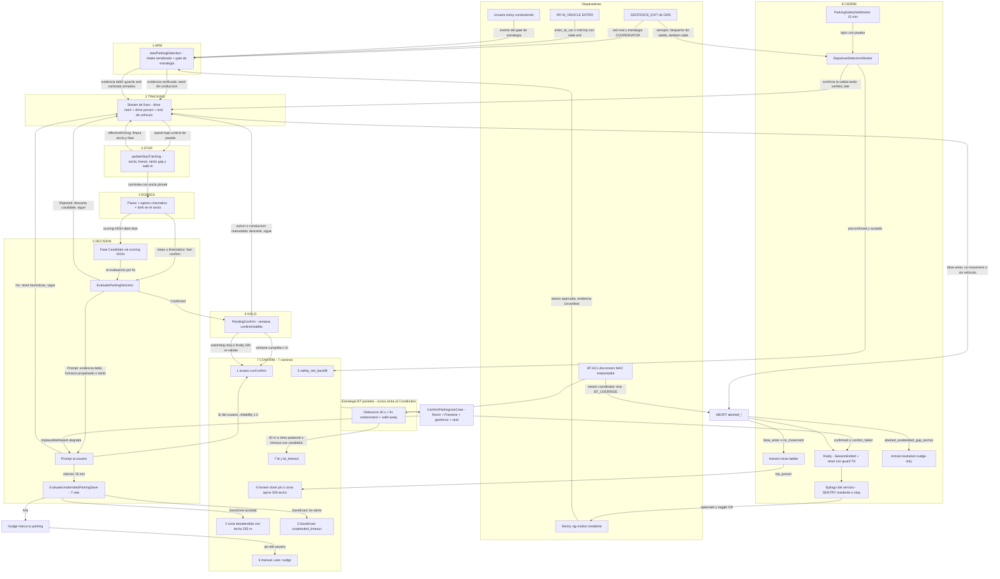

# 08 — Flujo end-to-end (estado actual, Fase 4)

> 📌 **Citas de línea ancladas a master `2288468e` (2026-08-24), el commit de arranque de F6.**
> A partir de aquí la Fase 1 mueve símbolos y los números se desplazan: son *a fecha de*, no punteros
> vivos. Para resolver cualquiera con exactitud: `git show 2288468e:<fichero>`. [P0.5]

> Fase 4 del refactor de detección · 2026-08-19 · síntesis de los parciales A (ARM→TRACKING→STOP→EGRESS)
> y B (DECISIÓN→HOLD→CONFIRM→CIERRE). Solo lectura de código; este doc no propone cambios.
>
> **Línea-base del código**: `CoordinatorParkingDetector.kt` (CPD) tiene **2586 líneas**, árbol
> post-`fbc83847` (DET-CAR-REST-CLOCK-001). ⚠️ Los line-refs de los docs 01-02 anteriores van
> **desplazados ~12-13 líneas en el tramo final** del CPD (todo lo posterior a ~`CPD:1130`);
> las líneas citadas AQUÍ son las del árbol actual.
>
> Abreviaturas de rutas (heredadas de los parciales):
> `CDS` = `composeApp/src/androidMain/kotlin/io/apptolast/paparcar/detection/service/CoordinatorDetectionService.kt`
> `CPD` = `composeApp/src/commonMain/kotlin/io/apptolast/paparcar/domain/coordinator/CoordinatorParkingDetector.kt`
> `EvalPD` = `EvaluateParkingDecisionUseCase.kt` · `EvalUS` = `EvaluateUnattendedParkingSaveUseCase.kt`
> `EvalHC` = `EvaluateHonestCloseUseCase.kt` · `RunHC` = `RunHonestCloseUseCase.kt`
> `CPUC` = `ConfirmParkingUseCase.kt` · `EvalSNC` = `EvaluateSafetyNetCheckUseCase.kt`
> `PSNW` = `ParkingSafetyNetWorker.kt` · `BFW` = `ParkingBackfillWorker.kt` · `RDC` = `RunDepartureCheckUseCase.kt`
> `SMPU` = `SaveManualParkingUseCase.kt` · `PCD` = `ProcessConfirmedDepartureUseCase.kt`
> Lo marcado **NO VERIFICADO** se cita por contrato/KDoc/doc previo, no por lectura del fichero.

---

## 0. Diagrama global

Colapso a nivel etapa de las 116 aristas crudas del apéndice (§9). Los 4+1 caminos de ARM
(geofence / AR / sentry / manual + BT paralelo) y los 7 caminos de CONFIRM son visibles; el
detalle fino (guards, sub-ramas, líneas) está en §§1-8 y en el apéndice.



(42 aristas en el diagrama; las 116 crudas, en §9.)

---

## 1. ETAPA ARM

Todo arm del Coordinator entra por el **intake serializado** del servicio [DET-INTAKE-001]:
`onStartCommand` promociona el FGS (`CDS:217-235`), encola `Command.Deliver` (`CDS:241`) y un único
consumidor procesa cada intent a completitud (`CDS:169-191`). El embudo final es
`startParkingDetection` (`CDS:1149-1351`), con UN gate de estrategia para todos los triggers
automáticos: `coordinatorMayArm(strategy, trigger)` (`CDS:1165-1174`,
`domain/detection/ParkingStrategyResolver.kt:63-64`) [DET-STRATEGY-GATE-001] — MANUAL está exento.
El intent nulo (sticky restart tras process kill) NUNCA arma: stop sin promover (`CDS:206-210`)
[DET-B-02].

Lo que TODO arm produce (salidas comunes de `startParkingDetection`):
- `logArmTrigger` → Crashlytics key `det_trigger` + evento remoto `SessionStarted(sessionId="arm_<now>",
  strategy="ARM:<trigger> (<detail>)")` + notificación debug en DEBUG (`CDS:1361-1389`).
- `lastEndedArmTrigger = trigger` para el streak de cooldown del sentry (`CDS:1179`)
  [DET-SENTRY-COOLDOWN-001].
- `closeSentryResidencyLedger(trigger)` — cierra la residencia SENTRY (evento `Sentry.WOKE`) o
  detecta un kill (`Sentry.KILLED`) (`CDS:1090-1127`) [DET-RESIDENT-FGS-001].
- `detectionRuntime.setRunning(true)` SÍNCRONO pre-launch (`CDS:1185`) [DET-READY-001c],
  `setPresence(Active)` (`CDS:1188`), `setTrip(trip)` (`CDS:1193`) [DEPART-CONSISTENCY-001].
- `PendingDetectionStore.arm(armId, armedAt, trigger)` — pending durable con heartbeat
  (`CDS:1196-1198`, heartbeat `CDS:1206-1222`; `sawDriving=true` al entrar en fase Candidate)
  [DET-NEVER-SILENT-001]. **NO VERIFICADO** el interior del store.
- lanza `detectionJob` → `parkingDetectionCoordinator(observeAdaptiveLocation().onEach{route.append},
  armEvidence, nominatingVehicleId, staleExitDelivery, departureAnchor, departureFenceRadiusMeters)`
  (`CDS:1266-1287`) + tap pasivo de ruta (`CDS:1231-1235`) [ROUTE-PASSIVE-FILL-001].
- al completar el job: `invokeOnCompletion → intake.trySend(DetectionEnded(lastStartId))`
  (`CDS:1344-1350`) [DET-ENDED-VETO-RACE-001]; el epílogo decide SENTRY vs stop
  (`resolveIdleEpilogue`, `CDS:951-1009`).

### 1.1 · Camino GEOFENCE_EXIT (`handleGeofenceExit`, `CDS:418-652`)

**(a) ENTRADAS.** PendingIntent `getForegroundService` de GMS con `ACTION_GEOFENCE_EXIT`
(`GeofenceManagerImpl.kt:133-149` [DET-G-01]; valla principal EXIT NEVER_EXPIRE, initial trigger 0,
`GeofenceManagerImpl.kt:31-47` [GEOF-001]; gemela ENTER → `GeofenceEnterReceiver` y testigo EXIT →
`GeofenceExitWitnessReceiver`, solo log [DET-EXIT-WITNESS-001], `GeofenceManagerImpl.kt:72-113`).
Datos: `triggeringGeofences` + `triggeringLocation` (`CDS:427-432`), sesión activa por geofence
desde Room (`CDS:438-453`), vehículo activo (`CDS:454`), fix fresco one-shot
(`getOneLocation(maxAgeMs=freshFixMaxAgeMs)`, `CDS:596`) y el bus AR (`departureEventBus`) dentro
del verificador.

**(b) SALIDAS.** Tres independientes:
1. *Despacho de salida*: por cada exit boundary, `GeofenceEvent.Exited` al bus in-process +
   `DepartureDetectionWorker` unique REPLACE por geofence (`CDS:483-489`). Para exits stale, el
   MISMO worker pero SIN emitir `Exited` (`CDS:513-523`) + `recordStaleExitDelivery` (`CDS:514`)
   + `ParkingSafetyNetWorker.enqueueCheckNow(SOURCE_GEOFENCE_EXIT_STALE)` (`CDS:524-527`)
   [DET-RIDE-PROOF-001][DET-CONJUNCTION-001].
2. *Limpieza de huérfanas*: `removeGeofence` + evento remoto `OrphanCleaned` (`CDS:463-470`).
3. *Arm del Coordinator*: `startParkingDetection(GEOFENCE_EXIT, trip=TripContext(session.location,
   session.vehicleId), armEvidence, staleExitDelivery)` (`CDS:638-646`).

**(c) DUEÑO.** La clasificación es del use case puro `EvaluateGeofenceExitUseCase`
(`EvaluateGeofenceExitUseCase.kt:71-105`) [AUDIT-A9-KMP-001]: huérfana vs real vs skip
(`LookupFailed` se descarta sin limpiar, `:78`), atribución al vehículo activo con fallback
(`:84-86`), y split boundary/stale por distancia de entrega vs `watchdogFarThresholdMeters`
(`:88-98`) [DET-EXIT-TRUST-001]. La evidencia del arm la decide `VerifyDepartureEvidenceUseCase`
(`VerifyDepartureEvidenceUseCase.kt:58-107`) [DET-G-05]: `VerifiedBySpeed` (fix a velocidad de
salida con accuracy creíble, `:66-70`) → `VerifiedByVehicleEnter` (ENTER con true-time POSTERIOR
al nacimiento de la sesión [DET-SESSION-BIRTH-001] `:73`, dentro de `vehicleEnterWindowMs`, Y
desplazamiento más allá del alcance peatonal `isBeyondPedestrianReach` `:83-89`
[DET-RIDE-PROOF-001]) → `Unverified` (`:106`; fail-closed sin fix).

**(d) QUÉ PUEDE ABORTARLA.**
- Evento nulo/error de GMS (`CDS:420-425`) o sin triggering fences (`CDS:428-430`).
- Lookup Room FALLIDO → skip, nunca huérfana (`CDS:444-449`, `GeofenceExitLookup.LookupFailed`)
  — cierre del incidente de campo 2026-07-11 00:38.
- `!decision.hasRealExit` → return sin arm (`CDS:473-474`); el despacho de salida ya corrió.
- Estrategia ≠ COORDINATOR → despacha salida pero NO arma (`CDS:648-650` + gate `CDS:1165-1174`)
  [DET-STRATEGY-GATE-001].
- `guardPermissions` sin permisos de localización → cancela job + notif permiso revocado, no arma
  (`CDS:533`, `CDS:1423-1429`).
- Coordinator ya corriendo en la MISMA zona → suprime el re-arm para no resetear el abort timer
  (`CDS:538-554`) [DET-AR-REARM-001]; si la valla nueva queda más allá de su propio radio del ancla
  corriente → SUPERSEDE (`shouldSupersedeRunningSession`, `CDS:549-552`;
  `domain/detection/SessionSupersede.kt` **NO VERIFICADO** su interior) [DET-SUPERSEDE-001].

**(e) QUÉ SE REGISTRA.** Local `PARKDIAG/Service` en cada rama. Remoto: `OrphanCleaned`
(`CDS:469`), `SessionSuperseded` (`CDS:562-571`), `DepartureVerdict(source="pre-arm",
verdict=armEvidence.persistLabel, speedKmh, enterAgeMs)` (`CDS:619-630`) [DET-SOLID-001],
`SessionStarted("ARM:GEOFENCE_EXIT (…)")` vía `logArmTrigger`. **Ramas mudas en remoto**: la
supresión "same area, not re-arming" (`CDS:554`) y el stand-down por estrategia (`CDS:649`) solo
dejan logcat; el stale-exit deja record en prefs pero ningún evento remoto propio.

**(f) TARDÍAS/STALE.** Doctrina intacta: *el EXIT lejos de la valla PIERDE la autoridad de
liberar al instante, nunca el deber de mirar* — corre el mismo worker speed-gated (`CDS:502-522`),
se registra para la conjunción EXIT∧ENTER [DET-CONJUNCTION-001] y el Coordinator ARMA IGUAL
(`CDS:574-580`) porque es la única ventana de FGS-start que el OS concede. Un arm nacido de la
vía stale lleva `staleExitDelivery=true` → presupuesto no-movement corto (`staleExitNoMovementMs`,
zombie probe ~75 s en vez de 4 min, `CPD:956-957`) [DET-ZOMBIE-PROBE-001]. La verificación usa
SOLO fix fresco (`freshFixMaxAgeMs`, `CDS:594-596`) para que un fix cacheado a velocidad de
conducción no "verifique" un exit viejo. Un EXIT entregado 11 h tarde (campo 17-08) arma, sondea
y aborta sin pin.

### 1.2 · Camino AR IN_VEHICLE ENTER — carril de DECISIÓN (`handleArTransition`, `CDS:666-807`)

**(a) ENTRADAS.** `ACTION_AR_TRANSITION` vía `getForegroundService` (registro de dos carriles en
`ActivityRecognitionManagerImpl`, throttle 30 min — **NO VERIFICADO** su interior)
[DET-AR-FIRST-001]. Datos: último evento `IN_VEHICLE ENTER` del batch (`CDS:672-675`), su
**true-time** desde `elapsedRealTimeNanos` (`CDS:680-681`), sesión aparcada activa-preferida
(`CDS:687-690`), record de stale-exit reciente (`hasRecentStaleExit`, ventana
`exitEnterPairWindowMs`, `CDS:724-728`), y fix fresco SOLO si la escalera lo pide (`CDS:742-751`).

**(b) SALIDAS.** Estampa el bus `departureEventBus.onVehicleEntered(trueEpochMs)` idempotente
(`CDS:684` — el carril de evidencia estampa el mismo true-time). Según la escalera:
`ArmAtCar` → arm con `ArmEvidence.BoardingAtCar` (sin seed) (`CDS:754-763`); `ArmMidTrip` → encola
`DepartureDetectionWorker` para la valla rota (`CDS:784-788`) + arm con lo que el verificador
conceda AHORA (`CDS:769-795`); resto → nada (el tick del evaluador ya lo encoló el carril de
evidencia).

**(c) DUEÑO.** `EvaluateArEnterArmUseCase` (`EvaluateArEnterArmUseCase.kt:69-98`)
[DET-AR-FIRST-001]: `NoSession` (`:76`) → `StaleEnter` si lag ∉ [0, exitEnterPairWindowMs]
(`:79`) o si el ENTER PREDATA la sesión (`:83`) [DET-SESSION-BIRTH-001] → `NoFix` (`:85`) →
`ArmAtCar` si el fix cae dentro de radio+accuracy de la propia valla (`:94`) → `ArmMidTrip` si hay
stale-exit registrado (`:95`) [DET-CONJUNCTION-001] → `TickOnly` (`:96` — bus/taxi/misfire).

**(d) QUÉ PUEDE ABORTARLA.** Sin resultado AR o sin ENTER (`CDS:667-679`); `guardPermissions`
(`CDS:685`); coordinator corriendo en la misma zona (mismo supersede-o-suprime que 1.1,
`CDS:691-723`); las cuatro salidas negativas de la escalera (`CDS:797-805`) — con NO stop aquí: el
epílogo del intake decide [DET-INTAKE-001]; y el gate de estrategia en el embudo.

**(e) QUÉ SE REGISTRA.** Local con lag medido. Remoto: `SessionStarted("ARM:AR_VEHICLE_ENTER")`
(y `SessionSuperseded` si aplicó). **Rama muda**: a diferencia del exit (1.1), `ArmMidTrip` NO
emite `DepartureVerdict` pre-arm — la evidencia de este arm solo queda en el `detail` del
`SessionStarted` y en el label persistido al confirmar; `TickOnly`/`StaleEnter`/`NoFix`/`NoSession`
no emiten NINGÚN evento remoto (solo logcat `CDS:804`).

**(f) TARDÍAS/STALE.** GMS re-entrega el último ENTER a AMBOS carriles en cada re-registro
[DET-AR-FIRST-001b]: la escalera corre PRIMERO SIN fix para que una re-entrega cueste milisegundos
y no aparque 15 s de espera GPS delante de un trigger real encolado (`CDS:729-741`)
[DET-INTAKE-001]. Un ENTER viejo pierde autoridad (`StaleEnter` → tick del evaluador, nunca arm),
pero el carril de evidencia (1.2b) ya aceleró el safety-net con el MISMO evento: el trigger sigue
disparando siempre.

### 1.2b · Carril de EVIDENCIA AR (`ActivityTransitionReceiver.kt:43-105`) — no arma nunca

`ON_BICYCLE ENTER` → `coordinator.onHumanPoweredRide(trueTime)` (`:52-58`, veto puro, sin
safety-net) [DET-BIKE-NOT-A-CAR-001]. `IN_VEHICLE EXIT` → `coordinator.onVehicleExit()` (pista no
decisiva del coordinator vivo) + `enqueueCheckNow(SOURCE_AR_EXIT)` (`:62-75`)
[DET-CONJUNCTION-001]. `IN_VEHICLE ENTER` → estampa bus + `coordinator.onVehicleRide(trueTime)`
(supersede de la bici) + `enqueueCheckNow(SOURCE_AR_ENTER)` (`:77-102`) [DET-SOLID-001]
[DET-RECONCILE-001]. Escrituras thread-safe al estado del CPD: `vehicleExitConfirmed=true`
(`CPD:1369-1372`), `bicycleRideAtMs` (`CPD:1377-1380`), `vehicleRideAtMs` (`CPD:1386-1388`).

### 1.3 · Camino SIGNIFICANT_MOTION / sentry wake (`handleSentryWake`, `CDS:307-332`)

**(a) ENTRADAS.** `ACTION_SENTRY_WAKE` desde `SignificantMotionMonitor` SOLO con el servicio
residente en `ServicePresence.Sentry` (**NO VERIFICADO** el monitor por dentro; cooldown
[DET-SENTRY-COOLDOWN-001] documentado en 03). Datos: sesiones aparcadas de Room + vehículo activo
(`CDS:314-317`).

**(b) SALIDAS.** Arm con `ArmEvidence.Unverified` y `TripContext(session.location,
session.vehicleId)` (`CDS:326-331`): sig-motion no distingue paseo de conducción → sin seed, todos
los guards anti-caminata armados [DET-RESIDENT-FGS-001].

**(c) DUEÑO.** El propio handler + el gate de estrategia; el amortiguador es
`nextSentryWakeAbortStreak`/`sentryWakeRearmCooldownMs` (commonMain `SentryWakeCooldown.kt`,
consumido en el epílogo `CDS:962-982`).

**(d) ABORTOS.** Job ya activo → wake redundante (`CDS:309-311`); sin permisos (`CDS:313`); sin
sesión aparcada → stand-down y el epílogo desmonta el residente (`CDS:318-322`); gate de
estrategia (bajo BLUETOOTH no arma).

**(e) REGISTRO.** `SessionStarted("ARM:SIGNIFICANT_MOTION (sentry-wake …)")`; el fold del abort en
el streak emite `Sentry.WAKE_COOLDOWN` (`CDS:977-981`); wake de residencia → `Sentry.WOKE`
(`CDS:1098-1104`). **Muda**: el stand-down "no parked session" solo deja logcat.

**(f) TARDÍAS.** No aplica re-entrega (sensor one-shot en proceso vivo); la protección es el
cooldown por streak de aborts (tormenta ~18 s/ciclo, campo 2026-08-13).

### 1.4 · Camino MANUAL (`handleStartTracking`, `CDS:334-346`; `ManualParkingDetectionImpl.kt:16-31`)

**(a)** El usuario pulsa "Estoy conduciendo" → `startForegroundService(ACTION_START_TRACKING)`
(app en foreground, legal en A12+) [DET-G-01b]. **(b)** Arm con `DetectionTrigger.MANUAL`,
`ArmEvidence.Manual`, SIN `TripContext` (sin ancla de salida → el proof por short-hop no aplica,
`CPD:501-508`). **(c)** El handler; MANUAL salta el gate de estrategia por diseño (`CDS:1165`,
`ParkingStrategyResolver.kt:51-53`). **(d)** Job ya activo → idempotente (`CDS:339-342`); sin
permisos. **(e)** `SessionStarted("ARM:MANUAL")`. **(f)** El reverso manual:
`ManualParkingDetectionImpl.stop()` → `ACTION_STOP_TRACKING` cancela un auto-confirm tardío cuando
el usuario marca el pin a mano (`:26-31`) [DET-MANUAL-CANCEL-001].

### 1.5 · Camino BLUETOOTH disconnect (estrategia paralela, NUNCA entra al Coordinator)

**(a) ENTRADAS.** ACL_DISCONNECTED/CONNECTED del stack BT → `BluetoothConnectionReceiver`
(manifest, exported + permiso [DET-BT-RECEIVER-EXPORT-001]). Gate maestro: `autoDetectParking` OFF
→ ignora (`BluetoothConnectionReceiver.kt:69-71`) [DET-TOGGLE-001]. Identidad: vehículo por MAC
(`getVehicleByBluetoothDeviceId`, `:97-100`); MAC desconocida → ignora sin arrancar servicio.

**(b) SALIDAS.** (1) *Arbitraje sobre el Coordinator*: `EvaluateBtArbitrationUseCase`
(`EvaluateBtArbitrationUseCase.kt:73-103`) [DET-TIERS-001] — DISCONNECT con sesión viva →
`SupersedeWithBluetooth`; CONNECT en Candidate → `VetoReturnToVehicle`; CONNECT a OTRO coche
propio en Driving → `YieldToConnectedCar` [DET-BT-WRONG-CAR-ABORT-001]; el veredicto ≠ NoOp se
ejecuta mandando `ACTION_BT_OVERRIDE` al servicio Coordinator (`:120-130`), que aborta como un
STOP (`CDS:284-287`). (2) *Estado de conexión*: `BtConnectionStore.markDisconnected/markConnected/
recordConnected` (`:137`, `:150-153`) [DET-BT-IDENTITY-GATE-001][DET-BT-CONNECTED-NOT-PAIRED-001].
(3) DISCONNECTED → `startForegroundService(BluetoothDetectionService.ACTION_BT_DISCONNECTED)`
(`:138-143`); CONNECTED → `startService(ACTION_BT_CONNECTED)` (cancela el job + check
`SOURCE_BT_CONNECT`, `BluetoothDetectionService.kt:180-196`) [DET-RETURN-ANCHOR-001].

**(c) DUEÑO del flujo de park BT.** `BluetoothParkingDetector.detectParking`
(`BluetoothParkingDetector.kt:61-179`), stateless, cancelación cooperativa; los veredictos son de
`EvaluateBtParkUseCase` (`EvaluateBtParkUseCase.kt:50-84`) [DET-AUDIT-002 T2/T3]. Secuencia:
debounce 30 s (`:66`, BT-005) → muestreo GPS ≤60 s hasta candidato PIN-GRADE Y ESTACIONARIO
(`evaluateCandidateFix`, un fix de conducción creíble = `DrivingAbort`) → walk-away acotado por
`btWalkAwayTimeoutMs`: confirma solo desplazamiento ≥`btWalkAwayDistanceMeters` a RITMO PEATONAL
(`evaluateWalkAway`; a ritmo de vehículo → `DrivingAbort`) → `ConfirmParkingUseCase(path="bt",
reliability=reliabilityBluetooth, sealPoint=walkSettled)` (`:161-178`). Timeout del walk-away con
candidato en pie → save reducido `path="bt_timeout"` con `sealPoint=parkingFix` (`:123-153`)
[DET-BT-TIMEOUT-SAVE-001].

**(d) ABORTOS.** Reconexión BT durante el debounce (cancel del job, `BluetoothDetectionService.kt:
180-196`); `DrivingAbort` en candidato o walk-away; timeout GPS sin candidato; extras faltantes
(`:105-111`); job supersedido (`detectionJob === thisJob`, `:170-175`) [BT-BUG-101].

**(e) REGISTRO.** Remoto `DepartureVerdict(source="bt")` con veredictos `bt_driving_abort`,
`bt_gps_timeout`, `bt_timeout_save`, `bt_timeout_save_refused`, `bt_walkaway_driving_abort`,
`bt_park_confirmed`, `bt_park_refused` (`BluetoothParkingDetector.kt:183-200`). Local
`PARKDIAG/BTDetector|BTService|BTReceiver`. Post-confirm: `enqueueCheckNow(SOURCE_BT_PARK)` sella
el ancla del safety-net (`BluetoothDetectionService.kt:150-157`). **Muda**: `KeepWaiting` no deja
traza; el arbitraje NoOp tampoco.

**(f) TARDÍAS.** El edge BT es en tiempo real por construcción (receiver de manifest, exento de
FGS-from-bg); la carrera residual es el hueco entre el edge y el abort del override (asíncrono vía
startService → intake), documentada como R2 en 03.

---

## 2. ETAPA TRACKING (stream de fixes, prueba de conducción, atribución)

**(a) ENTRADAS.** `Flow<GpsPoint>` de `ObserveAdaptiveLocationUseCase` (mismo stream que persiste
la ruta, `CDS:1270`); eventos de pasos (`stepDetector.steps()`, `CPD:599-669`); señales externas
thread-safe: `onVehicleExit`/`onVehicleRide`/`onHumanPoweredRide`/`onUserConfirmedParking`/
`onUserDeniedParking` (`CPD:1369-1407`) y el upgrade tardío `notifyDepartureConfirmed`
(`CPD:457-463`); los parámetros del arm (`armEvidence`, `nominatingVehicleId`,
`staleExitDelivery`, `departureAnchor`, `departureFenceRadiusMeters`, `CPD:478-509`).

**(b) SALIDAS / estado que muta.** A la entrada de `invoke`: claim de `currentSessionId`
(`CPD:518`) [DET-AUDIT-002 T8], `reset()` (`CPD:520`), seed de `hasEverReachedDrivingSpeed` si
`armEvidence.isVerifiedDeparture` (`CPD:527-530`) [DET-G-04], `currentArmEvidence` (`CPD:534`).
Por fix, el `updateAndGet` de estadísticas (`CPD:739-825`) muta: `sessionOrigin` (primer fix,
`:807`), `hasEverReachedDrivingSpeed` (cruce medido con accuracy ≤`minGpsAccuracyForDriving`,
`:750-753`) [BUG-SHORT-TRIP][DET-SOLID-001], `pendingMaxSpeedMps`/`credibleDrivingFixes`
(`:772-777`) [DET-SENTRY-ARM-PEDESTRIAN-CLOCK-001], `shortHopQualifyingFixes` (`:784-791`)
[DET-SHORT-HOP-PROOF-001], `driveProven` (latch, `:799-801`), `maxSpeedMps` (= pendingMax SOLO si
`driveProven`, `:815`) [DET-DRIVE-PROOF-001], `recentFixes` (ring 48, `:819`), `lastSpeedMps`
(`:823`) [DET-STEP-SPEED-GATE-001]. El stepJob muta `sessionSawSteps`, `stepEventsSinceDriving`,
`pinnedSteplessMovingFixes=0` y `stepCount` bajo su doble gate (`CPD:632-651`).

**(c) DUEÑO.** El collector principal (`CPD:729-1304`) para la sesión; la prueba de conducción es
de dos evaluadores: `corroboratesDrive` (look-back con progreso, `CPD:1973-1994`)
[DET-DRIVE-PROOF-001] y `EvaluateShortHopDriveProofUseCase` (desplazamiento desde el PIN que el
coche dejó, `CPD:784-798`; interior **NO VERIFICADO**) [DET-SHORT-HOP-PROOF-001]. La atribución de
vehículo se bloquea en el PRIMER fix a velocidad de conducción (`CPD:1004-1048`): nominador de la
valla > vehículo activo, con veto BT (`VehicleFenceOwnershipPolicy.resolveSessionVehicleId`,
`CPD:1019-1023`) [VEH-ACTIVE-FENCE-001][DET-BT-OWNERSHIP-001].

**(d) QUÉ PUEDE ABORTAR el tracking (orden REAL de precedencia, `CPD:849-1303`).**
0. El bloque HOLD post-confirm va PRIMERO (`CPD:849-921`, ver §6).
1. **False-ENTER abort**: `!hasEverReachedDrivingSpeed && stepCount ≥ falseEnterAbortSteps` →
   `aborted_false_enter` (`CPD:928-937`) [BUG-FALSE-ENTER-WALKING].
2. **No-movement**: presupuesto `maxNoMovementMs` (o `staleExitNoMovementMs` si stale
   [DET-ZOMBIE-PROBE-001]) con extensión por creep medido de atasco (`jamCreepMinMeters` en
   `jamCreepWindowMs` → `jamExtendedNoMovementMs`) → `aborted_no_movement[_jam]` (`CPD:950-1001`)
   [DET-JAM-WINDOW-001].
3. **Sin vehículo atribuible** → `aborted_no_vehicle` (`CPD:1025-1033`).
4. **Veto enter-arm por paso**: primer paso sospechosamente pronto tras un arm
   `verified_enter` sin conducción vista → degrada a `self_observed` y DES-siembra el seed
   (`CPD:615-624`, config-gated) [DET-SOLID-001·B4].
5. Externos: STOP_TRACKING / BT_OVERRIDE / supersede (cancelan el job; el finally con guard de
   identidad `CPD:1317`, `CDS:1315`); `onUserDeniedParking` resetea heurísticas preservando los
   latches de conducción (`CPD:1398-1407`).

**(e) REGISTRO.** Remoto por fix: `LocationFix(sessionId, now, location, stoppedDuration)`
(`CPD:837`) — el stream de replay [DET-LOG-04]; edge del AR EXIT como `ActivityTransition`
(`CPD:838-843`); `Step` en tres variantes (`CPD:653-662`); `SessionStarted(strategy="COORDINATOR",
evidence=…)` (`CPD:552`); `SessionEnded(outcome)` en el finally (`CPD:1337`) o
`outcome="superseded"` bajo id propio (`CPD:1346`) [DET-AUDIT-002 T8]. **Mudas**: el skip
pre-drive (`CPD:1110-1113`) y todo el interior de `updateStopTracking` solo dejan logcat; la
promoción de `driveProven` solo logcat (`CPD:802-805`).

**(f) TARDÍAS/STALE.** El upgrade en vivo: cuando `DepartureDetectionWorker` confirma la salida
DESPUÉS del arm, `RunDepartureCheckUseCase` llama `departureConfirmationListener.
notifyDepartureConfirmed()` (`RunDepartureCheckUseCase.kt:132-135`) → el CPD siembra
`hasEverReachedDrivingSpeed=true` y sube la evidencia a `verified_late` (`CPD:457-463`)
[DET-G-05]; ese label sigue siendo DÉBIL para el confirm silencioso
(`EvaluateParkingDecisionUseCase.kt:193-200`). Un fix con Doppler de espejismo no cuenta: la
estadística de velocidad está gateada por `driveProven` (campo 2026-07-27).

---

## 3. ETAPA STOP (apertura de parada, gap, captura y maduración del ancla)

Todo vive en `updateStopTracking(location, now)` (`CPD:2071-2407`), llamada como paso (0a) de cada
fix (`CPD:737`). Dos ramas por `location.speed < stoppedSpeedThresholdMps`.

**(a) ENTRADAS.** El fix crudo (velocidad, accuracy, timestamp), `previousFix` (DELIBERADAMENTE
todo fix procesado, basura incluida, `CPD:2210/2402`) [DET-CREDIBLE-DRIVE-001], `stepCount` y los
odómetros del stepJob, y el reloj `now`.

**(b) SALIDAS / estado que muta (rama PARADO, `CPD:2072-2215`).**
1. *Reloj del stop*: `stoppedSince = startedAt` (primer fix <umbral); `stoppedFixes` acumula
   dentro de `initialStopWindowMs` con cap `maxStoppedFixes` (`CPD:2170-2172`) [LOC-001].
2. *Detector de hueco GPS*: si el stop ABRE y el `previousFix` iba a velocidad REAL de conducción
   y el salto temporal > `anchorGapMaxFixGapMs` → `stopEnteredAfterGapMs = holeMs` (magnitud, no
   booleano) (`CPD:2088-2106`) [DET-GAP-ANCHOR-001][DET-GAP-ANCHOR-ZONE-001]. Speed-only en el fix
   pre-hueco a propósito (la accuracy degradada es justo la que produce el hueco).
3. *Captura/refinado del ancla*: `mayCapture = !pinnedToOtherStop && (withinInitialWindow ||
   sameStopPreEgress)` (`CPD:2113-2122`): un ancla PINNED jamás se re-captura en un stop posterior
   [ANCHOR-LOCK-001][DET-ANCHOR-FREEZE-001]; el mismo stop refina por accuracy SIN límite de 30 s
   mientras `stepCount == 0` (`sameStopPreEgress`, `CPD:2121` — fix del campo 2026-07-11 Av.
   Sanlúcar). `bestStopLocation` = fix de menor accuracy admisible (`CPD:2123-2127`).
4. *Sellado de snapshots al rebind* (condición `anchorStopOfRecord != s.anchorCapturedAtStop`
   repetida 5 veces, `CPD:2177-2206`): `anchorWalkFixesAtCapture`, `anchorStepEventsAtCapture`,
   `anchorSawStepsAtCapture` [DET-CONFIRM-FRESHNESS-001], `anchorWalkInSpanMeters` (geometría del
   walk-in desde `walkRunOriginFix`) [DET-WALK-ENTERED-ANCHOR-ZONE-001], `anchorGapMsAtCapture`
   (taint GAP con magnitud) [DET-GAP-ANCHOR-ZONE-001], y `anchorCapturedAtStop = startedAt`.
5. *Maduración del freeze*: `matured = !frozen && hasEverReachedDrivingSpeed && ancla-de-ESTE-stop
   && walkFixesSinceDriving ≤ anchorFreezeMaxWalkFixes && (restProvenByTime ≥ anchorFreezeStopMs
   || stoppedFixes ≥ anchorFreezeStableFixes)` (`CPD:2141-2146`) → `anchorFrozen=true`
   (`CPD:2207`) [DET-ANCHOR-FREEZE-001][DET-SHORT-TRIP-FREEZE-001]. El coche "descansa AQUÍ" sin
   necesitar pasos.
6. *Egress birth sabor parado*: ver §4.

**(b') SALIDAS (rama MÓVIL, `CPD:2216-2406`) — lo que cierra el stop.** El discriminador
persona/coche produce `effectiveDriving` (`CPD:2279-2288`) con precedencia: `isRealDrive`
(≥`minimumTripSpeedMps` con accuracy ≤50 m) → `sustainedDeparture`
(`isSustainedDepartureFromAnchor`, `CPD:1914-1935`) [DET-CREDIBLE-DRIVE-001] →
`steplessDeparture` (`pinnedSteplessMovingFixes ≥ frozenAnchorSteplessDepartureFixes` con contador
VIVO en silencio, `CPD:2273-2278`) [DET-CONFIRM-FRESHNESS-001] → `anchorPinned` → false (persona)
→ `corroboratedMuteHop` (`isCorroboratedVehicleHop`, `CPD:1946-1956`) → mudo+ambiguo → false →
banda ambigua con pasos que cubren el desplazamiento (`movementOutrunsSteps`, `CPD:1837-1846`) →
`isDriving`. `shouldClearBestStop = effectiveDriving || isRepositionBurst` (`CPD:2318-2326`)
[PARKING-001] limpia en cascada 9 campos (ancla, taints, egress, kinemático, `CPD:2358-2401`);
`effectiveDriving` además resetea `stepCount`, los odómetros de caminata, `vehicleExitConfirmed` y
`phase → Idle` (`CPD:2338`, `:2369-2387`).

**(c) DUEÑO.** `updateStopTracking` — 11 máquinas entrelazadas (censo en doc 02 §5, líneas
+12/+13 desplazadas hoy). Los predicados puros del ancla (`isAnchorLocked` `CPD:1791-1792`,
`isAnchorPinned` `CPD:1798-1799`, `isAnchorWalkEntered` `CPD:1813-1819` con la exención de
maniobra) son los jueces transversales.

**(d) QUÉ PUEDE ABORTAR/VETAR la captura.** `pinnedToOtherStop` (`CPD:2113`); el veto de
maduración por walk-fixes (`CPD:2145`); un `isRepositionBurst` solo si el ancla NO está pinned y
los pasos no la cubren (`CPD:2324-2325`); la re-captura por caminata queda vetada por diseño (el
incidente 2026-07-04: Doppler 2.5–3.6 m/s andando limpiaba el ancla real, `CPD:2219-2225`).

**(e) REGISTRO.** SOLO local: hueco GPS (`CPD:2097-2106`), FROZEN (`CPD:2147-2154`), UNPINNED
stepless (`CPD:2289-2296`), mute-hop corroborado (`CPD:2297-2303`), anchor LOCKED/HELD
(`CPD:2304-2317`), reposition burst (`CPD:2327-2334`). **Ninguna de las máquinas del stop emite
evento remoto propio** — la traza remota del ancla solo existe indirectamente vía `LocationFix` +
los campos que los veredictos citan al decidir.

**(f) TARDÍAS/STALE.** El equivalente aquí son los huecos y fixes viejos del stream, no eventos
del OS: un stop abierto tras hueco lleva su taint CON MAGNITUD y el veredicto desatendido lo acota
(`hueco_s × maxPedestrianSpeedMps`, `EvaluateUnattendedParkingSaveUseCase.kt:272-284`); el reloj
de descanso del COCHE es `now - anchorCapturedAtStop` del ancla pinned, nunca el stop-tracker del
teléfono (`CPD:1131-1141`) [DET-CAR-REST-CLOCK-001] — el ruido indoor no lo resetea.

---

## 4. ETAPA EGRESS (pasos, egress cinemático, nacimiento, desplazamiento)

**(a) ENTRADAS.** Pasos del stepJob (con triple gate: pre-drive siempre; parado; egress-walk con
ancla y `lastSpeedMps < egressStepMaxSpeedMps`, `CPD:632-651`) [DET-STEP-SPEED-GATE-001]; fixes de
banda peatonal con ancla FROZEN (`kinematicEgressFixes`, `CPD:2341-2347`)
[DET-KINEMATIC-EGRESS-001]; el ancla y sus snapshots (§3); el hint AR EXIT
(`vehicleExitConfirmed`); las respuestas del usuario.

**(b) SALIDAS / estado que muta.**
- *Nacimiento del egress* (DOS sabores con gates ligeramente distintos): parado — primer paso
  contado con ancla (`recordEgressBirth`, `CPD:2161`), refinable por accuracy dentro de
  `egressBirthWindowMs` mientras `stepCount ≤ birth + egressBirthRefineMaxExtraSteps`
  (`CPD:2165-2168`); móvil — primera evidencia peatonal (paso contado o arranque del kinemático)
  con ancla (`CPD:2351-2357`). Registra `egressOriginFix` + `egressOriginStepCount` (SNAPSHOT)
  [DET-ANCHOR-EGRESS-001].
- *Desplazamiento*: `hasEgressDisplacement` (suelo, ≥`minEgressDisplacementMeters` del ancla,
  `CPD:1427-1434`) [DET-A][DET-C-01]; `egressExceedsWalkReach` (techo peatonal generoso con floor
  `egressBirthFloorMeters`, `CPD:1892-1901`) [DET-EGRESS-PEDESTRIAN-CEILING-001];
  `isEgressBornAtAnchor` (el egress debe NACER en el coche: envolventes + pasos×stride + margen, o
  el floor, `CPD:2010-2021`); `hasKinematicEgressSignal` (`frozen && kinematicEgressFixes ≥
  kinematicEgressMinWalkFixes`, `CPD:1825-1827`).
- *Dónde se pinna*: `refinedParkLocation` — el birth con pasos>0, accuracy pin-grade y gap
  explicado por pasos+ruido puede REFINAR el ancla; un birth kinemático (0 pasos) jamás mueve el
  pin (`CPD:2030-2059`) [DET-ANCHOR-EGRESS-001 Rule A].
- *A qué alimenta*: fast-confirm `stepCount ≥ minStepsToConfirm || kinemático` (`CPD:1256-1301`)
  [DET-D-03]; árbol Candidate (`CPD:1230-1242`, `evaluateCandidatePhase` `CPD:1678-1757`);
  timeout desatendido (`CPD:1122-1227`); hold post-confirm [DET-C-02] con su watchdog por reloj
  (`CPD:694-719`, margen 30 s `CPD:2563`) y su descarte por frescura
  (`heldConfirmOutrunByVehicle`, `CPD:875-885`, `CPD:1855-1867`) [DET-CONFIRM-FRESHNESS-001].

**(c) DUEÑO del veredicto.** `EvaluateParkingDecisionUseCase`
(`EvaluateParkingDecisionUseCase.kt:120-248`): egress obligatorio para TODO confirm [DET-C-01];
`isRolling` veta todo (`:160-164`); techo vehicular solo confirmable vía kinemático (`:170`);
paths `steps+egress` > `kinematic+egress` (exige `sessionSawDriving`) > `vehicleExit+window+egress`
(`:162-175`, `:212-216`); degradación a `Prompt` por evidencia débil (`verified_enter`/
`verified_late`/`self_observed` sin conducción medida, `:193-200`) [DET-SOLID-001]
[DET-UNVERIFIED-CONFIRM-001], por humano-propulsado (`:208-210`) [DET-BIKE-NOT-A-CAR-001], o por
taints del ancla (`!egressBornAtAnchor || anchorWalkEntered || anchorGapEntered`, `:223-225`);
`Rejected` decisivo en rolling-con-pruebas y en drop-off vehicular (`:237-244`). El timeout
desatendido es de `EvaluateUnattendedParkingSaveUseCase`
(`EvaluateUnattendedParkingSaveUseCase.kt:155-313`): precedencia humano-propulsado → sin
conducción medida (rescate NO_DRIVE_EGRESS con contador vivo + señal vehicular, `:173-197`
[DET-NODRIVE-ZONE-001]) → unpinned (zona solo con contador vivo, `:209-216`) → egress-mismatch
(zona centrada según liveness del contador, `:224-238`) → egress vehicular (Ask SIEMPRE — evidencia
de AUSENCIA, por encima de toda zona, `:249-254`) → gap (zona acotada por el hueco si
`anchorRestMs ≥ sustainedStopForSaveMs`, `:272-284`) → walk-entered (zona acotada por pasos o span
GPS + descanso del coche, `:293-310`) → `SaveExact` (`:312`). El scoring
(`CalculateParkingConfidenceUseCase` → `evaluateConfidence`/`advanceLowMedium`/`advanceHigh`,
`CPD:2415-2530`) solo AVANZA la fase Idle→LowReached→Notified→Candidate (`ConfirmationPhase.kt:
36-66`); HIGH por sí solo nunca confirma.

**(d) QUÉ PUEDE ABORTAR el egress.** Conducir (`effectiveDriving` limpia ancla+pasos+fase, §3);
descarte del Candidate al expirar ventana sin conjunción (`Rejected` → fase Notified +
`stepCount=0`, `CPD:1737-1750`) [BUG-GARAGE-COLA-001][BUG-COORD-105]; el guard de repark
implausible dentro del confirm degrada a prompt (`CPD:1627-1648`; `ConfirmParkingUseCase` — visto
por dentro en el parcial B, §7.0) [DET-SOLID-001]; BT CONNECT en Candidate (veto
`VetoReturnToVehicle`, §1.5); el descarte del hold por reanudar conducción (`CPD:904-915`) o por
frescura (`CPD:875-885`); respuesta "No" del usuario (`CPD:1398-1407`).

**(e) QUÉ SE REGISTRA.** Remoto: `PROMPT_SHOWN` en ambos carriles (`CPD:2466-2472`,
`CPD:2507-2513`) [DET-FROZEN-COUNTER-001]; `Candidate OPENED/DISCARDED` (`CPD:2504/2521`,
`CPD:1748`); `Decision` con outcomes `CONFIRMED`/`CONFIRM_FAILED`/`CONFIRM_DEGRADED_PROMPT`
(`CPD:1623-1662`), `HOLD_STALE_DISCARDED` (`CPD:882-884`), `UNATTENDED_*_NUDGE` y
`UNATTENDED_ZONE_SAVED/SAVE_FAILED` (`CPD:1521-1530`, `CPD:1554-1562`); `SessionEnded` con
`sessionOutcome` (`confirmed_<path>`, `aborted_*`, `confirm_failed_*`). El pin persiste
`detectionPath` + `armEvidence` + `tripMaxSpeedMps` + `sealPoint` (`CPD:1587-1602`)
[DET-PIN-PROVENANCE-001][DET-STEP-BUDGET-ORIGIN-001]. **Mudas**: el descarte del hold por
"drove off" (`CPD:904-915`) NO emite evento remoto (a diferencia del stale-discard); la
acumulación kinemática y el nacimiento/refinado del egress solo logcat; `weak-evidence prompt`
se loguea local explícitamente porque antes era invisible (`CPD:1774-1782`) [DET-AR-FIRST-001 F4].

**(f) TARDÍAS/STALE.** El "Sí" tardío del usuario re-ancla: si el egress nació en el ancla y sin
gap → ancla; si contestó a >100 m de ancla Y birth → stop presenciado; si no → fix actual
(`CPD:1059-1099`, `USER_CONFIRM_NEAR_CAR_MAX_METERS=100`) [DET-CONFIRM-ANCHOR-001]. Un tap de
confirmación sin job activo es stale — el epílogo del intake desmonta (`CDS:348-359`)
[BUG-FGS-103]. El prompt ignorado NO descarta: guarda con verificación tardía (SaveExact/SaveZone/
Ask, `CPD:1122-1227`) [DET-RECONCILE-001]. Un stream muerto con confirm en hold lo finaliza el
watchdog por RELOJ (`CPD:694-719`) o el finally (`CPD:1321-1325`) [DET-AUDIT-002 T7]. Tras el
abort silencioso, fuera del CPD corren `maybeRunHonestClose` (`CDS:816-884`, evento remoto
`HonestClose`) [DET-HONEST-CLOSE-001] y el stamp de resolución nudge-only para que el backfill se
difiera (`CDS:896-912`) [DET-BACKFILL-TAINT-001].

---

## 5. ETAPA DECISIÓN

El collect principal de CPD (`invoke`, `CPD:722-1304`) procesa cada fix en este orden REAL:
hold (§6) → abort false-enter → guard no-movement/jam → lock de vehículo → user-confirm →
skip pre-drive → response-timeout (§7.4) → árbol candidate → fast-confirm → scoring.
La DECISIÓN pura vive en `EvaluateParkingDecisionUseCase`, invocada desde DOS sitios con el
mismo input: el fast-confirm (`CPD:1259-1277`, `elapsedSinceHighMs=0`) y el árbol candidate
(`CPD:1700-1718`, `elapsed = now − phase.highReachedAt`).

### 5.1 · Caminos de la decisión pura (`EvalPD:120-248`)

**(a) ENTRADAS** — `ParkingDecisionInput` (`EvalPD:32-105`): `stepCount`, `hasEgressDisplacement`,
`hadVehicleExit`, `elapsedSinceHighMs`, `vehicleType`, `sessionDurationMs`, `maxSpeedKmh`,
`evidenceLabel`, `hasKinematicEgress`, `lastSpeedMps`, `egressBornAtAnchor`, `anchorWalkEntered`,
`anchorGapEntered`, `egressExceedsWalkReach`, `humanPoweredRide`. Todas primitivas — replayable
[DET-D-02]. El coordinator las materializa desde su estado: pasos con doble gate (stepJob
`CPD:633-651`), helpers geométricos (`hasEgressDisplacement` `CPD:1415`, `egressExceedsWalkReach`
`CPD:1880`, `isEgressBornAtAnchor` `CPD:1998`, `isAnchorWalkEntered` `CPD:1801`), taints del ancla
(snapshots `anchor*AtCapture`), `maxSpeedKmh` gated por drive-proof (`CPD:815`) y
`currentArmEvidence` (@Volatile, `CPD:467`).

**(b) SALIDAS** — `ParkingDecision` sealed (`EvalPD:18-25`): `Confirmed(pathLabel, reliability)` ·
`Rejected` · `Inconclusive` · `Prompt(pathLabel)`. NINGÚN side effect: el evaluador es puro;
persistencia/notificación son del orquestador (§6-7).

**(c) DUEÑO** — `EvaluateParkingDecisionUseCase.invoke` (`EvalPD:120`). La escalera:
1. `confirmNow` (`EvalPD:162-175`): veto `isRolling` → veto mismatch scooter → egress obligatorio
   [DET-C-01] → veto vehicular (salvo kinemático) → `hasStepsProof` (`:130-131`: pasos ≥
   `minStepsToConfirm` ∧ egress ∧ ¬vehicular) → `hasKinematicProof` (`:147`: kinemático ∧ egress ∧
   `sessionSawDriving`) → `windowElapsed ∧ hadVehicleExit` (`:173`, ventana según `hadVehicleExit`,
   `:132-136`).
2. Degradación a `Prompt` (`EvalPD:223-225`): `confirmNow` ∧ (`weakEvidenceOnly` ∨ `humanPowered` ∨
   `!egressBornAtAnchor` ∨ `anchorWalkEntered` ∨ `anchorGapEntered`).
3. `Confirmed` (`EvalPD:226-233`) con reliability `reliabilityKinematicEgress` o
   `reliabilityVehicleExit` según `pathLabel` (`:212-216`: `steps+egress` > `kinematic+egress` >
   `vehicleExit+window+egress`).
4. `Rejected` decisivo: rolling con proofs (`:237`, [DET-STEP-SPEED-GATE-001]); vehicular con
   steps+floor (`:242-244`, [DET-EGRESS-PEDESTRIAN-CEILING-001]); ventana expirada (`:245`).
5. `Inconclusive` (`:246`) — el candidate sigue abierto.

**(d) QUÉ PUEDE ABORTARLA (guards)** —
- `isRolling` (`EvalPD:160`, [DET-STEP-SPEED-GATE-001]) veta TODO auto-confirm.
- `isMismatch` CAR-lento-largo (`EvalPD:151-153`, [BUG-SCOOTER-001]).
- `egressIsVehicular` sin kinemático (`EvalPD:170`, [DET-EGRESS-PEDESTRIAN-CEILING-001]).
- `weakEvidenceOnly` (`EvalPD:193-200`): labels débiles = {`verified_enter`, `verified_late`,
  `self_observed`} ∧ ¬`sessionSawDriving` [DET-SOLID-001][DET-UNVERIFIED-CONFIRM-001].
- `humanPowered` = perfil SCOOTER/BIKE ∨ `humanPoweredRide` (`EvalPD:208-210`,
  [DET-BIKE-NOT-A-CAR-001]).
- Taints del ancla: `!egressBornAtAnchor` [DET-ANCHOR-EGRESS-001], `anchorWalkEntered`
  [DET-CREDIBLE-DRIVE-001], `anchorGapEntered` [DET-GAP-ANCHOR-001] (`EvalPD:223-224`).
- Aguas arriba, antes de llegar a la decisión: abort por pasos pre-drive (`CPD:928-937`,
  [BUG-FALSE-ENTER-WALKING] → `aborted_false_enter`), guard no-movement con extensión jam
  (`CPD:950-1001`, [DET-ZOMBIE-PROBE-001][DET-JAM-WINDOW-001] → `aborted_no_movement[_jam]`),
  lock de vehículo fallido (`CPD:1025-1033`, [DET-BT-OWNERSHIP-001] → `aborted_no_vehicle`),
  y el skip `!hasEverReachedDrivingSpeed` (`CPD:1110-1113`).

**(e) QUÉ SE REGISTRA** — La decisión pura NO loguea (rama muda por diseño: el `Inconclusive`
del fast-confirm solo deja un log local "gated … falling to scoring" `CPD:1297-1300`, sin evento
remoto). El orquestador estampa: `Decision(outcome=CONFIRMED)` en runConfirm (`CPD:1623-1625`),
`Candidate(action=DISCARDED)` en el discard (`CPD:1748`), `Decision(outcome=CONFIRM_DEGRADED_PROMPT)`
en degradeToPrompt (`CPD:1780-1782`) y en el degrade por repark (`CPD:1643-1645`),
`Decision(outcome=PROMPT_SHOWN)` al abrir prompt (`CPD:2466-2472` low/medium, `2507-2513` high)
[DET-FROZEN-COUNTER-001]. El abort jam añade `Decision(outcome=NO_MOVEMENT_JAM_FOLD)` (`CPD:989-996`).

**(f) ENTREGAS TARDÍAS** — Un EXIT/ENTER viejo nunca llega aquí con autoridad: el arm ya lo
degradó (`VerifyDepartureEvidenceUseCase`, `CDS:587-634` — **NO VERIFICADO** en detalle por el
agente B, fuera de sus secciones leídas; el agente A lo leyó entero, ver §1.1c). Dentro de la
decisión, la evidencia tardía entra como `verified_late` (upgrade en vivo
`notifyDepartureConfirmed` `CPD:457-463`: estampa `currentArmEvidence` y siembra
`hasEverReachedDrivingSpeed` en la sesión VIVA) — y `verified_late` es DÉBIL a propósito
(`EvalPD:193-200`): sin `sessionSawDriving` degrada a Prompt, nunca pisa un prompt ya mostrado.
Un arm stale-lane corre con presupuesto corto (`staleExitNoMovementMs`, `CPD:956-957`).

### 5.2 · Scoring (rama 10) — `evaluateConfidence` (`CPD:2415-2439`)

- (a) `ParkingSignals(speed, stoppedDurationMs, gpsAccuracy, activityExit)` (`CPD:2421-2426`) →
  `CalculateParkingConfidenceUseCase` (**NO VERIFICADO** su interior).
- (b) Solo muta `phase` + notificación de prompt; NUNCA confirma por sí mismo (HIGH abre
  CANDIDATE, no pin — doctrina "scoring HIGH no auto-confirma").
- (c) `advanceLowMedium` (`CPD:2441-2484`): Idle→LowReached (`:2448`); LowReached→Notified si
  `vehicleExitConfirmed` o timeout `lowNotifTimeoutMs` (`:2453-2462`) + `notifyParkingConfirmation`.
  `advanceHigh` (`CPD:2486-2524`): Idle/LowReached→Candidate(now, snapshot `hadVehicleExit`,
  shownAt=now) + notif (`:2499-2513`); Notified→Candidate PRESERVANDO `shownAt` original
  (`:2516-2521`, [BUG-STUCK-SESSION]) para que el response-timeout cuente desde el prompt original.
- (d) Lo aborta: fase ya avanzada (no-op `:2479-2482`), y `effectiveDriving` resetea phase→Idle
  (`CPD:2326`, vía updateStopTracking).
- (e) `PROMPT_SHOWN` en ambos carriles (arriba); supresión de notif duplicada logueada (`:2519`).
- (f) El scoring lee `state.vehicleExitConfirmed` — señal que conducir borra (`CPD:2357`), así que
  un EXIT AR viejo de otro stop no cuenta; el snapshot `Candidate.hadVehicleExit` (`CPD:2494`)
  congela la señal a la ENTRADA del candidate.

---

## 6. ETAPA HOLD (ventana de gracia post-confirm) [DET-C-02]

### 6.1 · Apertura — `beginConfirm` (`CPD:1457-1475`)

- (a) `location` (ya refinada por `refinedParkLocation`), `reliability`, `vehicleId`, `pathLabel`, `now`.
- (b) Con `confirmHoldMs > 0`: escribe `PendingConfirm(location, reliability, vehicleId,
  pathLabel, confirmedAt=now)` (`CPD:1467-1469`) y devuelve `false` (la sesión SIGUE viva).
  Con `confirmHoldMs == 0`: `runConfirm` inmediato (`:1464-1465`). Sin persistencia aún.
- (c) `beginConfirm`; llamado desde fast-confirm (`CPD:1284`) y candidate-Confirmed (`CPD:1729`).
- (d) Nada lo aborta aquí; los guards actúan en la resolución (6.2).
- (e) Solo log local "tentative confirm … holding" (`:1470-1473`). **El PendingConfirm no emite
  evento remoto al abrirse** (rama muda: en el trace solo se ve el CONFIRMED/HOLD_STALE posterior).
- (f) n/a (abre con evidencia del instante).

### 6.2 · Resolución por FIX — bloque hold del collect (`CPD:849-921`), SIEMPRE primero

Sub-orden real (doc 02 §4 rama 1, verificado):
1. **(1a) Re-validación de frescura** [DET-CONFIRM-FRESHNESS-001] (`CPD:875-886`):
   `!userConfirmedParking ∧ heldMs ≥ confirmHoldMs ∧ heldConfirmOutrunByVehicle(pending, state,
   location)` (helper `CPD:1843-1855` según parcial B; ver Discrepancias en §10.7: d(pin holdeado,
   fix) > pasos×stride + accs + floor) → descarta `pendingConfirm=null`, log remoto
   `Decision(outcome=HOLD_STALE_DISCARDED)` (`:882-884`) y CAE al resto del collect (la sesión
   sigue detectando el parking real).
2. **(1b) Finalización** (`CPD:887-903`): `userConfirmedParking ∨ heldMs ≥ confirmHoldMs` →
   `runConfirm` — con "Sí" del user usa `reliabilityUserConfirmed` y path `user` (`:897-898`),
   si no el pending tal cual (`:900`). `return@collect`.
3. **(1c) Descarte por reanudar conducción** (`CPD:904-915`): `location.speed > resumeSpeedBar ∧
   acc ≤ minGpsAccuracyForDriving`, donde `resumeSpeedBar` = `minimumTripSpeedMps` si ancla
   PINNED, si no `clearBestStopSpeedMps` (`:856-860`, [ANCHOR-LOCK-001]) → `pendingConfirm=null`,
   cae y re-ancla (errand stop). **Sin evento remoto** (solo log local `:905-908` — rama muda).
4. **(1d) Sigue holdeando** (`CPD:916-919`): `return@collect`.

### 6.3 · Resolución por RELOJ — watchdog T7 (`CPD:684-719`) [DET-AUDIT-002 T7/M2]

- (a) `_detectionState.map { it.pendingConfirm }.distinctUntilChanged().collectLatest` (`:696-699`).
- (b) Tras `confirmHoldMs + HOLD_WATCHDOG_MARGIN_MS` sin cambio del pending y `!completed`
  (`:701-702`): `runConfirm(pending.location, …)` (`:707`) y cancela `sessionJob` (`:712`) — el
  save corre `NonCancellable` dentro de runConfirm.
- (c) `holdWatchdogJob` (corrutina hermana del collect).
- (d) Lo desarma: cualquier cambio del slot `pendingConfirm` (collectLatest cancela el timer) o
  `completed=true`.
- (e) Log local "hold starved of fixes" (`:703-706`); el evento remoto es el CONFIRMED del
  runConfirm. La cancelación viaja con mensaje `hold-watchdog-finalized`.
- (f) ⚠️ **COLISIÓN DE DOCTRINA ABIERTA nº 2** (06 §5.2): el watchdog finaliza **SIN** la
  re-validación (1a) — deliberado y documentado (`CPD:691-693`: "no hay fix contra el que
  re-validar; un coche en marcha sigue produciendo fixes — riesgo asimétrico aceptado").
  Consecuencia posible: pin stale confirmado tras ~2 min de silencio GPS. Decisión de producto
  pendiente; se describe, no se juzga.

### 6.4 · Cinturón del finally (`CPD:1321-1325`)

Si el stream MUERE (cancelación/upstream end) con un confirm holdeado y `!completed`, el finally
(bajo `NonCancellable`, y solo si `currentSessionId == thisSessionId` [T8]) lo finaliza con
`runConfirm` — también SIN re-validación (misma asimetría que T7).

---

## 7. ETAPA CONFIRM

Convergencia única: **`ConfirmParkingUseCase`** (`CPUC:81-354`). Tres llamadores concurrentes
(doc 03 §2.2): coordinator vivo (vía `runConfirm`/RunHC), `ParkingBackfillWorker` y
`BluetoothParkingDetector` (**NO VERIFICADO** el fichero BT por el agente B; el agente A lo leyó
entero, ver §1.5).

### 7.0 · El tronco común — `ConfirmParkingUseCase`

- (a) `location`, `detectionReliability`, `spotType`, `vehicleId?`, `tripMaxSpeedMps?`,
  `armEvidence?`, `detectionPath?`, `zoneRadiusMeters?`, `sealPoint?` (`CPUC:81-108`).
- (b) SALIDAS en orden: (1) resuelve user (`CPUC:115`) y vehículo (`:131-145`); (2) match de zona
  privada → `HOME_GEOFENCE` solo en AUTO_DETECTED (`:153-169`); (3) crea `UserParking` con
  provenance completa `detectionPath`+`armEvidence`+`tripMaxSpeedMps`+`zoneRadiusMeters`+
  `routePolyline` (`:240-257`); (4) **Room** `saveNewParkingSession` (`:260`) — internamente
  `replaceActiveSession` @Transaction, ≤1 activa por vehículo [R10]; (5) limpia el route store
  (`:270`); (6) borra la geofence huérfana de la sesión reemplazada (`:278-282`); (7) **resetea
  `DepartureEventBus`** (`:288`, [BUG-WALK-DEPART-001]); (8) encola enrichment (`:291`); (9)
  **geofence** solo si `VehicleFenceOwnershipPolicy.shouldOwnFence` (`:298-331`,
  [VEH-ACTIVE-FENCE-001]); fallo de registro → janitor one-shot + `DetectionEvent.
  GeofenceRegistration` (`:315-328`); (10) **sella la baseline de pasos** `detectionStepAnchors.
  seal(sessionId, sealPoint)` (`:339`, [DET-STEP-BUDGET-ORIGIN-001]); (11) prefs first-park +
  clearPendingParkNudge (`:344`, `:350`). El sync a **Firestore** va vía `SaveNewParkingSessionWorker`
  encadenado (**NO VERIFICADO** aquí; doc 03 §1.1) — se dispara desde el repo al guardar.
- (c) `ConfirmParkingUseCase.invoke`.
- (d) Aborta: `NotAuthenticated` (`:116-122`); vehículo irresoluble (`:142-145`); **guard de repark
  implausible** [DET-SOLID-001] (`:179-200`): AUTO_DETECTED ∧ reliability < userConfirmed ∧
  `tripMaxSpeedMps < minimumTripSpeedMps` ∧ arm no verificado ∧ previa activa cercana y reciente
  → `ImplausibleRepark`; `SaveFailed` (`:262-265`).
- (e) Logs `PARKDIAG/Confirm` paso a paso; evento remoto `GeofenceRegistration`. El propio
  confirm NO emite Decision — eso lo hace el llamador.
- (f) Frescura: la ruta solo se adjunta si su último fix < 30 min (`ROUTE_FRESHNESS_MS`,
  `CPUC:366-374`) y extensión ≥ 150 m (`:401-410`, [ROUTE-GAP-HONEST-001]); el guard de repark ES
  el freno a confirms tardíos de sesiones que nunca midieron conducción.

### 7.1 · Camino EXACTO (auto) — `runConfirm` (`CPD:1571-1667`)

- (a) pin (refinado con `refinedParkLocation` `CPD:2018-2047` en los llamadores), reliability del
  path, `vehicleId`, `pathLabel`, `zoneRadiusMeters?`.
- (b) Bajo `NonCancellable` (`:1582`): CPUC (7.0) con `tripMaxSpeedMps = state.maxSpeedMps`,
  `armEvidence = currentArmEvidence`, `sealPoint = previousFix ?: location` (`:1587-1602` — el
  sello es el CUERPO, no el pin). onSuccess: morph de la notificación a la card "Vehículo
  aparcado · ACK/REVERT" (`showParkingSavedConfirm` `:1612-1617`), `savedConfirmPostedAt` (`:1620`),
  `sessionOutcome = "confirmed_$pathLabel"` (`:1622`), `Decision(outcome=CONFIRMED)` (`:1623-1625`).
- (c) `runConfirm`; devuelve "¿debe morir la sesión?" (no "¿se guardó?").
- (d) `ImplausibleRepark` → **degradación a prompt** (`:1628-1647`): notifica prompt
  (`IMPLAUSIBLE_REPARK_PROMPT_SCORE`), `pendingConfirm=null`, `phase=Notified(now)`,
  `Decision(CONFIRM_DEGRADED_PROMPT)`, `sessionShouldEnd=false` — la sesión sigue viva para un
  "Sí" del user o el response-timeout. Otros fallos → `showConfirmationFailed` + dismiss +
  `sessionOutcome="confirm_failed_$pathLabel"` + `Decision(CONFIRM_FAILED)` (`:1649-1662`).
- (e) Ver (b)/(d).
- (f) La reliability y el path viajan al pin (provenance [DET-PIN-PROVENANCE-001]); la evidencia
  vieja ya fue degradada aguas arriba (weak-evidence → Prompt).

### 7.2 · Camino ZONA (desatendido) — `saveUnattendedZone` (`CPD:1493-1532`)

- (a) `reason` (`UnattendedSaveReason`), `center`, `doubtMeters` del veredicto SaveZone de EvalUS.
- (b) **Radio con techo**: `radius = min(unattendedZoneMaxRadiusMeters, max(honestCloseMinZone…,
  center.accuracy, doubt))` (`CPD:1501-1504`) → `runConfirm(center, reliabilityUnattendedSave,
  pathLabel="unattended_zone_<reason>", zoneRadiusMeters=radius)` (`:1513-1519`). Éxito solo si
  `sessionOutcome.startsWith("confirmed_")` (`:1520` — contrato por prefijo de string, bug #3 de
  11-bugs). Log remoto `Decision(UNATTENDED_ZONE_SAVED|UNATTENDED_ZONE_SAVE_FAILED)` con doubt y
  radio (`:1521-1530`).
- (c) `saveUnattendedZone`; su llamador único es el response-timeout (`CPD:1177-1196`).
- (d) Si el confirm degrada (repark) o falla → `false` → el llamador cae a `nudgeUnattended`
  (`CPD:1190-1195`): el ask siempre ocurre.
- (e) Ver (b).
- (f) El doubt YA acota la entrega tardía: el veredicto exige `anchorRestMs ≥
  sustainedStopForSaveMs` (reloj del ANCLA, no del teléfono [DET-CAR-REST-CLOCK-001]).

### 7.3 · Camino NUDGE — `nudgeUnattended` (`CPD:1544-1563`)

- (a) `reason`, `vehicleId`, fix, `distanceMeters?`.
- (b) Dismiss del prompt + `showMarkParkingNudge(source = reason.nudgeSource)` +
  `sessionOutcome = reason.abortedOutcome` (`aborted_unattended_<key>`) + log remoto
  `Decision(outcome = reason.decisionOutcome, pathLabel="unattended_timeout")` (`:1551-1562`).
  Las 3 grafías de cada reason viajan JUNTAS en el enum `UnattendedSaveReason` (`EvalUS:16-29`).
- (c) `nudgeUnattended`.
- (d) Nada — es el exit incondicional cuando la zona no procede o falla.
- (e) Ver (b). El caso `VEHICULAR_EGRESS` estampa la distancia medida (`EvalUS:52-55`).
- (f) El nudge deja rastro durable (`showMarkParkingNudge` con pending — la respuesta del user
  entra por `SaveManualParkingUseCase` con path `nudge`, §7.7); si el outcome es
  `aborted_unattended_gap_anchor` el servicio estampa la ARRIVAL RESOLUTION (§8.3).

### 7.4 · Camino DESATENDIDO (response-timeout) — `CPD:1122-1227` + EvalUS

- (a) Dispara: `phase.promptShownAt != null ∧ now − promptShownAt > confirmationResponseTimeoutMs`
  (`CPD:1123`). Input `UnattendedSaveInput` (`CPD:1142-1163`) con `anchorRestMs = now −
  anchorCapturedAtStop` solo si ancla PINNED (`:1137-1141`, [DET-CAR-REST-CLOCK-001]).
- (b/c) El veredicto de 7 vías es `EvaluateUnattendedParkingSaveUseCase` (`EvalUS:155-313`), en
  este ORDEN de precedencia:
  1. `humanPoweredRide` → **Ask(HUMAN_POWERED)** (`EvalUS:160`) — el coche nunca se movió.
  2. `¬measuredDriving` (`maxSpeedMps < trip`): con ancla ∧ `liveEgress` (contador vivo + pasos ≥
     lock + d ≥ minEgress) ∧ `vehicularSignal` (AR exit ∨ pico crudo + `credibleDrivingFixes ≥
     rawDriveSignalMinFixes`) → **SaveZone(NO_DRIVE_EGRESS)** (`:188-193`); si no →
     **Ask(NO_DRIVE)** (`:195`) [DET-NODRIVE-ZONE-001][DET-SENTRY-ARM-PEDESTRIAN-CLOCK-001].
  3. `¬anchorPinned` → `zoneOrAsk(UNPINNED_ANCHOR, bounded=sessionSawSteps)` (`:209-216`)
     [DET-ANCHOR-FREEZE-001][DET-FROZEN-COUNTER-001] — deliberadamente NO relajado.
  4. `¬egressBornAtAnchor` → `zoneOrAsk(EGRESS_MISMATCH, centro por liveness del contador,
     radio = d(birth, ancla), bounded=true)` (`:224-238`) [DET-ANCHOR-EGRESS-001].
  5. `egressExceedsWalkReach` → **Ask(VEHICULAR_EGRESS, distancia)** (`:249-254`) — evidencia de
     AUSENCIA, por ENCIMA de toda zona [DET-CONFIRM-FRESHNESS-001][DET-GAP-ANCHOR-ZONE-001].
  6. `anchorGapMs > 0` → `zoneOrAsk(GAP_ANCHOR, doubt = gap_s × maxPedestrianSpeedMps,
     bounded = anchorRestMs ≥ sustainedStopForSaveMs)` (`:272-284`) [DET-GAP-ANCHOR-ZONE-001].
  7. `anchorWalkEntered` → `zoneOrAsk(WALK_ENTERED_ANCHOR, doubt = max(stepEvents×stride,
     walkInSpan), bounded = doubt>0 ∧ sustainedStop)` (`:293-310`) [DET-WALK-ENTERED-ANCHOR-ZONE-001].
  8. **SaveExact** (`:312`).
  `zoneOrAsk` (`EvalUS:320-330`) es el ÚNICO sitio de la regla «centro + duda acotada, si falta
  algo → Ask».
- (b) side-effects según veredicto (`CPD:1176-1226`): SaveZone → §7.2 (fallback nudge); Ask → §7.3;
  SaveExact → dismiss + `runConfirm(refinedParkLocation, reliabilityUnattendedSave,
  "unattended_timeout")` (`:1207-1214`); si el runConfirm degrada → dismiss del prompt re-posteado y
  `sessionOutcome="aborted_response_timeout"` (`:1215-1222`, [BUG-STUCK-SESSION]). SIEMPRE
  `completed=true`.
- (d) ver escalera; además la colisión declarada nº 3 (06 §5.3): SaveExact con reliability 0.5
  invierte a propósito «mejor FN que FP» (perder ≪ corregir con un tap).
- (e) Log local exhaustivo del input (`:1164-1175`); eventos según camino (§7.2/7.3) + `CONFIRMED`.
- (f) TODO este camino ES la maquinaria de entrega tardía: el prompt ignorado 15 min se resuelve
  con la evidencia sellada en snapshots (`anchor*AtCapture`), y la freshness se re-verifica con
  `egressExceedsWalkReach` sobre el fix ACTUAL (regla 5).

### 7.5 · Camino HONEST-CLOSE — `CDS:816-884` + RunHC + EvalHC

- (a) Dispara: el coordinator retorna y `lastSessionOutcome ∈ {aborted_false_enter,
  aborted_no_movement}` (`CDS:818`; constantes de `DetectionSessionOutcomes`, `CDS:1485-1488`).
  Corre bajo `NonCancellable` justo tras invoke (`CDS:1293-1296`). Inputs: `lastSessionFix`
  (snapshot del finally, `CPD:1330`), vehículo activo (`CDS:820`), pin activo + su geofence
  (`CDS:822-824`), budget de pasos `stepsSinceSeal(staleGeofence)` (`CDS:827`), testigos de la
  sesión `lastSessionStepEvents`/`lastSessionMaxSpeedMps` (`CDS:833-834`), `sealAgeMs` (`CDS:837`).
- (b/c) Escalera pura `EvaluateHonestCloseUseCase` (`EvalHC:179-327`), en orden:
  `no_stale_pin` (`:188`) → `too_close` (`:199-204`) → **measured driving decisivo** (`:209-222`,
  defensivamente inalcanzable hoy) → `user_asserted_pin` (`:229-234`, [DET-WALK-FLOOR-001]) →
  `stale_seal` (`:242-247`, [DET-TRIP-WITNESS-001]) → `mute_counter` (`:251-255`) → `frozen_counter`
  (`:262-267`, [DET-FROZEN-COUNTER-001]) → `no_seal_origin` (`:275-279`, [DET-STEP-BUDGET-ORIGIN-001])
  → `walk_explains` (`:291-298`) → `walk_too_short` (`:306-312`) → **trip_proven** → `ApproximatePin`
  si `acc ≤ minGpsAccuracyForDriving`, si no `ApproximateZone(abortFix, max(acc,
  honestCloseMinZoneRadiusMeters))` (`:316-326`). Ver §7.5b (techo).
- (b) Side effects en `RunHonestCloseUseCase` (`RunHC:67-123`): lee el stale pin (`:76`), mapea la
  decisión (`:87-99`), guarda vía **ConfirmParkingUseCase** con `reliabilityUnattendedSave`,
  `detectionPath = closed_approximate_pin|closed_approximate_zone`, `zoneRadiusMeters = radius`,
  `sealPoint = abortFix` (`:101-112`) — el save RELEASE el pin stale por reemplazo (replaceActive)
  y registra valla nueva (cadena nunca rota). Fallo del save → silencio, pin stale intacto
  (`:115`). Éxito → `showMarkParkingNudge(source=outcome, persistPending=false)` (`:121`,
  [DET-NUDGE-PERSIST-001]) — nunca silencioso.
- (d) Los 9 KeepSilent tipados; y el save puede fallar (guard/red).
- (e) `DetectionEvent.HonestClose` con TODO el razonamiento bajo el id de la sesión abortada
  (`CDS:866-881`); logs locales con veredicto y números (`CDS:850-858`).
- (f) `sealAgeMs > honestCloseMaxSealAgeMs` (o null) → refuse (el budget caduca); la freshness
  del pin la da el propio abort (corre inmediato desde el FGS, no el worker Doze-held).
  ⚠️ Observación (rama muda): `aborted_no_movement_jam` (`CPD:987`) NO es igual a
  `ABORTED_NO_MOVEMENT` (`"aborted_no_movement"`, `SentryWakeCooldown.kt:26`) → un fold de jam
  **no dispara el honest-close** (`CDS:818`) ni incrementa el streak del sentry-cooldown
  (`SentryWakeCooldown.kt:41-42`). No consta si es deliberado — **NO VERIFICADO** intención.
  Registrado como hallazgo #5 en `11-bugs-encontrados.md` (§10.6).

#### 7.5b · Dictamen: techo `unattendedZoneMaxRadius` en el honest-close

**Cadena verificada línea a línea (parcial B):**

1. `EvaluateHonestCloseUseCase.kt:319` — `radiusMeters = maxOf(abortFix.accuracy,
   config.honestCloseMinZoneRadiusMeters)` → `ApproximateZone(abortFix, radiusMeters)` (`:320`).
   **Sin techo.** (Idéntico en la rama measured-driving, `:213-216` — hoy inalcanzable.)
2. Consumidor ÚNICO del verdict: `RunHonestCloseUseCase.kt:93-96` extrae
   `radiusMeters = decision.radiusMeters` **tal cual** y lo pasa a
   `confirmParking(zoneRadiusMeters = radiusMeters, …)` en `RunHonestCloseUseCase.kt:105`.
   **Sin clamp.**
3. `ConfirmParkingUseCase.kt:100` recibe `zoneRadiusMeters` y lo estampa **crudo** en la sesión
   (`ConfirmParkingUseCase.kt:255`) → Room (`UserParkingEntity.kt:52`) → UI
   (`UserParking.kt:62`, `isApproximate :93`). **Sin clamp.**
4. El llamador de RunHC es `CoordinatorDetectionService.maybeRunHonestClose`
   (`CDS:838-844`): pasa el resultado a telemetría (`radiusMeters = result.zoneRadiusMeters`,
   `CDS:878`) y **no toca el radio**.
5. Búsqueda exhaustiva: `unattendedZoneMaxRadius` aparece SOLO en `ParkingDetectionConfig.kt:544`
   (250 f), su invariante `:942-943`, y **un único punto de aplicación**:
   `CoordinatorParkingDetector.kt:1501-1504` (`saveUnattendedZone`, camino del response-timeout).

**DICTAMEN: TECHO AUSENTE (bug confirmado).** Una zona del honest-close se guarda con
`radius = max(accuracy_del_abortFix, honestCloseMinZoneRadiusMeters)` sin cota superior: un fix
indoor de accuracy 300–500 m (clase medida en campo: 100–266 m el 18-08 Góndola) produce una
zona persistida por encima del techo de 250 m que el camino desatendido sí respeta. El techo se
aplica en UN solo sitio (`CPD:1502`) y el honest-close no pasa por él porque confirma vía
RunHC→CPUC, no vía `saveUnattendedZone`. Nota: la precondición de la rama (`:316`) acota
`accuracy > minGpsAccuracyForDriving` (50 m) por abajo, no por arriba — el radio es
efectivamente ilimitado. El invariante de config `:942` (max ≥ min) sugiere que el techo se
concibió como cota global de zonas; el consumidor honest-close quedó fuera. Registrado como
bug #2 en `11-bugs-encontrados.md`.

### 7.6 · Camino SAFETY-NET — ParkingSafetyNetWorker + EvalSNC + backfill

- (a) Wake-ups: periódico 15 min + `enqueueCheckNow` desde 10 fuentes (doc 03). Por sesión
  activa: fix muestreado, ancla persistida (`lastSeenNearCarAtMs`), delta de pasos, AR ENTER
  true-time, EXIT stale archivado, `userPresent` (=SOURCE_APP_START, `PSNW:228`), gate BT
  (`PSNW:229-232`). Guard previo: skip si `detectionRuntime.isRunning` (doc 03; sección no leída
  del worker — **NO VERIFICADO** línea exacta, doc 03 la sitúa en `:156`).
- (b/c) Veredicto puro `EvaluateSafetyNetCheckUseCase` (`EvalSNC:138-406`):
  - dentro de la valla → `CureGeofence` (`:189-191`) → el worker re-sella ancla+pasos SIEMPRE
    (`PSNW:248-262`) y re-registra la valla solo si `shouldReregisterCure` (`EvalSNC:426-434`,
    throttle + [DET-CURE-FRESH-001]; `PSNW:275-308`, evento `GeofenceRegistration`).
  - lejos + velocidad creíble: con ancla fresca (`timeFreshAnchor ∨ stepFreshAnchor`,
    `:225-241`) → `DispatchDeparture(preconfirmed=false)`; sin ancla → `PromptStillParked`
    (`:248-263`).
  - conjunción exit∧enter post-sesión + fuera de alcance peatonal → `DispatchDeparture(
    preconfirmed=true, tripStartedAtMs=boarding)` (`:281-298`, [DET-CONJUNCTION-001]).
  - lejos + parado: budget de pasos (relativo ∧ absoluto, `:314-335`) / AR boarding at car
    (`:348-362`) / física peatonal (`:363-375`) → `DispatchDeparture(preconfirmed=true)`.
  - EXIT archivado sin explicación por pasos → `PromptStillParked` (`:388-392`); `userPresent`
    ciego → `PromptStillParked` (`:402-404`); resto → `None` (`:405`). **Nunca libera por distancia
    sola** [BUG-WALK-DEPART-001]; el veto BT degrada dispatch→ask (`releaseOrAsk`, `:174-177`,
    [DET-BT-IDENTITY-GATE-001]); guards de sesión-birth (`:158-160`) y contador frozen-suspect
    (`:212-216`).
- (b) Side effects del dispatch (`PSNW:311-350`): encola `DepartureDetectionWorker` unique REPLACE
  con `exitTimestampMs = tripStartedAtMs ?: now` (`:316-330`); si `preconfirmed ∧ backfillBounded`
  (decidido en el evaluador, `EvalSNC:221-223`) encadena **`ParkingBackfillWorker`** (`:339-347`);
  si no, arranca tracking vivo o, denegado, `showStillParkedPrompt` (`:359-378`,
  [DET-ARRIVAL-HANDOFF-001]).
- **Backfill** (`ParkingBackfillWorker:50-142`): guards (1) `detectionRuntime.isRunning` → defer al
  coordinator vivo (`:64-67`, [DET-ARRIVAL-DOUBLE-PIN-001], carrera R1 — check-then-act sin lock,
  ventana residual conocida); (2) `EvaluateBackfillDeferralUseCase` contra la ARRIVAL RESOLUTION
  estampada (`:82-103`, [DET-BACKFILL-TAINT-001], evento `BACKFILL_DEFERRED_TO_NUDGE` bajo sesión
  `system`); luego `confirmParking(path="safety_net_backfill", sealPoint=null)` (`:109-121` — sello
  SIN origen: el honest-close refusará el veredicto para este pin hasta el re-sello del cure),
  card revertible (`:131-136`), **nunca reintenta** (`:139-141`).
- (e) Telemetría: `DepartureVerdict` por intento (`RunDepartureCheck:87-99`, `:119-129`),
  `GeofenceRegistration` del cure, evento de deferral, debug lines del worker.
- (f) `preconfirmed` salta el re-check de velocidad (`RunDepartureCheck:117-130` — el viaje ya
  acabó); la freshness del SPOT publicado se mide contra `exitTimestampMs` real
  (`spotPublishMaxAgeMs`, `RunDepartureCheck:140-144`): una salida recuperada tarde converge el
  estado SIN publicar fantasmas.

### 7.7 · Camino MANUAL / USER / NUDGE — `SaveManualParkingUseCase` (`SMPU:26-106`)

- (a) pin del mapa (`invoke`, path `manual` o `nudge` según `fromDetectionNudge`, `SMPU:59-60`) o
  fix detectado ("Sí" del prompt vía UI, `confirmDetected`, path `user`, `:66-67`).
- (b) MOVE → `UpdateParkingLocationUseCase` (`:76`); CREATE → CPUC con reliability 1.0 y
  `sealPoint = gps` (el cuerpo está en el pin, `:89`) → `showParkingSaved` +
  `manualParkingDetection.stop()` (`:92-93`, [DET-MANUAL-CANCEL-001] — cancela el auto-confirm
  tardío del coordinator; ventana residual R12 **NO VERIFICADO**).
- (c) `SaveManualParkingUseCase`. El "Sí" del prompt de notificación entra en cambio por el
  intake del servicio → `onUserConfirmedParking` → rama 5 del collect (§5) — dos superficies
  distintas para el mismo gesto.
- (d) Los de CPUC (el guard de repark se auto-bypasea: reliability 1.0 y `tripMaxSpeedMps=null`).
- (e) Provenance `manual`/`user`/`nudge` [DET-PIN-PROVENANCE-001][DET-NUDGE-PIN-PROVENANCE-001];
  el set {backfill, manual, user, nudge} habilita la ruta inferida pin-to-pin del worker de
  enriquecimiento [ROUTE-MANUAL-PIN-INFERRED-001].
- (f) n/a — aserción del usuario, sin caducidad.

### 7.8 · Camino BT (visto desde el confirm)

El parcial B no leyó `BluetoothParkingDetector` (lo citó por doc 03/06 como **NO VERIFICADO**);
el parcial A SÍ lo leyó entero — el detalle completo del camino está en §1.5. Resumen del lado
confirm: `BluetoothParkingDetector` confirma vía CPUC con `vehicleId` resuelto por MAC, sella
baseline, y `tripMaxSpeedMps=null` → bypass del guard de repark (`CPUC:181`). Estrategias
paralelas arbitradas por `ACTION_BT_OVERRIDE` (carrera R2, doc 03).

---

## 8. ETAPA CIERRE

### 8.1 · Outcome y reset de sesión — finally de CPD (`CPD:1305-1348`)

- (a) El fin del collect (`takeWhile !completed`, `CPD:723-727`), una cancelación (supersede,
  watchdog, STOP manual) o el fin del upstream.
- (b) Bajo `NonCancellable` y SOLO si `currentSessionId == thisSessionId` [DET-AUDIT-002 T8/M1]:
  finaliza hold pendiente (§6.4) → snapshot `lastFinishedFix/SessionId/StepEvents/MaxSpeedMps`
  ANTES del reset (`CPD:1330-1335` — el canal post-invoke del honest-close) →
  `DetectionEvent.SessionEnded(sessionOutcome)` (`:1337`) → `currentSessionId=null` + `reset()`
  (`:1338-1339`). Sesión SUPERSEDIDA: no toca el estado del sucesor y estampa
  `SessionEnded(outcome="superseded")` bajo SU propio id (`:1340-1347`).
- (c) El finally de `invoke`; el vocabulario de `sessionOutcome` (@Volatile `CPD:396`): `ended`
  (default) · `confirmed_<path>` · `confirm_failed_<path>` · `aborted_false_enter` ·
  `aborted_no_movement[_jam]` · `aborted_no_vehicle` · `aborted_response_timeout` ·
  `aborted_unattended_<reason>` · `superseded`.
- (d) El guard de ownership T8 es lo único que puede "abortar el cierre" (lo desvía al carril
  superseded).
- (e) `SessionEnded` SIEMPRE (uno u otro carril). Bug #3 (11-bugs): los consumidores
  discriminan el outcome por prefijo de string (`startsWith("confirmed_")` `CPD:1520`;
  `startsWith("aborted_")` `CPD:~1520` zona — doc) — contrato frágil registrado.
- (f) Los snapshots `lastFinished*` cruzan al servicio con la evidencia YA vieja por definición;
  su frescura la re-juzga EvalHC (seal age, too_close).

### 8.2 · Epílogo del servicio (`CDS:1253-1350`)

Tras retornar el coordinator: honest-close + arrival-resolution en `NonCancellable`
(`CDS:1293-1296`, §7.5); finally del job: cancela heartbeat y route-tap pasivo, limpia
`PendingDetectionStore` (`CDS:1308-1310`, [DET-NEVER-SILENT-001]); si el job sigue siendo el
actual, `detectionRuntime.setRunning(false)` (`:1317`) — la ruta NO se limpia aquí (se limpia en
CONFIRM, `CPUC:270`). El teardown se pide vía `invokeOnCompletion → Command.DetectionEnded`
(`:1344-1350`, [DET-ENDED-VETO-RACE-001]), nunca desde el finally. El epílogo idle puede dejar el
servicio residente en SENTRY (`resolveIdleEpilogue` `CDS:951-1009` según parcial A; el parcial B
no leyó esa sección — **NO VERIFICADO** por B).

### 8.3 · Arrival resolution (nudge-only durable) — `CDS:896-912`

Si `lastSessionOutcome == "aborted_unattended_gap_anchor"` (constante local `CDS:1491`) estampa
`KEY_ARRIVAL_RESOLUTION_AT/POS` en las prefs del safety-net [DET-BACKFILL-TAINT-001] — el
backfill posterior defiere al nudge (§7.6). Solo el reason GAP_ANCHOR estampa; los otros
`aborted_unattended_*` no (rama sin resolution — descrito, no juzgado).

### 8.4 · Cierre de la SALIDA (el pin viejo)

Tres cerradores de la misma sesión (carrera R3, doc 03): (1) `DepartureDetectionWorker` →
`RunDepartureCheckUseCase` (`:57-150`): Rejected→Dismissed; Inconclusive→retry ≤3 / dismissed sin
boarding admisible [DET-SESSION-BIRTH-001]; confirmada → `notifyDepartureConfirmed()` (upgrade
tardío a la sesión viva, `:135`) + `processConfirmedDeparture(publishSpot = exitAge ≤
spotPublishMaxAgeMs)` (`:140-148`). (2) Tap del watchdog "me he ido" →
`handleWatchdogDeparture` (`CDS:394-404`) → `ProcessConfirmedDepartureUseCase` directo. (3) El
propio CONFIRM del pin nuevo (replaceActiveSession + drop de valla huérfana, `CPUC:278-282`).
`ProcessConfirmedDepartureUseCase` (`:48-94`): publica spot SOLO si `publishSpot ∧ privateZoneId
== null` (`:55`), clearActive por id (`:72-78`), **resetea DepartureEventBus** (`:80`), quita valla
(`:81`), evento `DepartureProcessed` (`:84-92`). Idempotencia entre cerradores: sesión ya inactiva →
`session == null` → no publica ni limpia, converge (verificado en Process; entre worker y tap la
benignidad sigue dependiendo de esto — coincide con doc 03 R3).
**`ReleaseActiveParkingSessionUseCase`** (release desde UI, `:36-103`): publica si
`reason.publishesSpot` **sin comprobar `privateZoneId` y sin resetear el bus** — bug #1 de
11-bugs, CONFIRMADO en código (`:42-66` no consulta privateZoneId; no hay `departureEventBus`);
sí limpia por id + quita valla (`:88-101`) + evento `Released` con reason (`:78-86`).

### 8.5 · Colisión abierta nº 1 (contexto del cierre) — sentry-cooldown

`SentryWakeCooldown` (`SentryWakeCooldown.kt:25-42`) incrementa el streak solo con
`aborted_false_enter`/`aborted_no_movement`; el cooldown duerme SOLO el nominador
significant-motion (06 §5.1) — EXIT, AR y net periódico inmunes. Field 17/18-08: cooldown +
EXIT retenido = FN con backstop en pregunta. Decisión de producto pendiente; cualquier refactor
del cierre debe conservar EXACTAMENTE esa división.

---

## 9. Apéndice: aristas completas

Las 116 aristas crudas de los dos parciales, tal cual las entregaron.
Formato `ORIGEN --condición--> DESTINO [fichero:línea]` (el parcial A embebe la cita en la
condición o la omite cuando el tramo se cita en su sección; el B la lleva inline).

### 9.A · Parcial A (ARM→TRACKING→STOP→EGRESS + estrategia BT) — 58 aristas

```
GEOFENCE_EXIT_GMS --entrega en el borde (EvaluateGeofenceExit boundary)--> DESPACHO_SALIDA_WORKER
GEOFENCE_EXIT_GMS --entrega lejos (stale)--> DESPACHO_SALIDA_WORKER
GEOFENCE_EXIT_GMS --entrega lejos--> RECORD_STALE_EXIT+SAFETY_NET_CHECK
GEOFENCE_EXIT_GMS --fence sin sesión--> LIMPIEZA_HUERFANA
GEOFENCE_EXIT_GMS --estrategia=COORDINATOR y permisos--> ARM[GEOFENCE_EXIT] (evidencia = VerifyDepartureEvidence: verified_speed | verified_enter | self_observed)
AR_ENTER_DECISION --lag<=exitEnterPairWindow y fix dentro de la propia valla--> ARM[AR_VEHICLE_ENTER] (enter_at_car, sin seed)
AR_ENTER_DECISION --fix lejos + stale-exit registrado--> ARM[AR_VEHICLE_ENTER] (mid-trip, evidencia del verificador) + DESPACHO_SALIDA_WORKER
AR_ENTER_DECISION --NoSession|StaleEnter|NoFix|TickOnly--> SIN_ARM (tick del evaluador ya encolado por el carril de evidencia)
AR_RECEIVER_EVIDENCIA --IN_VEHICLE EXIT--> TRACKING (hint vehicleExitConfirmed) + SAFETY_NET_CHECK
AR_RECEIVER_EVIDENCIA --ON_BICYCLE ENTER--> TRACKING (veto humanPoweredRide)
SENTRY_RESIDENTE --significant motion + sesión aparcada--> ARM[SIGNIFICANT_MOTION] (Unverified, sin seed)
USUARIO --"Estoy conduciendo"--> ARM[MANUAL] (exento del gate de estrategia)
ARM --strategy=BLUETOOTH|NONE y trigger automático--> SIN_ARM (DET-STRATEGY-GATE-001)
ARM --coordinator ya corriendo misma zona--> SIN_ARM (no resetear abort timer)
ARM --coordinator corriendo y valla nueva fuera de su radio--> SUPERSEDE (cancela job viejo, re-arma)
ARM --evidencia verificada (verified_speed|verified_enter)--> TRACKING (seed hasEverReachedDrivingSpeed)
ARM --evidencia no verificada (manual|self_observed|enter_at_car)--> TRACKING (guards anti-caminata armados)
TRACKING --stepCount>=falseEnterAbortSteps sin conducción--> ABORT[aborted_false_enter] --> HONEST_CLOSE?
TRACKING --presupuesto no-movement agotado (corto si stale, extendido si jam-creep)--> ABORT[aborted_no_movement(_jam)] --> HONEST_CLOSE?
TRACKING --primera velocidad de conducción y sin vehículo resoluble--> ABORT[aborted_no_vehicle]
TRACKING --cruce medido a velocidad de conducción con accuracy creíble--> DRIVE_LATCH (hasEverReachedDrivingSpeed)
TRACKING --corroboratesDrive(look-back) o short-hop desde el pin--> DRIVE_PROVEN (desbloquea maxSpeedMps)
TRACKING --DepartureDetectionWorker confirma tarde--> DRIVE_LATCH (verified_late, sigue siendo evidencia débil)
TRACKING --primer fix a velocidad de conducción--> VEHICULO_BLOQUEADO (nominador>activo, veto BT)
TRACKING --fix con speed<stoppedSpeedThreshold--> STOP (abre/continúa stoppedSince)
STOP --hueco>anchorGapMaxFixGapMs con previousFix conduciendo--> TAINT_GAP (magnitud del hueco)
STOP --mejor accuracy dentro de ventana o mismo-stop-pre-egress y no pinned-a-otro-stop--> ANCLA_CAPTURADA (bestStopLocation + 6 snapshots)
STOP --drive-entered + descanso por tiempo o por fixes densos--> ANCLA_FROZEN
STOP --fix móvil effectiveDriving (real drive | sustained departure | stepless departure | mute hop corroborado)--> TRACKING (limpia ancla+pasos+taints+fase)
STOP --reposition burst sin ancla pinned--> TRACKING (limpia ancla, conserva fase)
STOP --fix móvil banda peatonal con ancla pinned--> EGRESS (la persona camina, el ancla aguanta)
EGRESS --primer paso contado (o arranque kinemático) con ancla--> EGRESS_BIRTH (egressOriginFix, snapshot de pasos)
EGRESS --anchorFrozen + fixes banda peatonal de calidad >= kinematicEgressMinWalkFixes--> SEÑAL_KINEMATICA
EGRESS --stepCount>=minStepsToConfirm o señal kinemática--> DECISION (EvaluateParkingDecision, fast path)
EGRESS --scoring HIGH--> CANDIDATE (fase; nunca confirma por sí solo)
CANDIDATE --Confirmed (steps+egress | kinematic+egress | vehicleExit+window+egress)--> HOLD (beginConfirm, confirmHoldMs)
CANDIDATE --ventana expirada sin conjunción--> DESCARTE (fase Notified, stepCount=0)
DECISION --Prompt (evidencia débil | humano-propulsado | taints del ancla)--> PROMPT_USUARIO
PROMPT_USUARIO --"Sí"--> CONFIRM[user 1.0] (re-anclado DET-CONFIRM-ANCHOR-001)
PROMPT_USUARIO --"No"--> RESET_HEURISTICAS (sesión sigue)
PROMPT_USUARIO --silencio>confirmationResponseTimeout--> UNATTENDED (SaveExact | SaveZone acotada | Ask nudge)
HOLD --ventana cumplida o Sí explícito--> CONFIRM[path] (ConfirmParking: Room+Firestore+geofence+notif)
HOLD --conducción reanudada o posición outran pasos--> DESCARTE_HOLD (sigue detectando hacia el park real)
HOLD --stream muerto--> WATCHDOG_RELOJ --> CONFIRM[path]
CONFIRM --ImplausibleRepark--> PROMPT_USUARIO (degradación, sesión sigue)
BT_ACL_DISCONNECT --MAC emparejada + autoDetect ON--> BT_DEBOUNCE(30s)
BT_ACL_DISCONNECT --sesión coordinator viva--> BT_OVERRIDE (aborta coordinator, DET-TIERS-001)
BT_DEBOUNCE --reconexión BT--> CANCELADO
BT_DEBOUNCE --fix estacionario pin-grade--> BT_WALKAWAY
BT_DEBOUNCE --fix de conducción creíble--> ABORT[bt_driving_abort]
BT_WALKAWAY -->=30m a ritmo peatonal--> CONFIRM[bt]
BT_WALKAWAY --desplazamiento a ritmo de vehículo--> ABORT[bt_walkaway_driving_abort]
BT_WALKAWAY --timeout con candidato en pie--> CONFIRM[bt_timeout] (fiabilidad reducida)
BT_ACL_CONNECT --coordinator en Candidate mismo coche--> VETO_PIN_PENDIENTE
BT_ACL_CONNECT --coordinator Driving en OTRO coche propio--> ABORT_COORDINATOR (YieldToConnectedCar)
CONFIRM --cualquiera--> SESSION_ENDED --> EPILOGO (SENTRY residente si aparcado+toggle ON, si no stop)
ABORT --silencioso (false_enter|no_movement)--> HONEST_CLOSE (ladder fuera del CPD)
ABORT --aborted_unattended_gap_anchor--> STAMP_ARRIVAL_RESOLUTION (el backfill se difiere)
```

### 9.B · Parcial B (DECISIÓN→HOLD→CONFIRM→CIERRE + safety-net) — 58 aristas

```
FIX --pendingConfirm != null (CPD:850)--> HOLD
SCORING --High + phase Idle/LowReached/Notified (CPD:2499-2521)--> CANDIDATE
SCORING --Low/Medium + exit o lowNotifTimeout (CPD:2453-2462)--> PROMPT_NOTIFIED
CANDIDATE --EvalPD Confirmed (CPD:1725-1735)--> HOLD[beginConfirm]
CANDIDATE --EvalPD Rejected (CPD:1737-1749)--> PROMPT_NOTIFIED[discard, stepCount=0]
CANDIDATE --EvalPD Prompt (CPD:1751-1753)--> PROMPT_NOTIFIED[degradeToPrompt]
CANDIDATE --EvalPD Inconclusive (CPD:1755)--> CANDIDATE
FAST_CONFIRM[steps>=min o kinematic] --EvalPD Confirmed (CPD:1278-1291)--> HOLD[beginConfirm]
FAST_CONFIRM --EvalPD Prompt (CPD:1293-1295)--> PROMPT_NOTIFIED[degradeToPrompt]
FAST_CONFIRM --EvalPD Rejected/Inconclusive (CPD:1297-1303)--> SCORING
HOLD --1a heldConfirmOutrunByVehicle (CPD:875-885)--> DETECTANDO[HOLD_STALE_DISCARDED, sigue]
HOLD --1b heldMs>=confirmHoldMs o userYes (CPD:887-902)--> CONFIRM_EXACTO[runConfirm]
HOLD --1c drivingResumed (CPD:904-914)--> DETECTANDO[errand discard, sigue]
HOLD --1d else (CPD:916-918)--> HOLD
HOLD --watchdog T7 reloj sin fixes (CPD:701-712)--> CONFIRM_EXACTO[runConfirm SIN re-validar]
HOLD --stream muere con pending (CPD:1321-1325)--> CONFIRM_EXACTO[finally, SIN re-validar]
USER_YES --rama 5 (CPD:1051-1107)--> CONFIRM_EXACTO[runConfirm reliability 1.0, ancla DET-CONFIRM-ANCHOR-001]
PROMPT_NOTIFIED --timeout respuesta (CPD:1123)--> EVALUS[EvaluateUnattendedParkingSave]
EVALUS --humanPoweredRide (EvalUS:160)--> NUDGE[Ask HUMAN_POWERED]
EVALUS --no drive + liveEgress + vehicularSignal (EvalUS:188-193)--> ZONA[NO_DRIVE_EGRESS]
EVALUS --no drive sin senal (EvalUS:195)--> NUDGE[Ask NO_DRIVE]
EVALUS --ancla no pinned (EvalUS:209-216)--> ZONA_O_NUDGE[UNPINNED_ANCHOR, bounded=sessionSawSteps]
EVALUS --egress no nacido en ancla (EvalUS:224-238)--> ZONA_O_NUDGE[EGRESS_MISMATCH]
EVALUS --egressExceedsWalkReach (EvalUS:249-254)--> NUDGE[Ask VEHICULAR_EGRESS]
EVALUS --gap con rest sostenido del ancla (EvalUS:272-284)--> ZONA_O_NUDGE[GAP_ANCHOR]
EVALUS --walk-entered con duda acotada (EvalUS:293-310)--> ZONA_O_NUDGE[WALK_ENTERED_ANCHOR]
EVALUS --sin taints (EvalUS:312)--> CONFIRM_EXACTO[unattended_timeout, reliability 0.5]
ZONA --runConfirm confirmed_ (CPD:1513-1520)--> CONFIRM_ZONA[radius con techo CPD:1501-1504]
ZONA --save degrada/falla (CPD:1190-1195)--> NUDGE[fallback]
CONFIRM_EXACTO --ImplausibleRepark (CPD:1628-1646)--> PROMPT_NOTIFIED[sessionShouldEnd=false]
CONFIRM_EXACTO --fallo hard (CPD:1649-1662)--> CIERRE[confirm_failed_<path>]
CONFIRM_EXACTO --exito (CPD:1603-1625)--> CIERRE[confirmed_<path> + card ACK/REVERT]
CONFIRM_* --ConfirmParkingUseCase--> ROOM+FIRESTORE+GEOFENCE+SEAL+BUS_RESET (CPUC:260,288,310,339)
ABORT[aborted_false_enter | aborted_no_movement] --CDS:818--> HONEST_CLOSE[maybeRunHonestClose]
ABORT[aborted_no_movement_jam] --string no coincide (CPD:987 vs CDS:1487)--> SIN_HONEST_CLOSE[rama muda]
HONEST_CLOSE --EvalHC trip_proven + acc<=50m (EvalHC:316-317)--> CONFIRM_PIN_APROX[closed_approximate_pin]
HONEST_CLOSE --EvalHC trip_proven + acc>50m (EvalHC:318-321)--> CONFIRM_ZONA_APROX[SIN techo — bug]
HONEST_CLOSE --EvalHC KeepSilent x9 (EvalHC:188-312)--> CIERRE[silencio, pin stale intacto]
CONFIRM_PIN_APROX/ZONA_APROX --RunHC:101-121--> CPUC + NUDGE[showMarkParkingNudge persistPending=false]
ABORT[aborted_unattended_gap_anchor] --CDS:896-912--> ARRIVAL_RESOLUTION[stamp prefs nudge-only]
SESION_FIN --finally dueño (CPD:1317-1339)--> CIERRE[lastFinished* + SessionEnded + reset]
SESION_FIN --superseded (CPD:1340-1347)--> CIERRE[SessionEnded outcome=superseded, sin reset]
JOB_FIN --invokeOnCompletion (CDS:1344-1350)--> INTAKE[DetectionEnded → teardown/SENTRY]
SAFETY_NET --EvalSNC dentro valla (EvalSNC:189-191)--> CURE[re-sello ancla+pasos, re-registro throttled]
SAFETY_NET --EvalSNC far+evidencia+ancla (EvalSNC:248-375)--> DEPARTURE_WORKER[DispatchDeparture]
SAFETY_NET --preconfirmed+backfillBounded (PSNW:339-347)--> BACKFILL_WORKER[chained]
SAFETY_NET --EvalSNC sin prueba (EvalSNC:261,391,403)--> STILL_PARKED_PROMPT
SAFETY_NET --BT identity missing (EvalSNC:174-177)--> STILL_PARKED_PROMPT[downgrade]
BACKFILL_WORKER --isRunning (BFW:64-67)--> DEFER[al coordinator vivo]
BACKFILL_WORKER --arrival resolution fresca (BFW:82-103)--> DEFER[al nudge]
BACKFILL_WORKER --sin guard (BFW:109-121)--> CONFIRM_EXACTO[safety_net_backfill, sealPoint=null]
DEPARTURE_WORKER --confirmada (RDC:135)--> UPGRADE_SESION_VIVA[notifyDepartureConfirmed verified_late]
DEPARTURE_WORKER --exitAge<=spotPublishMaxAge (RDC:140-146)--> PROCESS_DEPARTURE[publica spot]
DEPARTURE_WORKER --exitAge stale (RDC:141-144)--> PROCESS_DEPARTURE[converge SIN publicar]
WATCHDOG_TAP --CDS:394-404--> PROCESS_DEPARTURE[directo]
PROCESS_DEPARTURE --PCD:55-92--> SPOT+CLEAR+BUS_RESET+REMOVE_FENCE
RELEASE_UI --Release:42-101--> SPOT_SIN_CHECK_PRIVADO+CLEAR+REMOVE_FENCE[bug #1: sin privateZoneId ni bus reset]
MANUAL_PIN --SMPU:78-93--> CONFIRM_EXACTO[manual|nudge|user, reliability 1.0] + STOP_TRACKING
```

---

## 10. Hallazgos de F4 sobre docs anteriores

Los bugs de código quedan registrados en `docs/detection/11-bugs-encontrados.md` — aquí se
consolidan solo los hallazgos DOCUMENTALES de F4 (derivas de los docs 01-06) y se referencian
los bugs sin duplicarlos.

### 10.1 · Deriva de líneas en el doc 02 (~12-13 líneas en el tramo final del CPD)

`CPD.kt` tiene hoy **2586 líneas** (doc 02 dice 2573); `updateStopTracking` está en
`CPD:2071-2407` (doc: 2059-2395) y todos los helpers del tramo final corren ~12-13 líneas.
Causa: DET-CAR-REST-CLOCK-001 (`fbc83847`) añadió el bloque `anchorRestMs` (`CPD:1131-1141`) y
el input nuevo del evaluador desatendido (`EvaluateUnattendedParkingSaveUseCase.kt:110-121`,
gates `:277` y `:303`) — posterior al doc. Los line-refs de ESTE doc son los del árbol actual.

### 10.2 · Doc 02 §4 rama 7 sin el input `anchorRestMs`

El doc 02 describe el timeout desatendido sin el input `anchorRestMs`; hoy las zonas GAP y
WALK_ENTERED exigen además `anchorRestMs ≥ sustainedStopForSaveMs` (reloj del ANCLA, no del
teléfono — el ruido indoor no lo resetea). Ver §7.4 reglas 6-7.

### 10.3 · El KDoc de precedencia del CPD sigue mintiendo por omisión

Confirmado lo que doc 02 ya avisaba: el KDoc de precedencia del CPD (`CPD:81-93`) sigue
listando 9 ramas sin el bloque hold (que va PRIMERO en el collect real, `CPD:849-921`) ni el
abort `aborted_no_vehicle` (`CPD:1025-1033`).

### 10.4 · Asimetría de observabilidad: `ArmMidTrip` sin `DepartureVerdict` pre-arm

Matiz no recogido en el doc 03: en el carril AR de decisión, `ArmMidTrip` NO emite
`DepartureVerdict` pre-arm — el carril geofence SÍ lo emite (`CDS:619-630`). La evidencia de un
arm mid-trip solo queda en el `detail` del `SessionStarted` y en el label persistido al
confirmar. Asimetría de observabilidad entre los dos caminos de arm verificado (§1.1e vs §1.2e).

### 10.5 · Techo AUSENTE en las zonas del honest-close (bug #2 de 11-bugs)

Dictamen completo con la cadena línea a línea en §7.5b: `unattendedZoneMaxRadiusMeters` (250 m)
se aplica en UN solo sitio (`CPD:1501-1504`, camino del response-timeout) y el honest-close
confirma vía RunHC→CPUC sin pasar por él → zona persistida con radio efectivamente ilimitado
(la accuracy del abortFix, sin cota superior). Registrado como **bug #2** en
`11-bugs-encontrados.md`.

### 10.6 · `aborted_no_movement_jam` no dispara honest-close ni sentry-cooldown (hallazgo #5)

`aborted_no_movement_jam` (`CPD:987`) no coincide con la constante `"aborted_no_movement"`
(`SentryWakeCooldown.kt:26`, `CDS:1485-1488`) → un fold de jam NO dispara el honest-close
(`CDS:818`) ni incrementa el streak del sentry-cooldown (`SentryWakeCooldown.kt:41-42`).
Intención **NO VERIFICADA** (no consta si es deliberado). Registrado como **hallazgo #5** en
`11-bugs-encontrados.md`. Relacionados y también registrados allí (no se duplican aquí):
**bug #1** (`ReleaseActiveParkingSessionUseCase` publica sin comprobar `privateZoneId` ni
resetear el bus, §8.4) y **bug #3** (contrato por prefijo de string en `sessionOutcome`, §8.1e).

### 10.7 · Discrepancias entre los parciales A y B

Ninguna contradicción de FONDO; dos discrepancias de CITA que se dejan registradas sin resolver
(este doc no re-deriva del código):

1. **`heldConfirmOutrunByVehicle` (helper)**: el parcial A lo cita en `CPD:1855-1867` (§4b);
   el parcial B en `CPD:1843-1855` (§6.2). Ambos coinciden en el bloque llamador
   (`CPD:875-885/886`). Los rangos del helper no cuadran entre sí — pendiente de verificar cuál
   es el exacto en el árbol actual.
2. **Fast-confirm**: el parcial A cita el bloque como `CPD:1256-1301` (§4b); el B como
   `CPD:1259-1277` (invocación de EvalPD) más `CPD:1278-1303` (ramas del resultado). Compatible
   (A abarca el bloque entero, B lo trocea), no contradictorio — se anota por si algún consumidor
   compara los rangos literalmente.

Adicionalmente, cobertura complementaria (no discrepancia): B marcó **NO VERIFICADO**
`VerifyDepartureEvidenceUseCase`, `BluetoothParkingDetector` y `resolveIdleEpilogue` por no
haberlos leído, pero A los leyó enteros (§1.1c, §1.5, cabecera §1); y a la inversa, A marcó
**NO VERIFICADO** `ConfirmParkingUseCase` y `ProcessConfirmedDepartureUseCase`, que B leyó
enteros (§7.0, §8.4). En la fusión, la marca NO VERIFICADO se conserva junto al agente que la
declaró.

---

## Addendum 2026-08-19 — cambios post-línea-base (08b53548 + bf92070c)

### A.1 · Nueva línea-base

**CPD tiene ahora 2677 líneas** (era 2586 en la línea-base `fbc83847`): `08b53548`
(DET-MOTOR-PROOF-001) le añade +91 líneas; `bf92070c` (DET-UNWITNESSED-DISPLACEMENT-001) **no toca
el CPD**. ⚠️ Los line-refs del CUERPO de este doc van desplazados en el tramo afectado:
- **CPD**: ~+36 desde `:351` (campos MOTOR PROOF del state + `provenDrivingBandMs`), ~+63 tras el
  stepJob (`:665+`), ~+85 tras el reloj de banda (`:867+`), +91 al final del fichero (p. ej. el
  outcome `aborted_no_movement_jam` que el cuerpo cita como `CPD:987` está hoy en `CPD:1073`; la
  promoción `maxSpeedMps` de `CPD:815` está en `CPD:895`; `saveUnattendedZone` con el techo, de
  `CPD:1501-1504` a `CPD:1592-1595`).
- **EvalHC**: +61 líneas — la escalera final va ~+52 (el cálculo del radio de zona, de `:319` a
  `:371`).
- **CDS**: +48 líneas a partir de `:835` (dentro de `maybeRunHonestClose` y los dos helpers nuevos).
- **PSNW**: +18 (refresco del testigo `:196-203` + keys `:773-782`).
- **Config**: +56 (bloque MOTOR PROOF `:502-527` + `honestCloseMaxImpliedTravelSpeedMps` `:574` +
  requires `:969-997`); `unattendedZoneMaxRadiusMeters` de `:544` a `:580`.
Las líneas citadas en ESTE addendum son las del árbol actual (verificadas).

### A.2 · Qué cambia en TRACKING (§2) y DECISIÓN (§5) — DET-MOTOR-PROOF-001

- **(a) ENTRADAS**: el stepJob juzga ahora cada step contra el snapshot del último fix que mantiene
  el collector (`lastFixSeenAtMs`, `lastFixCredible`, `lastSpeedMps`) — los steps concurrentes con
  un fix fresco (≤ `pedalCadenceFixFreshnessMs` = 10 s) y creíble por encima del techo peatonal
  cuentan como CADENCIA DE PEDALEO (`CPD:679-703`), independientes del `shouldCount` del egress.
- **(b) ESTADO**: 7 campos nuevos en `ParkingDetectionState` (`CPD:354-391`): `drivingBandMs` +
  `lastBandFixTimestampMs` (reloj de banda sostenida), `lastFixSeenAtMs`/`lastFixCredible`
  (snapshot de frescura), `fastMotionStepEvents`/`fastMotionStepFixes`/`fastMotionCreditedFixAtMs`
  (cadencia, dedup por fix). El `updateAndGet` de estadísticas acredita el hueco entre fixes
  in-band SUCESIVOS solo si cabe en `driveProofWindowMaxMs` (`CPD:876-885`); getter
  `provenDrivingBandMs` = 0 hasta `driveProven` (`CPD:396`), la MISMA promoción que `maxSpeedMps`
  (`CPD:895`).
- **(c) DUEÑO / decisión pura**: `ParkingDecisionInput` gana `sustainedDrivingMs`
  (`EvalPD:48-55`, materializado en `CPD:1354` fast-confirm y `CPD:1800` candidate);
  `sessionSawDriving = sustainedDrivingMs ≥ sustainedDriveProofMs` (30 s) — ya NO el pico
  (`EvalPD:150-154`; la constante `KMH_PER_MPS` desaparece del evaluador). Gatea, como antes, la
  weak-evidence policy (`EvalPD:213`) y el confirm cinemático (`EvalPD:160`). `maxSpeedKmh` queda
  SOLO para el mismatch guard (techo, no prueba).
- **(c') 2ª fuente de `humanPoweredRide`**: `isHumanPoweredRide` recibe
  `fastMotionStepEvents/Fixes` (`CPD:1452-1456`) y veta si `≥ 12 steps ∧ ≥ 2 fixes` — ANTES de
  consultar los sellos AR (`HumanPoweredRide.kt:69-76`): medido gana a recordado; el veto
  desemboca en los mismos dos consumidores de siempre (Prompt en EvalPD, Ask(HUMAN_POWERED) en
  EvalUS). `measuredDriving` de EvalUS NO cambia a sostenido (deliberado — regresión de zona).
- **(e) REGISTRO**: dos logs locales nuevos, ambos edge-logged: cruce del umbral de cadencia
  (`CPD:707-716`) y cruce de `sustainedDriveProofMs` (`CPD:883-885`). Sin evento remoto propio.
- **(f)**: nada nuevo — la estadística sostenida hereda el gating por `driveProven` (un mirage
  Doppler sigue comprando cero).

### A.3 · Qué cambia en CONFIRM/CIERRE (§7.5, §8) — DET-UNWITNESSED-DISPLACEMENT-001

- **El slot del testigo** (`last_witnessed_pos/acc/at`, prefs del safety-net,
  `PSNW:773-782`): la última posición que un wake ANTERIOR atestiguó de forma independiente.
  **Escriben** (latest wins, disco — un OEM-kill no lo ciega): (1) el epílogo del intake del CDS
  — `stampLastWitnessedFix()` (`CDS:920-931`) con `lastSessionFix`, llamado DESPUÉS de
  `maybeRunHonestClose()` (`CDS:1339-1343`: una sesión nunca atestigua su propio abort); (2) el
  safety-net en CADA check con su fix muestreado (`PSNW:196-203`).
- **Se lee** al abrir `maybeRunHonestClose` (`CDS:838-849`): `readLastWitnessedFix()`
  (`CDS:901-912`) + edad calculada a now; edad negativa (skew) ⇒ null, «sin testigo», jamás
  refutación falsa.
- **Qué rechaza la escalera** (`EvalHC:267-286`): TODO veredicto de inferencia (`trip_proven`,
  pin o zona) cuando `d(testigo, abortFix) > acc_t + acc_a + edad_s × 15 m/s`
  (`honestCloseMaxImpliedTravelSpeedMps`, `Config:574`) ⇒
  `KeepSilent(unwitnessed_displacement)`. La CONDUCCIÓN MEDIDA se evalúa ANTES del gate
  (`EvalHC:240-251` — una sesión que vio el viaje atestiguó el desplazamiento por definición).
  El gate PRECEDE a `stale_seal`/`mute_counter`/`frozen_counter`/`no_seal_origin`. La escalera
  pasa de 9 a **10 razones tipadas** de silencio.
- **Diagnóstico**: `DetectionEvent.HonestClose` gana `witnessDistanceMeters` + `witnessAgeMs`
  (`DetectionEvent.kt:149-153`; emisión `CDS:887-888`); en el wire `witnessAgeMs` viaja en la
  columna existente `sessionAgeMs` (reuso deliberado, patrón Sentry — `DetectionEventDto.kt:
  94-95, 166-169`). Los `trip_proven` legítimos TAMBIÉN estampan distancia/edad
  (`EvalHC:374-380`) — el dato de campo que audita el umbral de 15 m/s.
- **§7.5b sigue vigente**: el gate NO añade techo al radio (ver addendum del doc 11 — bug #2
  sigue abierto con line-refs nuevos).

### A.4 · Aristas nuevas/modificadas

```
STEP_EVENT --lastFixCredible ∧ lastSpeedMps ≥ egressStepMaxSpeedMps ∧ (stepAt − lastFixSeenAt) ≤ pedalCadenceFixFreshnessMs--> FAST_MOTION_STEP++ (dedup por fix) [CPD:685-703]
FAST_MOTION{events ≥ 12 ∧ fixes ≥ 2} --isHumanPoweredRide fuente CINEMÁTICA, antes que los sellos AR--> VETO_HUMAN_POWERED → Prompt (EvalPD) / Ask HUMAN_POWERED (EvalUS) [HumanPoweredRide.kt:69-76; CPD:1452-1456]
FIX_IN_BAND --hueco al fix in-band anterior ∈ [1..driveProofWindowMaxMs]--> drivingBandMs += hueco [CPD:876-885]
drivingBandMs --driveProven (promoción por lectura)--> provenDrivingBandMs → sustainedDrivingMs [CPD:396, 1354, 1800]
DECISION_PURA --sustainedDrivingMs ≥ sustainedDriveProofMs--> sessionSawDriving (weak-evidence + kinemático) [EvalPD:154, 160, 213]
EPILOGO_INTAKE(CDS) --tras maybeRunHonestClose, con lastSessionFix--> STAMP last_witnessed_* [CDS:1339-1343, 920-931]
SAFETY_NET_CHECK --cada check con fix muestreado--> STAMP last_witnessed_* [PSNW:196-203]
MAYBE_RUN_HONEST_CLOSE --lee slot + edad a now (negativa → null)--> EvalHC(lastWitnessedFix, witnessAgeMs) [CDS:838-849, 901-912]
ESCALERA_HC --d(testigo, abortFix) > acc_t + acc_a + edad_s × honestCloseMaxImpliedTravelSpeedMps--> KeepSilent(unwitnessed_displacement) [EvalHC:267-286]
ESCALERA_HC --trip_proven--> estampa witnessDistanceMeters/witnessAgeMs (auditoría del umbral) [EvalHC:374-380; CDS:887-888]
```

---

## Addendum 2026-08-20 — DET-STOP-BUTTON-001 (`1d8f7264`)

### B.1 · Nueva línea-base y deriva de líneas

- **CPD 2677 → 2699** (+22: el bloque `onUserStoppedDetection`, `CPD:1489-1508`). Refs del CPD
  posteriores a ~:1489 van ~+22: el `startsWith("confirmed_")` que el bug #3 del doc 11 cita está
  hoy en `CPD:1633`; el techo de `saveUnattendedZone` (addendum 19-08 «`CPD:1592-1595`») está en
  `CPD:1606-1615`.
- **CDS 1563 → 1656** (+93 en cinco bloques: case del intake :281-284, `handleUserStop` :362-391,
  gate de arm :1248-1268, `logArmSuppressedByUserStop` :1468-1494, constantes :1601-1606). Anclas
  re-verificadas del addendum 19-08: `maybeRunHonestClose` de `:816` a **`:854`** (filtro de
  outcomes `:856`), `readLastWitnessedFix` `:939`, `stampLastWitnessedFix` `:958`, orden del
  epílogo del testigo `:1397-1403`, fold del sentry-streak `:1045-1053`.
- **Config 1169 → 1182** (+13: `userStopQuietPeriodMs` `:558` + require `:1035-1037`); refs
  posteriores ~+10: `honestCloseMaxImpliedTravelSpeedMps` de `:574` a `:584`,
  `unattendedZoneMaxRadiusMeters` de `:580` a `:590`.

### B.2 · ETAPA ARM (§1) — el embudo único gana un gate, y es el PRIMERO

- `startParkingDetection` antepone al strategy-gate [DET-STRATEGY-GATE-001] el gate del veto de
  usuario (`CDS:1248-1268`): lee el stamp durable (`UserStopStore.read`, `:1254`) y consulta la
  política pura `isArmSuppressedByUserStop` (`UserStopQuietPeriod.kt:31-39` [KMP]) — durante los
  15 min de quiet period (`userStopQuietPeriodMs`, `Config:558`) ningún GEOFENCE_EXIT / AR ENTER /
  sentry wake arma. **MANUAL nunca se suprime** (`UserStopQuietPeriod.kt:37`) y al pasar LIMPIA el
  stamp (`CDS:1266-1267`) — «Estoy conduciendo» es el usuario retractándose; el lapso también
  limpia. Stamp del futuro (skew) ⇒ 0 (`UserStopQuietPeriod.kt:52`).
- **Rama que SÍ cuenta en remoto**: el arm rechazado emite
  `DetectionEvent.Decision(outcome = "ARM_SUPPRESSED_USER_STOP", sessionId sintético "arm_<now>",
  pathLabel = "<TRIGGER>(quiet=Ns)")` (`CDS:1474-1494`) — sin ella, «detección no arrancó» sería
  indistinguible de un trigger comido por el OEM. Es un precedente VIVO de la propuesta 3 del 09
  (disposición de trigger observable en remoto), la segunda tras el HonestClose ampliado.
- El stamp es DURABLE a propósito (`UserStopStore.kt:19-38` [Android], prefs del safety-net): los
  triggers que debe silenciar llegan rutinariamente a un service recién resucitado — un campo en
  memoria se borraría justo cuando importa.

### B.3 · ETAPA CIERRE (§8) — outcome terminal nuevo `stopped_by_user`

- **Intake**: `ACTION_USER_STOP` (`CDS:284`, constante `:1606`) es DISTINTO del interno
  `ACTION_STOP_TRACKING` (`:277-280`, `:1600` — cancel sin outcome propio). `handleUserStop`
  (`CDS:375-391`), en orden crítico: (1) `CPD.onUserStoppedDetection()` (`CPD:1489-1508`) estampa
  `sessionOutcome = stopped_by_user`, hace dismiss de la notificación de confirmación y resetea el
  estado — el **drop del confirm retenido** ocurre AQUÍ, antes de la cancelación, para que el
  cinturón del finally [DET-AUDIT-002 T7] (`CPD:1409-1413`) vea `pendingConfirm == null` y no
  plante el pin recién rechazado; (2) `UserStopStore.stamp` (`:383`); (3) `cancelDetectionJob`
  (`:384`). Un tap SIN sesión viva es stale: dismiss y ni cancela ni abre quiet period
  (`CDS:376-380`).
- **Honest-close: NO pasa, doblemente (VERIFICADO).** (1) La vía cancelada ni siquiera lo invoca:
  `maybeRunHonestClose()` solo corre tras retorno NORMAL del coordinator (`CDS:1392-1403`); el
  cancel sale por el catch de `CancellationException` (`CDS:1404-1406`). (2) Aunque corriera, el
  filtro de entrada (`CDS:856`) solo admite `aborted_false_enter` / `aborted_no_movement`.
- **Sentry-streak: RESETEA.** El fold del epílogo (`CDS:1045-1053`) sí corre, y `stopped_by_user`
  cae en el else de `nextSentryWakeAbortStreak` (`SentryWakeCooldown.kt:41-50`) → streak a 0.
  Deliberado (KDoc `SentryWakeCooldown.kt:28-32`): no es una nominación refutada sino la máxima
  autoridad hablando — tercera conducta de membership por convención de nombre (ver doc 11, bug #3).
- **El epílogo ordinario queda intacto**: tras el cancel, el intake resuelve sentry si queda un
  coche aparcado o stop si no — parar una sesión NO apaga la feature. Solo el ARM duerme: un EXIT
  durante el quiet period sigue liberando la plaza (aguas arriba del gate), el safety net sigue
  reconciliando, el carril BT no cambia.

### B.4 · Aristas nuevas del grafo (§9)

```
NOTIF_FGS("Parar detección") --PendingIntent broadcast--> ParkingConfirmationReceiver(ACTION_USER_STOP) [AppNotificationManagerImpl:298-309]
ParkingConfirmationReceiver --startForegroundService--> CDS intake ACTION_USER_STOP [PCR:35-42, 54, 58-61; CDS:284]
HOME_ROW_CTA(DetectionStory.Driving, stacked) --HomeIntent.StopDetection--> HomeViewModel --ManualParkingDetection.stopByUser() (comando PROPIO, no el stop() de DET-MANUAL-CANCEL-001)--> startService(ACTION_USER_STOP) [HomeDetectionSurface:210-211; HomeIntent:61; HomeViewModel:612-615 (+ Effect.TripDetectionStopped, HomeEffect:37); ManualParkingDetectionImpl:37-42]
CDS.handleUserStop --sesión viva--> CPD.onUserStoppedDetection (outcome stopped_by_user + DROP hold + dismiss + reset) → UserStopStore.stamp → cancelDetectionJob [CDS:375-391; CPD:1503-1508]
CDS.handleUserStop --sin sesión viva (stale tap)--> dismiss, SIN quiet period [CDS:376-380]
ARM_AUTOMÁTICO --isArmSuppressedByUserStop--> REFUSED + DetectionEvent.Decision(ARM_SUPPRESSED_USER_STOP) [CDS:1254-1264, 1474-1494; UserStopQuietPeriod.kt:31-39]
ARM_MANUAL --nunca suprimido--> UserStopStore.clear (retractación) [UserStopQuietPeriod.kt:37; CDS:1266-1267]
SESSION_ENDED(stopped_by_user) --fold del epílogo--> sentryWakeAbortStreak = 0 [CDS:1045-1053; SentryWakeCooldown.kt:41-50]
```

---

## Addendum 2026-08-21 — cuatro commits de detección (`26aec131` · `16d3ea69` · `ef03cea6` · `1c292ac8`)

### C.1 · Nueva línea-base y deriva de líneas (re-anclaje COMPLETO)

**Línea-base nueva: `bef70ec7`. CPD 2699 → 2998 líneas (+299).** Otros ficheros del subsistema:

| Fichero | dd200b84 | bef70ec7 | Δ |
|---|---|---|---|
| `CoordinatorParkingDetector.kt` (CPD) | 2699 | **2998** | +299 |
| `CoordinatorDetectionService.kt` (CDS) | 1656 | **1694** | +38 |
| `ParkingDetectionConfig.kt` (Config) | 1182 | **1226** | +44 |
| `EvaluateParkingDecisionUseCase.kt` (EvalPD) | 262 | **299** | +37 |
| `EvaluateSafetyNetCheckUseCase.kt` (EvalSNC) | 439 | **462** | +23 |
| `ParkingSafetyNetWorker.kt` (PSNW) | 876 | **955** | +79 |
| `ProcessConfirmedDepartureUseCase.kt` | 95 | **154** | +59 |
| `GeofenceJanitorWorker.kt` | 153 | **193** | +40 |
| `DetectionEvent.kt` | 281 | **311** | +30 |
| `HumanPoweredRide.kt` | 87 | **115** | +28 |
| `EvaluateHonestCloseUseCase.kt` (EvalHC) | 383 | **383** | **0** — ninguno de los 4 commits lo toca |

**Re-anclaje del mapa de etapas del collect** (el cuerpo de este doc y la lista `sessionStages` del
09 §4 citan los rangos viejos; estos son los del árbol actual, verificados uno a uno):

| Bloque del collect | Cita vieja | Árbol actual (`bef70ec7`) |
|---|---|---|
| Estadísticas del fix / `updateStopTracking` | `CPD:867` | **`CPD:868`** |
| Hold post-confirm [DET-C-02] | `CPD:849-921` | **`CPD:1073-1145`** (`heldConfirmOutrunByVehicle` en `:1104`) |
| Abort `aborted_false_enter` | `CPD:928-937` | **`CPD:1156-1165`** |
| Presupuesto de no-movimiento [DET-JAM-WINDOW-001] | `CPD:950-1001` | **`CPD:1168-1230`** (outcome del atasco en **`:1215`**, su rationale en **`:1212-1216`**) |
| Atribución de vehículo [VEH-ACTIVE-FENCE-001] | `CPD:1004-1048` | **`CPD:1233-1275`** |
| User-confirm [BUG-COORD-115] | `CPD:1051-1108` | **`CPD:1278-1336`** |
| Skip pre-conducción | `CPD:1110-1113` | **`CPD:1338-1341`** |
| Response-timeout [DET-RECONCILE-001] | `CPD:1122-1227` | **`CPD:1343-1455`** (los 2 `nudgeUnattended` en `:1421` y `:1426`) |
| Candidate | `CPD:1230-1242` | **`CPD:1457-1470`** |
| Fast-confirm steps+egress [DET-D-03] | `CPD:1256-1301` | **`CPD:1472-1525`** |
| Scoring (llamada) | — | **`CPD:1527-1533`** (ahora puede TERMINAR la sesión, ver C.4) |
| Watchdog T7 del hold | `CPD:684-719` | **`CPD:815-848`** (la defensa «deliberately NOT re-validated» en `:822-824`; el `runConfirm` por reloj en `:838`) |
| Cinturón T7 del `finally` | `CPD:1321-1325` / `:1409-1413` | **`CPD:1548-1555`** |
| `beginConfirm` | `CPD:1457-1475` | **`CPD:1733`** |
| `saveUnattendedZone` (techo de zona) | `CPD:1592-1595` → `:1606-1615` | **`CPD:1769-1780`** (el `minOf`/`maxOf` en `:1777-1780`) |
| `nudgeUnattended` | `CPD:1544-1563` | **`CPD:1820-1839`** |
| `runConfirm` | `CPD:1571-1667` | **`CPD:1847`** |
| `savedOk = startsWith("confirmed_")` | `CPD:1633` | **`CPD:1796`** |
| `onUserStoppedDetection` | `CPD:1489-1508` | **`CPD:1652-1671`** |
| `evaluateCandidatePhase` | `CPD:1678-1757` | **`CPD:1954-2035`** |
| `evaluateConfidence` (scoring) | `CPD:2415-2439` | **`CPD:2761-2827`** |
| Egress-birth sabor PARADO | `CPD:2503` | **`CPD:2503`** (SIN deriva — todo el crecimiento cae fuera del tramo) |
| Egress-birth sabor MÓVIL | `CPD:2693-2694` | **`CPD:2693-2694`** (SIN deriva) |

**Re-anclaje de los anclajes que citan los addenda 19-08 y 20-08** (CDS, +38 concentradas en el
intake y el handoff):

| Anclaje | Cita del addendum anterior | Árbol actual |
|---|---|---|
| `handleSentryWake` | `CDS:307-332` | **`CDS:316`** |
| `handleStartTracking` | `CDS:334-346` | **`CDS:343-355`** |
| `handleArrivalHandoff` | — (nuevo) | **`CDS:357-377`** |
| `handleUserStop` | `CDS:375-391` | **`CDS:399-415`** (`onUserStoppedDetection` `:406`, `UserStopStore.stamp` `:407`) |
| `handleGeofenceExit` | `CDS:418-652` | **`CDS:482`** |
| `handleArTransition` | `CDS:666-807` | **`CDS:730`** |
| `maybeRunHonestClose` (filtro de outcomes) | `CDS:854` / `:856` | **`CDS:880`** / **`CDS:882`** |
| `readLastWitnessedFix` / `stampLastWitnessedFix` | `CDS:939` / `:958` | **`CDS:965`** / **`CDS:984`** |
| Fold del sentry-streak | `CDS:1045-1053` | **`CDS:1071-1082`** |
| Gate de arm (quiet period + strategy) | `CDS:1248-1268` | **`CDS:1258`** (`startParkingDetection`), lectura `:1284`, gate `:1287`, log `:1293`, limpieza `:1297` |
| Orden del epílogo del testigo | `CDS:1397-1403` | **`CDS:1427-1433`** |
| `logArmSuppressedByUserStop` | `CDS:1468-1494` | **`CDS:1504`** |
| Constantes de acción | `CDS:1600` / `:1606` | **`CDS:1633`** (`ACTION_STOP_TRACKING`) / **`:1639`** (`ACTION_USER_STOP`) / **`:1644`** (`ACTION_ARRIVAL_HANDOFF`) |
| `unattendedZoneMaxRadiusMeters` | `Config:590` | **`Config:609`** (KDoc `:604-608`) |
| `honestCloseMinZoneRadiusMeters` | `Config:588` | **`Config:588`** (sin deriva) |
| `honestCloseMaxImpliedTravelSpeedMps` | `Config:584` | **`Config:603`** |
| `userStopQuietPeriodMs` | `Config:558` | **`Config:577`** |
| requires del techo de zona | `Config:1008-1010` | **`Config:1052-1054`** |
| `geofenceRadiusFor` | `Config:1129-1138` | **`Config:1173-1182`** |
| `EvalHC` (todos los anclajes del 19-08) | `:240-251`, `:267-286`, `:371-372`, `:374-380` | **idénticos** (fichero sin tocar) |
| `SentryWakeCooldown` | `:41-50`, `:47-48` | **`:41-50`, `:47-48`** (sin deriva) |

### C.2 · ETAPA ARM (§1) — un SEXTO camino: `ARRIVAL_HANDOFF` [DET-HANDOFF-NOT-MANUAL-001]

Los cinco caminos del §1 pasan a **seis**, y el nuevo no es nuevo en el mundo: es el handoff del
safety net, que hasta ahora se DISFRAZABA del camino 1.4 (MANUAL) reusando su intent.

- **`ACTION_ARRIVAL_HANDOFF` → `handleArrivalHandoff` (`CDS:261`, `:357-377`)**: mismo trabajo que
  `handleStartTracking` con la única diferencia que importa — arma con
  `DetectionTrigger.ARRIVAL_HANDOFF` + `ArmEvidence.ArrivalHandoff` (`CDS:373-376`), no con MANUAL.
  Entra por el MISMO embudo (`startParkingDetection`, `CDS:1258`), así que hereda los DOS gates que
  antes se saltaba: el quiet period del usuario (`CDS:1287`, `UserStopQuietPeriod.kt:18-22` lo dice
  explícito) y el strategy-gate (`coordinatorMayArm`, `ParkingStrategyResolver.kt:67-68` — la
  exención es de MANUAL y **solo** de MANUAL).
- **Consecuencia en la etapa DECISIÓN**: `arrival_handoff` entra en `weakLabels` de EvalPD
  (`EvalPD:234-240`), así que un handoff sin conducción medida **pregunta, no pincha**.
- **Consecuencia en los nudges**: `shouldNudgeForStalePending` lo trata como GEOFENCE_EXIT/MANUAL —
  siempre nudge (`PendingNudgeDecision.kt:26`), pero por una razón distinta y transitoria, escrita
  en su KDoc (`:12-18`): hoy el handoff solo existe porque el departure YA se despachó. Cuando §B
  deje de comprometer sin prueba, esta regla colapsa de nuevo en `sawDriving`.
- El productor sigue siendo PSNW (`:414-429`), ahora por su puerto propio
  (`ArrivalHandoffDetection` / `ArrivalHandoffDetectionImpl.kt:16-22`).

### C.3 · ETAPA TRACKING (§2) — banda de motor, carril AR trazado, y el one-shot del finalize

- **Segunda banda de velocidad** [DET-MOTORWAY-TRIP-JUDGED-BICYCLE-001 §A]: junto al reloj de
  conducción de DET-MOTOR-PROOF-001 corre ahora un reloj de MOTOR sobre el mismo acumulador puro
  (`SpeedBandClock.creditSpeedBand`, `CPD:955-965`), con `fixInMotorBand = credibleSpeedFix &&
  speed >= motorProofSpeedMps` (`:958`) y la misma ventana `driveProofWindowMaxMs`. Estado nuevo:
  `motorBandMs` / `lastMotorBandFixTimestampMs` (`CPD:405-407`, escritura `:991-993`). Log de
  cruce en `:966-968`.
- **El carril de EVIDENCIA AR deja de ser invisible** (§C): tres edge-logs nuevos dentro del
  collect, con latches locales (`CPD:613-615`) — sello `ON_BICYCLE` (`:1034-1043`), sello
  `IN_VEHICLE ENTER` (`:1045-1057`) y el cruce `MOTOR_WITNESSED` (`:1062-1071`). Los dos primeros
  viajan como `DetectionEvent.ActivityTransition` con `trueTimeAgeMs` (`DetectionEvent.kt:64-70`),
  que en el wire cabalga la columna existente `enterAgeMs` (`DetectionEventDto.kt:150-153`).
- **`onVehicleExit` gana carga probatoria** (`CPD:1614-1627`): además de `vehicleExitConfirmed`
  sella `vehicleRideAtMs = maxOf(previo, atMs)` — solo hacia delante. El receiver le pasa el tiempo
  VERDADERO de la transición (`ActivityTransitionReceiver.kt:61-67`), no el de entrega.
- **Arista nueva de CIERRE dentro de TRACKING** [DET-HANDOFF-NOT-MANUAL-001 §B]: en cuanto el
  estado alcanza `driveProven`, y **una sola vez por sesión** (latch local
  `deducedDepartureSettled`), `CPD:998-1006` invoca `FinalizeDeducedDepartureUseCase(activeVehicleId)`.
  Es el punto exacto donde una salida deducida se convierte en salida real. Nótese que corre
  DESPUÉS del `updateAndGet` de estadísticas y ANTES del log de estado — dentro del stream de fixes,
  no en el epílogo.

### C.4 · ETAPA DECISIÓN (§5) — `CloseHumanPowered`, la CUARTA salida de la máquina

**Dónde entra en la precedencia pura** (`EvalPD:259-297`, `when` de 7 ramas; la nueva es la 5ª):

| # | Rama | Cambio |
|---|---|---|
| 1 | `confirmNow && (weak ∥ humanPowered ∥ !egressBornAtAnchor ∥ walkEntered ∥ gapEntered)` → **Prompt** | sin cambio |
| 2 | `confirmNow` → **Confirmed** | sin cambio |
| 3 | `isRolling && proofs` → **Rejected** | sin cambio |
| 4 | `egressIsVehicular && steps && egress` → **Rejected** | sin cambio |
| **5** | **`humanPoweredRide && restCertified` → `CloseHumanPowered`** | **NUEVA** (`EvalPD:287-294`) |
| 6 | `windowElapsed` → **Rejected** | desplazada una posición |
| 7 | `else` → **Inconclusive** | sin cambio |

La colocación es el diseño: **DESPUÉS de las ramas de confirm** (una sesión human-powered CON todos
los proofs sigue preguntando — es la rama 1, intacta) y **ANTES de `windowElapsed`** (la ventana de
observación es un instrumento para decidir candidatos indecisos, y este ya está decidido).

**Dónde entra en el orquestador** — y aquí `1c292ac8 §B` corrigió a `16d3ea69`:

- **La pregunta principal NO está en `advanceHigh`.** `16d3ea69` la puso ahí razonando que «High ES
  la parada sostenida certificada, su única ruta es el tier de 5 min». La premisa era falsa: la vía
  RÁPIDA del scorer topa en Medium siempre que AR entregó un vehicle exit
  ([BUG-DETECT-310503]), y como la bici además tiene el prompt Low/Medium suprimido, esa sesión no
  tenía prompt, ni High, ni candidate — **nada podía terminarla** (102 min de campo). Hoy la
  pregunta vive en `evaluateConfidence` **antes del dispatch de tiers**, sobre el reloj de parada
  MEDIDO: `if (stoppedDuration >= config.slowPath5MinMs)` (`CPD:2785-2801`). `advanceHigh`
  (`CPD:2892-2903`) conserva el rationale de la mudanza.
- **Segunda puerta, para el sello que llega tarde**: dentro de `evaluateCandidatePhase`
  (`CPD:2025-2032`) — un AR `ON_BICYCLE` ENTER se entrega hasta ~2 min tarde, así que la parada
  puede madurar antes de saberse muscular.
- **Efecto terminal**: `closeHumanPoweredRide` (`CPD:2102-2126`) → `nudgeUnattended(HUMAN_POWERED)`;
  el retorno `true` sube por `evaluateConfidence` → `CPD:1527-1533` marca `completed = true` y sale
  del collect. **El scorer puede ahora TERMINAR la sesión**, que es un contrato nuevo de esa etapa
  (antes solo avanzaba fase).
- **La supresión del prompt Low/Medium** (`CPD:2844-2857`) deja la fase en `LowReached`, NO en
  `Notified`: no se estampa un `shownAt` que nadie vio, así que si el veto se levanta el prompt sale
  en el fix siguiente con su timeout medido desde `firstReachedAt`.

**El builder único** (`CPD:2064-2100`): las TRES vías que preguntan lo mismo (fast steps+egress,
candidate, reloj de parada) montaban a mano el input de 16 campos. Ahora hay un solo
`parkingDecisionInput(...)` y solo tres cosas difieren por vía —`elapsedSinceHighMs`,
`hadVehicleExit` y `restCertified`—:

| Vía | Línea | `elapsedSinceHighMs` | `hadVehicleExit` | `restCertified` |
|---|---|---|---|---|
| Fast confirm steps+egress [DET-D-03] | `CPD:1488-1500` | `0` | `state.vehicleExitConfirmed` | **`false`** — un ciclista parado en un semáforo no se cierra |
| Candidate | `CPD:1977-1987` | real | `phase.hadVehicleExit` | `true` (High solo llega por el tier de 5 min) |
| Reloj de parada (scoring) | `CPD:2787-2795` | `0` | `state.vehicleExitConfirmed` | `true` (lo acaba de MEDIR) |

### C.5 · ETAPA CONFIRM (§7) — §7.4 gana un segundo productor

`nudgeUnattended` (`CPD:1820-1839`) tenía DOS llamadores (ambos en el response-timeout,
`CPD:1421`/`:1426`, alimentados por EvalUS). Ahora tiene **tres**: `CPD:2125` desde el cierre
temprano. Los tres estampan el mismo `sessionOutcome` (`reason.abortedOutcome`) y el mismo
`DetectionEvent.Decision(outcome = reason.decisionOutcome, pathLabel = "unattended_timeout")` —
el `pathLabel` es un literal en `CPD:1834`. Esto es deliberado en el OUTCOME (comparabilidad de
campo, KDoc `CPD:2102-2114`) y **colateral en el `pathLabel`**, que ahora miente para la vía nueva:
ver bug **#7** del doc 11.

El resto del §7 no cambia: los siete caminos de confirm y su convergencia en `ConfirmParkingUseCase`
quedan idénticos, y el radio de zona sigue sin techo en el honest-close (bug #2, line-refs
re-verificados en el doc 11).

### C.6 · ETAPA CIERRE (§8) — sub-flujo NUEVO: la salida DEDUCIDA se finaliza o se RETRACTA

Este es el cambio estructural del addendum. Hasta `26aec131` la salida era atómica: publicar spot +
soltar sesión + borrar geocerca. Ahora la salida tiene **prueba** (`DepartureProof`) y, cuando es
`Deduced`, queda **pendiente** hasta que algo la resuelva.

```
DEPARTURE CONFIRMADO
   │
   ├─ proof = Witnessed  (RunDepartureCheck :111-113 — fix fresco a velocidad creíble;
   │                      o la vía watchdog del CDS :465)
   │     └─► ProcessConfirmedDeparture :131-151 — conducta de SIEMPRE:
   │            spot con TTL completo + clearActiveParkingSession + removeGeofence
   │            + departureEventBus.reset()  ← el reset SOLO vive en esta rama
   │
   └─ proof = Deduced    (RunDepartureCheck :70 — por defecto: reconcile del safety net
                          "el TELÉFONO está lejos", o el fall-through del embarque AR)
         └─► ProcessConfirmedDeparture :104-128
                • spot PUBLICADO YA pero provisional=true (TTL 12 min, SpotStatus.PROVISIONAL)
                • una sola vez: `alreadyPublishedProvisionally` (:79-80) impide que el
                  safety net re-publique el mismo fantasma cada 15 min
                • markProvisionalDeparture(session.id, now) (:111)
                • sesión y geocerca INTACTAS · sessionCleared=false en el evento (:124)
                • el arrival handoff arranca detección viva (PSNW :414-429) — lo ÚNICO
                  que puede probar una conducción
```

**Los dos desenlaces, y quién los dispara:**

| Desenlace | Disparador | Dónde | Qué hace |
|---|---|---|---|
| **FINALIZAR** | La sesión viva alcanza `driveProven` — el coche se movió y ahora está MEDIDO | `CPD:998-1006` (one-shot en el stream de fixes, latch `deducedDepartureSettled`) → `FinalizeDeducedDepartureUseCase.kt:48-94` | Re-publica el MISMO `spotId` (política REPLACE del worker) con TTL completo y `provisional=false` (`:61-73`); solo AHORA `clearActiveParkingSession` (`:75-81`) + `removeGeofence` (`:82`); emite `DepartureProcessed(sessionCleared = true)` (`:84-92`). Si el clear falla, el marcador se queda y devuelve `false` — el spot ya está promocionado, que es la mitad que importa a la comunidad |
| **RETRACTAR** | La sesión TERMINA sin haber medido conducción jamás | `CPD:1556-1565`, dentro del `withContext(NonCancellable)` del `finally`, **DESPUÉS** del cinturón T7 (`:1548-1555`) y **ANTES** del snapshot del honest-close (`:1566-1577`) | `RetractDeducedDepartureUseCase.kt:59-104`: lee las sesiones activas, filtra `provisionalDepartureAtMs != null`, y por cada una `spotRepository.retractSpot(session.id)` → `SpotStatus.RETRACTED` + `DetectionEvent.SpotRetracted` (`:93-100`). Las zonas privadas se saltan (`:75`): nunca publicaron nada |

**Cuatro sutilezas del sub-flujo, verificadas:**

1. **El orden dentro del `finally` es load-bearing y está comentado** (`CPD:1556-1561`): la
   retracción corre después del finalize del confirm retenido, porque un park confirmado ahí mismo
   reemplaza la sesión pendiente y entonces no queda nada que retractar.
2. **La retracción NO borra el marcador** (`RetractDeducedDepartureUseCase.kt:36-41`): el marcador
   es también el guard de «esta deducción ya gastó su única publicación». Borrarlo dejaría al safety
   net re-deducir la misma salida en su pase siguiente y publicar el mismo fantasma — el fantasma
   parpadeante que §B cerró. Y así una conducción medida MÁS TARDE todavía promociona el spot y
   suelta el coche por el camino ordinario.
3. **Asimetría deliberada de clave**: finalize se keyea por `vehicleId`; retract NO se keyea por
   nada (retracta TODA deducción pendiente) porque un viaje que nunca alcanzó velocidad de
   conducción normalmente tampoco fijó un `vehicleId` (`:49-58`).
4. **Si nada corre** (muerte de proceso, OEM-kill, sin red), el TTL de 12 min es el SUELO que acota
   el daño — no el plan (`RetractDeducedDepartureUseCase.kt:28-31`).

**§8.4 (cierre de la salida) queda desdoblado**: el `departureEventBus.reset()` sigue viviendo
SOLO en la rama Witnessed de `ProcessConfirmedDeparture` (`:139`). Una salida deducida no lo
resetea — coherente (nada se ha cerrado todavía) pero es materia del bug #1 y de la propuesta 6:
el núcleo común Release↔Process tendrá que decidir explícitamente en qué proof resetea el bus.

### C.7 · Workers, geocerca y SAFETY NET — el re-registro por CAUSA [DET-FENCE-REREGISTER-BY-CAUSE-001]

El §7.6 (camino safety-net) y el §8 de workers cambian en tres puntos:

- **Un LEDGER compartido antes de tocar GMS.** Los dos carriles que re-registran —el janitor y la
  cura del safety net— consultan ahora `FenceRegistrationLedger` (`:21-56`, in-memory por proceso),
  que delega en la política pura `FenceRegistrationPolicy.shouldRegister` (`:36-59`, [KMP]). El
  registro se escribe donde CONVERGEN todos los caminos (`GeofenceManagerImpl.kt:46-52`) y solo en
  ÉXITO; `removeGeofence` lo olvida (`:126-134`).
- **El JANITOR deja de ser el carril ciego.** `GeofenceJanitorWorker.kt:99-108` es su primer gate de
  redundancia en la vida (antes: cero salvaguardas, y corría en cada apertura de app), y `:125-141`
  su primer evento remoto de registro (`source = "janitor"`).
- **La CURA repara por causa, y el suelo cuenta ÉXITOS.** En `PSNW:294-326` el sello `poisoned_*`
  (escrito por `DepartureDetectionWorker.kt:50-53` al descartar un EXIT falso) entra como
  `statePoisoned` en `EvaluateSafetyNetCheckUseCase.shouldReregisterCure` (`:447-457`) y **precede a
  todo**, incluido el guard de frescura de DET-CURE-FRESH-001. La condición efectiva de la etapa es
  `mustReregister && ledgerAgrees` (`PSNW:317`) — dos throttles en cascada. Y el sello del suelo
  solo se escribe si la llamada tuvo éxito (`PSNW:347-355`), con `curedFencesThisProcess.remove` en
  el fallo para que el siguiente tick reintente.
- **La razón viaja**: `Throwable.toGeofenceRegistrationFailure()` (`GeofenceFailureMapping.kt:15-19`)
  → `DetectionEvent.GeofenceRegistration(source, failure)` (`DetectionEvent.kt:249-262`) → DTO
  reusando `source` y `reason` (`DetectionEventDto.kt:186-193`).
- **Lo que NO se tocó, dicho aquí porque el §8 lo cita**: los intervalos 6 h (suelo de cura) y 12 h
  (janitor periódico) — son los únicos parámetros que dependen de dato de campo y la telemetría que
  los zanjaría acaba de encenderse.

### C.8 · Aristas nuevas/modificadas del grafo (§9)

```
PSNW.DispatchDeparture --sin backfill encadenado--> ArrivalHandoffDetection.start() (PUERTO PROPIO, ya no el de "Estoy conduciendo") [PSNW:414-429; ArrivalHandoffDetectionImpl:16-22]
ArrivalHandoffDetectionImpl --startForegroundService(ACTION_ARRIVAL_HANDOFF)--> CDS intake [CDS:261, 1644]
CDS.handleArrivalHandoff --DetectionTrigger.ARRIVAL_HANDOFF + ArmEvidence.ArrivalHandoff--> startParkingDetection (quiet period + strategy-gate, como todo automático) [CDS:357-377, 1258, 1287; ParkingStrategyResolver:67-68; UserStopQuietPeriod:18-22]
ARM(arrival_handoff) --LABEL_ARRIVAL_HANDOFF ∈ weakLabels ∧ !sessionSawDriving--> weakEvidenceOnly → Prompt, nunca pin silencioso [EvalPD:228-240]
RunDepartureCheck --fix fresco a velocidad creíble--> DepartureProof.Witnessed ; en cualquier otro caso Deduced [RDC:70, 111-113, 158]
ProcessConfirmedDeparture(Deduced) --publica spot PROVISIONAL (TTL 12 min) + markProvisionalDeparture + NO suelta sesión ni geocerca--> sesión con provisionalDepartureAtMs [PCD:79-80, 100, 104-128]
ProcessConfirmedDeparture(Deduced, marcador YA puesto) --alreadyPublishedProvisionally--> no re-publica (mata el fantasma parpadeante del safety net cada 15 min) [PCD:79-83]
STREAM_DE_FIXES --state.driveProven ∧ !deducedDepartureSettled (one-shot)--> FinalizeDeducedDeparture: re-publica MISMO spotId con TTL completo → clearActiveParkingSession → removeGeofence [CPD:998-1006; FDD:48-94]
FINALLY(sesión) --tras el cinturón T7, !deducedDepartureSettled--> RetractDeducedDeparture: retractSpot(session.id) → SpotStatus.RETRACTED + SpotRetracted (el coche y el marcador SIGUEN) [CPD:1548-1565; RDD:59-104]
FIX_EN_BANDA_MOTOR --creditSpeedBand(hueco ≤ driveProofWindowMaxMs, speed ≥ motorProofSpeedMps)--> motorBandMs [CPD:955-965, 991-993; SpeedBandClock:27-37]
motorBandMs ≥ sustainedDriveProofMs --REFUTA sello AR Y latch de cadencia--> isHumanPoweredRide = false [HumanPoweredRide:75-91; CPD:1609-1610] (+ traza MOTOR_WITNESSED [CPD:1062-1071])
AR_IN_VEHICLE_EXIT --tiempo VERDADERO de la transición--> vehicleRideAtMs = maxOf(previo, atMs) → prueba el embarque, supersede al sello de bici [ActivityTransitionReceiver:61-67; CPD:1614-1627; HumanPoweredRide:109-113]
SELLO_AR (ON_BICYCLE / IN_VEHICLE ENTER) --edge-log con trueTimeAgeMs--> DetectionEvent.ActivityTransition (columna enterAgeMs en el wire) [CPD:1034-1057; DetectionEvent:64-70; Dto:150-153]
SCORING --stoppedDuration ≥ slowPath5MinMs, ANTES del dispatch de tiers--> EvalPD(restCertified=true) [CPD:2785-2796]
EvalPD --humanPoweredRide ∧ restCertified (rama 5 de 7: tras los confirms, antes de windowElapsed)--> CloseHumanPowered [EvalPD:287-294]
CloseHumanPowered --closeHumanPoweredRide--> nudgeUnattended(HUMAN_POWERED) → outcome aborted_unattended_human_powered → completed=true → FIN DE SESIÓN [CPD:2102-2126, 1527-1533]
LOW/MEDIUM ∧ humanPowered --supresión SIN estampar shownAt--> fase se queda en LowReached (el prompt sale si el veto se levanta) [CPD:2844-2857]
JANITOR / CURA --FenceRegistrationLedger.shouldRegister(dedup 5 min por PROCESO)--> registra o SALTA (proceso fresco siempre registra = caso force-stop) [GJW:99-108; PSNW:311-317; FenceRegistrationPolicy:47-59]
EXIT_FALSO_DESCARTADO --markFenceStatePoisoned--> sello poisoned_<geof> → la cura repara YA, venciendo al guard de frescura [DDW:50-53; PSNW:294-295; EvalSNC:447-457]
createGeofence FALLA --ApiException/SecurityException--> GeofenceRegistrationFailure (NOT_AVAILABLE / TOO_MANY_* / PERMISSION_DENIED / UNKNOWN) → evento con source+failure [GeofenceFailureMapping:15-19; DetectionEvent:249-262; Dto:186-193]
CURA con ÉXITO --y solo con éxito--> escribe el suelo de 6 h y CONSUME el sello de veneno; el fallo no compra silencio [PSNW:347-355]
```

---

## Addendum 2026-08-22 — cuatro commits de detección (`d7438173` · `1f7e6cde` · `cd7a2cf2` · `4d1d6716`)

### D.1 · Nueva línea-base y deriva de líneas (re-anclaje COMPLETO)

> ⚠️ **Aviso de corte.** Este addendum se ancla en `4d1d6716` y **todos sus line-refs se han
> verificado contra ESE commit** (extraído con `git show`, no leído del árbol de trabajo). Durante
> la redacción master avanzó cuatro commits más (`f42e393b`, `865f0f8a`, `64e1def0`, `0a0832cf`,
> 2026-08-22 01:43-01:53) que **no** se incorporan aquí y quedan para el addendum siguiente. Dos de
> ellos tocan terreno de estos docs y conviene saberlo ya: `f42e393b`
> [DET-CLOSE-ZONE-WHEN-THE-BODY-WALKED-001] **modifica `EvaluateHonestCloseUseCase` (383 → 465
> líneas)**, el fichero que llevaba dos addenda con delta 0 y donde vive el bug #2, así que **el
> re-anclaje del bug #2 caduca en cuanto se lea ese commit**; y `0a0832cf`
> [DET-HEARTBEAT-MISS-IS-EVIDENCE-001] toca el heartbeat exacto, que es una de las tres cosas que
> fallaron la noche del 21-08 (§D.6).

**Línea-base nueva: `4d1d6716`. CPD 2998 → 3052 líneas (+54).** Otros ficheros del subsistema:

| Fichero | bef70ec7 | 4d1d6716 | Δ |
|---|---|---|---|
| `CoordinatorParkingDetector.kt` (CPD) | 2998 | **3052** | +54 |
| `CoordinatorDetectionService.kt` (CDS) | 1694 | **1735** | +41 |
| `ParkingDetectionConfig.kt` (Config) | 1226 | **1298** | +72 |
| `EvaluateParkingDecisionUseCase.kt` (EvalPD) | 299 | **354** | +55 |
| `SentryWakeCooldown.kt` | 65 | **160** | **+95** (el mayor salto relativo del addendum) |
| `EvaluateBtParkUseCase.kt` | 89 | **142** | +53 |
| `BluetoothParkingDetector.kt` | 224 | **259** | +35 |
| `CalculateParkingConfidenceUseCase.kt` (CPC) | 74 | **83** | +9 (el scorer ENTERO reescrito dentro) |
| `DetectionEvent.kt` | 311 | **319** | +8 |
| `ArmEvidence.kt` | 80 | **93** | +13 |
| `EvaluateHonestCloseUseCase.kt` (EvalHC) | 383 | **383** | **0** — segundo addendum consecutivo sin tocarlo |
| `EvaluateSafetyNetCheckUseCase.kt` (EvalSNC) | 462 | **462** | **0** |
| `ParkingSafetyNetWorker.kt` (PSNW) | 955 | **955** | **0** |

**El +54 del CPD cae en DOS puntos, no repartido**: `d7438173` alrededor del degrade a prompt
(`:1937-1942` y `:2080-2107`) y `1f7e6cde` alrededor de la contabilidad de pasos
(`:329-338`, `:418-421`, `:2036-2051`). Todo lo que está por DEBAJO de `:1900` se desplaza **+14**;
lo que está por debajo de `:2060`, **+54**. Esto explica la tabla siguiente sin tener que memorizar
cada fila.

**Re-anclaje del mapa de etapas del collect** (verificado línea a línea contra el árbol actual):

| Bloque del collect | Cita del addendum 21-08 | Árbol actual (`4d1d6716`) |
|---|---|---|
| `takeWhile` / entrada del collect | `CPD:868` | **`CPD:868`** (sin deriva) |
| Estadísticas del fix / `updateStopTracking` | `CPD:868` | **`CPD:882`** |
| Watchdog T7 del hold | `CPD:815-848` | **`CPD:829-863`** (la defensa «deliberately NOT re-validated» en **`:836-838`**; el `runConfirm` por reloj en **`:852`**) |
| Hold post-confirm [DET-C-02] | `CPD:1073-1145` | **`CPD:1087-1157`** (`heldConfirmOutrunByVehicle` en **`:1118`**) |
| Abort `aborted_false_enter` | `CPD:1156-1165` | **`CPD:1170-1179`** (el outcome literal en **`:1176`**) |
| Presupuesto de no-movimiento [DET-JAM-WINDOW-001] | `CPD:1168-1230` | **`CPD:1182-1244`** (outcome del atasco en **`:1229`**, su rationale en **`:1226-1230`**) |
| Atribución de vehículo [VEH-ACTIVE-FENCE-001] | `CPD:1233-1275` | **`CPD:1247-1289`** |
| User-confirm [BUG-COORD-115] | `CPD:1278-1336` | **`CPD:1292-1350`** |
| Skip pre-conducción | `CPD:1338-1341` | **`CPD:1352-1355`** |
| Response-timeout [DET-RECONCILE-001] | `CPD:1343-1455` | **`CPD:1357-1469`** (los 2 `nudgeUnattended` en **`:1435`** y **`:1440`**) |
| Candidate | `CPD:1457-1470` | **`CPD:1471-1484`** |
| Fast-confirm steps+egress [DET-D-03] | `CPD:1472-1525` | **`CPD:1486-1539`** (el gate lee `freshStepCount` en **`:1500`**; la rama Prompt con razón en **`:1533-1535`**) |
| Scoring (llamada, puede TERMINAR la sesión) | `CPD:1527-1533` | **`CPD:1541-1548`** |
| Cinturón T7 del `finally` | `CPD:1548-1555` | **`CPD:1563-1571`** (el `runConfirm` en **`:1570`**) |
| Retracción de la deducción [DET-HANDOFF §B.3] | `CPD:1556-1565` | **`CPD:1572-1582`** |
| Snapshot del honest-close | `CPD:1566-1577` | **`CPD:1583-1594`** |
| `onVehicleExit` (sella `vehicleRideAtMs`) | `CPD:1614-1627` | **`CPD:1631-1644`** (el `maxOf` en **`:1640`**) |
| `onUserStoppedDetection` | `CPD:1652-1671` | **`CPD:1682-1701`** |
| `beginConfirm` | `CPD:1733` | **`CPD:1749`** |
| `saveUnattendedZone` (techo de zona, bug #2) | `CPD:1769-1780` (`minOf`/`maxOf` en `:1777-1780`) | **`CPD:1785-1796`** (`minOf` en **`:1793`**, `maxOf` en **`:1795`**) |
| `savedOk = startsWith("confirmed_")` | `CPD:1796` | **`CPD:1812`** |
| `nudgeUnattended` | `CPD:1820-1839` | **`CPD:1836-1855`** (el `pathLabel = "unattended_timeout"` LITERAL en **`:1850`** — bug #7, **sigue vivo**) |
| `runConfirm` | `CPD:1847` | **`CPD:1863`** |
| Degrade por repark implausible (6º productor de prompt) | — (sin fila) | **`CPD:1937-1942`** |
| `evaluateCandidatePhase` | `CPD:1954-2035` | **`CPD:1976-2072`** |
| 2ª puerta del cierre temprano (sello AR tardío) | `CPD:2025-2032` | **`CPD:2065-2072`** |
| Descarte de candidate (mueve la línea de frescura) | — (ponía `stepCount = 0`) | **`CPD:2036-2051`** |
| `degradeToPrompt` | — (sin fila) | **`CPD:2080-2107`** (firma con `reason: PromptReason` sin default en **`:2085`**) |
| `parkingDecisionInput` (builder único) | `CPD:2064-2100` | **`CPD:2121-2157`** (pasa `freshStepCount` en **`:2134`**) |
| `closeHumanPoweredRide` | `CPD:2102-2126` | **`CPD:2166-2190`** (el `nudgeUnattended(HUMAN_POWERED)` en **`:2176`**) |
| Egress-birth sabor PARADO | `CPD:2503` (aplica `:2550-2551`) | **`CPD:2554`** (aplica **`:2601-2602`**) |
| `shouldClearBestStop` | `CPD:2668` | **`CPD:2719`** |
| `newKinematicEgressFixes` | `CPD:2683-2684` | **`CPD:2734-2735`** |
| Egress-birth sabor MÓVIL | `CPD:2693-2694` (aplica `:2734-2743`) | **`CPD:2744-2745`** (aplica **`:2788-2796`**) |
| La línea de frescura viaja con el ancla | — (nuevo) | **`CPD:2765-2767`** |
| `evaluateConfidence` (scoring) | `CPD:2761-2827` | **`CPD:2815-2881`** |
| Reloj de parada → veredicto de cierre [MOTORWAY §B] | `CPD:2785-2801` | **`CPD:2837-2855`** (el `stoppedDuration >= slowPath5MinMs` en **`:2839`**, el terminal en **`:2851`**) |
| Supresión del prompt Low/Medium | `CPD:2844-2857` | **`CPD:2898-2911`** |
| `advanceHigh` (rationale de la mudanza) | `CPD:2892-2903` | **`CPD:2946-2957`** |

**Re-anclaje del CDS** (+41, casi todas en el fold del sentry y en el bloque del cooldown):

| Anclaje | Cita del addendum 21-08 | Árbol actual |
|---|---|---|
| Intake `ACTION_ARRIVAL_HANDOFF` | `CDS:261` | **`CDS:269`** |
| Intake `ACTION_USER_STOP` | `CDS:284` | **`CDS:294`** |
| `handleSentryWake` | `CDS:316` | **`CDS:324`** |
| `handleStartTracking` | `CDS:343-355` | **`CDS:351-363`** |
| `handleArrivalHandoff` | `CDS:357-377` | **`CDS:373-393`** |
| `handleUserStop` | `CDS:399-415` | **`CDS:407-423`** |
| `handleGeofenceExit` | `CDS:482` | **`CDS:490`** |
| `handleArTransition` | `CDS:730` | **`CDS:738`** |
| `maybeRunHonestClose` (filtro de outcomes) | `CDS:880` / `:882` | **`CDS:888`** / **`:890`** |
| `readLastWitnessedFix` / `stampLastWitnessedFix` | `CDS:965` / `:984` | **`CDS:973`** / **`:992`** |
| **Fold del sentry-streak** | `CDS:1071-1082` | **`CDS:1079-1096`** (crece: el hueco medido en **`:1087-1089`**, la llamada en **`:1090-1096`**) |
| Estampado de `lastSentryWakeAbortAtMs` | — (nuevo) | **`CDS:1097`** |
| Gate de valla + cooldown | — (era `sentryWakeRearmCooldownMs(streak, config)` en una línea) | **`CDS:1098-1112`** (`isInsideAnyOwnedFence` en **`:1103-1107`**) |
| Traza «la racha ganó el silencio y el gate se lo negó» | — (nueva) | **`CDS:1124-1131`** |
| `startParkingDetection` (embudo único de arm) | `CDS:1258` | **`CDS:1299`** |
| Gate de arm por quiet period del usuario | `CDS:1287` / log `:1293` / limpieza `:1297` | **`CDS:1328`** / **`:1334`** / **`:1338`** |
| Orden del epílogo del testigo | `CDS:1427-1433` | **`CDS:1466-1474`** (`maybeRunHonestClose` en **`:1469`**, `stampLastWitnessedFix` en **`:1473`**) |
| `logArmSuppressedByUserStop` | `CDS:1504` | **`CDS:1545`** |
| `ACTION_STOP_TRACKING` / `ACTION_USER_STOP` / `ACTION_ARRIVAL_HANDOFF` | `CDS:1633` / `:1639` / `:1644` | **`CDS:1674`** / **`:1680`** / **`:1685`** |
| Aliases `OUTCOME_ABORTED_*` del companion | `CDS:1664-1667` | **`CDS:1705-1708`** |

**Re-anclaje del Config** (+72, en tres bloques: EARLY GATE al principio, BT y sentry en medio):

| Anclaje | Cita anterior | Árbol actual |
|---|---|---|
| `fastPathMinStoppedMs` | `Config:21` (KDoc `:14-20`) | **`Config:20`** (KDoc **`:15-19`**) |
| `fastPathBaseScore` / `fastPathSpeedBonus` | `Config:27` / `:29` | **ELIMINADOS** |
| `briefRestScore` (nuevo) | — | **`Config:26`** (KDoc **`:21-25`**, cita `[BUG-DETECT-310503]`) |
| `activityExitBonus` (nuevo) | — | **`Config:31`** (KDoc **`:27-30`**) |
| `sentryWakeStreakDecayMs` (nuevo) | — | **`Config:583`** (KDoc **`:572-582`**) |
| `userStopQuietPeriodMs` | `Config:577` | **`Config:593`** |
| `honestCloseMinZoneRadiusMeters` | `Config:588` | **`Config:604`** |
| `honestCloseMaxImpliedTravelSpeedMps` | `Config:603` | **`Config:619`** |
| `unattendedZoneMaxRadiusMeters` (techo, bug #2) | `Config:609` (KDoc `:604-608`) | **`Config:625`** (KDoc **`:620-624`**) |
| `btMinRideDurationMs` / `btMaxRideDurationMs` (nuevos) | — | **`Config:661`** / **`:668`** |
| `fenceRegisterDedupWindowMs` | `Config:638-646` | **`Config:678-686`** |
| requires del scoring (los 4 nuevos) | — | **`Config:896-919`** |
| `require` del techo de zona | `Config:1052-1054` | **`Config:1109-1111`** |
| requires BT | — | **`Config:1121-1127`** |
| `require` del decay del sentry | — | **`Config:1149-1157`** |
| `geofenceRadiusFor` | `Config:1173-1182` | **`Config:1245-1254`** |
| `EvalHC` (todos los anclajes desde el 19-08) | `:240-251`, `:244-246`, `:267-286`, `:371-372`, `:374-380` | **idénticos** (fichero sin tocar por segundo addendum consecutivo) |
| `EvalPD` rama terminal `CloseHumanPowered` | `:287-294` | **`:342-349`** |
| `EvalPD` `restCertified` | `:131-135` | **`:166-171`** |

### D.2 · ETAPA ARM (§1) — el amortiguador deja de ser incondicional [DET-COOLDOWN-MUST-NOT-BLIND-A-DRIVE-001]

Los **seis** caminos de arm siguen siendo seis; lo que cambia es cuánto tiempo puede el sistema
apagar el más débil de ellos. El §1 documentaba el quiet period del sentry como una función de UN
argumento (la racha) aplicada en `SignificantMotionMonitor`. Hoy es una función de **tres**, y dos
de ellos son mediciones del mundo:

```
racha(t)          = f(outcome, trigger, HUECO DESDE EL ABORT ANTERIOR)   [decay 10 min]
quietPeriod(racha) = 0  si  NO hay valla propia que pueda emitir un EXIT
```

- **El nominador afectado sigue siendo SOLO `SIGNIFICANT_MOTION`** (`SentryWakeCooldown.kt:11-20`):
  la división que el 09 §14.2 preservó está intacta. Lo que se ha cerrado es que esa división
  **presuponía** que los demás carriles vigilaban, y ahora lo COMPRUEBA.
- **`isInsideAnyOwnedFence` es la comprobación** (`SentryWakeCooldown.kt:119-133`): mide contra el
  MISMO `config.geofenceRadiusFor(sizeCategory, accuracy)` con el que `ConfirmParkingUseCase`
  registró la valla, más la accuracy del propio fix como acolchado. No hay una noción paralela de
  «dentro».
- **Falla ABIERTO**: fix desconocido ⇒ `false` ⇒ sin cooldown (`:124`). La asimetría está escrita en
  el KDoc y va al revés que la del resto de la app **a propósito**: aquí el coste de equivocarse
  hacia el silencio es una plaza perdida, y hacia el ruido son unos cuantos despertares.
- **Ninguna rama nueva es muda**: cuando la racha GANA un quiet period y el gate de valla se lo
  niega, se escribe una línea de diagnóstico (`CDS:1124-1131`). Es el mismo gesto que el §14.2
  pedía («dejar traza») — pero en log local, **no** en remoto: la traza remota que §14.2/§14.3
  comprometieron **sigue sin implementarse**, ver el doc 09.

### D.3 · ETAPA TRACKING (§2) — un veredicto ya no borra una medición [DET-EVIDENCE-MUST-NOT-LOWER-CONFIDENCE-001]

El §2 describía `stepCount` como un contador que la conducción medida limpia. Sigue siendo cierto,
pero ahora hay **dos lecturas del mismo contador** y la etapa tiene que distinguirlas:

| Lectura | Quién la usa | Qué significa |
|---|---|---|
| `stepCount` (TOTAL) | bloqueo/congelación del ancla, techos de walk-reach, **veredicto desatendido** (que lo lee para justificar guardar el park como ZONA) | «cuántos pasos ha dado el cuerpo desde la última conducción medida» |
| `freshStepCount` = `stepCount − stepsAtLastDiscard` (`CPD:421`) | **solo** el evaluador de confirm (`CPD:1500` fast-confirm, `CPD:2134` vía el builder único) | «cuántos pasos puede alegar el PRÓXIMO confirm» |

- **El descarte de un candidate ya no destruye la medición** (`CPD:2036-2051`): mueve
  `stepsAtLastDiscard` en vez de poner `stepCount = 0`. El log lo dice: *«kept but no longer
  fresh»*.
- **La conducción medida sigue siendo lo único que limpia AMBOS** (`CPD:2765-2767`), exactamente
  como `walkFixesSinceDriving` — la línea de frescura viaja con el ancla.
- **Por qué importa para el flujo**: el veredicto desatendido de los 15 min y el evaluador de
  confirm hacen preguntas distintas sobre el mismo número, y antes la respuesta correcta a una
  borraba la evidencia de la otra. Medido: el replay del 27-07 con el techo del scorer levantado y
  SIN este paso convertía `confirmed_unattended_zone_no_drive_egress` en
  `aborted_unattended_no_drive` — un park real perdido.

El resto de TRACKING no cambia: los dos relojes de banda, el carril AR trazado y el one-shot del
finalize quedan donde los dejó el addendum 21-08 (con la deriva de la tabla D.1).

### D.4 · ETAPA DECISIÓN (§5) — la máquina responde lo mismo, pero ahora dice POR QUÉ

**Dos cambios independientes que se cruzan en la misma etapa.**

**(a) El veredicto Prompt nombra su causa** [DET-PROMPT-STATES-ITS-REASON-001]. La tabla de las
7 ramas de `EvalPD` **no cambia de orden ni de contenido**; cambia el TIPO de la rama 1:

| # | Rama | Cambio |
|---|---|---|
| 1 | `confirmNow && (weak ∨ humanPowered ∨ ¬egressBornAtAnchor ∨ walkEntered ∨ gapEntered)` → **Prompt** | el `OR` de cinco pasa a **first-match ORDENADO** (`EvalPD:305-320`) y `Prompt` gana `reason: PromptReason` (`EvalPD:322`) |
| 2-7 | resto | **sin cambio** |

El orden del first-match ES el diseño y está razonado en `EvalPD:305-315`: duda más ANCHA primero
—`HUMAN_POWERED` (afirmación sobre todo el viaje) → `WEAK_EVIDENCE` (sobre el arm) → las tres que
solo dudan de dónde está el ancla— porque con varias causas ciertas la etiqueta debe ser
determinista o la telemetría no agrupa. **El sexto productor vive fuera de EvalPD**: el degrade por
repark implausible del coordinator (`CPD:1937-1942`), que estampa
`reason = PromptReason.IMPLAUSIBLE_REPARK.key` directamente sobre el evento.

**Consecuencia para el contrato de trazas de la etapa**: `outcome` sigue siendo
`CONFIRM_DEGRADED_PROMPT` en los seis casos (deliberado: renombrarlo invalidaría toda traza
guardada) y la causa cabalga la columna `reason` que el DTO ya tenía
(`DetectionEventDto.kt:159-163`). **Cero superficie nueva de serializador.** El eje `pathLabel`
—que se compara por igualdad— queda intacto a propósito.

**(b) La puerta a CANDIDATE deja de castigar la evidencia** [DET-EVIDENCE-MUST-NOT-LOWER-CONFIDENCE-001].
El §5 describía el scorer como dos caminos mutuamente excluyentes. **Ya no hay ramas**:

```
puerta:  gateMs = si (AR vehicle-exit) fastPathMinStoppedMs  si no  slowPathGateMs
         stoppedDuration < gateMs  ⇒  NotYet   (silencio, preservado EXACTO)
score :  tier(reposo)  +  bono(velocidad)  +  bono(accuracy)  +  bono(vehicle-exit)
         todos los términos ≥ 0  ⇒  añadir evidencia NUNCA baja el nivel
```

- **Lo único que cambia de conducta**: High gana **exactamente un caso** — reposo maduro de 5 min
  QUE ADEMÁS tiene AR exit (0,70 + 0,15 = 0,85). Antes topaba en 0,65 para siempre.
- **Silencio idéntico**: la regla de la puerta ES el viejo split fast/slow expresado como umbral.
- **Consecuencia de flujo, y es grande**: High es la ÚNICA ruta a la fase CANDIDATE, así que un AR
  exit dejaba inalcanzable esa fase **y el carril de confirm `vehicleExit+window+egress` que vive
  detrás de ella**. Con el fix, ambos vuelven a existir en sesiones con AR. ⚠️ **NO VERIFICADO en
  campo**: se abrirán candidates donde hoy no se abren, y la 2ª puerta del cierre temprano
  (`CPD:2065-2072`) pasa de rara a común.
- **Los techos que quedan ya no son accidentes**: `Config:896-919` declara con `require` que una
  parada breve y el tier de 3 min no pueden alcanzar High **ni con todos los bonos**, y que un
  reposo maduro con AR exit **debe** alcanzarlo. Ver doc 06 §F para el desenlace de
  `BUG-DETECT-310503`.

### D.5 · FRONTERA DE ESTRATEGIAS — el carril BT deja de confirmar sin haber medido nada [DET-BT-DISCONNECT-WITHOUT-RIDE-001]

Esta es la etapa que ningún addendum anterior había tocado: `resolveStrategy` reparte entre
BLUETOOTH y COORDINATOR, y **el lado BLUETOOTH no tenía puerta de conducción**. El flujo del §3
(carril determinista) gana un primer paso:

```
ACL_DISCONNECTED (MAC emparejada)
   │
   ├─ [NUEVO] evaluateEngagement(lastConnectedAt, now)      ← ANTES del debounce
   │      Ride           90 s ≤ dur ≤ 12 h   → sigue el flujo de siempre
   │      ProximityOnly  dur < 90 s          → nudge "marca tu plaza" + RETURN
   │      Unknown        sin sello / skew /  → nudge "marca tu plaza" + RETURN
   │                     sello > techo
   │
   ├─ debounce por reconexión (BT-005)
   ├─ muestreo GPS → evaluateCandidateFix
   └─ vigilancia walk-away ≥30 m → confirm (o bt_timeout a los 15 min)
```

Cuatro consecuencias de flujo, todas verificadas en el árbol:

1. **El gate va antes del debounce, no en la rama del timeout** (`BluetoothParkingDetector.kt:66-84`),
   así que cubre **los DOS** confirms BT: con 13 s de conexión más 30 m de paseo, el código viejo
   pinchaba por la vía `bt` a 0,95, no solo por `bt_timeout` a 0,85.
2. **Un blip de proximidad deja de sostener recursos**: sin el gate, 13,7 s de radio compraban un
   FGS y el stream GPS durante **15 minutos**.
3. **La lectura del sello vive en la capa Android** (`BluetoothDetectionService.kt:148-157`,
   `BtConnectionStore.lastConnectedAt`) para que el core de decisión siga siendo KMP sin `Context`
   — el mismo reparto que `GeofenceFailureMapping` estableció en el addendum anterior.
4. **La cadena FP→arm queda cortada aguas arriba**: el pin BT falso creaba una geocerca de 105 m
   **cuyo EXIT armaba luego al Coordinator** cuando el usuario salía a pie. Sin pin no hay valla, y
   sin valla no hay ese arm. Es un caso donde una etapa arregla un bug de OTRA sin tocarla.

**Provenance de la etapa**, que el §7.7 daba por hecha y no lo estaba: el carril BT **no estampaba
`armEvidence` ninguna** (el pin de campo llevaba `null`). Ahora los dos confirms estampan
`ArmEvidence.BtRide(engagementMs)` (`:164` y `:193`), con `LABEL_BT_RIDE = "bt_ride"`
(`ArmEvidence.kt:87`), y hay un veredicto remoto nuevo `bt_no_ride_ask` (`:245`).

### D.6 · ETAPA CIERRE (§8) — el epílogo gana dos mediciones y una traza

El fold que convierte una sesión terminada en racha de aborts vive en el teardown del CDS, así que
el cooldown es un cambio de **CIERRE** cuyo efecto se cobra en **ARM**. La secuencia del §8.5 pasa
de tres pasos a cinco:

```
sesión TERMINA (outcome estampado por el CPD)
   1. lastEndedArmTrigger != null                                    [CDS:1080-1081]
   2. [NUEVO] hueco = now − lastSentryWakeAbortAtMs, o null si <0    [CDS:1087-1089]
   3. racha = nextSentryWakeAbortStreak(..., msSinceLastAbort)       [CDS:1090-1096]
      └─ hueco > sentryWakeStreakDecayMs (10 min) ⇒ la racha ARRANCA EN 1
   4. [NUEVO] insideOwnedFence = isInsideAnyOwnedFence(lastSessionFix, parkedSessions)
                                                                     [CDS:1103-1107]
   5. cooldown = sentryWakeRearmCooldownMs(racha, insideOwnedFence)  [CDS:1108-1112]
      ├─ >0  → applyRearmCooldown + evento remoto WAKE_COOLDOWN      [CDS:1113-1123]
      └─ =0 con racha suficiente → [NUEVO] log "sigo despierto"      [CDS:1124-1131]
```

- **`lastSentryWakeAbortAtMs` se estampa solo si la racha sobrevive** (`CDS:1097`): una racha
  reseteada a 0 borra también su fecha, así que el siguiente abort empieza limpio.
- **El input de posición es `lastSessionFix`** (`CPD:484`, el `lastFinishedFix` que el epílogo
  snapshotea en `CPD:1586`) — **el mismo fix que consume el honest-close** (`CDS:891`) y el testigo
  de DET-UNWITNESSED-DISPLACEMENT-001 (`CDS:993`, `:1015`). Cuarto consumidor del mismo snapshot;
  vale la pena que el 09 lo anote, porque el orden del epílogo ya es load-bearing.
- **Lo que NO cambia**: `maybeRunHonestClose` sigue filtrando por los dos outcomes silenciosos
  (`CDS:890`), el epílogo del testigo sigue estampándose DESPUÉS de que el honest-close consumiera
  el anterior (`CDS:1466-1474`), y la retracción de la deducción sigue corriendo tras el cinturón
  T7 (`CPD:1572-1582`). Los tres órdenes load-bearing del addendum anterior están intactos.

### D.7 · ETAPA CONFIRM (§7) — sin cambios de conducta, y el bug #7 SIGUE ABIERTO

Se verificó explícitamente porque `d7438173` parecía candidato a cerrarlo: **no lo cierra**.
`nudgeUnattended` (`CPD:1836-1855`) sigue estampando
`DetectionEvent.Decision(outcome = reason.decisionOutcome, pathLabel = "unattended_timeout")` con el
`pathLabel` **literal**, en `CPD:1850`. Sus tres llamadores siguen siendo `CPD:1435`, `:1440`
(response-timeout) y `:2176` (cierre temprano), y los tres producen trazas indistinguibles.

Lo que sí cambia es que el defecto **ya tiene su gemelo resuelto en master**: el carril `prompt`
ahora nombra su causa por la columna `reason`, con la decisión de NO tocar `outcome` ni `pathLabel`
razonada por escrito. El fix natural del #7 es el mismo gesto en el otro carril — un `pathLabel`
propio (`human_powered_rest` / `unattended_timeout`) como parámetro de `nudgeUnattended` — y ahora
tiene precedente, no solo propuesta. Ver doc 11.

El resto del §7 queda idéntico: los siete caminos de confirm, su convergencia en
`ConfirmParkingUseCase`, y el radio de zona **sigue sin techo** en el honest-close (bug #2:
`EvalHC` no lo toca nadie, segundo addendum consecutivo).

### D.8 · Aristas nuevas/modificadas del grafo (§9)

```
ACL_DISCONNECTED --lastConnectedAt desde BtConnectionStore (durable, sobrevive OEM-kill)--> evaluateEngagement [BDS:148-157; EvalBtPark:88-100]
evaluateEngagement --dur < btMinRideDurationMs (90 s)--> BtEngagement.ProximityOnly → showMarkParkingNudge(bt_no_ride) + RETURN, sin debounce ni GPS [BPD:66-84]
evaluateEngagement --sin sello / skew / dur > btMaxRideDurationMs (12 h)--> BtEngagement.Unknown → mismo nudge, misma salida [EvalBtPark:89-94]
evaluateEngagement --90 s ≤ dur ≤ 12 h--> BtEngagement.Ride → debounce → muestreo → walk-away (flujo intacto) [BPD:85+]
CONFIRM_BT / CONFIRM_BT_TIMEOUT --ArmEvidence.BtRide(engagementMs).persistLabel--> provenance en la sesión (antes: null) [BPD:164, 193; ArmEvidence:46-52, 87]
EvalPD(rama 1) --first-match ORDENADO: humanPowered > weakEvidence > egressNotAtAnchor > walkEntered > gapEntered--> ParkingDecision.Prompt(pathLabel, reason) [EvalPD:305-322]
CPD(repark implausible) --el SEXTO productor, fuera de EvalPD--> Decision(CONFIRM_DEGRADED_PROMPT, reason = implausible_repark) [CPD:1937-1942]
degradeToPrompt --reason SIN default (un default resucitaría el prompt anónimo)--> Decision(outcome intacto, reason = causa) [CPD:2080-2107]
DetectionEvent.Decision.reason --columna `reason` que HonestClose/Released/GeofenceRegistration ya usaban--> DTO sin superficie nueva [DetectionEvent:130-138; Dto:159-163]
SCORER --gateMs = si activityExit → fastPathMinStoppedMs, si no → slowPathGateMs--> NotYet o score (silencio preservado exacto) [CPC:53-55]
SCORER --tier(reposo) + bonos(velocidad, accuracy, vehicleExit), todos ≥ 0--> añadir evidencia nunca baja el nivel [CPC:57-68]
reposo 5 min ∧ AR vehicle-exit --0,70 + 0,15 = 0,85--> High → la fase CANDIDATE y el carril vehicleExit+window+egress vuelven a ser alcanzables [CPC:58, 66; Config:915-919]
parada BREVE ∧ todos los bonos --0,35 + 0,25 = 0,60 < 0,75, ASERTADO en init--> Medium: abre el prompt, jamás auto-confirma [Config:901-909] [BUG-DETECT-310503]
DESCARTE de candidate --stepsAtLastDiscard = stepCount (ya NO stepCount = 0)--> el total sobrevive para el veredicto desatendido; solo el confirm ve el delta [CPD:2036-2051]
CONDUCCIÓN MEDIDA --único evento que limpia total Y línea de frescura, como walkFixesSinceDriving--> stepCount = 0 ∧ stepsAtLastDiscard = 0 [CPD:2765-2767]
SESIÓN TERMINA --hueco desde el abort anterior > sentryWakeStreakDecayMs (10 min)--> la racha ARRANCA EN 1 en vez de extender la vieja [SentryWakeCooldown:81-94; CDS:1087-1096]
SESIÓN TERMINA --isInsideAnyOwnedFence(lastSessionFix, parkedSessions, MISMO geofenceRadiusFor + accuracy del fix)--> hasFenceThatCanStillFire [SentryWakeCooldown:119-133; CDS:1103-1107]
hasFenceThatCanStillFire = false --el amortiguador se retira sea cual sea la racha--> cooldown = 0, el sensor sigue despierto [SentryWakeCooldown:148-153]
fix de abort DESCONOCIDO --falla ABIERTO: posición desconocida ⇒ premisa no demostrable--> cooldown = 0 [SentryWakeCooldown:112-115, 124]
racha ≥ umbral ∧ cooldown = 0 --la racha ganó su silencio y el gate de valla se lo negó--> log de diagnóstico (rama NO muda, pero LOCAL, no remota) [CDS:1124-1131]
```
