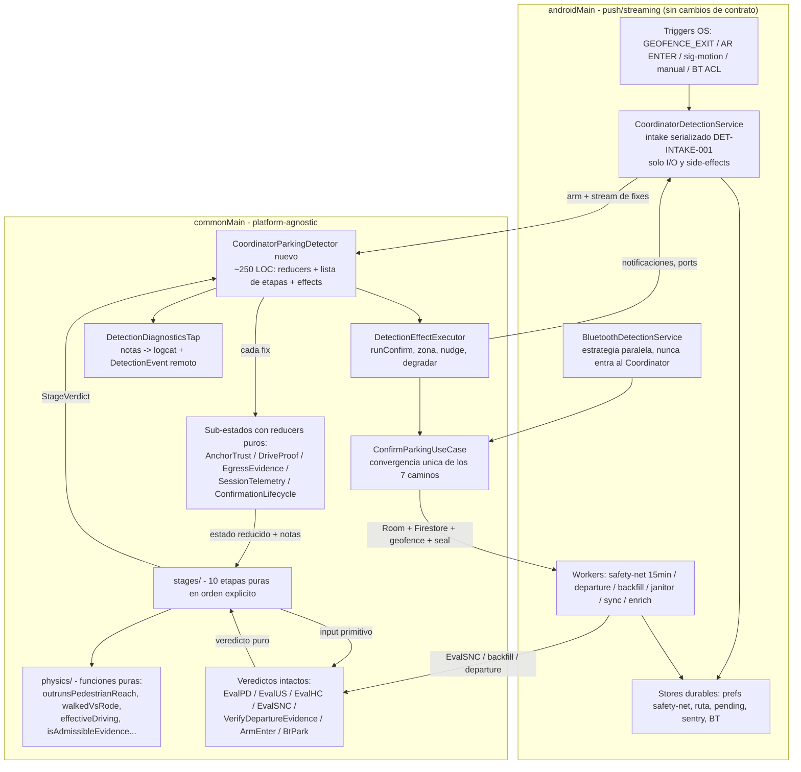

# 09 — Arquitectura objetivo (Fase 4)

> 📌 **Citas de línea ancladas a master `2288468e` (2026-08-24), el commit de arranque de F6.**
> A partir de aquí la Fase 1 mueve símbolos y los números se desplazan: son *a fecha de*, no punteros
> vivos. Para resolver cualquiera con exactitud: `git show 2288468e:<fichero>`. [P0.5]

> Propuesta de diseño · 2026-08-19 · solo lectura de código. Fuentes de verdad: `06-invariantes.md`
> (contrato: 133 tags vigentes, 15 clases de fallo, 5 políticas demostradas, 2 colisiones abiertas),
> `07-duplicacion.md` (veredictos FUNDIR 0 / PARAMETRIZAR 3 / MANTENER 8 / ELIMINAR 4 + 3 splits;
> AnchorTrust y DriveProof CONFIRMADOS; clasificador único DESCARTADO), `08-flujo-e2e.md` (flujo
> real, 8 etapas), `02-estado-coordinator.md` (39 campos + 8 @Volatile + 7 locals),
> `03-workers-entrypoints.md` (39 actores, carreras R1-R14), `11-bugs-encontrados.md` (5 bugs que
> se fixean APARTE). Abreviaturas como en el 06 (CPD, CDS, EvalPD, EvalUS, EvalHC, EvalSNC, SHP).
> Lo que no está respaldado por esos docs o por código leído se marca **NO VERIFICADO**.
>
> ⛔ Este documento NO autoriza código: es la propuesta a revisar. La doctrina
> [DET-VERDICT-NOT-PREDICATE-001] sigue vigente — el código no empieza hasta validar los 4 fixes
> de campo pendientes y aprobar F5.

---

## §0 · Resumen ejecutivo

1. El `CoordinatorParkingDetector` actual (2.586 líneas) se descompone en **un orquestador de
   ~250 líneas** + **5 sub-estados con reducers puros** + **10 etapas de precedencia como lista
   ordenada de objetos** + **un ejecutor de side-effects** + **un tap de diagnóstico**. Todo en
   commonMain; el servicio Android no cambia de contrato [DET-INTAKE-001].
2. La precedencia deja de ser un KDoc que miente (02 §4, 08 §10.3): pasa a ser `sessionStages`,
   una `List<SessionStage>` cuyo ORDEN es el código, testeable etapa a etapa (§4).
3. Los 39 campos del estado + los 8 `@Volatile` + las 7 locals se reparten SIN pérdida entre
   `AnchorTrust`, `DriveProof`, `EgressEvidence`, `SessionTelemetry` y `ConfirmationLifecycle`
   (tabla 1:1 en §5). Los snapshots `*AtCapture` viven DENTRO de AnchorTrust y se sellan en UNA
   transición (`rebind`), no en 5 condiciones copiadas [06 §3-e].
4. Toda física es función pura sin Flow ni logging: `outrunsPedestrianReach` ×4→1,
   `walkedVsRode`, `isAdmissibleEvidence` ×4→1, `effectiveDriving` (el `when` INTACTO),
   `honestZoneRadius`, `SavedParkingShape` (§6). Los 2 helpers con logger dentro suben el log al
   caller (07 §2.5).
5. Decidir y contar se separan: reducers y etapas devuelven veredicto + razón; el
   `DetectionDiagnosticsTap` emite (§7). Las ramas mudas dejan de existir COMO RAMAS; emitirlas en
   remoto es la propuesta nº 3 (§11), no un hecho consumado.
6. **Ningún veredicto se funde** (07: FUNDIR 0), **ningún worker desaparece** (no hay demostración
   en 06/07), **ningún guard [DET-*]/[BUG-*] desaparece**: los 124 guards de código cambian de casa
   con mapeo completo en §9 (+ DET-CAR-REST-CLOCK-001, el 133º post-snapshot).
7. Cero cambios de comportamiento observables, salvo las **8 propuestas numeradas de §11** para
   aprobación una a una (colisión sentry-cooldown, watchdog T7, techo del honest-close, jam-fold,
   Release↔Process, egress-birth unificado, telemetría de triggers, sedimento de tags).

---

## §1 · Principios y qué NO cambia

**Principios (doctrina vinculante, CLAUDE.md + 06):**
- *El evento NOMINA, solo el movimiento MEDIDO confirma* — la separación
  nominación (`hasEverReachedDrivingSpeed`, fuera de DriveProof a propósito, 07 §3.3) /
  confirmación (`DriveProof.proven`) es estructural en el diseño.
- *Mejor FN que FP; ante la duda se pregunta* — la escalera pin → zona acotada → ask → silencio se
  formaliza en `SavedParkingShape` sin unificar las razones de cada veredicto (07 §3.4).
- *Todo trigger dispara siempre, con verificación tardía* — el intake y los 4+1 caminos de arm no
  se tocan (08 §1).
- *BT y Coordinator NUNCA se mezclan* — la frontera (resolver + gate + arbitraje) queda idéntica.
- [DET-VERDICT-NOT-PREDICATE-001]: caso de uso por veredicto; predicados compartidos como
  funciones puras top-level en `domain/detection/`.
- [DET-INTAKE-001]: la DECISIÓN vive en commonMain puro; el servicio solo hace I/O y side-effects.

**Qué NO cambia (lista explícita):**
1. Los **11 use cases de veredicto** que 07 dictaminó MANTENER: `EvaluateParkingDecisionUseCase`,
   `EvaluateUnattendedParkingSaveUseCase`, `EvaluateHonestCloseUseCase`,
   `EvaluateSafetyNetCheckUseCase`, `VerifyDepartureEvidenceUseCase`,
   `DetectParkingDepartureUseCase`, `RunDepartureCheckUseCase`, `RevertParkingUseCase`,
   `CalculateParkingConfidenceUseCase`, `EvaluateBtParkUseCase`, `EvaluateArEnterArmUseCase` — sus
   escaleras internas, precedencias y vocabulario de diagnóstico quedan intactos.
2. El **`when` de precedencia persona/coche** (`effectiveDriving`, CPD:2279-2288): 07 §3.2 lo
   adjudicó — se muda como función pura comentada, SIN aplanar ni fragmentar.
3. El **servicio Android entero**: intake serializado, epílogo, SENTRY residente, honest-close
   desde el FGS, arrival-resolution, y los dos carriles AR [DET-G-01].
4. **Todos los workers y receivers** (03 §1): responsabilidades y colas idénticas (§8).
5. La **estrategia BT completa** (BluetoothDetectionService/Detector/arbitraje).
6. Las **dos colisiones de doctrina abiertas** (06 §5.1/5.2): se preservan EXACTAMENTE tal cual
   están hoy salvo aprobación explícita de las propuestas 1 y 2 (§11).
7. El **contrato de trazas**: `sessionOutcome`, `detectionPath`, `armEvidence`, eventos
   `DetectionEvent.*` — serializaciones exactas (el tipado de §13.3 no cambia ningún string).
8. Los **3 llamadores concurrentes de `ConfirmParkingUseCase`** y sus guards (R1/R2/R3 de 03).

---

## §2 · Diagrama de la arquitectura nueva



Lectura: los triggers y el I/O quedan en androidMain; el orquestador común consume el stream, hace
pasar cada fix por los reducers de sub-estado, evalúa la lista ordenada de etapas, y ejecuta los
side-effects por el ejecutor. Los veredictos existentes (EvalPD/EvalUS/…) son invocados POR las
etapas con inputs primitivos, exactamente como hoy [DET-D-02].

---

## §3 · Árbol de ficheros nuevo

Criterio de LOC: suma de los rangos de líneas actuales que se mudan (los rangos que citan 02/06/08)
+ ~20 % de ceremonia de tipos/firmas, redondeado a decenas. Son estimaciones honestas, no promesas.
`[KMP]` = platform-agnostic · `[Android]` = asume push/streaming de Android. Marcas: **N** = fichero
nuevo · **M** = movido/absorbido desde CPD u otro fichero · **=** = existente sin cambio de casa.

```
composeApp/src/commonMain/kotlin/io/apptolast/paparcar/domain/
├─ detection/
│  ├─ CoordinatorParkingDetector.kt        N  ~250 [KMP]  orquestador (§4)
│  ├─ DetectionEffectExecutor.kt           N  ~220 [KMP]  runConfirm/saveUnattendedZone/nudge/degradeToPrompt
│  │                                                       (hoy CPD:1445-1667 + 1748-1767) [DET-RECONCILE-001][REFACTOR-300]
│  ├─ DetectionDiagnosticsTap.kt           N  ~90  [KMP]  notas → Napier lazy + DetectionEvent [DET-LOG-03][DET-LOG-04]
│  ├─ state/
│  │  ├─ DetectionSessionState.kt          N  ~50  [KMP]  data class de los 5 sub-estados + onFix compuesto
│  │  ├─ AnchorTrust.kt                    N  ~260 [KMP]  ancla+taints+snapshots+egress-birth+kinemático
│  │  │                                                    (hoy CPD:2071-2407 + helpers 1779-2047) [06 §3-e]
│  │  ├─ DriveProof.kt                     N  ~170 [KMP]  HINT→RUN→PROVEN con provenance; absorbe SHP
│  │  │                                                    (hoy CPD:739-825, 1946-1994 + SHP ~110) [06 §3-a][07 P14]
│  │  ├─ EgressEvidence.kt                 N  ~90  [KMP]  máquina de pasos + señales AR (hoy CPD:599-669, señales 1341-1407)
│  │  ├─ SessionTelemetry.kt               N  ~80  [KMP]  contexto de sesión: origen, latch de nominación, atribución, outcome
│  │  └─ ConfirmationLifecycle.kt          N  ~110 [KMP]  phase + pendingConfirm + completed (absorbe ConfirmationPhase.kt, 77)
│  ├─ physics/
│  │  ├─ PedestrianReach.kt                N  ~50  [KMP]  outrunsPedestrianReach + 4 juegos nombrados [06 §3-b]
│  │  ├─ CredibleMovement.kt               N  ~35  [KMP]  isCredibleMovingFix + gate accuracy conducción [LOC-002]
│  │  ├─ DriveCorroboration.kt             N  ~120 [KMP]  corroboratesDrive / isCorroboratedVehicleHop /
│  │  │                                                    isSustainedDepartureFromAnchor (log al caller, 07 §2.5)
│  │  ├─ EffectiveDriving.kt               N  ~70  [KMP]  el when de precedencia INTACTO (CPD:2279-2288) [07 §3.2]
│  │  ├─ WalkedVsRode.kt                   N  ~90  [KMP]  step-budget compartido EvalHC↔EvalSNC [06 §3-c]
│  │  ├─ EvidenceAdmissibility.kt          N  ~15  [KMP]  evidencia ≥ sessionStart ×4→1 [06 §3-d][07 P15]
│  │  ├─ HonestZoneRadius.kt               N  ~15  [KMP]  floor+techo del radio de zona [07 §3.4.2] (⚠ techo en HC = propuesta 5)
│  │  ├─ SavedParkingShape.kt              N  ~40  [KMP]  sealed ExactPin/BoundedZone/AskUser/KeepSilent [07 §3.4.1]
│  │  ├─ SessionOutcome.kt                 N  ~50  [KMP]  outcomes tipados, serialización EXACTA (bug #3, §13)
│  │  └─ CureThrottle.kt                   N  ~25  [KMP]  shouldReregisterCure (split ligero de EvalSNC) [07 §1.2.2][DET-CURE-FRESH-001]
│  ├─ stages/
│  │  ├─ SessionStage.kt                   N  ~45  [KMP]  interfaz + StageVerdict + DetectionEffect sealed
│  │  ├─ HoldResolutionStage.kt            N  ~80  [KMP]  (CPD:849-921) [DET-C-02][DET-CONFIRM-FRESHNESS-001]
│  │  ├─ FalseEnterAbortStage.kt           N  ~25  [KMP]  (CPD:928-937)
│  │  ├─ NoMovementBudgetStage.kt          N  ~70  [KMP]  (CPD:950-1001) [DET-ZOMBIE-PROBE-001][DET-JAM-WINDOW-001]
│  │  ├─ VehicleAttributionStage.kt        N  ~50  [KMP]  (CPD:1004-1048) [VEH-ACTIVE-FENCE-001][DET-BT-OWNERSHIP-001]
│  │  ├─ UserConfirmStage.kt               N  ~60  [KMP]  (CPD:1051-1108) [BUG-COORD-115][DET-CONFIRM-ANCHOR-001]
│  │  ├─ PreDriveSkipStage.kt              N  ~10  [KMP]  (CPD:1110-1113)
│  │  ├─ ResponseTimeoutStage.kt           N  ~90  [KMP]  (CPD:1122-1227) [DET-RECONCILE-001] → EvalUS
│  │  ├─ CandidateStage.kt                 N  ~70  [KMP]  (CPD:1230-1242, 1678-1757) → EvalPD
│  │  ├─ FastConfirmStage.kt               N  ~50  [KMP]  (CPD:1256-1301) [DET-D-03] → EvalPD
│  │  └─ ConfidenceScoringStage.kt         N  ~90  [KMP]  (CPD:2415-2530) [BUG-DETECT-310502] → CalculateParkingConfidence
│  ├─ HumanPoweredRide.kt                  =        [KMP]
│  ├─ SentryWakeCooldown.kt                =        [KMP]  (+3 outcomes nuevos en DetectionSessionOutcomes, ruido 07 §4.1)
│  ├─ SessionSupersede.kt                  =        [KMP]
│  ├─ PendingNudgeDecision.kt / GhostFgsReapDecision.kt / PendingParkNudge.kt
│  │                                       =        [KMP]
│  ├─ VehicleFenceOwnershipPolicy.kt       =        [KMP]
│  ├─ ParkingStrategyResolver.kt           =        [KMP]
│  ├─ SentryLifecycleDecision.kt           =        [KMP]
│  └─ DrivingRoute.kt                      M  +~80  [KMP]  absorbe encodeFreshRoute de ConfirmParking [07 §1.2.1]
├─ usecase/parking/  (veredictos: EvalPD, EvalUS, EvalHC, RunHC, CalculateParkingConfidence,
│                     ConfirmParking −80 LOC, Process/Release/Revert, SaveManual, UpdateLocation…)
│                                          =        [KMP]  sin fusiones [07 §1]
├─ usecase/detection/ (EvalSNC −10 LOC, VerifyDepartureEvidence, DetectParkingDeparture,
│                     RunDepartureCheck, EvaluateArEnterArm, EvaluateGeofenceExit,
│                     EvaluateBtArbitration, EvaluateBtPark, EvaluateBackfillDeferral,
│                     Evaluate/ObserveDetectionReliability, ObserveDetectionReadiness,
│                     ObserveDepartureWatchGap…)   =        [KMP]
├─ ELIMINADOS [07 §1.1]: GetLastKnownLocationUseCase (muerto) · SendSpotSignalUseCase (inline)
│  · ClearParkNudgeUseCase (inline) · NotifyParkingConfirmationUseCase (plegado en el port
│  AppNotificationManager, NUNCA en el orquestador) · EvaluateShortHopDriveProofUseCase
│  (absorbido como perfil short-hop de DriveProof [07 P14]; su test viaja a DriveProofTest)
└─ coordinator/CoordinatorParkingDetector.kt  ELIMINADO al final de F6 (sustituido por el árbol de arriba)

composeApp/src/androidMain/.../detection/   =  [Android]  TODOS los actores del 03 §1 quedan:
   CoordinatorDetectionService (adelgaza: pierde maybeRunHonestClose→sin mover, solo re-cablea el
   nuevo orquestador), BluetoothDetectionService/Detector, ParkingSafetyNetWorker,
   DepartureDetectionWorker, ParkingBackfillWorker, GeofenceJanitorWorker, workers de sync/enrich,
   los 7 receivers, GeofenceManagerImpl, SignificantMotionMonitor, ExactHeartbeatScheduler,
   stores (PendingDetectionStore, SentryResidenceStore, BtConnectionStore, TripTrailImpl,
   DrivingRouteStoreImpl), ForegroundServiceController, AndroidDetectionStepAnchors.
```

**Recuento**: 30 ficheros NUEVOS en commonMain (~2.460 LOC estimadas, frente a las 2.586 del CPD
actual + ConfirmationPhase 77 + SHP ~110 que absorben), 1 movido (`DrivingRoute` engorda), 5
eliminados, 0 ficheros nuevos en androidMain. El total de LOC no baja mucho — baja el ACOPLAMIENTO:
ningún fichero nuevo supera ~260 líneas y cada uno tiene UN dueño de test.

---

## §4 · El orquestador (≤250 líneas)

**Responsabilidades (todas; nada más):**
1. Ciclo de vida de sesión: claim de `currentSessionId` → reset → seed del arm [DET-G-04] →
   collect → finally con guard de ownership [BUG-SERVICE-109 + DET-AUDIT-002 T8] → `SessionEpilogue`.
2. Por fix: aplicar los reducers de sub-estado (una sola `updateAndGet`), recorrer `sessionStages`
   en orden, ejecutar los `DetectionEffect` del primer veredicto `Handled`, emitir notas al tap.
3. Corrutinas hermanas: colector de pasos (delega en el reducer de `EgressEvidence`, con el
   try/catch de [BUG-COORD-112]), watchdog del hold [DET-AUDIT-002 T7] y `phaseSink`
   [DET-PHASE-001].
4. Entrypoints externos thread-safe (`onVehicleExit`, `onVehicleRide`, `onHumanPoweredRide`,
   `onUserConfirmedParking/Denied`, `notifyDepartureConfirmed`): delegados de 2-3 líneas que
   aplican UNA transición atómica de reducer (cierra la escritura en 2 pasos no atómica de
   02 §7.1 — `armEvidence` + seed en una sola transición).

Presupuesto: ctor/DI ~30 · invoke (claim/reset/seed/arm-log) ~50 · loop collect + etapas ~35 ·
jobs hermanos ~50 · entrypoints ~35 · finally/epílogo ~35 ≈ **235 LOC**. Los side-effects con I/O
(confirm, zona, nudge, notificaciones) viven en `DetectionEffectExecutor` (~220), inyectado.

**La precedencia como código** (sustituye al KDoc de 9 puntos que miente, 08 §10.3 — el orden de
la lista ES el orden real del collect actual, hold PRIMERO, verificado en 02 §4):

```kotlin
// stages/SessionStage.kt
interface SessionStage {
    val name: String
    fun evaluate(
        state: DetectionSessionState,
        fix: GpsPoint,
        now: Long,
        config: ParkingDetectionConfig,
    ): StageVerdict
}

sealed interface StageVerdict {
    /** La etapa no aplica a este fix: se sigue con la siguiente de la lista. */
    data object Skip : StageVerdict
    data class Handled(
        val newState: DetectionSessionState,
        val effects: List<DetectionEffect>,   // Confirm / SaveZone / Nudge / Abort / Notify / ResolveVehicle…
        val notes: List<DiagnosticNote>,      // decidir y contar, separados (§7)
        val stopsIteration: Boolean,          // el return@collect de hoy, explícito
    ) : StageVerdict
}

// CoordinatorParkingDetector.kt — LA precedencia. Cambiar el orden = cambiar comportamiento,
// y por eso el orden tiene su propio test (StageOrderTest) además del test de cada etapa.
internal val sessionStages: List<SessionStage> = listOf(
    HoldResolutionStage,      // hoy CPD:849-921 — PRIMERO [DET-C-02][DET-CONFIRM-FRESHNESS-001][BUG-COORD-115 1b]
    FalseEnterAbortStage,     // CPD:928-937 — abort aborted_false_enter
    NoMovementBudgetStage,    // CPD:950-1001 [DET-ZOMBIE-PROBE-001][DET-JAM-WINDOW-001]
    VehicleAttributionStage,  // CPD:1004-1048 [VEH-ACTIVE-FENCE-001][DET-BT-OWNERSHIP-001] → aborted_no_vehicle
    UserConfirmStage,         // CPD:1051-1108 [BUG-COORD-115][DET-CONFIRM-ANCHOR-001] — un tap gana
    PreDriveSkipStage,        // CPD:1110-1113 — sin conducción, nada que decidir
    ResponseTimeoutStage,     // CPD:1122-1227 [DET-RECONCILE-001] → EvaluateUnattendedParkingSaveUseCase
    CandidateStage,           // CPD:1230-1242 → EvaluateParkingDecisionUseCase (elapsed real)
    FastConfirmStage,         // CPD:1256-1301 [DET-D-03] → EvaluateParkingDecisionUseCase (elapsed=0)
    ConfidenceScoringStage,   // CPD:2415-2530 — solo avanza fase; HIGH jamás confirma solo
)

// El collect entero del orquestador:
locations.takeWhile { !state.value.confirmation.completed }.collect { fix ->
    val now = clock.now()
    val (reduced, reduceNotes) = state.reduceAndGet { it.onFix(fix, now, config) } // reducers puros §5
    diagnostics.onFix(sessionId, fix, reduced, reduceNotes)                        // [DET-LOG-04]
    for (stage in sessionStages) {
        val verdict = stage.evaluate(reduced, fix, now, config)
        if (verdict is StageVerdict.Handled) {
            state.value = verdict.newState
            diagnostics.onStage(sessionId, stage.name, verdict.notes)
            effects.execute(verdict.effects)                                       // único sitio con I/O
            if (verdict.stopsIteration) break
        }
    }
}
```

Notas de honestidad:
- `VehicleAttributionStage` es la única etapa que necesita I/O (repo de vehículos). La etapa decide
  en puro con `VehicleFenceOwnershipPolicy.resolveSessionVehicleId`; el lookup lo pide como efecto
  `ResolveVehicle` y el executor re-entra por un entrypoint atómico — mismo comportamiento que la
  rama 4 actual, con el I/O fuera de la decisión.
- El invariante implícito de 02 §7.4 (ramas fall-through operando sobre una foto parcialmente
  obsoleta tras un hold-discard) se vuelve EXPLÍCITO: `Handled(stopsIteration=false)` re-alimenta
  `newState` a las etapas siguientes — comportamiento equivalente y ahora testeable.
- El watchdog T7 y el finally conservan su asimetría actual (finalizan SIN re-validar frescura)
  salvo aprobación de la propuesta 1 (§11).

---

## §5 · Sub-estados

`DetectionSessionState = data class(anchor: AnchorTrust, drive: DriveProof, egress: EgressEvidence,
session: SessionTelemetry, confirmation: ConfirmationLifecycle)`. Regla de frontera (07 §2.4):
**AnchorTrust posee el ancla y sus taints; los pasos se le PRESENTAN como argumento, nunca se le
copian**. Cada sub-estado: reducer puro `(subestado, entrada) → (subestado', notas)`, con test
propio + los replays de characterization (F5) como red.

### 5.1 · Tabla de mapeo campo-viejo → campo-nuevo (los 39 de 02 §1, sin perder ninguno)

| # | Campo actual (02) | Campo nuevo | Sub-estado |
|---|---|---|---|
| 1 | `stoppedSince` | `stopStartedAt` | AnchorTrust |
| 2 | `stoppedFixes` | `stopWindowFixes` | AnchorTrust |
| 3 | `vehicleExitConfirmed` | `vehicleExitHint` | EgressEvidence |
| 4 | `userConfirmedParking` | `userConfirmed` | ConfirmationLifecycle |
| 5 | `pendingConfirm` | `pendingConfirm` | ConfirmationLifecycle |
| 6 | `phase` | `phase` (mismo sealed) | ConfirmationLifecycle |
| 7 | `hasEverReachedDrivingSpeed` | `hasEverReachedDrivingSpeed` (nominación; FUERA de DriveProof a propósito, 07 §3.3) | SessionTelemetry |
| 8 | `hasEverMoved` | `hasEverMoved` (vestigial — retirada en propuesta 8) | SessionTelemetry |
| 9 | `sessionOrigin` | `sessionOrigin` | SessionTelemetry |
| 10 | `bestStopLocation` | `anchor` | AnchorTrust |
| 11 | `anchorCapturedAtStop` | `capturedAtStop` | AnchorTrust |
| 12 | `anchorFrozen` | `frozenByRest` | AnchorTrust |
| 13 | `walkFixesSinceDriving` | `walkIn.fixesSinceDriving` | AnchorTrust (odómetro walk-in) |
| 14 | `kinematicEgressFixes` | `kinematicEgressFixes` (ciclo de vida del ancla, 07 §2.1) | AnchorTrust |
| 15 | `egressOriginFix` | `egressBirth.originFix` | AnchorTrust |
| 16 | `egressOriginStepCount` | `egressBirth.stepCountAtBirth` | AnchorTrust |
| 17 | `anchorWalkFixesAtCapture` | `captureSnapshot.walkFixes` | AnchorTrust (snapshot) |
| 18 | `stepEventsSinceDriving` | `stepEventsSinceDriving` | EgressEvidence |
| 19 | `anchorStepEventsAtCapture` | `captureSnapshot.stepEvents` (presentado por EgressEvidence al `rebind`) | AnchorTrust (snapshot) |
| 20 | `anchorSawStepsAtCapture` | `captureSnapshot.sawSteps` | AnchorTrust (snapshot) |
| 21 | `walkRunOriginFix` | `walkIn.runOriginFix` | AnchorTrust |
| 22 | `anchorWalkInSpanMeters` | `captureSnapshot.walkInSpanMeters` | AnchorTrust (snapshot) |
| 23 | `stopEnteredAfterGapMs` | `stopEnteredAfterGapMs` | AnchorTrust |
| 24 | `anchorGapMsAtCapture` | `captureSnapshot.gapMs` (magnitud, no booleano) | AnchorTrust (snapshot) |
| 25 | `sessionSawSteps` | `sensorAlive` | EgressEvidence |
| 26 | `bicycleRideAtMs` | `bicycleRideAtMs` | EgressEvidence |
| 27 | `vehicleRideAtMs` | `vehicleRideAtMs` | EgressEvidence |
| 28 | `pinnedSteplessMovingFixes` | `pinnedSteplessMovingFixes` (reset cruzado del paso: ahora AMBOS en el mismo sub-estado) | EgressEvidence |
| 29 | `previousFix` | `previousFix` (deliberadamente sin filtrar) | SessionTelemetry |
| 30 | `consecutiveRepositionFixes` | `repositionStreak` | AnchorTrust |
| 31 | `stepCount` | `stepCount` | EgressEvidence |
| 32 | `sessionStartMs` | `firstFixAtMs` | SessionTelemetry |
| 33 | `maxSpeedMps` | `provenMaxSpeedMps` (promoción retroactiva CPD:815 intacta) | DriveProof |
| 34 | `pendingMaxSpeedMps` | `peakMps` (grado HINT) | DriveProof |
| 35 | `credibleDrivingFixes` | `credibleFixCount` (grado RUN) | DriveProof |
| 36 | `driveProven` | `proven: Proof?` (sealed `TrackWindow`/`ShortHop` — provenance citable, 07 §3.3) | DriveProof |
| 37 | `recentFixes` | `recentFixes` (ring look-back) | DriveProof |
| 38 | `shortHopQualifyingFixes` | `shortHopRun` | DriveProof |
| 39 | `lastSpeedMps` | `lastSpeedMps` | SessionTelemetry |

### 5.2 · Los 8 `@Volatile` (02 §1c)

| Campo actual | Dónde entra | Justificación |
|---|---|---|
| `savedConfirmPostedAt` | **DetectionEffectExecutor** (campo cross-sesión del ejecutor, documentado) | Cruza sesiones por diseño [REFACTOR-300-FIX]; es estado de NOTIFICACIÓN, no de sesión |
| `currentSessionId` | **Orquestador** (sigue @Volatile: claim pre-reset, guard de ownership) | [DET-AUDIT-002 T8][BUG-SERVICE-109][DET-LOG-03] |
| `sessionOutcome` | `SessionTelemetry.outcome` (tipado `SessionOutcome`, serialización exacta) | Escrito solo vía reducers; el finally lee el snapshot final (bug #3, §13) |
| `lastFinishedFix` | `SessionEpilogue.fix` | Los 4 volatiles colapsan en UN value object |
| `lastFinishedSessionId` | `SessionEpilogue.sessionId` | sellado ATÓMICAMENTE en el finally, expuesto |
| `lastFinishedStepEvents` | `SessionEpilogue.stepEvents` | por el orquestador — el canal post-invoke del |
| `lastFinishedMaxSpeedMps` | `SessionEpilogue.maxSpeedMps` | honest-close queda intacto [DET-HONEST-CLOSE-001][DET-FROZEN-COUNTER-001] |
| `currentArmEvidence` | `SessionTelemetry.armEvidence` | El veto enter-arm (evidencia + un-seed) pasa a UNA transición atómica — cierra la escritura en 2 pasos de 02 §7.1 sin cambiar comportamiento |

### 5.3 · Las 7 locals de `invoke` (02 §1c)

| Local actual | Dónde entra |
|---|---|
| `completed` | `ConfirmationLifecycle.completed` (condición del `takeWhile`) |
| `locationCount` | `SessionTelemetry.fixCount` |
| `jamExtensionLogged` | **DiagnosticsTap** (dedup de notas — es contabilidad, no decisión) |
| `creepWindow` | `DriveProof.creepWindow` (ring PROPIO; la fusión con `recentFixes` NO se afirma — exige demostración, 07 §5.4) |
| `loggedVehicleExit` | **DiagnosticsTap** (edge-dedup del AR EXIT) [DET-LOG-04] |
| `activeVehicleId` | `SessionTelemetry.attributedVehicleId` |
| `activeVehicleType` | `SessionTelemetry.attributedVehicleType` |

### 5.4 · Transiciones y test por sub-estado

**AnchorTrust** — transiciones: `onStoppedFix(fix, now, prevFix, stepsView)` (abre stop, detecta
gap CPD:2088-2106, captura/refina `mayCapture` CPD:2113-2127, madura freeze CPD:2141-2146,
**`rebind()` = UN sellado atómico de los 5 snapshots** — hoy la condición está copiada ×5,
CPD:2177-2206 [06 §3-e] —, egress-birth sabor parado) · `onMovingFix(fix, now, stepsView,
effectiveDriving)` (odómetro walk-in, kinemático, egress-birth sabor móvil, reposition burst,
stepless) · `clear()` (la cascada `shouldClearBestStop` de 9 campos, hoy CPD:2350-2401, como UNA
función con test). Predicados: `pinned = lockedBySteps(stepsPresented) ∨ frozenByRest`,
`walkEntered` (exención de maniobra íntegra), `gapEntered`, `egressBornAtAnchor`,
`refinedParkLocation` (Rule A; el fallback `bestFix` se resuelve DENTRO — el rebind sella también
el bestFix, cerrando el cabo de 07 §2.1), `restMs(now)` [DET-CAR-REST-CLOCK-001],
`gapDoubtMeters`, `walkInDoubtMeters`. Test: `AnchorTrustTest` (nuevo) + replays
`Trace_CalleGavia001`, `Trace_Supermarket001`, `Trace_Enamorados001`, `Trace_CameliasOppo001`.
⚠ Los DOS sabores del egress-birth se unifican en `egressBirthTransition` SOLO bajo la condición
del 06 §3-e (re-validar contra Enamorados/CameliasOppo) — propuesta 7 de §11.

**DriveProof** — transición: `onFix(fix, now, departureAnchor?, fenceRadius?)` acumula
peak/credibleRun/shortHopRun/ring y promociona `proven` (TrackWindow por `corroboratesDrive`,
ShortHop por el perfil absorbido de SHP); la promoción retroactiva del pico banked (CPD:815) es
parte de la transición. RUN nunca promociona solo (compra zona, jamás pin) [06 §3-a].
`hasEverReachedDrivingSpeed` queda FUERA (autorización de ciclo de vida, no grado de prueba —
[DET-G-04/G-05], 07 §3.3). Test: `DriveProofTest` (absorbe `EvaluateShortHopDriveProofUseCaseTest`
y los CPDTest:1564-1890) + replay `Trace_RedmiLateExitHome001`.

**EgressEvidence** — transiciones: `onStepEvent(lastSpeedMps, anchorPresent)` (triple gate de
conteo CPD:632-651 [DET-STEP-SPEED-GATE-001], latch `sensorAlive`, reset de
`pinnedSteplessMovingFixes` — ahora el reset cruzado del stepJob y su contador viven en el MISMO
sub-estado), `onVehicleExit/onVehicleRide/onHumanPoweredRide(trueTimeMs)` (estampas AR
[DET-BIKE-NOT-A-CAR-001]), `onEffectiveDriving()` (resets CPD:2357-2375). Test:
`EgressEvidenceTest` + CPDTest de pasos existentes.

**SessionTelemetry** — transiciones: `armed(armEvidence)` (seed [DET-G-04], claim), `onFix`
(origen/firstFix/lastSpeed/previousFix/fixCount), `driveAuthorized()` (cruce medido CPD:750-753
[LOC-002]), `attributeVehicle(id, type)`, `enterArmStepVeto()` (evidencia+un-seed atómico),
`finish(outcome)`. Test: `SessionTelemetryTest` + CPDTest:668-742 (seed) y 1897-1966 (no-filtración
entre sesiones).

**ConfirmationLifecycle** — transiciones: las de `ConfirmationPhase` (Idle→LowReached→Notified→
Candidate, intactas [REFACTOR-200]) + `beginHold(pendingConfirm)`, `resolveHold(...)`,
`userSaid(yes/no)`, `complete(outcome)`. `toDetectionPhase()` se muda aquí [DET-PHASE-001]. Test:
`ConfirmationLifecycleTest` + `ConfirmationPhaseMappingTest` (existente) + CPDTest:2487-2727 (hold).

---

## §6 · Funciones puras y dueños

Todas sin `Flow`, sin logging, sin reloj implícito (`now` siempre argumento). Los 2 helpers que hoy
llevan `PaparcarLogger` dentro (`isSustainedDepartureFromAnchor` CPD:1916-1921,
`refinedParkLocation` CPD:2040-2044) quedan puros: el log sube al caller como `DiagnosticNote`
(07 §2.5).

```kotlin
// physics/PedestrianReach.kt — la familia geométrica ×4→1 [06 §3-b, ÍNTEGRO]
fun outrunsPedestrianReach(
    base: GpsPoint, fix: GpsPoint, steps: Int, strideMeters: Float, floorMeters: Float,
): Boolean
// Los 4 juegos de parámetros NOMBRADOS conservan cada escenario de campo:
//   movementOutrunsSteps    (base=ancla, floor=minEgressDisplacementMeters)  [ANCHOR-LOCK-001]
//   egressExceedsWalkReach  (base=ancla, floor=egressBirthFloorMeters)       [DET-EGRESS-PEDESTRIAN-CEILING-001]
//   heldConfirmOutrun       (base=pin holdeado, floor=egressBirthFloorMeters)[DET-CONFIRM-FRESHNESS-001]
//   escapesAnchorEnvelope   (base=ancla, steps=0, floor=minEgress)           [DET-CONFIRM-FRESHNESS-001 (b)]
// NOTA: pariente pero NO idéntica a isBeyondPedestrianReach (envelope por TIEMPO, Config:1092);
// NO se unifican — el 06 §3-b lo deja explícitamente sin demostrar.

// physics/CredibleMovement.kt — gate LOC-002 ×5→1 (07 §2.2)
fun isCredibleMovingFix(fix: GpsPoint, speedBarMps: Float, maxAccuracyMeters: Float): Boolean

// physics/DriveCorroboration.kt — corroboración por desplazamiento ×2 con núcleo compartido (07 §3.2)
fun corroboratesDrive(history: List<GpsPoint>, fix: GpsPoint, config: ...): DriveWindowVerdict   // [DET-DRIVE-PROOF-001]
fun isCorroboratedVehicleHop(prev: GpsPoint?, fix: GpsPoint, config: ...): Boolean               // [DET-CREDIBLE-DRIVE-001 (b)]
fun isSustainedDepartureFromAnchor(anchor: GpsPoint, capturedAtStop: Long, fix: GpsPoint,
    now: Long, config: ...): SustainedDepartureVerdict   // física DriveProof, DESTINO AnchorTrust [06 §3-a frontera]

// physics/EffectiveDriving.kt — el when de precedencia INTACTO [07 §3.2: fragmentarlo, NO]
fun effectiveDriving(input: EffectiveDrivingInput): EffectiveDrivingVerdict
// data class EffectiveDrivingVerdict(val isDriving: Boolean, val reason: EffectiveDrivingReason)
// — mismo orden comentado que CPD:2279-2288 (isRealDrive → sustainedDeparture → steplessDeparture
//   → anchorPinned → corroboratedMuteHop → mudo+ambiguo → movementOutrunsSteps → isDriving);
//   la razón alimenta el tap, no la decisión.

// physics/WalkedVsRode.kt — step-budget compartido [06 §3-c; 07 P5: predicado, NO fusión de use cases]
fun walkedVsRode(
    seal: StepSeal?, sealAgeMs: Long?, currentFix: GpsPoint, stepsDelta: Int?,
    counterHealth: CounterHealth,          // MUTE / FROZEN_SUSPECT / ALIVE — ambas cláusulas de salud (testigo Y física)
    config: ...,
): WalkedVsRodeVerdict                     // sealed: Walked / Rode / Uninterpretable(reason)
// Cláusulas con incidente: origen = sealPoint jamás el pin [DET-STEP-BUDGET-ORIGIN-001];
// sealAge > max ⇒ Uninterpretable y PRECEDE al resto [DET-TRIP-WITNESS-001, orden 06 §4.10];
// cumulativo < presenciado ⇒ FROZEN [DET-FROZEN-COUNTER-001]; distancia ≤ ruido ⇒ floor [DET-WALK-FLOOR-001].
// EvalHC y EvalSNC lo CONSUMEN; sus veredictos y escaleras siguen separados.

// physics/EvidenceAdmissibility.kt — ×4→1 [06 §3-d; 07 P15]
fun isAdmissibleEvidence(evidenceAtMs: Long?, sessionStartMs: Long): Boolean   // [DET-SESSION-BIRTH-001]

// physics/HonestZoneRadius.kt — la función única del radio [07 §3.4.2]
fun honestZoneRadius(centerAccuracyMeters: Float, doubtMeters: Double, config: ...): Float
// floor (honestCloseMinZoneRadiusMeters / accuracy) + techo (unattendedZoneMaxRadiusMeters).
// ⚠ Aplicarla al honest-close CAMBIA comportamiento (hoy sin techo, bug #2) → propuesta 5, §11.

// physics/SavedParkingShape.kt — el sealed de FORMA del guardado [07 §3.4.1]
sealed interface SavedParkingShape {
    data class ExactPin(val location: GpsPoint, val reliability: Float) : SavedParkingShape
    data class BoundedZone(val center: GpsPoint, val radiusMeters: Float) : SavedParkingShape
    data class AskUser(val reason: String) : SavedParkingShape
    data class KeepSilent(val reason: String) : SavedParkingShape
}
// Cada veredicto (EvalUS, EvalHC) EMITE su forma junto a su razón propia — las razones NO se
// unifican (contrato de trazas). zoneOrAsk sigue siendo el único sitio de la regla
// «centro + duda acotada; si falta algo → Ask» [DET-WALK-ENTERED-ANCHOR-ZONE-001].

// physics/SessionOutcome.kt — outcomes tipados con serialización EXACTA (bug #3, §13)
// physics/CureThrottle.kt — shouldReregisterCure top-level [DET-CURE-FRESH-001; 07 §1.2.2]

// AnchorTrust (dueño de estado + predicados, §5.4) y DriveProof (acumulador, §5.4) — ver arriba.
```

Dueños, resumen: **AnchorTrust** posee ancla/taints/snapshots/egress-birth/kinemático y expone la
duda (`gapDoubtMeters`, `walkInDoubtMeters`) que los veredictos consumen; **DriveProof** posee las
pruebas de conducción con provenance; **la física compartida** vive en `physics/` como funciones
top-level (patrón `HumanPoweredRide`); **los veredictos** (EvalPD/EvalUS/EvalHC/EvalSNC/…) no
cambian de vocabulario ni de escalera.

---

## §7 · Logging y diagnóstico separados de la lógica

**Mecanismo** (3 piezas):
1. **Las funciones puras devuelven veredicto + razón** (`EffectiveDrivingVerdict.reason`,
   `WalkedVsRodeVerdict.Uninterpretable(reason)`, `DriveWindowVerdict`…). La razón es un dato, no
   un log: la decisión no depende de ella.
2. **Reducers y etapas devuelven `DiagnosticNote`s** junto al estado nuevo (`StageVerdict.Handled
   .notes`). Ninguna lambda de `update` ejecuta side-effects — se cierra la clase de duplicación
   bajo contención CAS de 07 §4.2 (logs y haversines re-ejecutados).
3. **`DetectionDiagnosticsTap`** es el ÚNICO emisor: Napier local (con overload lazy
   `d(tag) { msg }` — hoy el logger es 100 % eager con 69 llamadas en el hot loop, 07 §4.2) +
   `DetectionEvent` remoto [DET-LOG-03][DET-LOG-04]. El tap también posee los dedups que hoy son
   estado (`loggedVehicleExit`, `jamExtensionLogged`).

**Consecuencia sobre las ramas mudas** (04 §2: 15 ramas mudas en remoto; 08: 5 ramas solo-log de
`updateStopTracking` + el hold que se abre/descarta sin evento): dejan de existir COMO RAMAS —
cada una se convierte en una `DiagnosticNote` con nombre (p. ej. `AnchorFrozen`, `RepositionBurst`,
`HoldOpened`, `HoldDroveOffDiscarded`, `ArmSuppressedSameArea`, `TickOnly`), producida por el
reducer/etapa que ya decidió. **Qué notas se emiten a REMOTO es una decisión aparte**: por defecto
el tap replica exactamente la superficie remota actual (cero cambio observable); ampliar la emisión
(evento `TRIGGER` con disposición, respuesta al prompt, etc. — 04 §4) es la **propuesta 3** de §11,
con su coste de writes medido en 04 §3.

Los dos casos con logger dentro de helpers "puros" (07 §2.5) quedan resueltos por construcción: la
función devuelve el veredicto con sus números y el caller/tap loguea.

---

## §8 · Workers y entrypoints

Ningún worker desaparece ni se funde: **06/07 no aportan demostración de redundancia para ninguno**
(la regla del plan exige demostración; sin ella, se quedan). El único movimiento es de LÓGICA, no de
actores: `shouldReregisterCure` → `CureThrottle.kt` (el worker lo sigue llamando).

Tabla de autoridad (del 03 §1 y 08 §1 — sin cambios propuestos):

| Actor | ¿Puede ARMAR el Coordinator? | ¿Puede CONFIRMAR un pin? | ¿Puede CERRAR la salida? |
|---|---|---|---|
| `CoordinatorDetectionService` (intake) | **SÍ — único embudo** (`startParkingDetection`, gate `coordinatorMayArm` [DET-STRATEGY-GATE-001]; triggers EXIT / AR ENTER / SENTRY_WAKE / MANUAL) | Vía el orquestador (efectos → CPUC) | Sí (tap watchdog → `ProcessConfirmedDeparture`) |
| `ParkingSafetyNetWorker` | **Indirecto y solo como handoff de llegada**: `manualParkingDetection.start()` cuando despacha salida sin backfill [DET-ARRIVAL-HANDOFF-001]; jamás decide por sí | No (encadena backfill) | No (encola `DepartureDetectionWorker`) |
| `DepartureDetectionWorker` | **NO** (upgrade `verified_late` a la sesión VIVA, nunca arma una nueva [DET-G-05]) | No | **SÍ** (`RunDepartureCheck` → `ProcessConfirmedDeparture`) |
| `ParkingBackfillWorker` | **NO** | **SÍ** (`safety_net_backfill`, con doble guard R1 [DET-ARRIVAL-DOUBLE-PIN-001][DET-BACKFILL-TAINT-001]) | No (la salida ya fue despachada) |
| `BluetoothDetectionService` / detector | **NUNCA** (estrategia paralela; puede ABORTAR al Coordinator vía override [DET-TIERS-001]) | **SÍ** (`bt`/`bt_timeout`) | No |
| `SignificantMotionMonitor` | No por sí — envía `SENTRY_WAKE` al servicio (que arma con `Unverified`) o encola check | No | No |
| Receivers de evidencia (`ActivityTransitionReceiver`, `GeofenceEnterReceiver`, `GeofenceExitWitnessReceiver`, `ExactHeartbeatReceiver`) | **NO** (estampan/encolan; el witness ni decide [DET-EXIT-WITNESS-001]) | No | No |
| `GeofenceJanitorWorker`, workers de sync/enrich/report, `FirstParkNudgeWorker`, `RegisterActivityTransitionsWorker` | **NO** | No | No (el janitor repara duplicados, no cierra salidas) |
| UI (`ReleaseActiveParkingSession`, `SaveManualParking`, "Estoy conduciendo") | Solo MANUAL (exento del gate [DET-G-01b]) | Sí (`manual`/`user`/`nudge`, reliability 1.0) | Sí (release desde UI — con el bug #1 pendiente de adjudicar) |

Las carreras R1-R14 del 03 conservan sus guards actuales; el refactor no abre ninguna ventana nueva
(el intake, los unique-works y `replaceActiveSession` @Transaction no se tocan).

---

## §9 · Mapeo tag → casa nueva (124/124 + 1)

Cobertura: los **124 guards de código vivos** del 06 §6 (132 − 7 solo-comentario/solo-test:
DET-D-01, DET-D-02, DET-D-04, DET-B-03, REFACTOR-200, DET-VERDICT-NOT-PREDICATE-001,
DET-UNVERIFIED-ARM-DRIVE-PROOF-001 − 1 frontera: BUG-DETECT-310503) **+ DET-CAR-REST-CLOCK-001**
(el 133º, post-snapshot). Cada tag conserva su condición ejecutable; "casa nueva" = dónde vive la
condición tras el refactor (las casas secundarias, cuando el 06 reparte el tag por varios ficheros,
se anotan). Los excluidos no desaparecen: sus comentarios/doctrina viajan con el código que anotan
(la retirada de etiquetas de sedimento es la propuesta 8).

| Casa nueva | Tags (nº) | Preservación |
|---|---|---|
| **state/AnchorTrust.kt** (10 + 1) | ANCHOR-LOCK-001 · DET-ANCHOR-FREEZE-001 · DET-SHORT-TRIP-FREEZE-001 (pasa a parámetro `restProvenByFixes` de la maduración, como 06 §4.6 pide) · LOC-001 (ventana inicial + `sameStopPreEgress` + `pinnedToOtherStop`) · LOC-002 (con `CredibleMovement`) · PARKING-001 (reposition burst) · DET-GAP-ANCHOR-001 · DET-ANCHOR-EGRESS-001 (egress-birth + Rule A; los 2 sabores → propuesta 7) · DET-CREDIBLE-DRIVE-001 (taint `walkEntered` + exención; su física en `DriveCorroboration`) · DET-KINEMATIC-EGRESS-001 · **DET-CAR-REST-CLOCK-001** (`restMs(now)`) | Los reducers reproducen máquina a máquina las 11 de 02 §5; los replays Gavia/Supermarket/Enamorados/CameliasOppo/Sanlúcar fijan cada escenario ANTES del move (F5) |
| **state/DriveProof.kt** (3) | DET-DRIVE-PROOF-001 (perfil track-window + promoción retroactiva) · DET-SHORT-HOP-PROOF-001 (perfil short-hop, absorbe SHP; la etiqueta gemela DET-UNVERIFIED-ARM-DRIVE-PROOF-001 se funde en su ficha [06 §4.11]) · DET-SENTRY-ARM-PEDESTRIAN-CLOCK-001 (fix-a-fix del run + señal cruda) | `DriveProofTest` absorbe SHPTest + CPDTest:1564-1890, 2932-2975; RUN nunca promociona solo |
| **state/EgressEvidence.kt** (1) | DET-STEP-SPEED-GATE-001 (gate de CONTEO; su mitad de decisión `isRolling` sigue en EvalPD) | El triple gate CPD:632-651 es la transición `onStepEvent` |
| **physics/PedestrianReach.kt** (1) | DET-EGRESS-PEDESTRIAN-CEILING-001 (juego de parámetros nombrado; su consumo en EvalPD/EvalUS intacto) | 06 §3-b verificado carácter a carácter: solo cambian (base, steps, floor) |
| **physics/WalkedVsRode.kt** (4) | DET-FROZEN-COUNTER-001 · DET-STEP-BUDGET-ORIGIN-001 · DET-TRIP-WITNESS-001 (su PRECEDENCIA en la escalera queda documentada y testeada en el predicado, 06 §4.10) · DET-WALK-FLOOR-001 | Cláusulas del mismo cálculo [06 §3-c]; EvalHC/EvalSNC consumen, no se fusionan [07 P5] |
| **physics/EvidenceAdmissibility.kt** (1) | DET-SESSION-BIRTH-001 (las 4 copias colapsan) | Trivial por construcción [06 §3-d] |
| **domain/detection/HumanPoweredRide.kt** (2, ya existe) | DET-BIKE-NOT-A-CAR-001 · BUG-SCOOTER-001 (su mitad resolver sigue en `ParkingStrategyResolver`; el mismatch CAR-lento-largo sigue en EvalPD) | Sin cambio |
| **stages/** (11) | DET-C-02 + DET-CONFIRM-FRESHNESS-001 + BUG-COORD-115 → `HoldResolutionStage` (el invariante "un tap gana" queda en UNA rama testeable; el KDoc podrido de CPD:81-93 muere con el fichero) · DET-JAM-WINDOW-001 + DET-ZOMBIE-PROBE-001 → `NoMovementBudgetStage` · DET-CONFIRM-ANCHOR-001 → `UserConfirmStage` · DET-RECONCILE-001 (rama 7; el tag sistémico sigue también en EvalSNC/RDC) → `ResponseTimeoutStage` · DET-D-03 → `FastConfirmStage` · BUG-GARAGE-COLA-001 (DISCARD del candidate) → `CandidateStage` · BUG-DETECT-310502 (timeout del prompt Low) → `ConfidenceScoringStage` · DET-PHASE-001 → `ConfirmationLifecycle.toDetectionPhase` | Cada etapa hereda los tests del bloque que muda (CPDTest:2487-2878, 771, 876, 2253-2384, 2101-2123…) + `StageOrderTest` nuevo fija el orden |
| **Orquestador + DiagnosticsTap** (5) | DET-G-04 (seed en `SessionTelemetry.armed()`) · BUG-SERVICE-109 (+T8: reset con guard de ownership en el finally) · BUG-COORD-112 (catch del colector de pasos) · DET-LOG-03 · DET-LOG-04 | El ciclo claim→reset→…→SessionEnded se conserva línea a línea; CPDTest:216, 668-742 |
| **Veredictos commonMain intactos** (23) | DET-C-01, DET-UNVERIFIED-CONFIRM-001, DET-SOLID-001 (paraguas: weakLabels en EvalPD, B4 en la transición de veto, degradeToPrompt en el executor, harness de replay) → EvalPD/executor · DET-NODRIVE-ZONE-001, DET-GAP-ANCHOR-ZONE-001, DET-WALK-ENTERED-ANCHOR-ZONE-001 → EvalUS (la duda la aporta AnchorTrust) · DET-HONEST-CLOSE-001 → EvalHC/RunHC · DET-SAFETY-NET-001, DET-CONJUNCTION-001, DET-BT-IDENTITY-GATE-001, DET-CURE-FRESH-001 (→ CureThrottle) → EvalSNC · DET-G-05 → VerifyDepartureEvidence · DET-EXIT-TRUST-001 → EvaluateGeofenceExit · DET-RIDE-PROOF-001 (física `isBeyondPedestrianReach` se muda de Config a physics/ sin tocarla) · DET-DEPART-PROOF-001 → DetectParkingDeparture · BUG-WALK-DEPART-001 (doctrina-madre: bus reset en CPUC + límites en EvalSNC/EvalHC/RDC/BtPark) · VEHICLE-SYNC-001, DET-PIN-PROVENANCE-001 → CPUC · DET-NUDGE-PIN-PROVENANCE-001, DET-MANUAL-CANCEL-001 → SaveManualParking · DET-AR-FIRST-001 → EvaluateArEnterArm · DET-SUPERSEDE-001 → SessionSupersede · DET-BACKFILL-TAINT-001 → EvaluateBackfillDeferral | Cero movimiento: 07 los dictaminó MANTENER; sus tests no se tocan |
| **Estrategia/BT/readiness commonMain intactos** (24) | DET-TIERS-001 · DET-STRATEGY-GATE-001 · ARCH-MONITORING-002 · DET-BT-CONNECTED-NOT-PAIRED-001 · DET-BT-WRONG-CAR-ABORT-001 · DET-BT-OWNERSHIP-001 · DET-READY-001b/001c/001i · DET-READY-TRIP-OVER-PARKED-001 · DET-WATCH-REACTIVATE-001 · DET-WATCH-RESUME-RACE-001 · DET-WATCH-HONEST-001 · DET-SENTRY-COOLDOWN-001 (división EXACTA preservada, 06 §5.1) · DET-FGS-REAPER-001 · DET-TOGGLE-001/002 · DET-G-01b · DET-RELIABILITY-001 · DET-NEVER-SILENT-001 · DET-NUDGE-PERSIST-001 · DET-SESSION-RELIABILITY-STAMP-001 · DET-BREADCRUMBS-001 · DET-AR-REARM-001 | Cero movimiento |
| **DetectionEffectExecutor / port de notificación** (1) | REFACTOR-300 (+FIX: `savedConfirmPostedAt` cross-sesión documentado) | El morph prompt→card y su guard de edad se mudan con el efecto |
| **androidMain intactos** (38) | DET-INTAKE-001 · DET-B-01 (dominada por el intake, 06 §4.1 — retirada de etiqueta en propuesta 8, el log queda) · DET-B-02 · DET-ENDED-VETO-RACE-001 · DETECT-SERVICE-RACE-001 · DET-RESIDENT-FGS-001 · BUG-FGS-001/001a/100 · DET-EXACT-HEARTBEAT-001 · DET-SIGMOTION-001 · DET-STEP-SENSOR-REDMI-001 · DET-AR-FIRST-001b · DET-G-01 · ANCHOR-PERSIST-001 · DET-ARRIVAL-HANDOFF-001 · DET-ARRIVAL-DOUBLE-PIN-001 · BUG-WORKER-001/002 · MAPPER-003 · SESSION-RESTORE-001 · GEOF-001 · GEOF-RESTORE-001 · DET-EXIT-WITNESS-001 · DET-BT-TIMEOUT-SAVE-001 · DET-RETURN-ANCHOR-001 · DET-ROUTE-TRACK-001 · ROUTE-PASSIVE-FILL-001 · ROUTE-FIX-ACCURACY-001 · ROUTE-GAP-HONEST-001 · ROUTE-QUALITY-001 · ROUTE-SNAP-001 · DET-ROUTE-SNAP-STORE-001 · ROUTE-START-AT-CAR-001 · ROUTE-END-AT-CAR-001 · VEHICLE-CATEGORIZATION-001 · VEH-ACTIVE-FENCE-001 (policy en commonMain, consumo en janitor/CPUC) · GEOCODE-DEADLINE-001 | Cero movimiento: la capa androidMain no cambia de contrato |

**Suma: 10+3+1+1+4+1+2+11+5+23+24+1+38 = 124** ✓ (+ DET-CAR-REST-CLOCK-001 en AnchorTrust).

---

## §10 · Piezas iOS (modelo wake-and-query)

Marca por pieza del árbol de §3: **todo `domain/detection/**` nuevo es [KMP]** (sub-estados,
physics, stages, orquestador, executor con ports, tap) y **todos los veredictos existentes son
[KMP]**; **todo `androidMain/detection/**` es [Android]** (intake FGS, GMS geofence/AR, sig-motion,
alarma exacta, WorkManager, prefs, BT ACL).

Realidad del port (honesta): iOS **no tiene** el modelo push/streaming de Android — sin FGS
residente, sin WorkManager de 15 min garantizado, sin AR de GMS. El modelo es *wake-and-query*:
el OS despierta la app en momentos discretos y la app pregunta al mundo. Consecuencias:

- **El núcleo iOS natural es la vía del safety-net**: `EvaluateSafetyNetCheckUseCase` (muestrear
  UN fix y decidir) + `EvaluateBackfillDeferral` + `WalkedVsRode` + `EvidenceAdmissibility` son
  exactamente la forma de decisión que un wake de BGTask/CLVisit permite. Ya son [KMP].
- **El orquestador streaming corre solo en ventanas acotadas**: tras un region-exit
  (`CLCircularRegion`, análogo del GEOFENCE_EXIT — límite 20 regiones) o un
  `CLLocationManager.startUpdatingLocation` con Always, los sub-estados y la lista de etapas
  funcionan tal cual (son por-fix y puros). Lo que NO es portable 1:1 es la GARANTÍA de stream
  continuo — el diseño no la asume: un stream que muere converge por response-timeout/watchdog/
  finally, que ya existen.
- **Contrato del wrapper iOS** (interfaces en commonMain, impls `iosMain/`):

```kotlin
interface DetectionPlatformPorts {
    val locationSampler: LocationSampler        // one-shot (wake-and-query) + stream acotado (ventana de detección)
    val stepSource: StepSource?                 // CMPedometer; null ⇒ paths kinemático/window (ya soportado [DET-KINEMATIC-EGRESS-001])
    val geofencePort: GeofencePort              // CLCircularRegion (≤20; sin valla testigo — DET-EXIT-WITNESS-001 es [Android]-only)
    val wakeScheduler: WakeScheduler            // BGTaskScheduler + CLVisit/significant-change (sustituye worker 15 min + sig-motion + alarma exacta)
    val notificationPort: AppNotificationManager // ya existe (IosAppNotificationManagerImpl)
    val durableStore: DetectionDurableStore     // sustituto de los prefs de ancla/pending/ruta [ANCHOR-PERSIST-001]
    val activitySource: ActivitySource?         // CMMotionActivity (automotive/cycling) — mapea a onVehicleRide/onHumanPoweredRide
}
```

- **[Android]-only sin equivalente iOS** (se degradan, no se emulan): SENTRY residente
  [DET-RESIDENT-FGS-001], valla testigo [DET-EXIT-WITNESS-001], alarma exacta
  [DET-EXACT-HEARTBEAT-001] (BGTask no garantiza puntualidad — `firedDelayMs` medirá la realidad),
  doble carril AR [DET-G-01], reaper de FGS [DET-FGS-REAPER-001]. La estrategia BT en iOS está
  limitada por CoreBluetooth/аccesorios — **NO VERIFICADO** su alcance; fuera de este diseño.
- Ya hay precedente en el árbol: `IosLocationDataSourceImpl` (passive tap no-op),
  `IosActivityRecognitionManagerImpl`, `IosAppNotificationManagerImpl`, `DomainModule` con
  TripTrail null en iOS (06: DET-BREADCRUMBS-001, DET-D-03).

---

## §11 · PROPUESTAS DE CAMBIO DE COMPORTAMIENTO (aprobar una a una)

> Por defecto, NINGUNA se ejecuta: el refactor es conducta-idéntica. Cada una: hoy → propuesto →
> riesgo FP/FN → invariante afectado.

1. **Watchdog T7 y finally del hold sin re-validación de frescura** (colisión abierta 06 §5.2).
   *Hoy*: un hold hambriento de fixes se FINALIZA por reloj (CPD:694-719) o en el finally
   (CPD:1321-1325) sin `heldConfirmOutrunByVehicle` — pin stale posible tras ~2 min de silencio
   GPS. *Propuesto*: en esas dos vías, degradar a Prompt (o confirmar con reliability reducida y
   nota). *Riesgo*: +FN leve (una pregunta donde hoy hay pin), −FP de pin stale. *Invariantes*:
   extiende DET-CONFIRM-FRESHNESS-001 a las 2 vías; toca DET-C-02 y DET-AUDIT-002 T7; alineado con
   «mejor FN que FP».
2. **Sentry-cooldown vs «todo trigger dispara siempre»** (colisión abierta 06 §5.1). *Hoy*: el
   cooldown duerme SOLO el nominador sig-motion; EXIT/AR/net inmunes; en el field 17/18-08 el
   resultado fue pregunta (safety-net), no pin. *Propuesto por defecto*: NO cambiar nada (división
   exacta preservada y pendiente de validación de campo). *Alternativa a decidir*: durante
   cooldown, un wake con el pin lejos podría emitir nudge directo (el no-abierto
   DET-STALE-PIN-FAR-WAKE-NUDGE-001). *Riesgo*: la alternativa añade preguntas (FP de nudge ≈ 0,
   molestia real), reduce la latencia del FN. *Invariante*: DET-SENTRY-COOLDOWN-001 +
   DET-SAFETY-NET-001 como backstop.
3. **Las ramas mudas pasan a CONTAR en remoto** (04 §2 y §4). *Hoy*: 15 ramas mudas remotas; un
   trigger descartado es indistinguible de uno no entregado (la ambigüedad del FN del 17-08).
   *Propuesto*: evento `TRIGGER` con disposición (`armed/suppressed_rearm/refused_strategy/
   refused_permissions/not_armable/lookup_failed/orphan`) + `PROMPT_ANSWERED` + resultado del
   backfill — emitidos por el DiagnosticsTap. *Riesgo FP/FN*: ninguno en detección; coste de
   writes (04 §3) y solo tras opt-in. *Invariante*: da cumplimiento observable a «todo trigger
   dispara siempre» y a DET-PIN-PROVENANCE-001.
4. **Membership del `aborted_no_movement_jam`** (bug #5, adjudicar). *Hoy*: el fold de jam NO
   dispara honest-close NI incrementa el streak del sentry-cooldown (mismatch de string; intención
   NO VERIFICADA). *Propuesto*: decidir explícitamente al tipar `SessionOutcome` — (a) incluirlo
   en honest-close (+recuperación de FN de atasco; FP ≈ 0, la escalera pregunta o calla) y/o (b)
   en el streak (menos wakes en atascos repetidos). *Invariantes*: DET-HONEST-CLOSE-001,
   DET-SENTRY-COOLDOWN-001, DET-JAM-WINDOW-001.
5. **Techo de 250 m para las zonas del honest-close** (bug #2, confirmado en 08 §7.5b). *Hoy*:
   `radius = max(accuracy_abortFix, floor)` SIN cota — un fix indoor de 300-500 m persiste una
   zona gigante. *Propuesto*: `honestZoneRadius` única (floor + techo `unattendedZoneMaxRadius`)
   para TODOS los paths de zona; alternativa más conservadora: si `doubt > techo` → Ask en vez de
   zona recortada. *Riesgo*: recortar puede prometer más precisión de la medida (zona que "miente
   por defecto"); Ask añade fricción. *Invariantes*: DET-FROZEN-COUNTER-001(b) (radio acotable),
   DET-HONEST-CLOSE-001, invariante de config :942 (el techo se concibió global).
6. **Parametrización Release↔Process** (07 P1, bloqueada por bug #1). *Hoy*: `Release` publica el
   spot sin comprobar `privateZoneId` y no resetea `DepartureEventBus`; `Process` hace ambas.
   *Propuesto*: tras adjudicar el bug, núcleo común `(sesión, razón)` con gate de zona privada y
   reset del bus en UN sitio. *Riesgo*: cierra un FP comunitario (spot de zona privada) y un FP de
   salida falsa post-release; si la divergencia era intencional, se parametriza explícita.
   *Invariantes*: BUG-WALK-DEPART-001, DET-RECONCILE-001, PARK-DELETE-NO-DECLARE-001.
7. **Unificación de los 2 sabores del egress-birth** (`egressBirthTransition`). *Hoy*: sabor
   parado (CPD:2144-2156) y móvil (CPD:2336-2345) con gates «ligeramente distintos» (02 §5 m.6) —
   divergencia silenciosa señalada por el 06. *Propuesto*: una transición única en AnchorTrust,
   con criterio de aceptación = replay Enamorados + CameliasOppo sin cambio de outcome; cualquier
   delta observable vuelve aquí para aprobación. *Riesgo*: bajo pero no nulo (los gates difieren en
   `!shouldClearBestStop` y la pata kinemática). *Invariante*: DET-ANCHOR-EGRESS-001 (el 06 §3-e
   condiciona la unificación a exactamente esta re-validación).
8. **Retiradas de sedimento nominal** (06 §4, [borrable tras ticket]). *Propuesto*: (a) retirar la
   etiqueta DET-B-01 (dominada por DET-INTAKE-001; el log queda como nota); (b) fundir la etiqueta
   DET-UNVERIFIED-ARM-DRIVE-PROOF-001 en la ficha de DriveProof; (c) renombrar REFACTOR-200 (riesgo
   de grep con BT-REFACTOR-200); (d) DET-SHORT-TRIP-FREEZE-001 pasa a parámetro documentado; (e)
   retirar el campo vestigial `hasEverMoved` (solo log). *Riesgo FP/FN*: ninguno ejecutable —
   cambia el CENSO de tags y algún log, por eso pide aprobación. *Invariante*: la regla sagrada
   («ningún guard desaparece — cambia de casa») se respeta: cada rationale se muda al dueño.

---

## §12 · Riesgos del refactor y cómo los acota F5

1. **Riesgo nº 1 — semántica de concurrencia del estado.** Hoy hay 3 corrutinas mutando un
   StateFlow + 8 volatiles + lambdas CAS con side-effects; el nuevo diseño pasa a reducers puros +
   transiciones atómicas. Es una MEJORA, pero cambia timings (p. ej. el stepJob deja de escribir 2
   campos en 2 pasos). *Acotación F5*: characterization tests PRIMERO — todos los replays de campo
   (`Trace_*` en DetectionTraceReplayTest) + los ~2.900 líneas de CPDTest pasan contra el árbol
   nuevo SIN editar sus asserts; cualquier edit de un assert es señal de cambio de conducta y para.
2. **El invariante implícito del fall-through** (02 §7.4: ramas operando sobre foto obsoleta).
   El diseño lo hace explícito (`Handled.stopsIteration` + re-alimentación de `newState`); F5 le
   escribe el test que hoy no existe ANTES de mover el hold.
3. **Orden de etapas.** Un despiste en `sessionStages` cambia la precedencia en silencio.
   *Acotación*: `StageOrderTest` fija la lista literal + los replays cubren los cruces reales
   (hold-primero, user-confirm vs candidate, timeout vs fast-confirm).
4. **El canal post-invoke del honest-close** (`lastFinished*` → `SessionEpilogue`): si el sellado
   atómico cambia el instante de visibilidad, el honest-close podría leer nulls. *Acotación*: test
   de contrato del epílogo + replay CameliasHop/LateExitOnFoot.
5. **Deriva de líneas y citas**: F4 ya detectó ±12-14 líneas entre parciales; F5 re-ancla TODAS las
   citas sobre UN commit antes del primer move (07 §5, discrepancias).
6. **Tamaño del cambio**: solo moves/renames puros primero (physics y helpers huérfanos de estado,
   07 §2.4 — 7 helpers no leen ya ningún campo), después sub-estados uno a uno (AnchorTrust el
   último por ser el mayor), después etapas una a una, cada paso con diff pequeño y reversible
   (plan §6). Los 4 fixes de campo pendientes se validan ANTES de empezar
   [DET-VERDICT-NOT-PREDICATE-001 ⛔].
7. **Lo que este refactor NO arregla**: las carreras R1-R14 (sus guards se conservan tal cual),
   los 5 bugs de 11-bugs (tickets aparte), y las 2 colisiones de doctrina (decisión de producto).

---

## §13 · Dónde caerían los 5 bugs de `11-bugs-encontrados.md` en la casa nueva

| # | Bug | Casa natural del fix (cuando se adjudique — ticket aparte) |
|---|---|---|
| 1 | `Release` sin gate de `privateZoneId` ni reset del bus | El núcleo parametrizado Release↔Process (propuesta 6): gate de zona privada y `departureEventBus.reset()` quedan en UN sitio del cierre de sesión; imposible divergir de nuevo |
| 2 | Zona del honest-close sin techo | `physics/HonestZoneRadius.kt`: al ser LA función de radio de todos los paths de zona, el techo aplica por construcción (propuesta 5) — hoy el techo vive en un solo caller (CPD:1501-1504) |
| 3 | `sessionOutcome` discriminado por prefijo de string | `physics/SessionOutcome.kt` (sealed con serialización exacta) + `SessionTelemetry.outcome`: `isConfirmed`/`triggersHonestClose`/`extendsSentryStreak` pasan a ser propiedades del tipo, no `startsWith` |
| 4 | `creepWindow` vs `recentFixes` (dos rings) | `DriveProof` posee AMBOS rings con sus podas (§5.3); la fusión en un solo ring queda como candidato con demostración propia (07 §5.4) — el diseño la deja a un cambio local |
| 5 | `aborted_no_movement_jam` fuera del honest-close y del streak | El tipado del bug #3 obliga a declarar la membership explícita del outcome jam en los dos sets (propuesta 4): la exclusión deja de poder ser accidental |

---

*Fin de la propuesta. Nada de lo anterior se codifica sin: (1) validación de los 4 fixes de campo
pendientes, (2) aprobación de este documento, (3) aprobación una a una de las propuestas de §11,
(4) el plan F5 (`10-plan-refactor.md`) con characterization tests primero.*

---

## Addendum 2026-08-19 — impacto de los fixes post-línea-base en la propuesta

> `08b53548` (DET-MOTOR-PROOF-001) y `bf92070c` (DET-UNWITNESSED-DISPLACEMENT-001) entraron en
> master tras la línea-base de este doc (CPD ahora 2677 líneas). Nada de lo siguiente invalida el
> diseño; lo EXTIENDE. Line-refs verificados contra el árbol actual.

### A.1 · DriveProof: el HINT (pico) VIVE, pero pierde el veredicto que compraba

- **La promoción retroactiva sigue existiendo** tras el diff: `maxSpeedMps = if (driveProven)
  newPendingMax else 0f` está hoy en `CPD:895` (era `:815`) — la fila 33 de §5.1
  (`provenMaxSpeedMps`, «promoción retroactiva intacta») sigue siendo correcta tal cual.
- **Lo que cambia es la SEMÁNTICA del pico**: `sessionSawDriving` ya no lee `maxSpeedKmh` sino el
  nuevo acumulador SOSTENIDO (`provenDrivingBandMs ≥ sustainedDriveProofMs`, `EvalPD:150-154`).
  El pico (`peakMps`, grado HINT) queda relegado a (i) alimentar la promoción a PROVEN vía
  `corroboratesDrive` y (ii) actuar de TECHO en el mismatch guard — nunca de prueba de motor.
  En el vocabulario del §6: **HINT sigue siendo pico**, pero ningún veredicto consume ya el HINT
  promocionado como «esta sesión midió conducción»; lo consume la nueva estadística de banda.
- **DriveProof gana un acumulador**: `drivingBandMs` + `lastBandFixTimestampMs` (`CPD:364-372`) —
  huecos entre fixes in-band sucesivos, acreditables solo ≤ `driveProofWindowMaxMs`, publicados con
  promoción POR LECTURA (`provenDrivingBandMs`, getter `CPD:396` — cero hasta `proven`, sin campo
  espejo). En el sub-estado nuevo es un tercer grado de evidencia junto a peak/credibleRun: la
  ficha del §5.4 pasa a «acumula peak/credibleRun/shortHopRun/**bandMs**/ring y promociona
  `proven`». La tabla §5.1 gana filas 40-46 (7 campos nuevos, reparto en A.3).
- La invariante de config `sustainedDriveProofMs ≤ driveProofWindowMaxMs` (`Config:972-976`) es
  parte del contrato del sub-estado (un solo hop confiable — Gavia — debe poder satisfacer el
  reloj) y debe viajar con él.

### A.2 · HumanPoweredRide: sigue siendo el patrón que este doc ya proponía

Verificado: la fuente cinemática nueva vive DENTRO de la función pura
`domain/detection/HumanPoweredRide.kt` (`:69-76` — cadencia juzgada ANTES que los sellos AR), no
en el coordinator. El adaptador de 11 líneas del CPD que 07 dictaminó **DEJAR DENTRO**
(`humanPoweredRide`, 07 §2 fila) sigue siendo eso: solo crece 2 args (`CPD:1452-1456`,
`fastMotionStepEvents/Fixes`). Conclusión: **sin cambio de propuesta** — el fix de campo aterrizó
él solo en el patrón predicado-compartido del §1 (física en `domain/detection/`, adaptación en el
dueño del estado). En la casa nueva la adaptación pasa del CPD al orquestador/etapa que llama a
EvalPD/EvalUS, con los contadores servidos por EgressEvidence (A.3).

### A.3 · El slot `last_witnessed_*`: pieza de estado NUEVA, cross-sesión y [Android]

- **Qué es**: la última posición del CUERPO atestiguada por un wake independiente
  (`"lat,lon"` + accuracy + epoch-ms), UN solo slot en disco (prefs del safety-net,
  `PSNW:773-782`). No es estado de SESIÓN (describe el cuerpo, no una valla ni una sesión) ni de
  ancla: es un hermano de `PendingDetectionStore` / los prefs de ancla [ANCHOR-PERSIST-001].
- **Escritores**: (1) epílogo del intake del CDS (`stampLastWitnessedFix`, `CDS:920-931`) con el
  fix del canal post-invoke — en la casa nueva, `SessionEpilogue.fix` (§5.2); orden obligatorio:
  DESPUÉS de que el honest-close consumiera el slot anterior (`CDS:1339-1343`). (2) El
  safety-net worker en cada check (`PSNW:196-203`). **Lector**: `maybeRunHonestClose`
  (`CDS:838-849, 901-912`), que lo degrada a args primitivos (`GpsPoint` + edad) para el
  veredicto puro [DET-D-02].
- **Casa propuesta en el árbol del §3**: un store pequeño
  `androidMain/.../detection/LastWitnessedFixStore.kt` **[Android]** (~40 LOC: read/stamp + parse
  defensivo), junto a `PendingDetectionStore`/`SentryResidenceStore`, sustituyendo las keys sueltas
  del companion de PSNW y los dos helpers privados del CDS — hoy la MISMA key la escriben dos
  ficheros a mano. El lado **[KMP]** no lo ve jamás: `EvalHC` (veredicto MANTENER, intacto) recibe
  `lastWitnessedFix`/`witnessAgeMs` como parámetros. En iOS cae de forma natural en el port
  `durableStore: DetectionDurableStore` (§10) — el modelo wake-and-query lo alimenta igual (cada
  wake muestrea y estampa).

### A.4 · Mapeo §9 extendido (nuevo total)

| Tag nuevo | Casa nueva |
|---|---|
| **DET-MOTOR-PROOF-001** | Repartido con dueño primario **state/DriveProof.kt** (reloj de banda + `provenDrivingBandMs`; `sustainedDriveProofMs` viaja con su invariante) · **state/EgressEvidence.kt** (contadores de cadencia en `onStepEvent` — juzgados contra el snapshot de frescura del fix, que EgressEvidence recibe PRESENTADO igual que los pasos se presentan a AnchorTrust) · **HumanPoweredRide.kt** (predicado, ya en su casa) · consumo en EvalPD intacto (`sessionSawDriving`) |
| **DET-UNWITNESSED-DISPLACEMENT-001** | **EvalHC** (gate + razón nº 10 — veredicto MANTENER, cero movimiento) · **LastWitnessedFixStore [Android]** (A.3) · escritores CDS-epílogo (`SessionEpilogue.fix`) y PSNW · evento `HonestClose` ampliado (tap/diagnóstico) |

**Suma nueva**: los 124 guards mapeados + **3 post-snapshot** (DET-CAR-REST-CLOCK-001 →
AnchorTrust, ya anotado; DET-MOTOR-PROOF-001; DET-UNWITNESSED-DISPLACEMENT-001) = **127 filas**
(guard-código vivo del 06: 124 → 126; CAR-REST-CLOCK ya contaba como el +1 del título del §9).

### A.5 · Efecto sobre las propuestas del §11

- **Propuesta 5 (techo del honest-close) — AFECTADA pero NO resuelta: sigue necesaria.** El gate
  nuevo refuta por VELOCIDAD IMPLÍCITA, no por accuracy — y las accuracies SUMAN al allowance
  (`acc_t + acc_a + edad×15`, `EvalHC:277-278`), así que un fix de accuracy enorme es MÁS difícil
  de refutar, no menos: un fix indoor con acc 800 m y velocidad implícita baja (o sin testigo)
  sigue colando una zona de 800 m (`EvalHC:371-372`, sin techo; cadena re-verificada en el doc 11
  actualizado). `physics/HonestZoneRadius.kt` queda exactamente igual de justificada; nota nueva:
  también debe cubrir la rama measured-driving (`EvalHC:244-246`, igualmente sin techo, hoy
  defensivamente inalcanzable).
- **Propuesta 1 (watchdog T7 del hold) — NO afectada.** El gate vive en el cierre por abort
  (`aborted_false_enter`/`aborted_no_movement`, `CDS:818`); el watchdog T7 resuelve un HOLD
  post-confirm de una sesión viva. Caminos disjuntos: ni el hold pasa por EvalHC ni el gate toca
  `CPD` (el commit `bf92070c` no modifica el coordinator).
- Colateral menor a la **propuesta 4** (membership del jam): sin cambio — el gate corre solo en
  los 2 outcomes de siempre; el fold de jam sigue fuera del honest-close.
- Colateral a la **propuesta 3** (telemetría): el evento `HonestClose` ya ganó dos campos de
  auditoría (`witnessDistanceMeters` + `witnessAgeMs` reusando `sessionAgeMs`) — precedente del
  patrón «auditar el umbral con los trip_proven legítimos» que la propuesta 3 puede imitar.

---

## Addendum 2026-08-20 — DET-STOP-BUTTON-001 (`1d8f7264`)

> Feature entrada en master tras el addendum anterior (CPD ahora 2699 líneas). Como los dos fixes
> del 19-08: nada invalida el diseño — este commit incluso ATERRIZA solo en el patrón destino.
> Line-refs verificados contra el árbol actual.

### B.1 · Mapeo §9 extendido (+1 fila) y casas de las piezas nuevas

| Tag nuevo | Casa nueva |
|---|---|
| **DET-STOP-BUTTON-001** | **`UserStopQuietPeriod.kt`** ya nació en el patrón destino — función pura top-level en `domain/detection/` [KMP], hermana de `SentryWakeCooldown.kt`: en el árbol del §3 entra como `=` (igual que SentryWakeCooldown en §3:179) · **`UserStopStore.kt`** [Android, ~39 LOC] se suma a la lista de stores del §3 junto a `PendingDetectionStore`/`SentryResidenceStore`/el propuesto `LastWitnessedFixStore` (misma familia: un slot durable que debe sobrevivir al teardown) · **`onUserStoppedDetection`** (`CPD:1489-1508`) → en la casa nueva es un **entrypoint del orquestador** que delega UNA transición atómica: drop del hold en `ConfirmationLifecycle` (`pendingConfirm = null`) + `SessionTelemetry.finish(stopped_by_user)` (+ dismiss vía el puerto de notificación) — hoy ya es un único `update` atómico, la mudanza es de fichero, no de semántica · **el gate de arm queda en el service** (androidMain intacto, mismo sitio que el strategy-gate: `CDS:1248-1268`) — la política es [KMP], la aplicación es plataforma |

**Suma nueva**: 127 filas del addendum 19-08 + **1** = **128 filas** (guard-código vivo del 06:
126 → 127; censo completo en el addendum 20-08 del doc 06).

### B.2 · Efecto sobre las propuestas del §11

- **Propuesta 1 (watchdog T7 del hold) — NO cambia, pero gana EVIDENCIA.** El drop del hold en
  `onUserStoppedDetection` existe únicamente para esquivar al cinturón del finally: sin él, T7
  vería `pendingConfirm != null && !completed` (`CPD:1409-1413`) y finalizaría exactamente el pin
  que el usuario acaba de rechazar. Es decir: **todo camino nuevo que termine una sesión con un
  hold vivo tiene que CONOCER a T7 y desactivarlo a mano** — la asimetría sin re-validación que la
  propuesta quiere cerrar ya cobró su primer peaje de diseño. Anotado como precedente; la
  propuesta queda tal cual.
- **Propuesta 3 (las ramas mudas cuentan en remoto) — segundo precedente vivo.**
  `ARM_SUPPRESSED_USER_STOP` (`CDS:1474-1494`, `DetectionEvent.Decision` con sessionId sintético
  `arm_<now>` y `pathLabel = "<TRIGGER>(quiet=Ns)"`) es la segunda traza de DISPOSICIÓN de trigger
  emitida en remoto, tras el `HonestClose` ampliado del 19-08 — exactamente la forma
  (`suppressed_*` + contexto) que la propuesta generaliza. El vocabulario propuesto
  (`armed/suppressed_rearm/refused_strategy/…`) debería ganar `suppressed_user_stop`.
- Resto de propuestas: sin efecto (el commit no toca honest-close, zonas, Release/Process ni
  egress-birth).

### B.3 · El tipado de `SessionOutcome` (§6/§13, bug #3) necesita una propiedad más

`stopped_by_user` introduce una **TERCERA conducta de membership** codificada hoy por convención
de nombre: ni extiende el streak del sentry como los aborts andantes
(`SentryWakeCooldown.kt:47-48`) ni dispara el honest-close (`CDS:856`), sino que **RESETEA el
streak** cayendo en el else del fold (`SentryWakeCooldown.kt:41-50` — deliberado, KDoc `:28-32`:
no es una nominación refutada, es la máxima autoridad hablando). Hoy ese reset es el default
implícito del `when`; en el sealed propuesto (`physics/SessionOutcome.kt`) la conducta debe
DECLARARSE para que un outcome nuevo no herede membership por accidente: además de
`isConfirmed`/`triggersHonestClose`/`extendsSentryStreak`, la propiedad **`resetsSentryStreak`**
(true para `stopped_by_user` y los confirms; los aborts andantes en false). La evidencia completa
de las tres conductas, con line-refs, está en la fila del bug #3 del doc 11 (actualizada 20-08).

---

## §14 · ADJUDICACIÓN de las propuestas §11 (sesión 2026-08-20, decisiones del user)

> Cada fila la decide el user una a una. `ADJUDICADA-*` = decisión firme; lo no listado sigue
> pendiente. Estas decisiones son entrada de la Fase 5 (`10-plan-refactor.md`): las que cambian
> conducta viajan en pasos PROPIOS, nunca dentro de un move de refactor.

### §14.1 · Propuesta 1 (watchdog T7 + finally del hold) — **ADJUDICADA: estampar, no cambiar la decisión**

**Decisión del user**: las dos vías por reloj SIGUEN confirmando el pin retenido (el caso común —
egress a pie hacia un edificio o garaje, con el stream hambriento — es correcto y el watchdog
rescata un FN real). Lo que cambia es la HONESTIDAD del pin, no su existencia:

1. **Provenance distinguible**: hoy ambas vías llaman `runConfirm(..., pending.pathLabel)` con la
   MISMA etiqueta que la vía asentada por fix (`CPD:777` y `CPD:1412`), así que un pin finalizado
   por reloj es indistinguible en telemetría de uno asentado por fix. Se le da etiqueta propia
   (watchdog / session-end) para cumplir la regla permanente «identificar SIEMPRE qué path colocó
   cada pin» y para poder medir la tasa de reversión de estos pines en campo.
2. **Fiabilidad reducida**: el pin se estampa con una fiabilidad menor que la del asentado por fix
   (valor exacto a fijar en F5 respetando las invariantes de orden de `ParkingDetectionConfig`).

**Lo que NO se hace**: degradar a Prompt (añadiría fricción al caso común y correcto, y exigiría
decidir un fallback si nadie contesta) ni condicionar al ancla fijada. La colisión de doctrina
06 §5.2 queda **cerrada como asimetría ACEPTADA Y MEDIDA**, no como bug: sin fix no hay nada
contra lo que re-validar, y la defensa escrita en `CPD:752-758` se mantiene — pero se le añade el
instrumento para falsarla con datos de campo.

**Contra-evidencia registrada para el futuro** (por si la medición la confirma): (a) el caso Calle
Abeto 23-07 falsifica la premisa «stream hambriento ⇒ peatón» — hubo 95 s de silencio GPS
CONDUCIENDO y el hold se asentó con el coche 570 m más allá; (b) `DET-STOP-BUTTON-001` tuvo que
DESACTIVAR esta vía a mano (`CPD:1489-1508`) para que el botón no plantara el pin recién
rechazado. Si la telemetría muestra reversiones frecuentes de los pines watchdog, la escalada
natural es la opción condicionada al ancla (`isAnchorPinned` ya se calcula en la propia rama del
hold, `CPD:942-947`).

**Invariantes tocados**: DET-AUDIT-002 T7 (gana etiqueta y fiabilidad propias, conducta intacta),
DET-CONFIRM-FRESHNESS-001 (NO se extiende a las 2 vías), DET-PIN-PROVENANCE-001 (se cumple donde
hoy no se cumplía), DET-C-02 (sin cambio).

### §14.2 · Propuesta 2 (sentry-cooldown) — **ADJUDICADA: no cambiar la conducta, pero dejar traza**

**Decisión del user**: la división EXACTA se preserva — el cooldown sigue durmiendo SOLO al
nominador `SIGNIFICANT_MOTION`; la geocerca EXIT, el carril AR y el safety net periódico siguen
inmunes (`SentryWakeCooldown.kt:16-19`). **NO** se añade el nudge directo en wake lejano
(el DET-STALE-PIN-FAR-WAKE-NUDGE-001 sigue sin abrir): el backstop ya demostró funcionar en el
field 17/18-08 (Chema→Balsa) — el safety net PREGUNTÓ, no hubo pin fantasma — y meter un segundo
preguntador en ese camino arriesga preguntar dos veces.

**Lo que sí cambia**: el despertar suprimido deja de ser rama muda. Hoy la supresión vive en
`SignificantMotionMonitor` (androidMain) sin traza remota, así que **es imposible medir cuántas
veces un cooldown tapó un viaje real** — la misma ceguera que §14.1 decidió cerrar en el watchdog.
Se emite traza con el streak vigente y el silencio restante, imitando el precedente ya en master
`ARM_SUPPRESSED_USER_STOP` (`CDS:1469`). Esta traza es un SUBCONJUNTO de la propuesta 3 (§11.3);
si la 3 se aprueba, se implementa allí y no por separado.

**Colisión 06 §5.1 → cerrada como división deliberada Y MEDIDA.** Criterio de revisión futura: si
la telemetría muestra cooldowns cubriendo salidas reales con latencia alta, la escalada natural es
la alternativa del nudge directo, ya redactada arriba.

**Invariantes tocados**: DET-SENTRY-COOLDOWN-001 (conducta intacta, gana observabilidad),
DET-SAFETY-NET-001 (sigue siendo el backstop que justifica la supresión), DET-NEVER-SILENT-001.

### §14.3 · Propuesta 3 (ramas mudas → remoto) — **ADJUDICADA: aprobada ENTERA + recorte de `LOCATION_FIX`**

**Decisión del user**: se emiten `TRIGGER` con disposición (`armed` / `suppressed_rearm` /
`refused_strategy` / `refused_permissions` / `not_armable` / `lookup_failed` / `orphan`),
`PROMPT_ANSWERED` y el resultado del backfill, desde el `DetectionDiagnosticsTap` (§7). Absorbe
las dos trazas comprometidas en §14.1 (pin finalizado por reloj) y §14.2 (wake suprimido por
cooldown) — no se implementan sueltas.

**Ampliación fuera de la propuesta original** (recomendación de 04 §205-207, aceptada): el
`LOCATION_FIX` a resolución completa pasa a vivir bajo un flag de replay (`trace_level=replay`).
Justificación de coste: un viaje típico escribe hoy **~400-950 docs**, de los cuales **~360-900
son `LOCATION_FIX`** (04 §158-161); los eventos nuevos son ~10 por viaje (<2 %). Con el recorte
(−80-90 % de esos writes) el resultado neto es **más diagnóstico y MENOS escrituras que hoy**.
Todo sigue detrás del opt-in de diagnóstico ya existente.

**Riesgo FP/FN: ninguno** — no cambia ninguna decisión. Da cumplimiento observable a «todo trigger
dispara SIEMPRE» y a DET-PIN-PROVENANCE-001. **Invariantes**: DET-LOG-03, DET-LOG-04.
**Nota F5**: el recorte de `LOCATION_FIX` afecta a los replays `Trace_*` — verificar que el flag de
replay queda ACTIVO en los devices de field-test, o se pierde la materia prima de los replays.

### §14.4 · Propuesta 4 (membership del fold de atasco) — **ADJUDICADA: declarar lo actual + dimensionar la cohorte**

**Hallazgo que cierra el "NO VERIFICADO" del bug #5**: la etiqueta distinta NO es un accidente del
prefijo. `CPD:1071-1074` lo dice literalmente — *«Distinct outcome + telemetry when the extension
ran: field data sizes this cohort (jam that never cleared? crawl into a re-park?) before deciding
whether it deserves a nudge»*. La exclusión del honest-close fue **deliberada y PROVISIONAL**,
a la espera de datos de campo.

**Decisión del user**: el sealed `SessionOutcome` DECLARA explícitamente la conducta actual —
(a) el fold de atasco **resetea** el streak del sentry (hoy es el `else` implícito de
`SentryWakeCooldown.kt:49`, y es semánticamente correcto: el streak amortigua ABORTOS ANDANTES y
aquí hubo desplazamiento medido, luego el mundo sí se movió); (b) **no** dispara honest-close.
Ninguna de las dos por accidente de string. **Y antes de cerrar (b)** se consulta la telemetría
`NO_MOVEMENT_JAM_FOLD` — el instrumento que el autor dejó puesto para exactamente esta decisión.

**Invariantes**: DET-JAM-WINDOW-001, DET-SENTRY-COOLDOWN-001, DET-HONEST-CLOSE-001. Bug #5 pasa a
`ADJUDICADO-INTENCIÓN` en su mitad streak; la mitad honest-close queda pendiente de la cohorte.

#### §14.4-bis · Resultado de la medición de la cohorte de atasco (21-08) — **cohorte VACÍA**

Barrido de telemetría (`diagnostics`, 4 uids, **1.359 sesiones**, 13-08 → 21-08; conteos por
agregado `COUNT`, no muestreo): **`aborted_no_movement_jam` = 0**. Control de validez: el mismo
método da 28 `aborted_no_movement` en el OPPO, que cuadra con el recuento manual → el filtro
funciona y el cero es real. El instrumento shipeó el 05-08 (`69156e33`), así que toda la ventana
con datos está cubierta por el código que emite. No hay sesiones anteriores en Firestore (causa
NO VERIFICADA: retención o reinstalación).

Por qué está vacía: las 55 `aborted_no_movement` pliegan TODAS a ~4,1 min (`maxNoMovementMs`) o
~1,4 min (sonda zombie) — **ninguna a ~10 min**, que es la firma del fold jam-extendido. La
extensión nunca llegó a armarse: vmax medio ~4,2 km/h y coordenadas finales repetidas (ruido GPS
estacionario en casa), muy lejos de los ≥30 m medidos en 2 min con acc ≤50 m que la extensión
exige (`ParkingDetectionConfig:227-244`).

**Adjudicación de la mitad pendiente**: la exclusión del honest-close se **mantiene**, y no por
evidencia a favor sino por ausencia total de casos — la pregunta del autor («¿atasco que nunca se
despejó o arrastre hacia un re-aparcamiento?») es hoy **indecidible con datos**. El fix del bug #5
es por TIPADO (declarar la membership para que no pueda ser accidental), no por conducta.

**Caveat que NO se puede cerrar** (levantado por la medición, importante): un caso donde la
extensión SÍ se armó y después la conducción se probó **no deja evento en diagnostics** — solo un
log local. Por tanto «0 folds» **no** demuestra «la extensión nunca ayudó»: el instrumento solo ve
los fracasos, no los rescates. **NO VERIFICADO**. Si esta cohorte se quiere dimensionar de verdad,
hay que emitir telemetría en el MOMENTO DE EXTENDER, no solo al plegar — cae de forma natural
dentro de la propuesta 3, ya aprobada entera (§14.3), y se anota allí como requisito.

### §14.5 · Propuesta 5 (techo del honest-close, bug #2) — **ADJUDICADA: techo único + marcar el recorte**

**Decisión del user**: `physics/HonestZoneRadius.kt` pasa a ser LA función de radio de zona (suelo
+ techo `unattendedZoneMaxRadiusMeters`) aplicada a **todos** los caminos, incluida la rama de
conducción medida (`EvalHC:244-246`, hoy defensivamente inalcanzable pero igualmente sin cota).
**Además**, cuando la duda supera el techo se ESTAMPA que el radio se recortó, para que (a) la
tarjeta de aparcamiento guardado pueda insistir en pedir refinar y (b) la telemetría cuente la
frecuencia. Mismo patrón que §14.1/§14.2: cambiar lo mínimo y dejar traza.

**Evidencia recogida al adjudicar (dos hallazgos que refuerzan el dictamen de bug, no de intención):**
1. **El daño es de UI, no operativo**: el radio de zona **no** alimenta la geocerca. La valla usa
   `geofenceRadiusFor(sizeCategory, accuracy)` (`Config:1129-1138`), con su propio tope
   `geofenceMaxRadiusMeters`. Una zona de 800 m pinta un círculo inútil; no rompe la detección de
   salida. Baja la gravedad del bug #2 — engañoso, no peligroso.
2. **El techo se concibió GLOBAL, y el propio config lo demuestra**: existe la invariante
   `require(unattendedZoneMaxRadiusMeters >= honestCloseMinZoneRadiusMeters)` (`Config:1008-1010`)
   — relaciona el techo con el SUELO DEL CIERRE HONESTO, lo que solo tiene sentido si ambos acotan
   el mismo radio. Bug #2 confirmado como omisión.
3. **La objeción doctrinal ya estaba contestada por el autor**: «recortar a 250 m una duda de 800 m
   es prometer precisión no medida» — el KDoc del techo (`Config:587-589`) responde que pasado ese
   punto la zona «pintaría medio barrio y dejaría de significar nada», que el artefacto honesto se
   guarda en el tope y que **la tarjeta de aparcamiento guardado ES la petición de refinar**. Por
   eso NO se elige la alternativa «Ask por encima del techo».

**Invariantes**: DET-HONEST-CLOSE-001, DET-FROZEN-COUNTER-001(b), DET-WALK-ENTERED-ANCHOR-ZONE-001,
DET-GAP-ANCHOR-ZONE-001 (todas las zonas pasan por la misma función). Bug #2 → `ADJUDICADO-BUG`,
fix en ticket propio.

### §14.6 · Propuesta 6 (Release↔Process, bug #1) — **ADJUDICADA: núcleo común CON el gate de zona privada**

**Divergencia verificada (21-08)**: `ProcessConfirmedDepartureUseCase` comprueba
`session.privateZoneId == null` en TRES puntos antes de publicar (`:84`, `:123`, `:147`) y resetea
el bus (`:139`). `ReleaseActiveParkingSessionUseCase` **no hace ninguna de las dos** (grep sin
coincidencias en todo el fichero).

**Decisión del user**: bug #1 = **ADJUDICADO-BUG**. Se implementa el núcleo común parametrizado
por `(sesión, razón)` (07 P1) con el gate de zona privada y el `departureEventBus.reset()` en UN
solo sitio, aplicando a AMBOS caminos. Soltar desde la UI una sesión aparcada en zona privada deja
de publicar el spot comunitario.

**Razonamiento registrado** (la pregunta de producto que se planteó y cómo se resolvió): la zona
privada la CLASIFICA el sistema al confirmar (HOME_GEOFENCE), no la marca el usuario — así que un
"liberar y publicar" dentro del garaje no es la autoridad del usuario ejerciéndose sobre la
evidencia (el caso DET-STOP-BUTTON-001) sino, con alta probabilidad, desconocimiento de una
clasificación que él no puso. Además el daño no recae en quien decide: la comunidad ve una plaza
fantasma y se expone la ubicación privada. Por eso NO se elige la variante «publicación forzada
como parámetro explícito». Si el producto quiere esa capacidad en el futuro, entra como parámetro
CON NOMBRE + aviso en la UI, nunca como omisión silenciosa entre gemelos.

**Cierra a la vez**: un FP comunitario (spot en zona privada) y un FP de salida falsa post-release
(sello de AR ENTER caducado vivo en el bus). **Invariantes**: BUG-WALK-DEPART-001,
DET-RECONCILE-001, PARK-DELETE-NO-DECLARE-001, PEEK-ACTIONS-001.

### §14.7 · Propuesta 7 (egress-birth unificado) — **ADJUDICADA: unificar con los deltas como parámetros nombrados**

**Comparación exacta de los dos sabores (verificada 21-08)**:

| | Sabor PARADO (`CPD:2503`, aplica `:2550-2551`) | Sabor MÓVIL (`CPD:2693`, aplica `:2734-2743`) |
|---|---|---|
| guard de borrado | — (un fix parado no puede resolver como COCHE) | `!shouldClearBestStop` + rama `-> null / 0` |
| testigo aceptado | `stepCount > 0` | `stepCount > 0` **o** `newKinematicEgressFixes > 0` |
| refine (3 cláusulas) | idéntico | idéntico |

**Decisión del user**: UNA transición `egressBirthTransition` en `AnchorTrust` con los dos deltas
como parámetros CON NOMBRE (`canClearAnchor`, `acceptsKinematicWitness`). Conducta **idéntica por
construcción** (riesgo cero, no depende de que un replay lo demuestre) y la divergencia pasa a
estar escrita en la firma en vez de escondida en dos ramas a 200 líneas de distancia. NO se elige
el superconjunto: aceptar el testigo cinemático en ambos sabores es un cambio de conducta y no
entra dentro de un refactor.

**Hallazgo derivado, registrado como candidato en el doc 11 (#6, NO VERIFICADO)**: la asimetría
del testigo cinemático puede perder nacimientos de egress en dispositivos con el contador de pasos
MUDO o CONGELADO ([DET-STEP-SENSOR-REDMI-001], [DET-FROZEN-COUNTER-001]): con `stepCount == 0`, el
testigo cinemático acumulado en fixes móviles NO graba el nacimiento si el siguiente fix entra
clasificado como parado — el nacimiento espera al próximo fix móvil y se graba MÁS LEJOS del
coche, debilitando `egressBornAtAnchor` y pudiendo desplazar el pin. No verificado que la
combinación se dé en la práctica ni que no esté dominada por otras ramas; se resuelve con replay
dirigido o dato de campo, en ticket propio.

### §14.8 · Propuesta 8 (sedimento nominal) — **ADJUDICADA: las cinco retiradas aprobadas**

**Decisión del user**: (a) se retira la etiqueta `DET-B-01` (dominada por `DET-INTAKE-001`; el log
y su rationale se quedan con el código); (b) `DET-UNVERIFIED-ARM-DRIVE-PROOF-001` se funde en la
ficha de `state/DriveProof.kt`; (c) `REFACTOR-200` se renombra (colisión de grep con
`BT-REFACTOR-200` — se hace DURANTE el refactor, que ya mueve esos ficheros); (d)
`DET-SHORT-TRIP-FREEZE-001` pasa a parámetro documentado de la maduración del ancla
(`restProvenByFixes`, como pedía 06 §4.6); (e) muere el campo vestigial `hasEverMoved`.

**Verificación de (e) (21-08)**: `hasEverMoved` se calcula (`CPD:885-893`), se escribe
(`CPD:972`), se loguea (`CPD:1010`) y se preserva a través de `onUserDeniedParking` (`CPD:1680`) —
y **ningún veredicto lo lee**: no entra en `ParkingSignals` ni alimenta el scoring ni ninguna
decisión (grep en todo `domain/` sin consumidores fuera del CPD). Vestigial confirmado; la fila 8
de la tabla §5.1 desaparece.

**Doc-rot derivado, se arregla en el mismo gesto**: `ParkingDetectionConfig:201` y `:206`
documentan `maxNoMovementMs` en términos de `hasEverMoved` («maximum duration to wait for
hasEverMoved before aborting»), pero ese presupuesto lo gobierna `hasEverReachedDrivingSpeed`
(`CPD:1036-1045`). Retirar el campo sin tocar esos KDoc los dejaría colgando de un símbolo
inexistente.

**Censo final tras la propuesta 8: 136 → 134 tags vigentes** (−DET-B-01, −DET-UNVERIFIED-ARM-DRIVE-
PROOF-001); guard-código 127 → 125. La regla sagrada se respeta: ninguna CONDICIÓN desaparece —
solo etiquetas dominadas o fundidas, con su rationale mudado al dueño. Riesgo FP/FN: ninguno
ejecutable.

---

## §15 · Estado del checkpoint tras la adjudicación (2026-08-21)

**Las 8 propuestas de §11 están ADJUDICADAS** (§14.1-§14.8). Resumen ejecutable para la Fase 5:

| # | Decisión | Cambia conducta | Paso propio en F5 |
|---|---|---|---|
| 1 | Watchdog: estampar (provenance + fiabilidad), no degradar | Sí (fiabilidad + etiqueta) | Sí |
| 2 | Sentry-cooldown: conducta intacta + traza | No (solo telemetría) | Dentro de la 3 |
| 3 | Ramas mudas → remoto, ENTERA + recorte de `LOCATION_FIX` | No (solo telemetría) | Sí |
| 4 | Fold de atasco: declarar membership; exclusión se mantiene (cohorte vacía) | No | Dentro del tipado de SessionOutcome |
| 5 | Techo único de zona + marca de recorte | Sí (radio acotado) | Sí |
| 6 | Release↔Process: núcleo común CON gate de zona privada | Sí (deja de publicar en zona privada) | Sí (ticket de bug #1) |
| 7 | Egress-birth: una transición, deltas como parámetros | No (idéntica por construcción) | Sí |
| 8 | Sedimento: las cinco retiradas | No | Sí (mecánico) |

**Regla de F5 heredada del plan §7.4**: las que cambian conducta (1, 5, 6) viajan en pasos PROPIOS
con su test, nunca dentro de un move de refactor. Las de telemetría (2, 3) van juntas. Las
mecánicas (7, 8) pueden acompañar al move de su fichero.

**Sigue en pie el segundo bloqueo de F6**: el código no arranca hasta validar en campo los 4 fixes
pendientes [DET-VERDICT-NOT-PREDICATE-001].

---

## Addendum 2026-08-21 — cuatro commits de detección (`26aec131` · `16d3ea69` · `ef03cea6` · `1c292ac8`)

> Cuatro commits en master tras el addendum del 20-08. **Línea-base nueva `bef70ec7`, CPD 2998
> líneas.** Como en los anteriores: nada invalida el diseño; tres de las piezas nuevas nacen YA en
> el patrón destino y una de ellas **adelanta trabajo que el §4/§5 tenía planificado** (C.4).
> Line-refs verificados contra el árbol actual. Este addendum **no reescribe §14 ni §15**: sus
> hallazgos sobre las adjudicaciones van en C.5, y las cifras que derivan se anotan allí.

### C.1 · Casa nueva para cada clase nueva

| Clase nueva | Dónde vive hoy | Casa en el árbol del §3 | Razonamiento |
|---|---|---|---|
| **`SpeedBandClock.kt`** (`creditSpeedBand`, 37 LOC) | `domain/detection/` [KMP] | **`physics/SpeedBandClock.kt`** — marca `M` (move mecánico, contenido intacto) | Es aritmética pura por-fix sin estado propio (recibe acumulado + último fix in-band, devuelve el nuevo acumulado): exactamente la forma de `CredibleMovement`/`PedestrianReach`. Los ACUMULADORES (`drivingBandMs`, `motorBandMs` y sus `lastInBand*`) son estado y viajan a **`state/DriveProof.kt`**, que es su único consumidor. Nótese que esta separación es la que 06 §3-a predijo para DriveProof («verificador único parametrizado por momento»): aquí el parámetro es la BANDA |
| **`FenceRegistrationPolicy.kt`** (`shouldRegister`, 60 LOC) | `domain/detection/` [KMP] | **`domain/detection/` como `=`** — y **corrige al §3**: el `physics/CureThrottle.kt` reservado allí debe pasar a `domain/detection/FenceRegistrationDecision.kt` y absorber TAMBIÉN `shouldReregisterCure` | **NO es physics**: no habla de cinemática ni de geometría del mundo, sino de una política de integración con el SO (ventana de dedup contra el reseteo INSIDE/OUTSIDE de GMS). Su familia son `SentryWakeCooldown` / `UserStopQuietPeriod` / `VehicleFenceOwnershipPolicy`: función pura top-level en `domain/detection/`, aplicada en la capa [Android]. Poner un throttle de GMS en `physics/` diluiría el criterio del paquete. Ver el solape 3-g del doc 06: hoy son DOS throttles sobre la misma valla en cascada (`PSNW:317`) y el refactor tiene aquí una fusión con demostración pendiente |
| **`GeofenceRegistrationFailure.kt`** (enum + `fromStatusCode`, 70 LOC) | `domain/detection/` [KMP] | **`domain/detection/` como `=`** | Es VOCABULARIO de diagnóstico tipado (lo importa `DetectionEvent.kt:3` y serializa a la columna `reason`), no una política. Alternativa considerada y descartada: `domain/diagnostics/` junto a `DetectionEvent` — se descarta porque el enum también es el contrato que la capa Android debe cumplir al mapear los status de GMS, y `domain/detection/` es donde vive esa frontera. Su parte [Android] es una sola extension function (abajo) |
| **`FenceRegistrationLedger.kt`** (57 LOC) | `androidMain/.../detection/` | **[Android], `=`** — se suma a la lista de actores del §3, pero **en familia propia** | Es un store **EN MEMORIA por proceso**, deliberadamente NO durable: un proceso fresco debe registrar siempre (caso force-stop). Por eso NO entra en la lista de stores durables (`PendingDetectionStore` / `SentryResidenceStore` / `UserStopStore` / el propuesto `LastWitnessedFixStore`): comparte forma, no semántica, y confundirlos sería exactamente el error que su KDoc advierte |
| **`GeofenceFailureMapping.kt`** (24 LOC) | `androidMain/.../detection/` | **[Android], `=`** | Frontera GMS→dominio de 5 líneas útiles. Es el patrón correcto y ya establecido: lo específico de plataforma es sacar el `statusCode` de la excepción; lo que cada código SIGNIFICA es [KMP] y testeado |
| **`FinalizeDeducedDepartureUseCase`** (99 LOC) y **`RetractDeducedDepartureUseCase`** (109 LOC) | `domain/usecase/parking/` [KMP] | **VEREDICTOS que se MANTIENEN** → la lista 1 del **§1 pasa de 11 a 13** use cases de veredicto intocables | Pasan el test de DET-VERDICT-NOT-PREDICATE-001 sin discusión: su resultado aparece en el vocabulario de diagnóstico (`DepartureProcessed(sessionCleared=true)` y `SpotRetracted`, eventos propios) y cambia lo que ve el usuario (spot promocionado o retirado, coche soltado o no). Que tengan I/O no los descalifica: `ProcessConfirmedDeparture` y `RunDepartureCheck` ya están en esa lista con la misma forma. **Consecuencia para la propuesta 6**: el «par» Release↔Process es en realidad una **familia de cuatro** — ver C.5 §14.6 |
| **`DepartureProof`** (enum, 43 LOC) · **`SpotStatus`** (46) · **`SpotTtlPolicy`** (ampliado) | `domain/detection/` y `domain/model/` | **`=`** | Enums de dominio puros. `DepartureProof` es un EJE nuevo sobre el lado de la SALIDA que el §2/§3 no modelaba: no cae en ninguna caja del árbol porque no es ni estado de sesión ni etapa — es el tipo del contrato entre el evaluador de salida y sus tres consumidores |
| **`ArrivalHandoffDetection`** (interfaz) + `ArrivalHandoffDetectionImpl` / `IosArrivalHandoffDetectionImpl` | `domain/detection/` + `androidMain` + `iosMain` | **`=`**, y **encaja en el §10**: es un puerto más del contrato `DetectionPlatformPorts` | Confirma el modelo del §10: la interfaz es [KMP], la implementación es un `startForegroundService` en Android y un stub en iOS. El commit lo implementó ya en las tres capas |
| **`parkingDecisionInput`** (builder, `CPD:2064-2100`) | método privado del CPD | **`stages/`** — pasa a ser la función que `CandidateStage`, `FastConfirmStage` y `ConfidenceScoringStage` comparten (ver C.4) | Hoy es un método privado del coordinator porque el coordinator es donde vivía el estado. En la casa nueva es el ADAPTADOR `DetectionSessionState → ParkingDecisionInput`, y su sitio natural es junto a `SessionStage.kt` (o como método de extensión del sub-estado), NO dentro de una de las tres etapas |

### C.2 · Mapeo §9 extendido (+4 filas)

| Tag nuevo | Casa nueva |
|---|---|
| **DET-HANDOFF-NOT-MANUAL-001** | Repartido, con dueño primario en los **veredictos MANTENER** (`ProcessConfirmedDeparture` + `RunDepartureCheck` + los dos nuevos `FinalizeDeducedDeparture`/`RetractDeducedDeparture`) · **`DepartureProof`/`SpotStatus`/`SpotTtlPolicy`** (enums de dominio, `=`) · **androidMain intacto** para el puerto y el intake (`ArrivalHandoffDetectionImpl`, `CDS.handleArrivalHandoff`) · en el orquestador nuevo, los dos disparos son **`DetectionEffect`**: `FinalizeDeducedDeparture` emitido por la etapa que detecta `driveProven` y `RetractDeducedDeparture` emitido por el `SessionEpilogue` — ambos ejecutados por `DetectionEffectExecutor`, jamás inline · consumo intacto en `ParkingStrategyResolver`, `EvalPD` (weakLabels), `PendingNudgeDecision`, `UserStopQuietPeriod` |
| **DET-HUMAN-POWERED-EARLY-CLOSE-001** | **`EvalPD`** (veredicto MANTENER: la rama terminal y el input `restCertified` son suyos) · **`stages/ConfidenceScoringStage.kt`** (que gana el derecho a TERMINAR la sesión: su `StageVerdict.Handled` pasa a poder llevar `stopsIteration = true` + efecto `Nudge`) · **`stages/CandidateStage.kt`** (la segunda puerta, para el sello AR tardío) · el builder compartido, en `stages/` (C.1) · `HumanPoweredRide.kt` sin cambio |
| **DET-FENCE-REREGISTER-BY-CAUSE-001** | **`domain/detection/FenceRegistrationDecision.kt`** (el `physics/CureThrottle.kt` del §3, renombrado y reubicado — absorbe `shouldReregisterCure` Y `FenceRegistrationPolicy.shouldRegister`) · **`GeofenceRegistrationFailure`** (`=`) · **androidMain intacto**: `FenceRegistrationLedger`, `GeofenceFailureMapping`, `GeofenceManagerImpl`, `GeofenceJanitorWorker`, `ParkingSafetyNetWorker`, `DepartureDetectionWorker` · evento ampliado → **`DetectionDiagnosticsTap`** |
| **DET-MOTORWAY-TRIP-JUDGED-BICYCLE-001** | **`physics/SpeedBandClock.kt`** (aritmética) + **`state/DriveProof.kt`** (los dos acumuladores de banda) · **`HumanPoweredRide.kt`** (la refutación por motor y el EXIT-como-embarque, ambos dentro del predicado que ya existe — cero fichero nuevo) · **`stages/ConfidenceScoringStage.kt`** (§B: el reloj de reposo antes del dispatch de tiers) · **`state/EgressEvidence.kt`** (`vehicleRideAtMs` sellado desde `onVehicleExit`) · **`DetectionDiagnosticsTap`** (§C: el carril de evidencia AR y `MOTOR_WITNESSED`) |

**Suma nueva**: 128 filas del addendum 20-08 + **4** = **132 filas** (guard-código vivo del 06:
127 → 131; censo completo en el addendum 21-08 del doc 06).

### C.3 · Recuento del §3 (ficheros y LOC) — revisado, no reescrito

El §3 estimó **30 ficheros nuevos en commonMain ≈ 2.460 LOC** contra un CPD de **2.586**. Ese CPD
es hoy **2.998** (+412 en cuatro addenda). Qué cambia y qué no:

- **Ficheros NUEVOS: siguen siendo 30.** Ninguna de las siete clases nuevas de estos commits crea
  una caja que el árbol no tuviera: cinco son `=` (ya nacieron en su casa), una es `M` mecánica
  (`SpeedBandClock` → `physics/`) y dos son veredictos que entran en la lista de intocables. **El
  árbol destino no necesita ni un fichero más por estos cuatro commits.**
- **El presupuesto del orquestador (~235 LOC) NO se mueve**: nada de lo añadido es orquestación.
  Los dos disparos del sub-flujo de salida deducida son EFECTOS (C.2), no lógica del `invoke`.
- **Reparto honesto del +412** (estimación, no medición): `state/DriveProof` **+~30** (segunda
  banda), `state/EgressEvidence` **+~10** (`vehicleRideAtMs`), `stages/ConfidenceScoringStage`
  **+~50** (reloj de reposo + puerta terminal), `stages/CandidateStage` + `stages/FastConfirmStage`
  **−~30 conjuntas** (el builder único borra dos copias del input de 16 campos),
  `DetectionDiagnosticsTap` **+~50** (carril AR §C + `MOTOR_WITNESSED`),
  `DetectionEffectExecutor` **+~15** (los dos efectos nuevos), `physics/SpeedBandClock` **+37**.
  **Estimación revisada: ~2.460 → ~2.560 LOC** en los 30 ficheros nuevos. Sigue cumpliéndose el
  criterio duro del §3: **ningún fichero nuevo supera ~260 líneas**.
- **androidMain**: el §3 decía «0 ficheros nuevos en androidMain». Sigue siendo cierto para el
  refactor — pero la CAPA ha ganado dos ficheros en master (`FenceRegistrationLedger`,
  `GeofenceFailureMapping`) que hay que añadir a la enumeración de actores del §3 como `=`.

### C.4 · Lo que estos commits ya ADELANTARON del refactor

Vale la pena registrarlo porque reduce trabajo de F5, no solo porque sea agradable:

1. **El ensamblador único de `ParkingDecisionInput` YA EXISTE** (`CPD:2064-2100`,
   [DET-HUMAN-POWERED-EARLY-CLOSE-001]). El §4/§5 planeaba que cada etapa construyera el input del
   veredicto desde `DetectionSessionState`; el problema real era que TRES vías montaban a mano un
   input de 16 campos y una señal añadida a una se perdía silenciosamente en las otras. Eso ya está
   resuelto en master, con los tres deltas reales convertidos en parámetros con nombre
   (`elapsedSinceHighMs`, `hadVehicleExit`, `restCertified`). En F5 este método **se muda, no se
   diseña** — y su firma es literalmente el contrato que `CandidateStage`/`FastConfirmStage`/
   `ConfidenceScoringStage` compartirán.
2. **El predicado del reloj de banda YA está extraído** (`SpeedBandClock.kt`): la primera pieza
   concreta de la política 3-a («DriveProof») existiendo como función pura top-level, con su test
   propio. Su KDoc razona la extracción con el mismo argumento del refactor («dos copias de un
   acumulador de cinco líneas es exactamente cómo una señal se arregla en una banda y se olvida en
   la otra»).
3. **`FenceRegistrationPolicy` es el `CureThrottle` del §3, medio hecho** — pero en el paquete
   correcto y con la mitad equivocada aún fuera (`shouldReregisterCure` sigue dentro de EvalSNC).
   El §3 lo tenía presupuestado en ~25 LOC; con las dos mitades juntas serán ~90.
4. **`ArrivalHandoffDetection` valida el modelo de puertos del §10**: interfaz [KMP] + impl Android
   + impl iOS, escritas en el mismo commit y sin que el dominio sepa cuál corre.

### C.5 · Impacto en las ADJUDICACIONES del §14 (revisión una a una)

> **No se reescribe §14.** Esto es la anotación de qué toca cada commit, con los line-refs
> re-anclados al árbol actual (los del §14 se escribieron contra `dd200b84`).

- **§14.1 · Propuesta 1 (watchdog T7 + finally del hold) — AFECTADA solo en line-refs, y gana un
  TERCER precedente.**
  Re-anclaje: `CPD:777` → **`CPD:838`** · `CPD:1412` → **`CPD:1554`** · la defensa escrita
  «deliberately NOT re-validated» `CPD:752-758` → **`CPD:822-824`** · `isAnchorPinned` en la rama
  del hold `CPD:942-947` → **`CPD:1084-1088`** · el cinturón del `finally` `CPD:1409-1413` →
  **`CPD:1548-1555`** · `onUserStoppedDetection` `CPD:1489-1508` → **`CPD:1652-1671`**.
  **Evidencia nueva**: `26aec131` tuvo que colocar la retracción de la deducción DESPUÉS del
  cinturón T7 y **escribirlo en un comentario** (`CPD:1556-1561`: «Runs AFTER the held-confirm
  finalize on purpose — a park confirmed just now replaces the pending session, and then there is
  nothing left to retract»). Es el **segundo camino de cierre en dos semanas** que tiene que
  conocer a T7 y ordenarse respecto de él a mano (el primero fue el drop del hold de
  DET-STOP-BUTTON-001, §B.2). La adjudicación no cambia — estampar, no degradar — pero el argumento
  de «asimetría aceptada y medida» acumula un coste de diseño más.
- **§14.2 · Propuesta 2 (sentry-cooldown) — NO afectada en conducta.** `SentryWakeCooldown.kt:41-50`
  y `:47-48` siguen sin deriva. Único matiz: `aborted_unattended_human_powered` sigue cayendo en el
  `else` del fold (RESETEA el streak) y ahora se alcanza a los ~5 min en vez de a los ~15+ — misma
  conducta, antes. No cambia la división exacta que §14.2 preservó.
- **§14.3 · Propuesta 3 (ramas mudas → remoto) — LA MÁS AFECTADA. Gana un consumidor con decisión
  PENDIENTE y dos precedentes más.**
  1. **La telemetría de vallas ya se encendió** (`ef03cea6 §D`): `DetectionEvent.GeofenceRegistration`
     gana `source` (`cure`/`janitor`) y `failure` (`DetectionEvent.kt:249-262`), ambos sobre columnas
     que el DTO YA tenía (`DetectionEventDto.kt:186-193`) — el mismo patrón «disposición + causa en
     columnas existentes» que la propuesta generaliza. Y **el janitor emite por primera vez**.
  2. **Hay una decisión de producto ESPERANDO a esos datos**: el propio ticket deja los dos
     intervalos (suelo de cura 6 h, `Config:661`; janitor periódico 12 h,
     `GeofenceJanitorWorker.kt:161`) deliberadamente intactos *porque son los únicos parámetros que
     dependen de dato de campo y la telemetría que los zanjaría acaba de encenderse*. La propuesta 3
     deja de ser «más diagnóstico» en abstracto: tiene un cliente concreto con una pregunta
     concreta.
  3. **Dos precedentes más del patrón** (van tres, con `ARM_SUPPRESSED_USER_STOP`):
     `DetectionEvent.SpotRetracted` (`:192-205`, el numerador de la tasa de retractación que §B.5
     del ticket de handoff necesita) y el carril de evidencia AR de `1c292ac8 §C`
     (`ActivityTransition` con `trueTimeAgeMs` sobre la columna `enterAgeMs`).
  4. **El vocabulario propuesto debe crecer**: además del `suppressed_user_stop` ya anotado en §B.2,
     la disposición `armed` necesita distinguir el origen `arrival_handoff` (hasta `26aec131` era
     indistinguible de `manual`, que es justo el bug que ese commit cierra).
  5. **Refuerzo de la nota F5 sobre el recorte de `LOCATION_FIX`**: el replay
     `Trace_MotorwayRedmi001.kt` se construyó con **los 1.470 eventos de campo** de una sola sesión.
     Es la demostración práctica de que el flag `trace_level=replay` DEBE quedar activo en los
     móviles de field-test, o el próximo bug de esta clase no tendrá fixture.
- **§14.4 · Propuesta 4 (membership del fold de atasco) — NO afectada, pero gana un HERMANO.** Los
  refs derivan: el rationale `CPD:1071-1074` → **`CPD:1212-1216`**, el outcome
  `aborted_no_movement_jam` `CPD:987` → **`CPD:1215`**, el filtro del honest-close `CDS:818/856` →
  **`CDS:882`**. La cohorte sigue vacía (nada en estos commits la puebla). **Hermano nuevo**: el
  cierre temprano de `16d3ea69` reusa a propósito la etiqueta `aborted_unattended_human_powered`
  Y el `pathLabel` `unattended_timeout` (`CPD:1834`), así que dos vías distintas producen trazas
  idénticas — el mismo problema de vocabulario que el bug #3/#5, en su versión `pathLabel`.
  Registrado como **bug #7** en el doc 11.
- **§14.5 · Propuesta 5 (techo del honest-close, bug #2) — NO afectada; sigue igual de justificada.**
  **`EvaluateHonestCloseUseCase.kt` no lo toca ninguno de los cuatro commits** (383 líneas, delta 0),
  así que `:244-246`, `:267-286`, `:371-372` y `:374-380` siguen exactos. Lo que SÍ deriva son los
  refs de `Config` citados en §14.5: `geofenceRadiusFor` `Config:1129-1138` → **`Config:1173-1182`**
  · el `require(unattendedZoneMaxRadiusMeters >= honestCloseMinZoneRadiusMeters)` `Config:1008-1010`
  → **`Config:1052-1054`** · el KDoc del techo `Config:587-589` → **`Config:604-608`** ·
  `unattendedZoneMaxRadiusMeters` → **`Config:609`** · y el ÚNICO caller que aplica el techo,
  `saveUnattendedZone`, de `CPD:1501-1504`/`:1606-1615` → **`CPD:1777-1780`**.
- **§14.6 · Propuesta 6 (Release↔Process, bug #1) — AFECTADA de forma sustantiva: el «par» es hoy
  una FAMILIA DE CUATRO, y aparece una TERCERA divergencia del mismo invariante.**
  1. Los refs del §14.6 **no derivan**: `ProcessConfirmedDepartureUseCase` sigue gateando
     `privateZoneId == null` en `:84`, `:123` y `:147`, y reseteando el bus en `:139` — pese a haber
     crecido de 95 a 154 líneas. `ReleaseActiveParkingSessionUseCase` sigue sin ninguna de las dos.
  2. El fichero tiene ahora **dos ramas por `proof`** (`:104-128` Deduced / `:131-151` Witnessed), y
     **el `departureEventBus.reset()` vive SOLO en la rama Witnessed** (`:139`).
  3. **Hallazgo nuevo (verificado)**: `FinalizeDeducedDepartureUseCase` completa exactamente la
     misma transición que la rama Witnessed —publica con TTL completo (`:61-73`),
     `clearActiveParkingSession` (`:75-81`), `removeGeofence` (`:82`)— y **NO resetea
     `DepartureEventBus`**: no lo recibe siquiera en el constructor (`:35-40`). Es la MISMA omisión
     que el bug #1 denuncia en `Release`, en un tercer sitio. Sí gatea `privateZoneId` (`:61`), así
     que la mitad «zona privada» está bien; la mitad «bus» no.
  4. **Consecuencia para la propuesta**: el núcleo común ya no se parametriza por `(sesión, razón)`
     sino por **`(sesión, razón, proof)`**, y debe cubrir CUATRO llamadores —`Process` (2 ramas),
     `Release`, `Finalize` y `Retract`— porque los cuatro completan o deshacen la misma transición.
     Anotado también en el doc 11 como evidencia añadida al bug #1 (que ya era `ADJUDICADO-BUG`, así
     que no cambia de estado).
- **§14.7 · Propuesta 7 (egress-birth unificado) — NO afectada, y sus line-refs siguen EXACTOS.**
  Verificado uno a uno contra `bef70ec7`: sabor PARADO `CPD:2503` (aplica `:2550-2551`) y sabor
  MÓVIL `CPD:2693-2694` (aplica `:2734-2743`) están donde el §14.7 los dejó — el crecimiento de
  +299 líneas cae íntegramente fuera de ese tramo. La tabla comparativa del §14.7 se mantiene
  válida sin tocar una cifra, y el bug #6 sigue abierto tal cual.
- **§14.8 · Propuesta 8 (sedimento nominal) — NO afectada en contenido; SÍ en las cifras del censo.**
  La verificación de (e) sigue exacta: `hasEverMoved` se calcula en **`CPD:885-893`**, se escribe en
  **`CPD:972`**, se loguea en **`CPD:1010`** y sobrevive a `onUserDeniedParking` en **`CPD:1680`** —
  los cuatro refs SIN deriva — y ningún veredicto lo lee. El doc-rot de `Config:201`/`:206` también
  sigue en su sitio. **Lo que sí cambia es el cierre numérico**: donde §14.8 dice «136 → 134 tags
  vigentes; guard-código 127 → 125», con los cuatro tags nuevos hay que leer **140 → 138 vigentes;
  guard-código 131 → 129**.

### C.6 · Efecto sobre el §15 (estado del checkpoint) — sin reescribirlo

- **Las 8 decisiones de §14 siguen en pie tal cual.** Ninguno de los cuatro commits invalida una
  adjudicación; los cambios son de line-refs (§14.1, §14.4, §14.5), de alcance (§14.6: de un par a
  una familia de cuatro), de refuerzo (§14.3) y de cifra final (§14.8).
- **La tabla del §15 no cambia de contenido**, con una matización a la fila 6: «Release↔Process:
  núcleo común CON gate de zona privada» debe leerse ahora como núcleo común de CUATRO llamadores
  parametrizado también por `DepartureProof`, y su paso propio en F5 crece en consecuencia.
- **El segundo bloqueo de F6 sigue en pie y su LISTA CRECIÓ.** §15 lo cifra en «los 4 fixes
  pendientes» de validar en campo; a 21-08 son al menos ocho los commits de detección en master
  esperando viaje real (los cuatro de este addendum se suman a los que ya arrastraba la memoria del
  proyecto). Ninguno de los cuatro se ha probado conduciendo: `1c292ac8` está verificado por replay
  1:1 de campo (que es lo más cerca que se puede estar sin conducir), `ef03cea6` está verificado en
  device para la parte medible (ventanas ciegas por apertura de app, 2 → 1) y los otros dos solo
  por tests. **La condición del bloqueo no se ha relajado.**

### C.7 · Trabajo EN VUELO que toca este mismo terreno

Dos worktrees con cambios SIN COMMITEAR sobre `bef70ec7` tocan ficheros del subsistema y colisionan
con el refactor. El detalle (ficheros, riesgo y qué adjudicación afectan) está en el **apartado
«Trabajo en vuelo» al final del doc 11**; se resume aquí lo que importa para ESTE doc:

- **`DET-EVIDENCE-MUST-NOT-LOWER-CONFIDENCE-001`** (worktree `../Paparcar-evidence-floor`) reescribe
  `CalculateParkingConfidenceUseCase` —**la clase de la etapa `ConfidenceScoringStage`** (§3:177,
  §9)— de dos caminos excluyentes a **un solo score aditivo**, y cambia `CPD` (`stepCount` deja de
  ponerse a 0 en el descarte de candidate) y `ParkingDetectionConfig`. Afecta al §4 (la etapa gana
  el `require` de techo en config), al §9 (la fila de `ConfidenceScoringStage` gana
  BUG-DETECT-310503 como guard MODIFICADO, no solo movido) y al §12.1 (los characterization tests
  del scorer cambian de valores esperados ANTES del refactor, que es justo el orden correcto).
- **`DET-PROMPT-STATES-ITS-REASON-001`** (worktree `../Paparcar-prompt-reason`) añade un enum
  `PromptReason` a `EvaluateParkingDecisionUseCase` y un campo a `ParkingDecision.Prompt`. Afecta al
  §11.3/§14.3 (es telemetría de causa, exactamente el patrón aprobado) y al §1.7 (el contrato de
  trazas: mantiene `CONFIRM_DEGRADED_PROMPT` a propósito y mete la causa en la columna `reason`, sin
  cambiar ninguna serialización existente).

---

## Addendum 2026-08-22 — cuatro commits de detección (`d7438173` · `1f7e6cde` · `cd7a2cf2` · `4d1d6716`)

> Cuatro commits en master tras el addendum del 21-08. **Línea-base nueva `4d1d6716`, CPD 3052
> líneas** (+54). Dos de ellos son los worktrees que el addendum anterior (C.7) registraba como
> «trabajo en vuelo»: **ya están dentro y el apartado se cierra** (E.7). Como en los anteriores:
> nada invalida el diseño; **cero ficheros nuevos** en el árbol destino y una de las adjudicaciones
> del §14 queda **superada por los hechos** (E.5, §14.2). Line-refs verificados contra el árbol
> actual. Este addendum **no reescribe §14 ni §15**: sus hallazgos sobre las adjudicaciones van en
> E.5 y su efecto sobre el checkpoint en E.6.
>
> ⚠️ **Aviso de corte.** Los line-refs se han verificado contra `4d1d6716` extraído con `git show`,
> no leídos del árbol de trabajo — porque durante la redacción master avanzó cuatro commits más
> (`f42e393b`, `865f0f8a`, `64e1def0`, `0a0832cf`, 2026-08-22 01:43-01:53) que **no** se incorporan
> aquí. Uno de ellos importa mucho para este doc: `f42e393b`
> [DET-CLOSE-ZONE-WHEN-THE-BODY-WALKED-001] **toca `EvaluateHonestCloseUseCase` (383 → 465
> líneas)**, el fichero que llevaba dos addenda con delta 0 y en el que vive el bug #2, así que el
> re-anclaje de §14.5 que se da más abajo **caduca en cuanto se lea ese commit**. Los otros tres
> ([DET-ASK-STATE-001], [UI-HISTORY-IDENTITY-AND-SOURCE-001],
> [DET-HEARTBEAT-MISS-IS-EVIDENCE-001]) introducen además tres ficheros nuevos en
> `domain/detection/` (`ExactHeartbeatHealth.kt`, `ParkingDetectionSource.kt`,
> `PendingPromptWindow.kt`) que el recuento del §3 tendrá que adjudicar.

### E.1 · Casa nueva para cada clase nueva

| Clase / pieza nueva | Dónde vive hoy | Casa en el árbol del §3 | Razonamiento |
|---|---|---|---|
| **`isInsideAnyOwnedFence`** (predicado puro, 15 LOC útiles) | `domain/detection/SentryWakeCooldown.kt:119-133` [KMP] | **`domain/detection/`**, marca **`M`** — sale de `SentryWakeCooldown.kt` a un fichero propio (`FenceContainment.kt`) que absorba también el duplicado de `EvaluateArEnterArmUseCase` | **La pregunta que hay que contestar es physics vs domain/detection, y la respuesta es domain/detection.** A favor de `physics/`: es geometría pura (haversine contra un radio, acolchado por la accuracy del fix) y la forma es idéntica a `CredibleMovement`/`PedestrianReach`/`SpeedBandClock`. **En contra, y decisivo**: el RADIO no es una magnitud física sino una política de la app (`config.geofenceRadiusFor(sizeCategory, accuracy)` mezcla tamaño del vehículo con calidad del fix), y la pregunta real que responde la función no es «¿está el cuerpo dentro del círculo?» sino **«¿puede Play Services todavía entregarme un EXIT?»** — integración con el SO, exactamente el criterio con el que el addendum 21-08 sacó `FenceRegistrationPolicy` de `physics/`. Poner un radio resuelto por config dentro de `physics/` diluiría el paquete igual que lo habría hecho un throttle de GMS. Su familia es `SentryWakeCooldown` / `UserStopQuietPeriod` / `VehicleFenceOwnershipPolicy` / `FenceRegistrationPolicy`. **Y hay una razón de segundo orden para el fichero propio**: hoy tiene un consumidor y ya nace duplicado (ver solape 3-h del doc 06) — `EvaluateArEnterArmUseCase.kt:91-95` escribe la MISMA expresión, y `EvaluateSafetyNetCheckUseCase.kt:186-190` una VARIANTE sin acolchado. Dejarlo dentro del fichero del amortiguador garantiza que el tercer consumidor vuelva a copiarla |
| **`PromptReason`** (enum, 6 causas, 24 LOC) | `domain/usecase/parking/EvaluateParkingDecisionUseCase.kt:33-56` [KMP] | **`=`** — se queda pegado a su veredicto, que es uno de los **MANTENER** del §1 | No es una política ni un predicado: es el **vocabulario de salida de un veredicto**, y `ParkingDecision.Prompt` lo lleva en su firma. Sacarlo a `domain/detection/` lo separaría del `when` que lo produce. Precedente exacto: `UnattendedSaveReason` vive en el mismo fichero por la misma razón, y el commit lo dice — son hermanos deliberados. La única regla que impone al refactor es la del §1 punto 7 (contrato de trazas): ver E.4 |
| **`BtEngagement`** (sealed, 3 casos) + **`evaluateEngagement`** | `domain/usecase/detection/EvaluateBtParkUseCase.kt:26-44`, `:69-100` [KMP] | **`=`**, y **fuera del alcance del árbol del §3** | El árbol destino del §3 modela el **Coordinator**; el carril Bluetooth es la otra estrategia y siempre ha vivido aparte (`EvaluateBtParkUseCase` ya era su core puro). `cd7a2cf2` no cambia eso: mete la puerta de conducción DENTRO del core que ya existía, en el sitio correcto, con la parte Android reducida a leer un sello de prefs (`BluetoothDetectionService.kt:148-157`). **Lo que sí obliga a anotar** es que la doctrina «solo el movimiento medido confirma» tiene ahora **dos implementaciones legítimamente distintas** — cinemática en el Coordinator, duración de conexión en BT — y que el refactor **no debe** intentar fundir `evaluateEngagement` dentro de `DriveProof` (doc 06, §3-a) |
| **`stepsAtLastDiscard`** + `freshStepCount` (derivado) | `CoordinatorParkingDetector.kt:333-338`, `:418-421` | **`state/EgressEvidence.kt`** — el mismo dueño que `stepCount`, con `freshStepCount` como propiedad calculada de esa caja | Es literalmente una segunda lectura del contador de pasos, no un concepto nuevo: el total contesta «cuánto ha andado el cuerpo desde la última conducción medida» y el fresco contesta «cuánto puede alegar el PRÓXIMO confirm». Las dos viven donde vive el contador. **Confirma la caja `state/EgressEvidence`**: el §3 la creó porque estas señales se leían desde media docena de sitios con semánticas distintas, y este commit es el ejemplo de manual — la línea de frescura viaja con el ancla (`CPD:2765-2767`) igual que `walkFixesSinceDriving` |
| **El scorer aditivo** (`CalculateParkingConfidenceUseCase` reescrito, 74 → 83 LOC) | `domain/usecase/parking/` [KMP] | **`=`** — sigue siendo **la clase de `stages/ConfidenceScoringStage`** (§3:177 y su fila del §9) | El §12.1 exigía characterization tests del scorer ANTES de moverlo, y el doc 11 §W.1 advertía que este WIP los invalidaría. **Se hizo en el orden correcto**: el ticket entró primero y trajo sus propios tests (incluido un test de PROPIEDAD, `CalculateParkingConfidenceUseCaseTest:137`, que es mejor characterization que cualquier tabla de valores esperados, porque fija el invariante en vez de los números). El move de F5 arranca ahora desde una base más firme, no más débil |
| **Los cuatro `require` del scoring** | `ParkingDetectionConfig.kt:896-919` | **`=`** (el `init` del config sigue siendo el sitio de los invariantes de configuración) | **Es el precedente en master del patrón que la propuesta 5 pide** (§14.5): un techo que se sostenía «por accidente aritmético» convertido en aserción declarada con su mensaje de fallo escrito en prosa. Ver E.5 §14.5 |
| **`lastSentryWakeAbortAtMs`** | `CoordinatorDetectionService.kt:173` [Android] | **[Android], `=`** — **segundo miembro** de la familia «estado EN MEMORIA por proceso», junto a `FenceRegistrationLedger` | El addendum 21-08 abrió esa familia (deliberadamente NO durable) y la separó de los stores durables (`PendingDetectionStore`/`SentryResidenceStore`/`UserStopStore`). Este campo cae ahí por el mismo motivo escrito en su KDoc: *«both damp a storm that only exists on a live resident process»*. Persistirlo importaría una racha a un proceso que ya no la está viviendo |
| **`ArmEvidence.BtRide(engagementMs)`** | `domain/detection/ArmEvidence.kt:46-52`, `:87` | **`=`** | Séptimo caso del sealed que ya existía. Nota para el §1 punto 7: la etiqueta persistida `bt_ride` es contrato de trazas nuevo, y **`isVerifiedDeparture` sigue siendo `false`** para él (`:56-57`) — una conexión con forma de viaje no siembra `hasEverReachedDrivingSpeed` |

**Suma de ficheros nuevos en el árbol destino por estos cuatro commits: 0** (uno es una `M` dentro
de `domain/detection/`; el resto son `=`).

### E.2 · Mapeo §9 extendido (+4 filas)

| Tag nuevo | Casa nueva |
|---|---|
| **DET-PROMPT-STATES-ITS-REASON-001** | **`EvalPD`** (veredicto MANTENER: el enum y el campo de `Prompt` son suyos) · **`stages/`**: los dos call sites que consumen `Prompt` (`FastConfirmStage`, `CandidateStage`) pasan la razón sin interpretarla · **el sexto productor** (`CPD:1937-1942`, degrade por repark implausible) vive en la etapa de user-confirm/repark, NO en EvalPD — anotar en la ficha de esa etapa que produce el mismo `outcome` por su cuenta · **`DetectionDiagnosticsTap`** (la columna `reason` sobre `Decision`) |
| **DET-EVIDENCE-MUST-NOT-LOWER-CONFIDENCE-001** | **`stages/ConfidenceScoringStage.kt`** (el scorer aditivo: su `require` de techo vive en config, su función en `CalculateParkingConfidenceUseCase`) · **`state/EgressEvidence.kt`** (`stepsAtLastDiscard` + `freshStepCount`) · **`stages/CandidateStage.kt`** (el descarte que mueve la línea en vez de borrar el contador) · el builder compartido `parkingDecisionInput` en `stages/` es quien decide qué lectura ve cada veredicto |
| **DET-BT-DISCONNECT-WITHOUT-RIDE-001** | **FUERA del árbol del §3** — carril Bluetooth: `EvaluateBtParkUseCase` (`=`, veredicto propio del carril determinista) · `ArmEvidence` (`=`) · **androidMain intacto**: `BluetoothParkingDetector`, `BluetoothDetectionService`, `BtConnectionStore` · `DetectionDiagnosticsTap` (verdict `bt_no_ride_ask`). **Fila con nota**: es el primer tag del mapeo cuyo dueño primario no está en el árbol del coordinator, y conviene que el §9 lo diga en vez de forzarlo dentro |
| **DET-COOLDOWN-MUST-NOT-BLIND-A-DRIVE-001** | **`domain/detection/SentryWakeCooldown.kt`** (`=`, las dos funciones que ya vivían ahí, ahora con sus premisas como parámetros) + **`domain/detection/FenceContainment.kt`** (`M`, `isInsideAnyOwnedFence` extraído — E.1) · **androidMain intacto**: el fold y el gate siguen en `CoordinatorDetectionService`, que es donde se conoce el `lastSessionFix` y las sesiones aparcadas · en el orquestador nuevo **nada cambia**: esto ocurre en el teardown del servicio, no dentro del `invoke` |

**Suma nueva**: 132 filas del addendum 21-08 + **4** = **136 filas**. (Guard-código vivo del 06:
131 → 135, y 136 contando la rehabilitación de `BUG-DETECT-310503`; censo completo en el addendum
22-08 del doc 06. La diferencia entre las 136 filas de mapeo y las 144 etiquetas vigentes es la de
siempre: las doctrinales/solo-test no mapean a una caja.)

### E.3 · Recuento del §3 (ficheros y LOC) — revisado, no reescrito

- **Ficheros NUEVOS: siguen siendo 30**, más el desglose de `FenceContainment.kt` que sale de
  `SentryWakeCooldown.kt` (mismo paquete, marca `M`): **30 → 31 si se acepta el fichero propio**,
  30 si `isInsideAnyOwnedFence` se queda donde nació. Recomendación: 31, por el argumento del
  tercer consumidor (E.1).
- **El presupuesto del orquestador (~235 LOC) NO se mueve**: ninguno de los cuatro commits añade
  orquestación. El único que crece de verdad —`SentryWakeCooldown.kt`, +95— crece en KDoc y en una
  función pura, y vive fuera del `invoke`.
- **Reparto honesto del +54 del CPD** (estimación, no medición): `state/EgressEvidence` **+~15**
  (`stepsAtLastDiscard` + el derivado + su KDoc), `stages/CandidateStage` **+~15** (el descarte que
  mueve la línea), `stages/` (`degradeToPrompt` + el sexto productor) **+~25**. **Estimación
  revisada: ~2.560 → ~2.615 LOC** en los ficheros nuevos de commonMain. **Sigue cumpliéndose el
  criterio duro del §3**: ningún fichero nuevo supera ~260 líneas.
- **Ojo con `domain/detection/`**: `SentryWakeCooldown.kt` ha pasado de 65 a **160** líneas en un
  solo commit. Sigue por debajo del criterio, pero es el fichero de política pura que más rápido
  crece y ya contiene tres cosas distintas (el objeto de outcomes, el fold de racha y la geometría
  de valla). Es la razón práctica del split de E.1, no solo la razón estética.
- **androidMain**: sigue sin ficheros nuevos por el refactor. La CAPA no gana ninguno tampoco en
  este addendum (los cambios de `cd7a2cf2` y `4d1d6716` en Android son ediciones de ficheros que ya
  existían).

### E.4 · Lo que estos commits adelantaron — y la deuda que dejan al §1 punto 7

1. **El contrato de trazas del §1.7 se respeta y además se DOCUMENTA la regla.** `d7438173` es el
   caso de estudio: la causa nueva viaja en una columna existente (`reason`), el `outcome` NO se
   renombra *porque renombrarlo invalidaría toda traza guardada y toda nota que la cita*, y
   `pathLabel` no se toca *porque se compara por igualdad*. Esas tres frases son la formulación
   operativa que al §1.7 le faltaba: **el contrato tiene tres ejes con reglas distintas** —
   `outcome` (inmutable), `pathLabel` (comparable por igualdad, no contaminar) y `reason`
   (extensible). Merece incorporarse al §1.7 en F5, con `PromptReason` y `UnattendedSaveReason`
   como sus dos ejemplos.
2. **La deuda que abre**: hay ahora **dos enums de causa hermanos** (`PromptReason` con 6 claves y
   `UnattendedSaveReason`) que comparten al menos una clave a propósito (`human_powered`) y viven
   en el mismo fichero. En la casa nueva EvalPD se muda; hay que mudarlos JUNTOS o el parentesco
   —que es lo que hace comparables las dos familias de traza— se pierde en el diff.
3. **El precedente de `require` para los techos** (`Config:896-919`) es exactamente lo que la
   propuesta 5 tendrá que escribir para `HonestZoneRadius`. Ver E.5 §14.5.
4. **La reutilización de `geofenceRadiusFor` en `isInsideAnyOwnedFence`** valida la decisión del §3
   de no crear una noción paralela de radio: cuatro consumidores del mismo resolver y ninguno con
   su propia constante.

### E.5 · Impacto en las ADJUDICACIONES del §14 (revisión una a una)

> **No se reescribe §14.** Esto es la anotación de qué toca cada commit, con los line-refs
> re-anclados al árbol actual.

#### §14.1 · Propuesta 1 (watchdog T7) — **NO afectada; solo line-refs.**

Re-anclaje: el `runConfirm` por reloj `CPD:838` → **`CPD:852`** · el del `finally` `CPD:1554` →
**`CPD:1570`** · la defensa «deliberately NOT re-validated» `CPD:822-824` → **`CPD:836-838`** ·
`isAnchorPinned` en la rama del hold `CPD:1084-1088` → **`CPD:1098`** · el cinturón del `finally`
`CPD:1548-1555` → **`CPD:1563-1571`** · `onUserStoppedDetection` `CPD:1652-1671` →
**`CPD:1682-1701`**.

**Nota de segundo orden, no cambia la decisión**: `1f7e6cde` hace alcanzable la fase CANDIDATE en
sesiones con AR vehicle-exit que hoy no la alcanzan, y detrás de esa fase está el carril
`vehicleExit+window+egress`, que es **el que produce confirms RETENIDOS**. Es razonable esperar más
holds y por tanto más disparos del watchdog T7. Eso hace la instrumentación de §14.1 (etiqueta
propia + fiabilidad reducida) **más urgente, no menos**: la tasa de reversión que la adjudicación
quiere medir va a medirse sobre una población mayor. ⚠️ **NO VERIFICADO** el tamaño del efecto.

#### §14.2 · Propuesta 2 (sentry-cooldown) — **SUPERADA POR LOS HECHOS. Mitad caducada, mitad viva.**

La adjudicación decía: *«no cambiar la conducta, pero dejar traza»*, y cerraba la colisión 06 §5.1
como *«división deliberada Y MEDIDA»* con este criterio de revisión futura: *«si la telemetría
muestra cooldowns cubriendo salidas reales con latencia alta, la escalada natural es…»*. **El campo
del 21-08 midió eso por la vía dura, sin telemetría: dos móviles, dos pérdidas, las dos causadas
por el cooldown**, y la conducta **YA cambió en master** (`4d1d6716`, hoy la línea-base de este
doc). Desglose honesto:

**Qué CADUCÓ:**
1. **«No cambiar la conducta».** Cambió. `sentryWakeRearmCooldownMs` tiene un argumento nuevo
   (`hasFenceThatCanStillFire`) que devuelve 0 sea cual sea la racha, y
   `nextSentryWakeAbortStreak` tiene otro (`msSinceLastAbort`) que reinicia la racha pasados 10 min.
   Ambas puertas **solo QUITAN** quiet periods, así que la decisión de producto implícita en §14.2
   («no arriesgar FP nuevos») se respeta — pero la conducta no es la que §14.2 preservó.
2. **La PREMISA en la que descansaba la adjudicación.** §14.2 escribió: *«la geocerca EXIT, el
   carril AR y el safety net periódico siguen inmunes»*, citando `SentryWakeCooldown.kt:16-19`.
   Siguen inmunes, sí — pero *inmune* no es lo mismo que *capaz*, y esa noche los tres fueron
   incapaces a la vez: la valla de Covirán nunca entregó su EXIT, la del Redmi estaba consumida con
   el móvil 389 m fuera, AR entregó `ON_BICYCLE`, y el safety net del Oppo tenía el heartbeat
   exacto muerto desde las 18:28 con una rejilla de 15 min que se tragó el viaje.
3. **El argumento «el backstop ya demostró funcionar» (field 17/18-08 Chema→Balsa)**, con el que
   §14.2 justificó NO abrir `DET-STALE-PIN-FAR-WAKE-NUDGE-001`. El backstop **también falló** el
   21-08. ⚠️ Esto **no** reabre automáticamente aquel ticket: sigue siendo cierto que meter un
   segundo preguntador arriesga preguntar dos veces, y `4d1d6716` ataca la causa (el sensor se
   queda despierto) en vez del síntoma. **Pero el «ya demostró funcionar» deja de ser evidencia
   utilizable** — el backstop tiene ahora un fallo documentado en contra.

**Qué SIGUE VIVO — y es la parte que hay que ejecutar:**
1. **La traza remota NO se ha implementado.** §14.2 comprometió emitir traza del despertar
   suprimido *«con el streak vigente y el silencio restante, imitando `ARM_SUPPRESSED_USER_STOP`»*,
   porque *«es imposible medir cuántas veces un cooldown tapó un viaje real»*. Verificado en el
   árbol: `4d1d6716` añade **una línea de log LOCAL** (`CDS:1124-1131`) para el caso contrario —
   cuando la racha gana su silencio y el gate de valla se lo niega— y **nada remoto**. La supresión
   efectiva sigue emitiendo solo el `Sentry.WAKE_COOLDOWN` que ya existía (`CDS:1113-1123`), que
   dice que hubo silencio pero no si ese silencio tapó algo. **La ceguera que §14.2 quería cerrar
   sigue abierta.**
2. **La decisión de no abrir el nudge directo** sigue en pie (ver arriba, con la salvedad).
3. **La división exacta se preservó**: el cooldown sigue durmiendo SOLO a `SIGNIFICANT_MOTION`
   (`SentryWakeCooldown.kt:11-20`). Lo que `4d1d6716` revocó no es la división sino su
   **incondicionalidad**.

**Reformulación de la adjudicación para F5** (sustituye de hecho a §14.2 sin borrarla): *la
conducta ya está hecha en master; lo que queda de la propuesta 2 es exclusivamente su traza, sigue
dentro de la propuesta 3, y su vocabulario crece* — la disposición del wake suprimido debe llevar
**racha vigente + silencio restante + si el gate de valla intervino**, y distinguirse de
`suppressed_user_stop`. Además el log local de `CDS:1124-1131` es el **primer caso posterior a la
adjudicación en que un commit eligió log local pudiendo elegir remoto**: es la rama muda que la
propuesta 3 existe para cerrar, recién creada.

**Colisión 06 §5.1**: pasa de «cerrada como división deliberada Y MEDIDA» a **ABIERTA pero acotada**
— el agujero residual está declarado por escrito en el propio commit (3 aborts rápidos DENTRO de
una valla que luego no entrega su EXIT sigue siendo ciego) y su cura declarada es *abaratar el
despertar en vez de suprimirlo*, que es un ticket propio.

#### §14.3 · Propuesta 3 (ramas mudas → remoto) — **REFORZADA por tercera vez; su alcance crece.**

1. **Gana un precedente más, y el más grande hasta ahora**: `DetectionEvent.Decision.reason`
   (`DetectionEvent.kt:130-138`, DTO `:159-163`). Van **cinco** instancias del patrón «disposición
   o causa en una columna que ya existe»: `ARM_SUPPRESSED_USER_STOP`,
   `GeofenceRegistration(source, failure)`, `SpotRetracted`, `ActivityTransition.trueTimeAgeMs` y
   ahora `Decision.reason`. El patrón deja de ser una propuesta y es la práctica establecida.
2. **El vocabulario propuesto crece otra vez** (van tres addenda seguidos ampliándolo): a
   `suppressed_user_stop` y `armed(origin=arrival_handoff)` se suman **`suppressed_sentry_cooldown`
   con su racha, su silencio restante y su gate de valla** (§14.2 arriba) y el veredicto BT nuevo
   **`bt_no_ride_ask`** (`BluetoothParkingDetector.kt:245`), que es la primera disposición
   «pregunté en vez de plantar» del carril determinista.
3. **Requisito nuevo, verificado**: la línea de `CDS:1124-1131` es local. Si la propuesta 3 no la
   sube a remoto, la pregunta «¿por qué este móvil sigue despierto?» solo se contesta con un cable,
   que es justamente el modo de diagnóstico que `cd7a2cf2` tuvo que usar y describió como el coste
   de no tener provenance.
4. **El recorte de `LOCATION_FIX` gana un argumento a favor**: con `reason` sobre `Decision`, cada
   evento de decisión vale más por documento, así que el trade «−80-90 % de writes de fix a cambio
   de ~10 eventos ricos por viaje» mejora. La nota F5 sigue igual de crítica: el flag
   `trace_level=replay` DEBE quedar activo en los móviles de field-test.

#### §14.4 · Propuesta 4 (fold de atasco) — **NO afectada en decisión; el fold gana una CUARTA rama.**

Re-anclaje: el outcome `aborted_no_movement_jam` `CPD:1215` → **`CPD:1229`** · su rationale
`CPD:1212-1216` → **`CPD:1226-1230`** · el filtro del honest-close `CDS:882` → **`CDS:890`** · y
**la membership por convención de nombre se desplaza mucho**, porque `SentryWakeCooldown.kt` creció
+95: `:41-50` → **`:87-94`**, y las dos igualdades exactas `:47-48` → **`:89-90`**; el
`DetectionSessionOutcomes` con `STOPPED_BY_USER` y su KDoc `:28-32` → **`:54-63`** (KDoc
**`:58-62`**).

**Hallazgo**: el fold pasa de 3 ramas a **4** (`SentryWakeCooldown.kt:87-94`), y la rama nueva
—el gate de cadencia, `:92`— **NO es membership por nombre**: compara tiempos. Es decir, el fold
mezcla ahora dos criterios de naturaleza distinta en el mismo `when`. Eso **no agrava el bug #3**
(no añade una cuarta conducta atada a una convención de string) pero sí refuerza la adjudicación:
cuando `SessionOutcome` se tipe, el `when` quedará partido en «membership declarada» + «cadencia
medida», que es más legible que hoy. La cohorte de atasco sigue **vacía**; nada en estos cuatro
commits la puebla.

#### §14.5 · Propuesta 5 (techo del honest-close, bug #2) — **NO afectada; y gana su PLANTILLA en master.**

`EvaluateHonestCloseUseCase.kt` sigue en **383 líneas, delta 0 por segundo addendum consecutivo**,
así que `:244-246`, `:267-286`, `:371-372` y `:374-380` siguen exactos y el bug #2 está intacto.
Lo que deriva son los refs de `Config` (+72) y el único caller que aplica el techo:
`honestCloseMinZoneRadiusMeters` `:588` → **`:604`** · `honestCloseMaxImpliedTravelSpeedMps` `:603`
→ **`:619`** · `unattendedZoneMaxRadiusMeters` `:609` (KDoc `:604-608`) → **`:625`** (KDoc
**`:620-624`**) · el `require(unattendedZoneMaxRadiusMeters >= honestCloseMinZoneRadiusMeters)`
`:1052-1054` → **`:1109-1111`** · `geofenceRadiusFor` `:1173-1182` → **`:1245-1254`** ·
`saveUnattendedZone` `CPD:1777-1780` → **`CPD:1793-1796`** (`minOf` en `:1793`, `maxOf` en `:1795`).

**Refuerzo doble, y esto es lo útil del addendum para esta propuesta:**
- **La plantilla del `require` ya existe en master.** `Config:896-919` convierte cuatro techos que
  se sostenían «por accidente aritmético» en aserciones declaradas **con su razón escrita en el
  mensaje de fallo** (*«It opens the prompt, never an auto-confirm»*). Es exactamente la forma que
  debe tener el `require` de `HonestZoneRadius`, y ahora hay un precedente que copiar en vez de un
  criterio que inventar.
- **La reutilización del resolver ya está demostrada.** `isInsideAnyOwnedFence` mide contra el
  MISMO `geofenceRadiusFor` con el que se registró la valla, con su KDoc diciendo *«so there is no
  parallel notion of inside»*. La propuesta 5 pide justo eso para el radio de zona: **una** función
  de radio para todos los caminos.

#### §14.6 · Propuesta 6 (Release↔Process, bug #1) — **NO afectada en absoluto.**

Ninguno de los cuatro commits toca `ProcessConfirmedDepartureUseCase`,
`ReleaseActiveParkingSessionUseCase`, `FinalizeDeducedDepartureUseCase` ni
`RetractDeducedDepartureUseCase`. Los line-refs del §14.6 y de la ampliación del addendum 21-08
(`:84`, `:123`, `:147`, `:139`, `:104-128`, `:131-151`; `Finalize:35-40`, `:61-73`, `:75-81`,
`:82`) **siguen exactos**. La familia de cuatro llamadores y el núcleo común parametrizado por
`(sesión, razón, proof)` quedan como estaban.

#### §14.7 · Propuesta 7 (egress-birth unificado) — **NO afectada en contenido; sus line-refs DERIVAN por primera vez.**

Después de dos addenda sin moverse, el tramo del egress-birth se desplaza (+51/+51) porque
`1f7e6cde` inserta la contabilidad de frescura por encima: sabor **PARADO** `CPD:2503` (aplica
`:2550-2551`) → **`CPD:2554`** (aplica **`:2601-2602`**) · sabor **MÓVIL** `CPD:2693-2694` (aplica
`:2734-2743`) → **`CPD:2744-2745`** (aplica **`:2788-2796`**) · `newKinematicEgressFixes`
`:2683-2684` → **`:2734-2735`** · `shouldClearBestStop` `:2668` → **`:2719`**.

La tabla comparativa de los dos sabores **se mantiene válida sin tocar una cifra**: la asimetría
del testigo cinemático sigue exactamente igual (PARADO exige `stepCount > 0` a secas, MÓVIL acepta
`stepCount > 0` **o** `newKinematicEgressFixes > 0`) y **el bug #6 sigue abierto**. ⚠️ Matiz nuevo
que conviene anotar para F5: los dos sabores leen `stepCount` **TOTAL**, no `freshStepCount` — la
línea de frescura de `1f7e6cde` no llega aquí, y es correcto que no llegue (el nacimiento del
egress es un hecho histórico, no una alegación de confirm), pero es una tercera semántica del
mismo contador que `state/EgressEvidence` tendrá que declarar explícitamente.

#### §14.8 · Propuesta 8 (sedimento nominal) — **NO afectada en contenido; SÍ en cifras y refs.**

La verificación de (e) sigue en pie: `hasEverMoved` se calcula en `CPD:885-893` → **`CPD:899-907`**,
se escribe en `CPD:972` → **`CPD:986`**, se loguea en `CPD:1010` → **`CPD:1024`** y sobrevive a
`onUserDeniedParking` en `CPD:1680` → **`CPD:1696`**; ningún veredicto lo lee. El doc-rot también
deriva: `ParkingDetectionConfig:201`/`:206` → **`:205`** / **`:210`** (los KDoc de `maxNoMovementMs`
que siguen hablando de `hasEverMoved` cuando el presupuesto lo gobierna
`hasEverReachedDrivingSpeed`, dentro del bloque de no-movimiento hoy en `CPD:1182-1244`).

**Cierre numérico**: donde §14.8 dice «136 → 134 tags vigentes; guard-código 127 → 125», y donde el
addendum 21-08 lo corrigió a «140 → 138; guard-código 131 → 129», hay que leer ahora **144 → 142
vigentes; guard-código 136 → 134**.

### E.6 · Efecto sobre el §15 (estado del checkpoint) — sin reescribirlo

- **Siete de las ocho decisiones de §14 siguen en pie tal cual.** La excepción es la **2**: su
  columna «Cambia conducta = No (solo telemetría)» **ya no describe la realidad** — la conducta
  cambió en master el 22-08 y lo hizo por dos pérdidas de campo, no por la telemetría que la
  adjudicación planeaba esperar. La fila 2 del §15 debe leerse hoy como **«conducta: HECHA fuera de
  F5 (`4d1d6716`); traza: pendiente, dentro de la 3»**.
- **Las demás filas cambian solo en line-refs (1, 4, 5, 7, 8) o ganan refuerzo (3).** La 6 no se
  toca.
- **El segundo bloqueo de F6 sigue en pie y su LISTA VUELVE A CRECER.** §15 lo cifraba en «los 4
  fixes pendientes»; el addendum 21-08 lo subió a «al menos ocho»; a 22-08 son **al menos doce**
  commits de detección en master esperando viaje real. De los cuatro de este addendum:
  `4d1d6716` nace de campo del 21-08 y **no se ha vuelto a conducir**; `cd7a2cf2` está verificado
  contra el log de device y `dumpsys` del incidente pero **no en un viaje BT nuevo**; `1f7e6cde`
  está verificado contra los **12 replays de campo** (ninguna fixture cambia de veredicto), que es
  lo más cerca que se puede estar sin conducir; `d7438173` solo por tests, aunque **no cambia
  ninguna decisión**, así que su riesgo de campo es nulo por construcción. **La condición del
  bloqueo no se ha relajado** — y `1f7e6cde` la aprieta un poco más, porque abre candidates en
  sesiones donde hoy no se abren y eso es precisamente lo que un viaje real tiene que enseñar.

### E.7 · Trabajo EN VUELO — **CERRADO**

Los dos worktrees que el addendum 21-08 registraba en C.7 **están mergeados en master**:

| Ticket | Worktree | Hash en master | Estado del riesgo que se anotó |
|---|---|---|---|
| `DET-EVIDENCE-MUST-NOT-LOWER-CONFIDENCE-001` | `../Paparcar-evidence-floor` | **`1f7e6cde`** | Riesgo 1 (orden respecto al move del scorer): **resuelto en el orden correcto** — el ticket entró ANTES del move y trajo un test de propiedad. Riesgo 2 (censo / `BUG-DETECT-310503`): **resuelto y documentado** — doc 06 §F, el tag se rehabilita en vez de retirarse. Riesgo 3 (`1c292ac8 §B`): la premisa de `16d3ea69` vuelve a ser cierta y **el reloj de reposo de §B NO se revirtió** (`CPD:2837-2855`), que era lo que había que vigilar |
| `DET-PROMPT-STATES-ITS-REASON-001` | `../Paparcar-prompt-reason` | **`d7438173`** | Riesgo 1 (firma de `ParkingDecision.Prompt` + barrido de consumidores): hecho, `degradeToPrompt` recibe la razón sin default. Riesgo 2 (conflicto con el otro worktree en el CPD): **no se materializó** — entraron en commits separados y ordenados. Riesgo 3 (mismo vocabulario que `UnattendedSaveReason`): **respetado**, `human_powered` coincide en las dos familias |

Ninguno de los dos cambió de DECISIÓN respecto a lo que el doc 11 §W.1/§W.2 había leído del diff.

**Inventario de worktrees a 2026-08-22** (`git worktree list`): quedan tres además del principal
—`Paparcar-auth-providers` (`feature/AUTH-PROVIDERS-EXPLICIT-001-no-phone`), `Paparcar-ios-f0`
(`feature/IOS-F0-001-fase0`) y `Paparcar-ios-social`
(`feature/IOS-SOCIAL-LOGIN-001-google-apple`)— y **ninguno toca el subsistema de detección**, así
que no hay trabajo en vuelo que colisione con F5 por este flanco. El árbol principal solo tiene sin
commitear los propios documentos de `docs/detection/`.

---

## Addendum 2026-08-27 — DET-PACKAGE-CLUSTERS-001 (subpaquetes por rol)

El §3 dibujó el árbol con 37 ficheros en la raíz de `domain/detection/` y los marcó `=` (sin
cambio de casa) porque el refactor F6 movía LÓGICA, no direcciones. Cerrada la Fase 3 y sin ramas
de detección en vuelo, la raíz se reagrupó por consumidor — cero conducta, solo `package` +
imports (66 ficheros, 1.708 tests intactos):

| Subpaquete nuevo | Ficheros (antes en raíz) | Consumidor dominante |
|---|---|---|
| `sentry/` | `SentryWakeCooldown` · `SentryWakeTriage` · `SentryLifecycleDecision` · `SessionSupersede` · `TriggerLedger` · `UserStopQuietPeriod` · `GhostFgsReapDecision` · `ExactHeartbeatHealth` · `PendingNudgeDecision` | el servicio/receivers/workers de androidMain: veredictos de despertar, matar, superseder y ledger |
| `fence/` | `FenceRegistrationPolicy` · `GeofenceRegistrationFailure` · `VehicleFenceOwnershipPolicy` | geofence manager + workers: propiedad y registro de cercas |
| `ports/` | `ArrivalHandoffDetection` · `DepartureWatchResumer` · `ManualParkingDetection` · `DrivingRouteStore` · `TripTrail` | contratos KMP puros con `*Impl` por plataforma |

La raíz conserva el núcleo de sesión (orquestador, ejecutor, despachador, tap, epílogo,
`HoldLifecycle`, `ArmEvidence`) y el vocabulario transversal que leen UI y domain
(`ParkingDetectionSource`, `ParkingStrategyResolver`, `DetectionRuntimeState`, `DetectionTrigger`,
`PendingParkNudge`, `PendingPromptWindow`, `DepartureProof`, `DepartureSpeedProof`,
`HumanPoweredRide`, `AssertedPinAuthority`, `DrivingRoute`). Los tests espejo de `commonTest`
siguieron a sus ficheros. Los guardrails no cambiaron de criterio: `StagePurityGuardrailTest`
ancla en `stages/` (intacto) y `TriggerLane`/`HoldLane` solo actualizaron un import.

Toda mención de rutas en los §§ anteriores a ficheros de la tabla se lee con este mapa delante.
